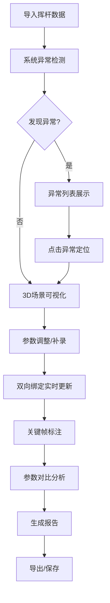
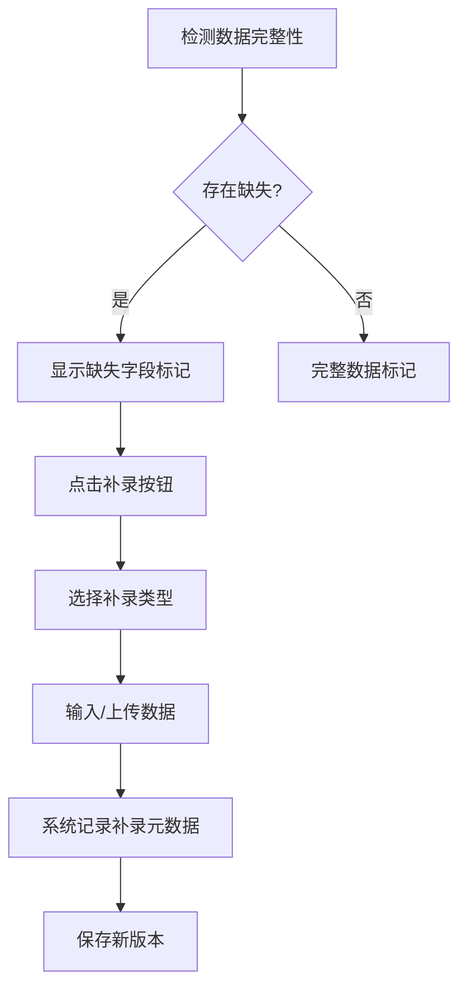
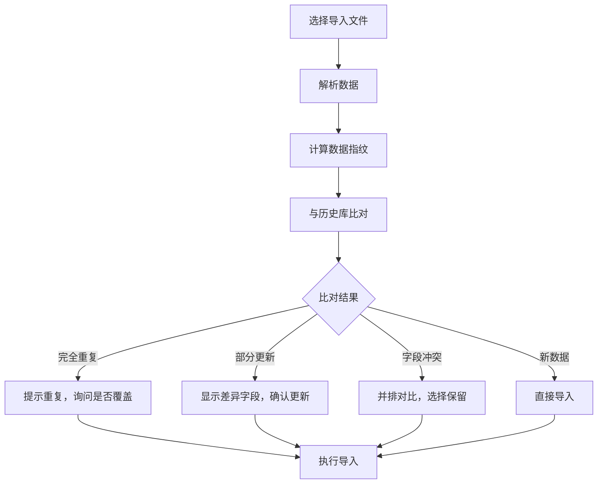

## 1. 产品概述

高尔夫挥杆力线舱是一套专业的高尔夫挥杆3D分析系统，为教练提供可视化的挥杆轨迹分析工具，解决传统人工检测效率低、易遗漏的痛点。通过3D可视化、参数双向绑定、异常智能检测、数据补录追溯等核心功能，帮助教练高效完成学员挥杆分析、训练指导和报告生成。

目标用户为高尔夫教练、职业球员及培训机构，核心价值在于将抽象的挥杆数据转化为直观可交互的3D模型，实现数据驱动的精准教学。

## 2. 核心功能

### 2.1 用户角色

| 角色 | 注册方式 | 核心权限 |
|------|----------|----------|
| 教练 | 本地账户 | 完整功能权限：数据导入、3D分析、参数调整、异常检测、报告导出、历史管理 |
| 助理 | 教练邀请 | 数据导入、补录、基础查看权限 |

### 2.2 功能模块

1. **主分析舱**：3D场景视图、挥杆轨迹回放、实时参数面板
2. **数据管理**：数据导入、补录系统、版本历史、去重冲突检测
3. **智能检测**：异常自动识别、异常列表、定位跳转、人工确认
4. **分析工具**：关键帧标注、参数对比、筛选面板、点选联动
5. **报告中心**：历史保存、报告导出、截图功能、训练报告管理

### 2.3 页面详情

| 页面名称 | 模块名称 | 功能描述 |
|---------|---------|----------|
| 主分析舱 | 3D场景视图 | 可旋转3D场景，展示挥杆轨迹、杆头模型、击球点，支持拖拽旋转、缩放、平移 |
| 主分析舱 | 回放控制器 | 播放/暂停、进度条拖拽、速度调节、关键帧跳转 |
| 主分析舱 | 参数面板 | 挥杆轨迹、杆面角、击球点、杆头速度等参数实时显示与编辑，修改后3D场景实时更新 |
| 主分析舱 | 异常警示条 | 顶部悬浮显示检测到的异常，点击可定位跳转 |
| 数据管理 | 导入面板 | 支持拖拽导入数据文件，显示导入进度、去重检测结果 |
| 数据管理 | 补录面板 | 支持挥杆轨迹、杆头速度、杆面角、击球点、学员备注、附件的补录，标记补录内容与时间 |
| 数据管理 | 版本历史 | 显示数据修改记录，支持版本对比与回滚 |
| 数据管理 | 冲突解决 | 重复数据识别、更新确认、冲突字段对比、合并选择 |
| 智能检测 | 异常列表 | 坐标抖动、杆面角反向、击球点丢失等异常的分类展示 |
| 智能检测 | 异常详情 | 异常位置、严重程度、影响范围、人工确认按钮 |
| 分析工具 | 关键帧标注 | 在时间轴上添加标注、备注、颜色标记 |
| 分析工具 | 参数对比 | 选择两组数据进行参数对比、差值计算、图表展示 |
| 分析工具 | 筛选面板 | 按日期、学员、异常类型、数据完整度筛选 |
| 分析工具 | 点选联动 | 点击3D对象高亮对应参数，点击参数高亮对应3D位置 |
| 报告中心 | 历史记录 | 已保存的分析记录列表，支持搜索、排序、标签管理 |
| 报告中心 | 报告导出 | 生成PDF/PNG报告，包含3D截图、参数表格、异常说明、教练备注 |
| 报告中心 | 截图工具 | 一键截取3D场景，支持添加标注、箭头、文字 |

## 3. 核心流程

### 主工作流程

教练导入挥杆数据 → 系统自动检测异常 → 教练在3D场景中查看并调整参数 → 补录缺失数据或备注 → 确认异常或标记为误报 → 添加关键帧标注 → 对比历史数据 → 生成并导出报告 → 保存分析记录

### 数据补录流程

检测到数据缺失 → 显示缺失字段提示 → 教练点击补录 → 选择补录类型（轨迹/速度/角度/击球点/备注/附件） → 输入或上传数据 → 系统标记补录信息 → 保存版本记录

### 导入去重流程

选择导入文件 → 解析数据 → 计算数据指纹 → 与历史数据比对 → 显示比对结果（重复/更新/冲突） → 教练选择处理方式 → 执行导入

## 4. 用户界面设计

### 4.1 设计风格

采用**精密仪器/专业分析**风格，营造高科技运动分析实验室氛围：

- **主色调**：深空灰 (#0B0F17) 作为背景，体现专业感和沉浸感
- **强调色**：霓虹绿 (#00FF88) 用于正常数据、轨迹线；霓虹橙 (#FF8800) 用于警告、异常；霓虹蓝 (#00AAFF) 用于选中状态、交互元素
- **警示色**：霓虹红 (#FF3366) 用于严重异常
- **中性色**： slate 系列灰色用于文本、边框、分隔线
- **字体**：显示字体使用 JetBrains Mono，营造工程仪器感；正文字体使用 Inter，保证可读性
- **视觉风格**：深色背景 + 霓虹高亮 + 细边框 + 扫描线效果 + 微妙网格背景，模拟专业示波器/分析仪器界面

### 4.2 页面设计概述

| 页面名称 | 模块名称 | UI Elements |
|---------|---------|-------------|
| 主分析舱 | 3D场景视图 | 居中大尺寸3D视口，网格地面，霓虹色轨迹线，半透明杆头模型，击球点发光标记，鼠标悬停显示坐标 |
| 主分析舱 | 左侧参数面板 | 可折叠卡片式布局，每个参数组独立卡片，数值输入框带步进按钮，异常参数红框闪烁 |
| 主分析舱 | 底部时间轴 | 黑胶唱片风格进度条，关键帧标记点，播放控制按钮组，速度调节旋钮 |
| 主分析舱 | 右侧工具面板 | 标签页切换（标注/对比/筛选/报告），紧凑列表布局，选中项霓虹边框 |
| 主分析舱 | 顶部异常警示条 | 滑动出现动画，异常计数徽章，点击展开异常列表，每个异常项带定位按钮 |
| 数据管理 | 导入面板 | 虚线拖拽区域，文件列表带进度条，去重结果三色标记（绿/橙/红） |
| 数据管理 | 补录面板 | 补录字段带虚线边框和"补录"角标，时间戳显示，版本对比并排视图 |
| 智能检测 | 异常详情 | 异常位置3D预览缩略图，严重程度进度条，影响范围高亮，确认/忽略按钮组 |
| 报告中心 | 报告导出 | 预览区域带标尺，导出格式选择，可勾选包含模块，生成进度动画 |

### 4.3 响应式

采用桌面优先设计，针对教练工作场景优化：
- 主屏：1920×1080 及以上，完整三栏布局（左参数 + 中3D + 右工具）
- 中小屏：1280×800 ~ 1920×1080，参数面板和工具面板可自动折叠为抽屉
- 交互：鼠标悬停状态、右键菜单、滚轮缩放、拖拽旋转等桌面优化

### 4.4 3D场景指导

- **环境**：纯深空灰背景 + 半透明网格地面，无多余环境元素，突出轨迹本身
- **光照**：三灯布光 - 主光（冷白45°）、补光（暖白低位）、轮廓光（霓虹绿边缘），营造专业棚拍感
- **相机**：默认透视相机，45°俯视角，可围绕挥杆平面中心旋转，支持预设视角快速切换（正面/侧面/俯视/挥杆平面）
- **动画**：轨迹线渐进式绘制动画，杆头运动带拖尾效果，关键帧处有脉冲发光，异常位置有红色闪烁标记
- **后处理**：轻微Bloom发光效果（霓虹色），FXAA抗锯齿，微妙色差模拟专业显示器
- **性能**：轨迹使用TubeGeometry + LineSegments，杆头使用简化模型，单场景三角面控制在5万以内

## 5. 交互设计细节

### 5.1 双向绑定交互
- 修改参数面板数值 → 3D场景实时更新，伴随过渡动画
- 拖拽3D杆头调整位置 → 参数面板数值实时变化
- 点击异常列表项 → 3D相机自动飞行到对应位置，参数面板滚动到对应参数

### 5.2 补录视觉区分
- 补录字段：虚线边框 + 右上角"补录"角标 + 悬停显示补录时间和操作人
- 补录数据在3D轨迹中使用虚线样式显示，与原始数据实线区分

### 5.3 异常视觉反馈
- 坐标抖动：轨迹线高频段变为橙色波浪线 + 感叹号标记
- 杆面角反向：杆头模型变红 + 旋转方向箭头反向
- 击球点丢失：击球位置显示红色问号 + 脉冲动画

### 5.4 动效设计
- 页面加载：元素从边缘滑入，3D场景淡入，轨迹线按时间轴渐进绘制
- 状态切换：标签页切换使用淡入淡出，面板展开/折叠使用弹性动画
- 数据更新：数值变化时数字滚动过渡，3D模型变化使用插值动画
- 警告提示：异常出现时警示条从顶部滑入，伴随轻微震动效果
