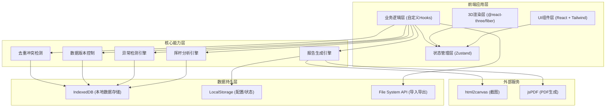
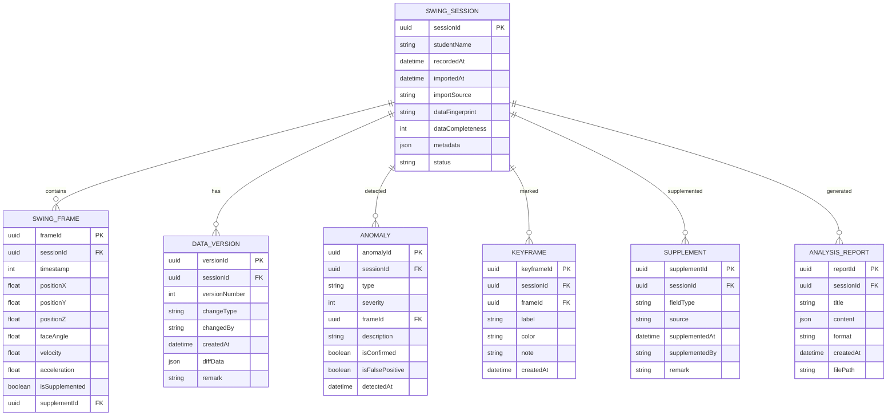

## 1. 架构设计



## 2. 技术描述

- **前端框架**: React@18 + TypeScript + Vite
- **3D引擎**: three@0.160 + @react-three/fiber@8.15 + @react-three/drei@9.92 + @react-three/postprocessing@2.15
- **状态管理**: zustand@4.4
- **样式方案**: tailwindcss@3.4 + CSS Variables
- **UI组件**: lucide-react@0.309 (图标) + 自定义组件
- **数据存储**: IndexedDB (idb@7.1) + LocalStorage
- **导出功能**: html2canvas@1.4 + jspdf@2.5
- **数据处理**: 自研分析算法（无外部AI服务）
- **后端**: 无后端，纯前端应用，数据本地存储

## 3. 路由定义

| 路由 | 用途 |
|------|------|
| / | 主分析舱 - 核心3D分析界面 |
| /data | 数据管理 - 导入、补录、版本历史 |
| /detection | 异常检测 - 异常列表、详情、确认 |
| /compare | 参数对比 - 多组数据对比分析 |
| /history | 历史记录 - 已保存分析记录管理 |
| /report | 报告导出 - 报告生成与导出 |

## 4. 数据模型

### 4.1 数据模型定义



### 4.2 核心数据结构定义

```typescript
// 挥杆帧数据
interface SwingFrame {
  frameId: string;
  timestamp: number;
  position: { x: number; y: number; z: number };
  faceAngle: { x: number; y: number; z: number };
  velocity: number;
  acceleration: number;
  isSupplemented?: boolean;
  supplementId?: string;
}

// 挥杆会话
interface SwingSession {
  sessionId: string;
  studentName: string;
  recordedAt: Date;
  importedAt: Date;
  importSource: string;
  dataFingerprint: string;
  dataCompleteness: number;
  frames: SwingFrame[];
  impactPoint?: {
    position: { x: number; y: number; z: number };
    faceAngle: number;
    velocity: number;
    isSupplemented?: boolean;
  };
  metadata: Record<string, any>;
  supplements: SupplementRecord[];
  versions: DataVersion[];
  anomalies: Anomaly[];
  keyframes: Keyframe[];
  status: 'draft' | 'analyzing' | 'completed' | 'archived';
}

// 补录记录
interface SupplementRecord {
  supplementId: string;
  fieldType: 'trajectory' | 'velocity' | 'faceAngle' | 'impactPoint' | 'note' | 'attachment';
  source: 'manual' | 'file' | 'voice';
  supplementedAt: Date;
  supplementedBy: string;
  remark: string;
  affectedFrames: string[];
}

// 数据版本
interface DataVersion {
  versionId: string;
  versionNumber: number;
  changeType: 'create' | 'update' | 'supplement' | 'import';
  changedBy: string;
  createdAt: Date;
  diffData: Record<string, any>;
  remark: string;
}

// 异常记录
interface Anomaly {
  anomalyId: string;
  type: 'jitter' | 'faceAngleReverse' | 'impactPointMissing' | 'dataGap';
  severity: 'low' | 'medium' | 'high';
  frameId?: string;
  frameRange?: { start: number; end: number };
  description: string;
  isConfirmed: boolean;
  isFalsePositive: boolean;
  detectedAt: Date;
  confirmedBy?: string;
  confirmedAt?: Date;
}

// 关键帧标注
interface Keyframe {
  keyframeId: string;
  frameId: string;
  label: string;
  color: string;
  note: string;
  createdAt: Date;
}

// 导入比对结果
type ImportResultType = 'new' | 'duplicate' | 'update' | 'conflict';

interface ImportConflict {
  field: string;
  existingValue: any;
  newValue: any;
  resolution: 'keep' | 'replace' | 'merge';
}

interface ImportResult {
  resultType: ImportResultType;
  existingSessionId?: string;
  conflicts: ImportConflict[];
  updatedFields: string[];
}
```

### 4.3 状态管理 Store

```typescript
// Zustand Store 定义
interface SwingAnalysisStore {
  // 会话状态
  currentSession: SwingSession | null;
  sessions: SwingSession[];
  selectedFrameIndex: number;
  isPlaying: boolean;
  playbackSpeed: number;
  
  // 3D场景状态
  cameraPosition: { x: number; y: number; z: number };
  cameraTarget: { x: number; y: number; z: number };
  showTrajectory: boolean;
  showClubHead: boolean;
  showImpactPoint: boolean;
  showGrid: boolean;
  
  // 选中状态
  selectedObjectId: string | null;
  selectedAnomalyId: string | null;
  selectedKeyframeId: string | null;
  
  // UI状态
  activePanel: 'params' | 'anomalies' | 'keyframes' | 'compare' | 'report';
  showAlertBar: boolean;
  
  // 操作方法
  setCurrentSession: (session: SwingSession | null) => void;
  updateSession: (updates: Partial<SwingSession>) => void;
  setSelectedFrame: (index: number) => void;
  setPlaying: (playing: boolean) => void;
  setPlaybackSpeed: (speed: number) => void;
  updateParameter: (frameIndex: number, param: string, value: any) => void;
  supplementData: (supplement: Omit<SupplementRecord, 'supplementId' | 'supplementedAt'>) => void;
  detectAnomalies: () => void;
  confirmAnomaly: (anomalyId: string, confirmed: boolean) => void;
  addKeyframe: (keyframe: Omit<Keyframe, 'keyframeId' | 'createdAt'>) => void;
  importData: (data: any) => Promise<ImportResult>;
  resolveConflict: (conflict: ImportConflict, resolution: 'keep' | 'replace') => void;
  saveSession: () => void;
  exportReport: (format: 'pdf' | 'png') => Promise<void>;
  loadSessions: () => void;
  setSelectedObject: (id: string | null) => void;
  flyToFrame: (frameIndex: number) => void;
}
```

## 5. 核心模块设计

### 5.1 3D渲染模块

| 组件 | 职责 | 关键技术 |
|------|------|----------|
| SwingScene | 3D场景容器，管理相机、灯光、后处理 | @react-three/fiber, PerspectiveCamera |
| SwingTrajectory | 挥杆轨迹渲染，支持实线/虚线区分 | TubeGeometry, LineSegments |
| ClubHead | 杆头模型渲染，支持姿态调整 | GLTF模型 / 自定义几何体 |
| ImpactPoint | 击球点标记，支持发光效果 | Mesh, MeshStandardMaterial, emissive |
| GroundGrid | 地面网格参考线 | GridHelper |
| PlaybackControls | 回放控制器 | drei/OrbitControls, useFrame |
| SceneHighlights | 选中/异常高亮效果 | postprocessing/Bloom |

### 5.2 异常检测引擎

| 检测类型 | 算法 | 阈值 |
|----------|------|------|
| 坐标抖动 | 相邻帧位置二阶导数计算，高频波动检测 | 加速度 > 3σ 阈值 |
| 杆面角反向 | 击球前后杆面角变化趋势分析 | 角度变化率 > 90°/0.1s |
| 击球点丢失 | 帧序列完整性检查 + 击球区域检测 | 击球窗口内无有效帧 |
| 数据断层 | 时间戳连续性检查 | 相邻帧时间差 > 50ms |

### 5.3 去重冲突检测

| 比对维度 | 指纹计算方法 | 判定规则 |
|----------|-------------|----------|
| 数据指纹 | SHA-256(学员ID + 记录时间 + 前100帧特征值) | 指纹相同 → 完全重复 |
| 部分更新 | 逐字段比对，差异字段 < 30% | 指纹相似 + 少量字段不同 → 更新 |
| 冲突检测 | 同一字段新旧值差异 > 阈值 | 指纹相似 + 关键字段不同 → 冲突 |

## 6. 目录结构

```
src/
├── components/
│   ├── layout/
│   │   ├── AppLayout.tsx
│   │   ├── Header.tsx
│   │   ├── AlertBar.tsx
│   │   └── SidePanel.tsx
│   ├── scene3d/
│   │   ├── SwingScene.tsx
│   │   ├── SwingTrajectory.tsx
│   │   ├── ClubHead.tsx
│   │   ├── ImpactPoint.tsx
│   │   ├── GroundGrid.tsx
│   │   └── PlaybackControls.tsx
│   ├── panels/
│   │   ├── ParameterPanel.tsx
│   │   ├── AnomalyPanel.tsx
│   │   ├── KeyframePanel.tsx
│   │   ├── ComparePanel.tsx
│   │   └── ReportPanel.tsx
│   ├── timeline/
│   │   ├── Timeline.tsx
│   │   ├── PlaybackController.tsx
│   │   └── KeyframeMarkers.tsx
│   ├── data/
│   │   ├── ImportPanel.tsx
│   │   ├── SupplementPanel.tsx
│   │   ├── VersionHistory.tsx
│   │   └── ConflictResolver.tsx
│   └── common/
│       ├── Button.tsx
│       ├── Input.tsx
│       ├── Card.tsx
│       ├── Tabs.tsx
│       └── Badge.tsx
├── store/
│   └── useSwingStore.ts
├── hooks/
│   ├── useAnomalyDetection.ts
│   ├── usePlayback.ts
│   ├── useDataImport.ts
│   ├── useDeduplication.ts
│   ├── useSupplement.ts
│   └── useReportExport.ts
├── utils/
│   ├── swingMath.ts
│   ├── anomalyDetector.ts
│   ├── dataFingerprint.ts
│   ├── versionControl.ts
│   ├── storage.ts
│   └── mockData.ts
├── types/
│   └── index.ts
├── pages/
│   ├── AnalysisPage.tsx
│   ├── DataManagementPage.tsx
│   ├── DetectionPage.tsx
│   ├── ComparePage.tsx
│   ├── HistoryPage.tsx
│   └── ReportPage.tsx
├── App.tsx
├── main.tsx
├── index.css
└── router.tsx
```

## 7. 性能优化策略

1. **3D渲染优化**
   - 轨迹线使用BufferGeometry，避免频繁重建
   - 杆头模型使用LOD（层次细节）技术
   - 后处理效果按需开启，可配置质量等级
   - 帧动画使用useFrame的delta时间插值

2. **数据处理优化**
   - 异常检测使用Web Worker后台计算
   - 大数据量帧数据使用分片加载
   - 版本差异计算使用增量diff算法

3. **状态管理优化**
   - Zustand selectors 避免不必要重渲染
   - 3D场景状态与UI状态分离管理
   - 参数更新使用防抖节流

4. **存储优化**
   - IndexedDB存储大体积帧数据
   - 历史数据使用压缩存储（lz-string）
   - 常用查询建立索引
