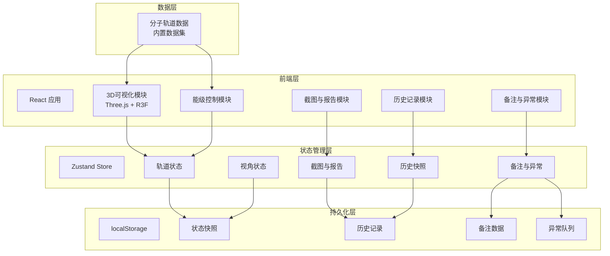

## 1. 架构设计



## 2. 技术说明

- **前端**：React@18 + TypeScript + TailwindCSS@3 + Vite
- **3D渲染**：Three.js + @react-three/fiber + @react-three/drei + @react-three/postprocessing
- **状态管理**：Zustand（含 persist 中间件实现 localStorage 持久化）
- **截图**：html2canvas 或 Three.js renderer.domElement.toDataURL()
- **报告导出**：前端生成 HTML 报告，可选打印为 PDF
- **初始化工具**：vite-init
- **后端**：无（纯前端应用，数据内置）
- **数据库**：无（localStorage 持久化）

## 3. 路由定义

| 路由 | 用途 |
|------|------|
| `/` | 轨道工作台主页面（3D场景+能级控制+备注+截图+历史） |

应用为单页面，所有功能通过面板切换与折叠实现，无需多路由。

## 4. 数据模型

### 4.1 分子轨道数据结构

```typescript
interface MolecularOrbital {
  id: string
  label: string
  energy: number
  symmetry: string
  bondingType: "bonding" | "antibonding" | "nonbonding"
  nodeCount: number
  nodePlanes: NodePlane[]
  isosurfaceData: Float32Array
  phaseColors: [string, string]
}

interface NodePlane {
  normal: [number, number, number]
  distance: number
  label: string
}

interface MoleculeData {
  id: string
  name: string
  formula: string
  atomPositions: [number, number, number][]
  atomLabels: string[]
  bonds: [number, number][]
  orbitals: MolecularOrbital[]
  energyOrder: string[]
}
```

### 4.2 应用状态数据结构

```typescript
interface AppState {
  currentMoleculeId: string
  currentOrbitalId: string
  cameraPosition: [number, number, number]
  cameraTarget: [number, number, number]
  showNodePlanes: boolean
  nodePlaneOpacity: number
  sectionPosition: number
  showSection: boolean
  isosurfaceThreshold: number
  notes: Note[]
  anomalyQueue: AnomalyItem[]
  screenshots: Screenshot[]
  history: HistorySnapshot[]
  activeHistoryId: string | null
}

interface Note {
  id: string
  orbitalId: string
  content: string
  timestamp: number
  anomalyTag?: AnomalyType
  stateSnapshot: OrbitalSnapshot
}

type AnomalyType = "energy_order_error" | "node_occlusion" | "color_misleading" | "custom"

interface AnomalyItem {
  id: string
  type: AnomalyType
  description: string
  orbitalId: string
  status: "pending" | "resolved" | "dismissed"
  timestamp: number
  stateSnapshot: OrbitalSnapshot
}

interface Screenshot {
  id: string
  dataUrl: string
  timestamp: number
  orbitalId: string
  filterState: string
  anomalyNote: string
}

interface HistorySnapshot {
  id: string
  timestamp: number
  action: string
  state: OrbitalSnapshot
}

interface OrbitalSnapshot {
  moleculeId: string
  orbitalId: string
  cameraPosition: [number, number, number]
  cameraTarget: [number, number, number]
  showNodePlanes: boolean
  nodePlaneOpacity: number
  sectionPosition: number
  showSection: boolean
  isosurfaceThreshold: number
  notes: Note[]
  anomalyQueue: AnomalyItem[]
}
```

### 4.3 内置分子数据集

提供以下分子作为内置数据：
- O₂（氧气）：12个分子轨道
- N₂（氮气）：10个分子轨道
- CO（一氧化碳）：10个分子轨道

每个分子的轨道数据包含预计算的等值面顶点数据、能量值、对称性标签和节点面定义。
