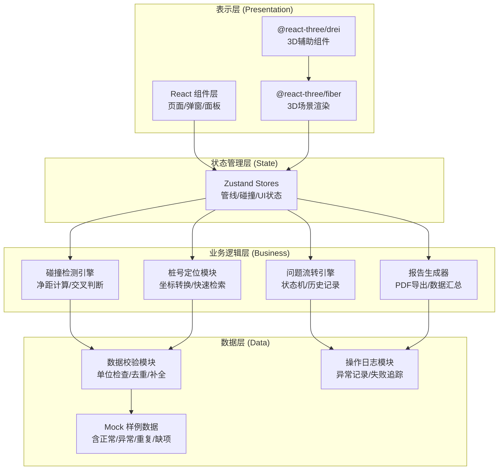
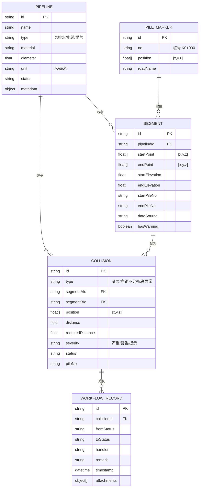
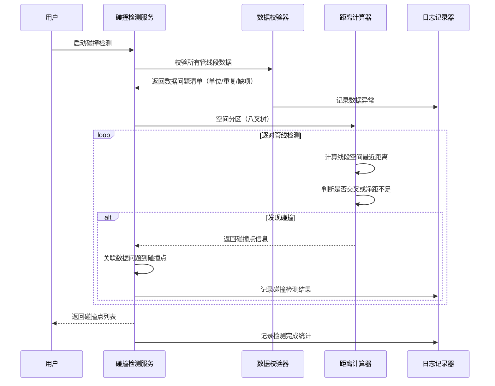

## 1. 架构设计



## 2. 技术描述

### 2.1 核心技术栈

| 层级 | 技术选型 | 版本 | 用途 |
|------|----------|------|------|
| 前端框架 | React | 18.x | 组件化UI开发 |
| 语言 | TypeScript | 5.x | 类型安全 |
| 构建工具 | Vite | 5.x | 快速构建与HMR |
| 样式 | TailwindCSS | 3.x | 原子化CSS |
| 3D引擎 | three | 0.160.x | WebGL 3D渲染 |
| 3D React封装 | @react-three/fiber | 8.x | React声明式Three.js |
| 3D组件库 | @react-three/drei | 9.x | 常用3D组件封装 |
| 状态管理 | Zustand | 4.x | 轻量级状态管理 |
| 图标库 | lucide-react | 0.294.x | 统一图标系统 |
| PDF导出 | jspdf | 2.5.x | PDF生成 |
| 截图 | html2canvas | 1.4.x | DOM转图片 |

### 2.2 设计原则

- **无后端设计**：纯前端应用，所有数据和逻辑在浏览器端运行，便于部署和演示
- **数据驱动**：所有3D渲染、碰撞检测、报告生成都基于统一的数据模型
- **可观测性**：完整记录数据校验、碰撞计算、状态流转的每一步操作日志
- **异常优先**：重点处理标高单位错误、管线重叠、数据缺项等真实场景问题
- **性能优先**：管线几何体合并、视锥体剔除、碰撞检测空间分区优化

## 3. 路由定义

| 路由 | 页面 | 功能 |
|------|------|------|
| `/` | 3D巡检主界面 | 核心工作页面，包含3D场景、控制面板、检测面板 |
| `/report` | 报告预览页 | 展示碰撞检测报告，支持导出PDF |
| `/logs` | 操作日志页 | 查看数据加载、碰撞检测、问题处理的详细日志 |

## 4. 数据模型

### 4.1 实体关系图



### 4.2 TypeScript 类型定义

```typescript
// 管线类型
export type PipelineType = 'water' | 'electric' | 'gas';
export type PipelineStatus = 'normal' | 'warning' | 'error' | 'fixed';

// 碰撞类型
export type CollisionType = 'intersect' | 'distance' | 'elevation' | 'duplicate' | 'missing';
export type CollisionSeverity = 'critical' | 'warning' | 'info';
export type WorkflowStatus = 'pending' | 'processing' | 'resolved' | 'ignored';

// 空间点
export interface Point3D {
  x: number;
  y: number;
  z: number;
}

// 管线段
export interface PipelineSegment {
  id: string;
  pipelineId: string;
  pipelineName: string;
  type: PipelineType;
  startPoint: Point3D;
  endPoint: Point3D;
  diameter: number;
  unit: 'm' | 'mm';
  startPileNo: string;
  endPileNo: string;
  dataSource: 'survey' | 'design' | 'corrected' | 'duplicate';
  hasWarning: boolean;
  warningMessage?: string;
}

// 碰撞点
export interface CollisionPoint {
  id: string;
  type: CollisionType;
  severity: CollisionSeverity;
  segmentA: PipelineSegment;
  segmentB: PipelineSegment;
  position: Point3D;
  calculatedDistance: number;
  requiredDistance: number;
  pileNo: string;
  status: WorkflowStatus;
  createdAt: string;
  dataIssues: DataIssue[];
}

// 数据问题
export interface DataIssue {
  type: 'unit_error' | 'duplicate' | 'missing' | 'elevation_mismatch';
  description: string;
  originalValue: any;
  correctedValue?: any;
  impact: string; // 对碰撞结果的影响说明
}

// 工作流记录
export interface WorkflowRecord {
  id: string;
  collisionId: string;
  fromStatus: WorkflowStatus;
  toStatus: WorkflowStatus;
  handler: string;
  remark: string;
  timestamp: string;
}

// 检测配置
export interface DetectionConfig {
  waterElectricMinDist: number;  // 水-电最小净距
  waterGasMinDist: number;       // 水-气最小净距
  electricGasMinDist: number;    // 电-气最小净距
  sameTypeMinDist: number;       // 同类管线最小净距
  elevationTolerance: number;    // 标高容差
  autoCorrectUnit: boolean;      // 自动修正单位
}

// 操作日志
export interface OperationLog {
  id: string;
  timestamp: string;
  level: 'info' | 'warning' | 'error';
  module: 'data' | 'collision' | 'workflow' | 'report';
  message: string;
  details?: any;
}
```

## 5. 核心模块架构

### 5.1 目录结构

```
src/
├── components/
│   ├── layout/           # 布局组件（顶部栏、侧面板）
│   ├── three/            # 3D相关组件（管线、碰撞点、地面）
│   ├── panels/           # 控制面板（图层、检测配置、结果列表）
│   ├── modals/           # 弹窗组件（问题详情、报告预览）
│   └── common/           # 通用组件（按钮、表单、表格）
├── stores/               # Zustand 状态管理
│   ├── pipelineStore.ts  # 管线数据状态
│   ├── collisionStore.ts # 碰撞检测状态
│   ├── workflowStore.ts  # 工作流状态
│   └── uiStore.ts        # UI交互状态
├── engine/               # 核心业务逻辑
│   ├── collision.ts      # 碰撞检测算法
│   ├── distance.ts       # 空间距离计算
│   ├── pileNo.ts         # 桩号定位逻辑
│   └── dataValidator.ts  # 数据校验与修正
├── data/                 # 样例数据
│   ├── pipelines.ts      # 管线数据（含异常）
│   ├── pileMarkers.ts    # 桩号数据
│   └── config.ts         # 检测规则配置
├── utils/                # 工具函数
│   ├── three.ts          # Three.js辅助函数
│   ├── geometry.ts       # 几何计算
│   ├── export.ts         # 导出相关（PDF）
│   └── logger.ts         # 日志记录
├── types/                # TypeScript类型定义
└── pages/                # 页面组件
```

### 5.2 碰撞检测引擎工作流程



### 5.3 状态管理设计

**pipelineStore** - 管线数据管理：
- 加载/解析样例数据
- 数据校验与自动修正
- 管线段增删改查
- 图层显隐控制

**collisionStore** - 碰撞检测管理：
- 检测配置参数
- 执行碰撞检测
- 碰撞点列表与筛选
- 桩号定位与跳转

**workflowStore** - 问题流转管理：
- 碰撞点状态变更
- 工作流记录追加
- 责任人与备注管理

**uiStore** - UI交互状态：
- 选中的管线段/碰撞点
- 3D视角预设
- 面板折叠状态
- 剖切平面控制

## 6. 关键技术实现点

### 6.1 管线3D渲染
- 使用 `TubeGeometry` 沿路径生成管线几何体，真实管径比例
- 材质采用 `MeshStandardMaterial` 实现金属质感半透明效果
- 大量管线使用 `InstancedMesh` 进行实例化渲染优化性能
- 支持按管段分段拾取，点击高亮显示详细信息

### 6.2 碰撞检测算法
- 采用八叉树空间分区，减少不必要的距离计算
- 线段最近距离计算：三维空间两线段最短距离解析解
- 交叉判断：线段相交检测 + 端点距离判断
- 标高异常检测：同桩号处同类管线标高差异检查

### 6.3 数据问题处理
- 标高单位错误：检测异常值（如1000m vs 1m），自动除以1000修正并记录
- 管线重叠：坐标完全相同的管段标记为重复数据
- 属性缺项：管径、标高、桩号缺失的管段标记并跳过检测
- 所有修正操作都记录对碰撞结果的影响说明

### 6.4 报告导出
- 使用 `html2canvas` 截取3D场景和碰撞点详情
- 使用 `jspdf` 生成包含汇总表、问题详情、截图的PDF报告
- 报告中专门章节说明数据异常及其对检测结果的影响

### 6.5 操作日志
- 所有数据加载、检测、修改操作都记录日志
- 日志分级（info/warning/error），可筛选查看
- 失败操作记录详细上下文，便于问题排查
- 日志持久化到 localStorage，刷新不丢失
