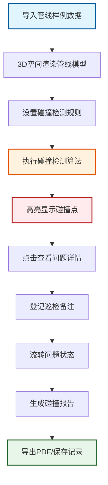
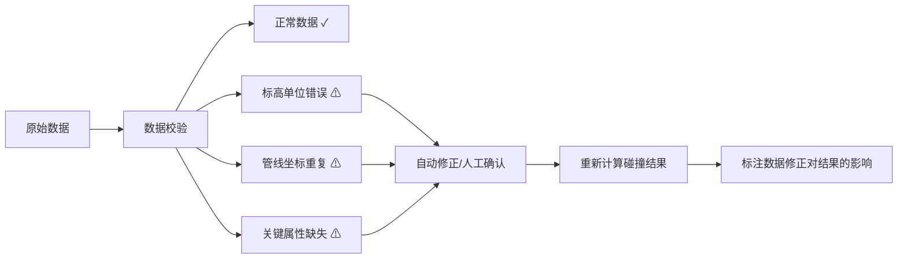

## 1. 产品概述

面向市政设计院的地下管线3D可视化巡检系统，支持给排水、电缆、燃气管线的空间关系分析，自动检测管线交叉碰撞与净距不足问题，并提供完整的问题流转和报告导出机制。

- **核心价值**：将抽象的管线数据转化为直观的3D空间模型，帮助工程师快速发现标高错误、管线重叠、净距漏判等隐蔽问题
- **目标用户**：市政设计院工程师、管线巡检人员、项目审核人员
- **核心目标**：提升管线碰撞检测效率，减少人工漏判，留存问题追溯记录

## 2. 核心功能

### 2.1 用户角色

| 角色 | 登录方式 | 核心权限 |
|------|----------|----------|
| 巡检工程师 | 本地账号 | 查看3D模型、执行碰撞检测、记录巡检备注、流转问题 |
| 审核人员 | 本地账号 | 复核碰撞报告、审批问题处理、导出正式报告 |
| 系统管理员 | 本地账号 | 管理数据源、配置检测规则、查看操作日志 |

### 2.2 功能模块

1. **3D管线主视图**：管线空间渲染、视角控制、图层显隐、标高显示
2. **碰撞检测模块**：净距分析、交叉检测、问题高亮、规则配置
3. **桩号定位模块**：道路桩号检索、快速定位、断面剖切
4. **问题流转模块**：问题登记、状态流转、处理记录、备注追踪
5. **报告导出模块**：PDF报告生成、碰撞点汇总、异常数据标注

### 2.3 页面详情

| 页面名称 | 模块名称 | 功能描述 |
|----------|----------|----------|
| 3D巡检主界面 | 3D场景渲染 | Three.js渲染给排水/电缆/燃气三类管线，支持缩放、旋转、平移 |
| 3D巡检主界面 | 左侧控制面板 | 图层控制、标高单位切换、管线透明度调节、桩号搜索框 |
| 3D巡检主界面 | 右侧检测面板 | 碰撞检测按钮、净距阈值设置、检测结果列表、问题详情 |
| 3D巡检主界面 | 底部时间轴 | 巡检记录时间轴、历史版本对比、异常数据标记 |
| 问题详情弹窗 | 问题流转表单 | 问题状态（待处理/处理中/已解决/已忽略）、责任人、处理意见、附件上传 |
| 报告预览页 | 报告导出 | 碰撞点汇总表、异常数据说明、3D截图嵌入、PDF导出 |

## 3. 核心流程

**核心流程说明**：
1. 用户选择样例数据文件导入，系统自动解析管线坐标、标高、管径、桩号等信息
2. 系统在3D空间中按类别渲染三类管线，不同颜色区分，支持单独显隐
3. 用户可配置净距阈值（如：给水管与燃气管最小净距0.5m），启动碰撞检测
4. 检测引擎逐段计算管线空间距离，标记交叉点、净距不足点、标高异常点
5. 点击碰撞点可查看详细信息：涉及管线、桩号位置、计算净距、规范要求
6. 工程师填写巡检备注，流转问题状态，完整记录处理过程
7. 系统自动汇总所有问题，生成带3D截图的巡检报告，支持导出PDF

**异常数据处理流程**：

## 4. 用户界面设计

### 4.1 设计风格

- **主色调**：工程蓝 `#1e3a5f`，代表专业与可靠
- **警示色**：碰撞红 `#e53935`、警告橙 `#fb8c00`、正常绿 `#43a047`
- **辅助色**：管线分类色：给排水蓝 `#1976d2`、电缆橙 `#f57c00`、燃气黄 `#fbc02d`
- **字体**：标题使用「思源黑体 Bold」，正文使用「思源黑体 Regular」，等宽数据使用「JetBrains Mono」
- **布局**：三栏式布局，左侧控制面板（280px）+ 中间3D场景 + 右侧检测面板（320px）
- **视觉风格**：工业科技感，深色主题降低视觉疲劳，细边框、低透明度面板、精准的数据表格

### 4.2 页面设计概述

| 页面名称 | 模块名称 | UI元素 |
|----------|----------|--------|
| 3D巡检主界面 | 顶部标题栏 | 系统Logo、项目名称、样例数据选择器、用户信息、帮助按钮 |
| 3D巡检主界面 | 左侧图层面板 | 分类复选框、颜色图例、透明度滑块、单位切换（米/毫米）、标高显示开关 |
| 3D巡检主界面 | 中央3D场景 | 管线几何体、地面网格、碰撞点标记（红色球体+脉冲动画）、桩号标注、坐标轴线 |
| 3D巡检主界面 | 右侧检测面板 | Tab切换（检测配置/结果列表/问题流转）、阈值输入框、检测进度条、结果列表卡片 |
| 3D巡检主界面 | 底部状态栏 | 鼠标坐标、当前视角、已检测管线数、碰撞数、加载状态、错误日志入口 |
| 碰撞详情弹窗 | 信息面板 | 碰撞位置截图、管线A/B信息、计算净距、规范值、桩号、数据来源、修正历史 |
| 碰撞详情弹窗 | 流转表单 | 状态下拉、责任人选择、备注文本框、时间戳记录、保存/取消按钮 |

### 4.3 响应式设计

- **桌面端优先**：1920×1080及以上分辨率，充分利用屏幕空间展示3D场景
- **平板适配**：1024px以上，左右面板可折叠收起，最大化3D视图
- **交互优化**：3D场景支持鼠标拖动旋转、滚轮缩放、右键平移；碰撞点支持悬停预览、点击详情
- **触屏支持**：双指缩放、单指旋转、长按选中

### 4.4 3D场景设计

- **环境**：深色渐变背景 `#0a1929 → #1e3a5f`，半透明地面网格，弱化环境突出管线
- **光照**：主光源（方向光，冷白色，强度0.8）+ 环境光（强度0.4）+ 碰撞点自发光材质
- **相机**：初始透视视角，俯角45°，可切换正交视图；支持预设视角（顶视/正视/侧视/等轴测）
- **管线材质**：金属质感半透明材质（透明度0.85），管径真实比例渲染，选中管线高亮发光
- **碰撞点效果**：红色发光球体 + 向外扩散的圆环脉冲动画，点击后显示信息标签
- **桩号标注**：沿道路中心线等距显示桩号牌，选中后高亮对应管线段
- **剖切功能**：支持X/Y/Z三个方向的剖切平面，查看管线内部空间关系
- **性能优化**：管线分段渲染，视锥体剔除，LOD控制，保证1000+管线段流畅运行
