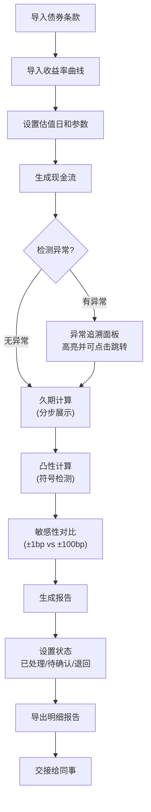

## 1. 产品概述

债券久期凸性解释器是面向固收分析新人的专业计算工具，解决收益率变动时价格差异解释不清的问题。核心目标是统一现金流生成、久期计算、凸性修正、敏感性分析、报告导出的算法口径，实现全流程可追溯、可复查。

目标用户：固收分析师、交易员、风控人员，特别是需要交接工作、复核计算结果的业务人员。

## 2. 核心功能

### 2.1 用户角色

| 角色 | 注册方式 | 核心权限 |
|------|----------|----------|
| 分析师 | 本地使用 | 导入债券数据、计算分析、导出报告 |
| 复核人 | 本地使用 | 查看计算过程、追溯异常来源、确认或退回 |

### 2.2 功能模块

1. **债券管理页**：债券条款录入、现金流预览、版本管理
2. **计算分析页**：久期计算、凸性修正、敏感性对比、过程追溯
3. **曲线管理页**：收益率曲线导入、插值方法配置、异常检测
4. **报告中心页**：报告生成、状态管理（已处理/待确认/退回）、明细导出

### 2.3 页面详情

| 页面名称 | 模块名称 | 功能描述 |
|----------|----------|----------|
| 债券管理页 | 债券信息录入 | 支持录入债券基本条款（面值、票息、到期日、付息频率）、手动调整现金流 |
| 债券管理页 | 现金流生成器 | 自动生成付息计划、高亮漏期/异常期、支持点击追溯来源条款 |
| 债券管理页 | 版本管理 | 记录每次修改的版本号、操作人、时间、备注，支持版本对比与回滚 |
| 计算分析页 | 久期计算器 | 显示麦考利久期、修正久期、有效久期的分步计算过程，每步可追溯 |
| 计算分析页 | 凸性分析器 | 计算凸性值、凸性修正项，自动检测凸性符号异常并提示来源 |
| 计算分析页 | 敏感性对比 | 小变动（±1bp）与大变动（±100bp）价格差异对比表格，可视化展示 |
| 计算分析页 | 异常追溯面板 | 列出所有异常（现金流漏期、曲线插值错、凸性符号反），点击跳转来源 |
| 曲线管理页 | 曲线导入 | 支持Excel/CSV导入收益率曲线，显示插值前后对比 |
| 曲线管理页 | 插值配置 | 支持线性插值、样条插值等方法，可查看每个插值点的计算明细 |
| 报告中心页 | 报告生成器 | 统一算法口径导出计算明细，包含债券信息、现金流、曲线、计算过程 |
| 报告中心页 | 状态管理 | 报告可标记为已处理/待确认/退回补材料，支持添加备注和交接记录 |
| 报告中心页 | 导出功能 | 支持Excel/PDF导出，包含完整计算链路和版本信息 |

## 3. 核心流程

用户导入债券条款和收益率曲线 → 系统自动生成现金流并检测异常 → 用户选择估值日进行久期和凸性计算 → 系统展示分步计算过程并高亮异常 → 敏感性对比分析（小变动vs大变动）→ 生成带状态的报告 → 导出或交接给同事

## 4. 用户界面设计

### 4.1 设计风格

- **主色调**：深海军蓝 (#1e3a5f) 作为主色，代表专业和信任；铜金色 (#c9a227) 作为强调色，突出金融属性
- **辅助色**：成功绿 (#2e7d32)、警告橙 (#f57c00)、错误红 (#c62828) 用于状态和异常提示
- **按钮风格**：直角微圆角 (2px)，细线边框，悬停时有细微阴影变化，保持专业严谨感
- **字体**：标题使用「思源宋体」体现专业刊物感，正文使用「Inter」确保数字和表格可读性
- **布局风格**：卡片式布局，清晰的分区边框，充足的留白，金融报表式的对齐规范
- **图标风格**：线性细图标，避免过于卡通，保持专业工具的严谨性

### 4.2 页面设计概述

| 页面名称 | 模块名称 | UI元素 |
|----------|----------|--------|
| 债券管理页 | 信息录入区 | 双列表单布局，左侧债券基本信息，右侧高级条款；输入框带验证提示 |
| 债券管理页 | 现金流表格 | 斑马纹表格，异常行高亮显示；每行可点击展开详情和来源追溯 |
| 计算分析页 | 计算过程面板 | 左侧公式说明区（数学公式+文字解释），右侧分步计算结果区 |
| 计算分析页 | 敏感性对比 | 上下分栏：上为价格变动曲线图，下为对比数据表（小变动vs大变动） |
| 计算分析页 | 异常追溯 | 右侧悬浮抽屉，时间线式展示异常列表，点击高亮对应数据源 |
| 报告中心页 | 报告卡片 | 卡片式列表，顶部状态栏标记颜色区分；悬停显示操作按钮 |
| 报告中心页 | 报告详情 | 分页式布局，包含完整计算链路，每页带版本号和时间戳 |

### 4.3 响应性

- 桌面端优先设计（1280px+），确保复杂表格和计算面板的可读性
- 平板端（768px-1279px）：侧边栏收起为图标，表格支持横向滚动
- 移动端：简化为核心功能列表，主要用于查看报告状态，不支持复杂计算

### 4.4 动效设计

- 页面加载：顶部进度条 + 内容区域渐入，避免突兀的跳转动画
- 异常提示：错误行轻微闪烁（2次）后保持高亮，引导用户注意
- 抽屉展开：平滑滑入动画（200ms），背景轻微模糊
- 数字变化：计算结果更新时有数字滚动动画，增强感知
- 悬停效果：表格行背景色细微变化，可点击元素有下划线提示
