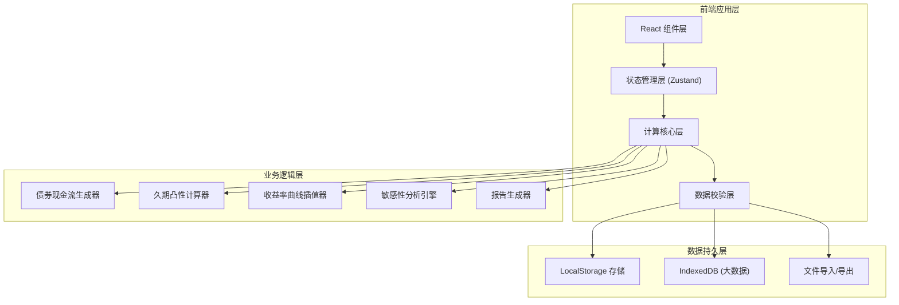

## 1. 架构设计



## 2. 技术描述

- **前端框架**：React@18 + TypeScript@5
- **构建工具**：Vite@5
- **样式方案**：TailwindCSS@3 + 自定义CSS变量
- **状态管理**：Zustand（轻量级，适合金融计算场景）
- **路由管理**：React Router@6
- **图表库**：ECharts@5（专业金融图表）
- **数学计算**：decimal.js（高精度十进制计算，避免浮点数误差）
- **表格组件**：TanStack Table@8（高性能可交互表格）
- **文件处理**：SheetJS (xlsx) + jsPDF
- **后端**：无（纯前端应用，数据本地存储）
- **数据库**：LocalStorage + IndexedDB（本地持久化）

## 3. 路由定义

| 路由 | 页面 | 主要功能 |
|------|------|----------|
| / | 首页/仪表盘 | 快速入口、最近债券、待办提醒 |
| /bonds | 债券管理 | 债券列表、新增/编辑债券、现金流预览 |
| /bonds/:id | 债券详情 | 债券信息、现金流管理、版本历史 |
| /calculator | 计算分析 | 久期计算、凸性分析、敏感性对比 |
| /curves | 曲线管理 | 收益率曲线列表、导入、插值配置 |
| /reports | 报告中心 | 报告列表、生成报告、状态管理、导出 |
| /reports/:id | 报告详情 | 完整计算报告、异常追溯、交接记录 |

## 4. 核心数据模型

### 4.1 TypeScript 类型定义

```typescript
// 债券基本信息
interface Bond {
  id: string;
  name: string;
  code: string;
  faceValue: Decimal;
  couponRate: Decimal;
  couponFrequency: 1 | 2 | 4 | 12;
  issueDate: Date;
  maturityDate: Date;
  firstCouponDate: Date;
  dayCountConvention: 'ACT/ACT' | 'ACT/365' | '30/360';
  version: number;
  createdAt: Date;
  updatedAt: Date;
  remarks: string;
}

// 现金流明细
interface CashFlow {
  id: string;
  bondId: string;
  period: number;
  paymentDate: Date;
  couponPayment: Decimal;
  principalPayment: Decimal;
  totalPayment: Decimal;
  accruedDays: number;
  isException: boolean;
  exceptionType?: 'MISSING_PERIOD' | 'DUPLICATE_DATE' | 'IRREGULAR_AMOUNT';
  exceptionMessage?: string;
  sourceRef: string;
}

// 收益率曲线点
interface CurvePoint {
  term: Decimal;
  rate: Decimal;
  source?: string;
}

interface YieldCurve {
  id: string;
  name: string;
  valueDate: Date;
  points: CurvePoint[];
  interpolationMethod: 'LINEAR' | 'CUBIC_SPLINE' | 'NELSON_SIEGEL';
  version: number;
}

// 计算参数
interface CalculationParams {
  valuationDate: Date;
  yieldCurveId: string;
  spread: Decimal;
  priceType: 'DIRTY' | 'CLEAN';
  yieldShiftBpSmall: number;
  yieldShiftBpLarge: number;
}

// 久期计算结果
interface DurationResult {
  macaulayDuration: Decimal;
  modifiedDuration: Decimal;
  effectiveDuration: Decimal;
  dv01: Decimal;
  calculationSteps: CalculationStep[];
}

// 凸性计算结果
interface ConvexityResult {
  convexity: Decimal;
  convexityAdjustment: Decimal;
  dollarConvexity: Decimal;
  signCheck: 'NORMAL' | 'ABNORMAL';
  signCheckMessage?: string;
  calculationSteps: CalculationStep[];
}

// 敏感性分析
interface SensitivityAnalysis {
  basePrice: Decimal;
  smallUpPrice: Decimal;
  smallDownPrice: Decimal;
  largeUpPrice: Decimal;
  largeDownPrice: Decimal;
  smallDurationEffect: Decimal;
  smallConvexityEffect: Decimal;
  largeDurationEffect: Decimal;
  largeConvexityEffect: Decimal;
  priceDiffExplanation: string;
}

// 计算步骤（用于追溯）
interface CalculationStep {
  stepId: string;
  description: string;
  formula: string;
  inputs: Record<string, string>;
  result: string;
  sourceRef?: string;
}

// 报告
interface Report {
  id: string;
  bondId: string;
  bondVersion: number;
  curveId: string;
  curveVersion: number;
  params: CalculationParams;
  duration: DurationResult;
  convexity: ConvexityResult;
  sensitivity: SensitivityAnalysis;
  cashFlows: CashFlow[];
  status: 'PROCESSED' | 'PENDING_CONFIRM' | 'RETURNED';
  statusRemark?: string;
  handoverRecord?: HandoverRecord[];
  createdAt: Date;
  createdBy: string;
}

// 交接记录
interface HandoverRecord {
  id: string;
  fromUser: string;
  toUser: string;
  timestamp: Date;
  message: string;
  attachments?: string[];
}
```

## 5. 核心算法模块

### 5.1 现金流生成算法

- 输入：债券条款（票息率、付息频率、到期日等）
- 输出：标准化现金流列表
- 异常检测：漏期检测、重复日期检测、金额异常检测
- 追溯：每个现金流项记录来源条款引用

### 5.2 收益率曲线插值

- 支持方法：线性插值、三次样条插值、Nelson-Siegel模型
- 异常检测：插值点合理性校验、端点外推警告
- 每个插值点记录计算过程和来源

### 5.3 久期计算（统一口径）

- 麦考利久期：现金流加权平均期限
- 修正久期：麦考利久期 / (1 + y/k)
- 有效久期：[P(-Δy) - P(+Δy)] / (2 * P0 * Δy)
- 每步计算记录公式和中间结果

### 5.4 凸性计算

- 凸性：二阶导数 / 价格
- 凸性修正：0.5 * 凸性 * (Δy)²
- 符号检测：自动检测凸性符号异常并提示

### 5.5 敏感性对比

- 小变动（±1bp）：主要是久期效应，凸性效应可忽略
- 大变动（±100bp）：久期效应 + 凸性修正
- 价格差异解释：自动生成差异原因说明

## 6. 数据持久化

### 6.1 存储策略

- **债券基本信息**：LocalStorage（JSON序列化）
- **现金流明细**：IndexedDB（数据量较大）
- **收益率曲线**：LocalStorage
- **计算报告**：IndexedDB
- **版本历史**：每条记录带版本号和时间戳

### 6.2 导出格式

- Excel：使用SheetJS导出，包含多个sheet（债券信息、现金流、计算过程、敏感性分析）
- PDF：使用jsPDF导出，带页码和页眉页脚
- 所有导出文件包含版本信息和计算时间戳
