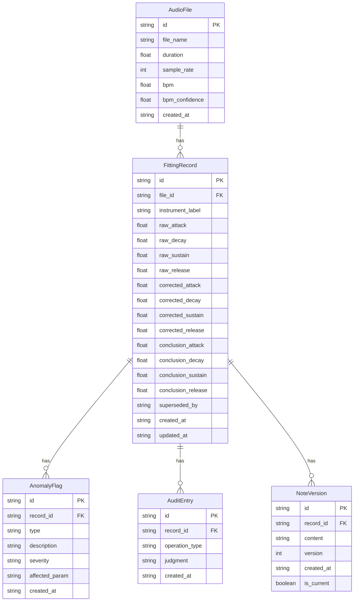

## 1. 架构设计

```mermaid
graph TB
    subgraph "前端层"
        "React SPA" --> "Zustand 状态管理"
        "React SPA" --> "Web Audio API"
        "React SPA" --> "Canvas 波形渲染"
        "React SPA" --> "SVG 包络可视化"
    end
    subgraph "后端层"
        "Express API" --> "音频分析服务"
        "Express API" --> "ADSR 拟合引擎"
        "Express API" --> "BPM 检测模块"
        "Express API" --> "审计日志服务"
    end
    subgraph "数据层"
        "SQLite" --> "拟合记录表"
        "SQLite" --> "参数三层表"
        "SQLite" --> "异常标记表"
        "SQLite" --> "审计明细表"
        "SQLite" --> "备注版本表"
    end
    "React SPA" -->|"REST API"| "Express API"
    "Express API" -->|"SQL"| "SQLite"
```

## 2. 技术说明

- 前端：React@18 + TypeScript + Tailwind CSS@3 + Vite
- 状态管理：Zustand
- 音频处理：Web Audio API（前端波形预览）+ 服务器端 FFmpeg/wavefile 解析
- 可视化：Canvas（波形）+ SVG（包络曲线）
- 初始化工具：vite-init
- 后端：Express@4 + TypeScript（ESM）
- 数据库：SQLite（better-sqlite3）
- 图标：lucide-react

## 3. 路由定义

| 路由 | 用途 |
|------|------|
| / | 工作台页面：音频上传、波形显示、ADSR 拟合、参数面板 |
| /detail | 数据明细页面：三层值展示、异常标记、审计明细、备注编辑 |
| /compare | 历史对比页面：多记录对比、趋势图、覆盖保护 |

## 4. API 定义

### 4.1 音频与拟合

```typescript
interface AudioUploadResponse {
  fileId: string;
  fileName: string;
  duration: number;
  sampleRate: number;
  bpm: number | null;
  bpmConfidence: number;
  waveform: number[];
}

interface ADSRFitRequest {
  fileId: string;
  onsetSample: number;
  instrumentLabel: string;
  notes: string;
}

interface ADSRFitResponse {
  recordId: string;
  raw: ADSRParams;
  corrected: ADSRParams | null;
  conclusion: ADSRParams;
  anomalies: AnomalyFlag[];
  peakInfo: PeakInfo;
  auditEntries: AuditEntry[];
}

interface ADSRParams {
  attack: number;
  decay: number;
  sustain: number;
  release: number;
}

interface AnomalyFlag {
  type: "onset_misjudgment" | "noise_interference" | "parameter_out_of_bounds";
  description: string;
  severity: "low" | "medium" | "high";
  affectedParam: keyof ADSRParams | "all";
}

interface PeakInfo {
  peakAmplitude: number;
  peakSample: number;
  steadyStateAmplitude: number;
  steadyStateStart: number;
  steadyStateEnd: number;
  releaseEnd: number;
}

interface AuditEntry {
  id: string;
  recordId: string;
  operationType: "fit" | "peak_detect" | "param_interpret" | "chart_export" | "history_compare";
  judgment: string;
  timestamp: string;
}
```

### 4.2 数据明细

```typescript
interface FittingRecord {
  id: string;
  fileId: string;
  instrumentLabel: string;
  bpm: number | null;
  raw: ADSRParams;
  corrected: ADSRParams | null;
  conclusion: ADSRParams;
  anomalies: AnomalyFlag[];
  notes: NoteVersion[];
  createdAt: string;
  updatedAt: string;
  supersededBy: string | null;
}

interface NoteVersion {
  id: string;
  recordId: string;
  content: string;
  version: number;
  createdAt: string;
  isCurrent: boolean;
}

interface UpdateCorrectedRequest {
  recordId: string;
  corrected: ADSRParams;
  judgment: string;
}

interface UpdateNotesRequest {
  recordId: string;
  content: string;
}
```

### 4.3 历史对比

```typescript
interface CompareRequest {
  recordIds: string[];
}

interface CompareResponse {
  records: FittingRecord[];
  differences: ParamDifference[];
  coverageWarnings: CoverageWarning[];
}

interface ParamDifference {
  param: keyof ADSRParams;
  values: { recordId: string; value: number }[];
  maxDiff: number;
  maxDiffPercent: number;
}

interface CoverageWarning {
  oldRecordId: string;
  newRecordId: string;
  coveredParams: (keyof ADSRParams)[];
  message: string;
}
```

## 5. 服务器架构图

```mermaid
graph LR
    "Controller" --> "Service"
    "Service" --> "Repository"
    "Repository" --> "SQLite"
```

### 5.1 模块职责

- **Controller**：请求校验、响应格式化
- **Service**：ADSR 拟合算法、峰值检测、BPM 检测、异常检测、覆盖保护逻辑
- **Repository**：CRUD 操作、事务管理

## 6. 数据模型

### 6.1 数据模型定义



### 6.2 数据定义语言

```sql
CREATE TABLE audio_files (
  id TEXT PRIMARY KEY,
  file_name TEXT NOT NULL,
  duration REAL NOT NULL,
  sample_rate INTEGER NOT NULL,
  bpm REAL,
  bpm_confidence REAL,
  created_at TEXT NOT NULL DEFAULT (datetime('now'))
);

CREATE TABLE fitting_records (
  id TEXT PRIMARY KEY,
  file_id TEXT NOT NULL REFERENCES audio_files(id),
  instrument_label TEXT NOT NULL DEFAULT '',
  raw_attack REAL NOT NULL,
  raw_decay REAL NOT NULL,
  raw_sustain REAL NOT NULL,
  raw_release REAL NOT NULL,
  corrected_attack REAL,
  corrected_decay REAL,
  corrected_sustain REAL,
  corrected_release REAL,
  conclusion_attack REAL NOT NULL,
  conclusion_decay REAL NOT NULL,
  conclusion_sustain REAL NOT NULL,
  conclusion_release REAL NOT NULL,
  superseded_by TEXT,
  created_at TEXT NOT NULL DEFAULT (datetime('now')),
  updated_at TEXT NOT NULL DEFAULT (datetime('now'))
);

CREATE TABLE anomaly_flags (
  id TEXT PRIMARY KEY,
  record_id TEXT NOT NULL REFERENCES fitting_records(id),
  type TEXT NOT NULL CHECK(type IN ('onset_misjudgment', 'noise_interference', 'parameter_out_of_bounds')),
  description TEXT NOT NULL,
  severity TEXT NOT NULL CHECK(severity IN ('low', 'medium', 'high')),
  affected_param TEXT NOT NULL,
  created_at TEXT NOT NULL DEFAULT (datetime('now'))
);

CREATE TABLE audit_entries (
  id TEXT PRIMARY KEY,
  record_id TEXT NOT NULL REFERENCES fitting_records(id),
  operation_type TEXT NOT NULL CHECK(operation_type IN ('fit', 'peak_detect', 'param_interpret', 'chart_export', 'history_compare')),
  judgment TEXT NOT NULL,
  created_at TEXT NOT NULL DEFAULT (datetime('now'))
);

CREATE TABLE note_versions (
  id TEXT PRIMARY KEY,
  record_id TEXT NOT NULL REFERENCES fitting_records(id),
  content TEXT NOT NULL DEFAULT '',
  version INTEGER NOT NULL,
  created_at TEXT NOT NULL DEFAULT (datetime('now')),
  is_current INTEGER NOT NULL DEFAULT 1
);

CREATE INDEX idx_fitting_records_file_id ON fitting_records(file_id);
CREATE INDEX idx_anomaly_flags_record_id ON anomaly_flags(record_id);
CREATE INDEX idx_audit_entries_record_id ON audit_entries(record_id);
CREATE INDEX idx_note_versions_record_id ON note_versions(record_id);
CREATE INDEX idx_fitting_records_superseded_by ON fitting_records(superseded_by);
```
