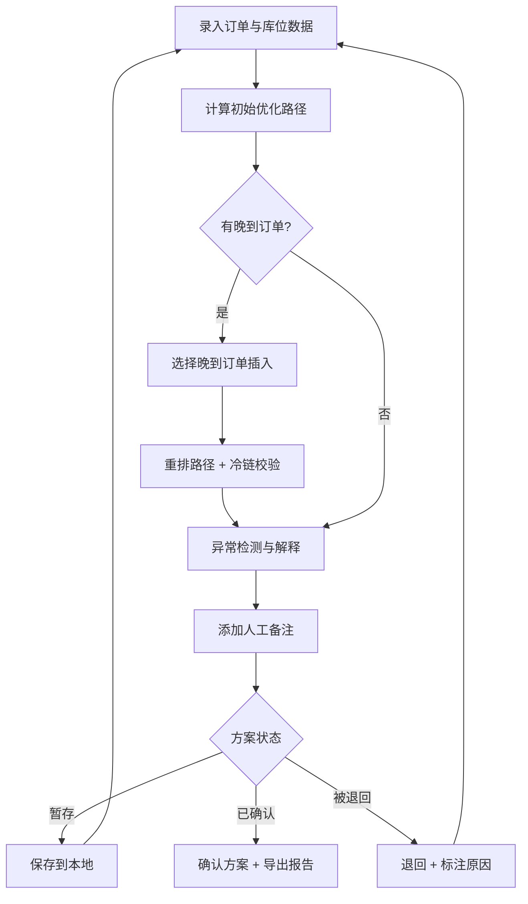

## 1. 产品概述

仓储拣货路径重排计算工具——面向仓库主管，解决晚到订单插入拣货路线时的路径绕远、冷链超时、路径回头过多等实际问题。支持本地数据持久化，关闭浏览器后重新打开仍可继续处理未完成路线。

- 目标用户：仓库主管、拣货调度员
- 核心价值：将晚到订单智能插入已有路线，保证不绕远、不超冷链时限，并对异常情况给出稳定可追溯的解释

## 2. 核心功能

### 2.1 功能模块

1. **拣货路线管理页**：订单清单录入/导入、库位坐标管理、冷链标记、拣货员分配、截止时间设定
2. **路径计算与重排页**：路径优化计算、插单重排、冷链时限约束校验、路径可视化
3. **异常处理与报告页**：异常检测（库位重复/冷链超时/路径回头过多）、稳定解释生成、人工备注、状态流转（暂存→已确认/被退回）、报告导出

### 2.2 页面详情

| 页面名称 | 模块名称 | 功能描述 |
|----------|----------|----------|
| 拣货路线管理 | 订单清单面板 | 录入订单号、商品、数量、库位；支持手动添加和批量导入；保留原始数据 |
| 拣货路线管理 | 库位坐标面板 | 录入/编辑库位的 x,y 坐标；检测库位重复并标记 |
| 拣货路线管理 | 冷链标记面板 | 为订单/商品标记冷链属性，设定冷链最大时限（分钟） |
| 拣货路线管理 | 拣货员与截止时间 | 分配拣货员、设定每单截止时间；冲突时给出提示 |
| 路径计算与重排 | 路径优化面板 | 基于贪心最近邻+2-opt优化生成初始路径；展示路径总距离、预计耗时 |
| 路径计算与重排 | 插单重排面板 | 选择晚到订单插入当前路线；计算最优插入位置；校验冷链时限 |
| 路径计算与重排 | 路径可视化面板 | 2D 坐标图展示库位分布和路径连线；标记冷链库位；高亮插入点 |
| 异常处理与报告 | 异常检测面板 | 自动检测三类异常并给出稳定解释；同一条数据多次计算结果一致 |
| 异常处理与报告 | 状态流转面板 | 路线方案状态：暂存→已确认/被退回；支持状态切换与筛选 |
| 异常处理与报告 | 报告导出面板 | 导出包含人工备注的路径报告（JSON/CSV）；备注字段始终保留 |

## 3. 核心流程

用户录入订单和库位数据 → 系统计算初始优化路径 → 用户插入晚到订单 → 系统重排路径并校验冷链时限 → 系统检测异常并生成稳定解释 → 用户添加人工备注 → 用户确认/退回/暂存方案 → 导出报告

## 4. 用户界面设计

### 4.1 设计风格

- 主色调：深墨蓝 (#1B2A4A) + 工业橙 (#E8712B) 强调色，体现仓储工业感
- 辅助色：冷链蓝 (#00A3E0)、警告红 (#DC3545)、通过绿 (#28A745)
- 按钮风格：圆角微凸（rounded-lg + shadow-sm），主操作用工业橙，危险操作用警告红
- 字体：DM Sans（正文）+ JetBrains Mono（数据/坐标），突出专业工具感
- 布局：左侧面板 + 右侧主内容区，顶部状态栏，工业仪表盘风格
- 图标：lucide-react 线性图标

### 4.2 页面设计概览

| 页面名称 | 模块名称 | UI 要素 |
|----------|----------|---------|
| 拣货路线管理 | 订单清单面板 | 卡片列表布局，每单一张卡片，冷链标记用蓝色标签，截止时间倒计时用橙色 |
| 拣货路线管理 | 库位坐标面板 | 紧凑表格，重复库位用红色行高亮，坐标用等宽字体 |
| 路径计算与重排 | 路径可视化面板 | 2D 画布，库位为圆点，冷链库位加蓝色光晕，路径为带箭头折线，插入点用橙色脉冲动画 |
| 异常处理与报告 | 异常检测面板 | 三类异常分色标签，解释文本用引用块样式，可折叠详情 |
| 异常处理与报告 | 状态流转面板 | 状态徽章（暂存=灰、已确认=绿、被退回=红），切换按钮组 |

### 4.3 响应式

- 桌面优先设计（1280px+最佳体验）
- 1024-1280px 面板可折叠
- 触控：按钮最小 44px 触控区域

## 5. 样例数据要求

工具需内置一组可运行的样例数据，包含：
- 8-10 个订单（其中 2-3 个标记冷链）
- 12-15 个库位坐标（其中 2 组重复库位，用于演示异常检测）
- 2 个晚到订单（1 个冷链、1 个普通）
- 1 个拣货员
- 截止时间分布在 30-120 分钟内
