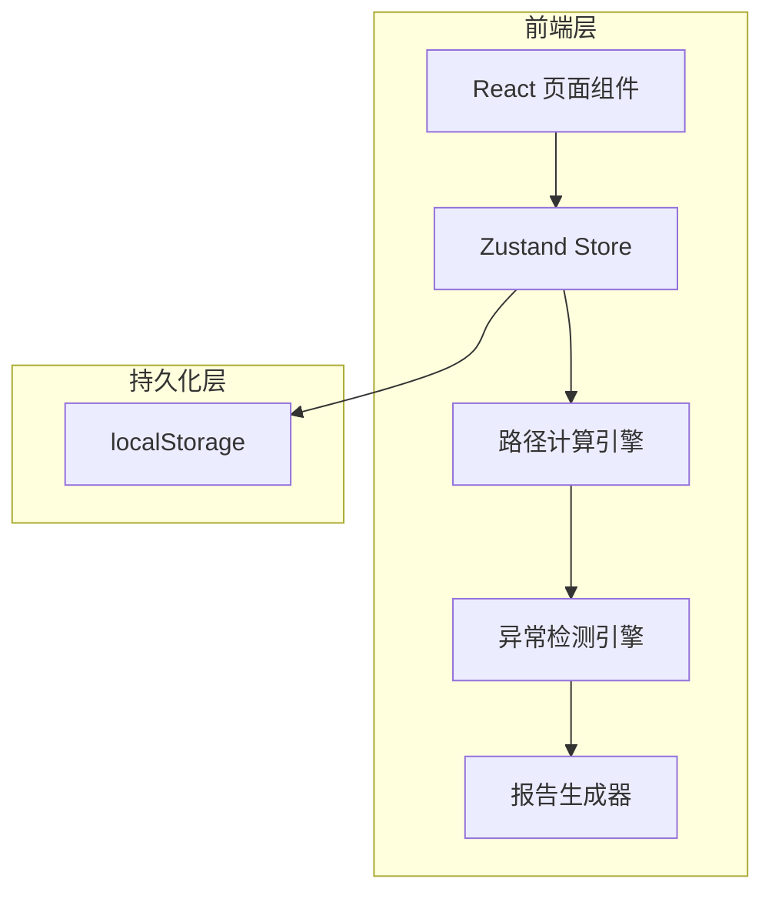
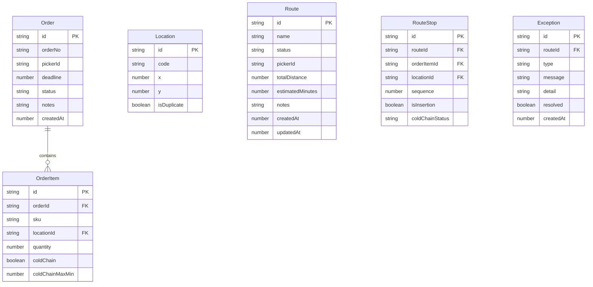

## 1. 架构设计



纯前端架构，无后端服务，所有数据和计算在浏览器端完成，通过 localStorage 实现本地持久化。

## 2. 技术说明

- 前端：React@18 + TypeScript + Tailwind CSS@3 + Vite
- 初始化工具：vite-init（react-ts 模板）
- 状态管理：Zustand（含 persist 中间件实现 localStorage 持久化）
- 路径可视化：HTML5 Canvas（轻量，无需额外依赖）
- 报告导出：浏览器原生 Blob + download
- 后端：无
- 数据库：无（localStorage 替代）

## 3. 路由定义

| 路由 | 用途 |
|------|------|
| / | 拣货路线管理页（订单清单、库位坐标、冷链标记、拣货员、截止时间） |
| /optimize | 路径计算与重排页（路径优化、插单重排、路径可视化） |
| /exceptions | 异常处理与报告页（异常检测、状态流转、报告导出） |

## 4. 数据模型

### 4.1 数据模型定义



### 4.2 类型定义（TypeScript）

```typescript
type RouteStatus = 'draft' | 'confirmed' | 'rejected' | 'stored'
type ColdChainStatus = 'ok' | 'warning' | 'timeout'
type ExceptionType = 'duplicate_location' | 'cold_chain_timeout' | 'path_backtrack'

interface Order {
  id: string
  orderNo: string
  pickerId: string
  deadline: number
  status: RouteStatus
  notes: string
  createdAt: number
  items: OrderItem[]
}

interface OrderItem {
  id: string
  orderId: string
  sku: string
  locationId: string
  quantity: number
  coldChain: boolean
  coldChainMaxMin: number
}

interface Location {
  id: string
  code: string
  x: number
  y: number
  isDuplicate: boolean
}

interface Route {
  id: string
  name: string
  status: RouteStatus
  pickerId: string
  totalDistance: number
  estimatedMinutes: number
  notes: string
  createdAt: number
  updatedAt: number
  stops: RouteStop[]
}

interface RouteStop {
  id: string
  routeId: string
  orderItemId: string
  locationId: string
  sequence: number
  isInsertion: boolean
  coldChainStatus: ColdChainStatus
}

interface PathException {
  id: string
  routeId: string
  type: ExceptionType
  message: string
  detail: string
  resolved: boolean
  createdAt: number
}
```

## 5. 核心算法说明

### 5.1 路径优化（贪心最近邻 + 2-opt）

1. 从起点（0,0）出发，贪心选择最近未访问库位
2. 执行 2-opt 局部优化：尝试交换任意两段路径，若总距离减少则接受
3. 冷链约束：冷链库位在路径中必须在其时限内到达，否则标记 warning/timeout

### 5.2 插单重排

1. 对晚到订单的每个库位，尝试插入路径中的每个间隙位置
2. 计算插入后的总距离增量和冷链影响
3. 选择总距离增量最小的位置，若冷链超时则尝试下一个位置
4. 所有位置均超时则标记异常并给出解释

### 5.3 异常检测与稳定解释

- **库位重复**：同一坐标出现多个不同 code 的库位 → 解释：「库位 {code1} 和 {code2} 坐标相同 ({x},{y})，可能导致拣货员遗漏」
- **冷链超时**：冷链商品从离开冷藏区到完成拣货超过最大时限 → 解释：「冷链商品 {sku} 预计耗时 {actual}分钟，超过时限 {limit}分钟」
- **路径回头过多**：路径中出现连续 3 次以上方向反转（通过向量叉积检测） → 解释：「路径在库位 {loc1}→{loc2}→{loc3} 处出现第 {n} 次回头，建议重新排列」

同一条数据多次运行，生成的异常解释文本完全一致（确定性算法，无随机因子）。
