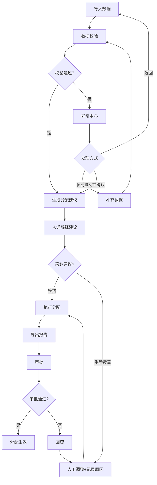
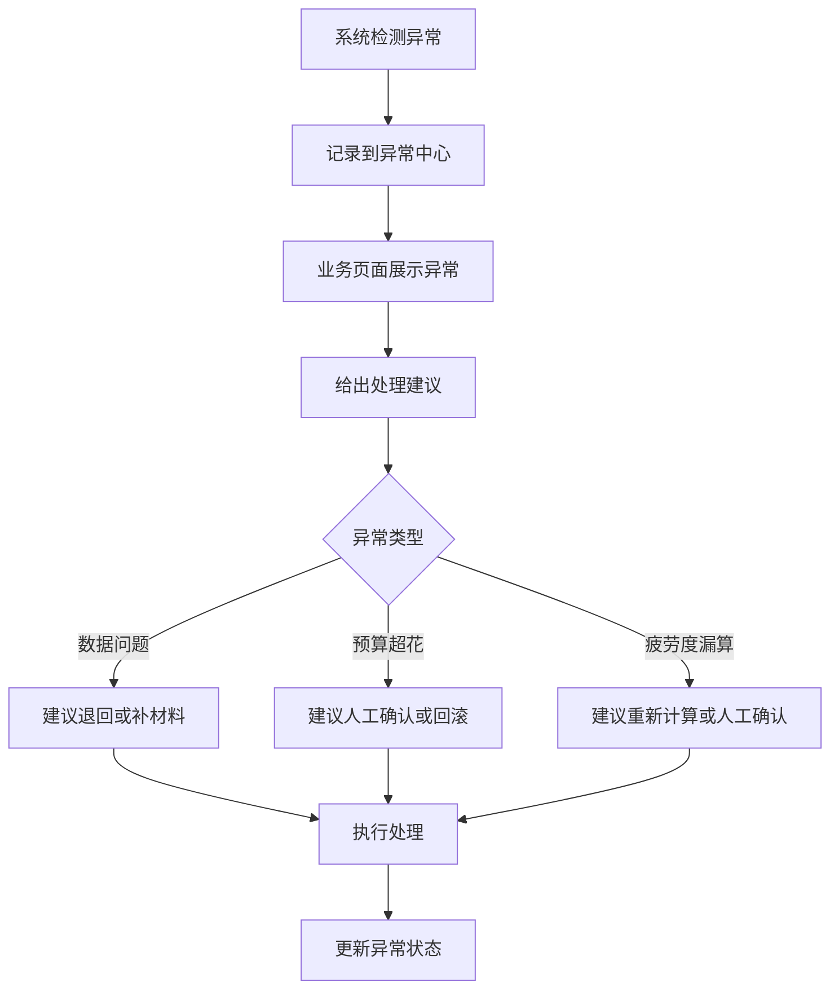
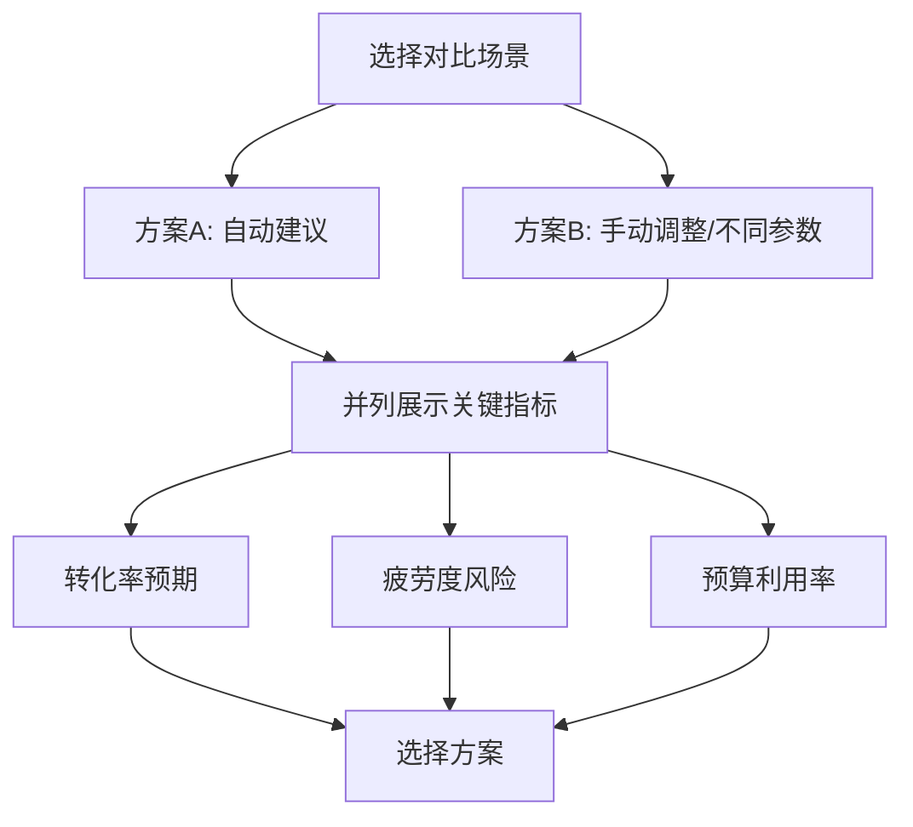

## 1. 产品概述

短视频投放预算分配系统——面向市场投放团队的日常预算调拨工具。系统基于渠道转化率、受众疲劳度和活动剩余天数，自动生成渠道预算建议，并以人话提示呈现给终端操作者，同时输出 Markdown / JSON 供复核留档。

- 核心问题：市场同事每天手动调预算，缺乏数据驱动的分配依据，容易遗漏疲劳度和转化延迟
- 目标用户：市场投放运营、预算审批负责人、数据分析复核人员
- 价值：减少人工决策偏差，提升预算使用效率，确保异常可追溯、可回滚

## 2. 核心功能

### 2.1 用户角色

| 角色 | 注册方式 | 核心权限 |
|------|----------|----------|
| 投放运营 | 管理员分配账号 | 导入数据、查看建议、执行/覆盖分配、导出报告 |
| 预算审批 | 管理员分配账号 | 查看建议、审批/退回分配、查看异常、导出报告 |
| 数据分析 | 管理员分配账号 | 查看全量数据、情景对比、复核报告、查看异常 |

### 2.2 功能模块

1. **工作台**：当日分配概览、异常提醒、渠道健康度仪表盘、待处理事项
2. **数据管理**：导入渠道数据、转化流水、预算表、创意标签、投放日历、建议报告；处理同名对象、日期格式不统一、附件延迟到达
3. **预算分配**：自动建议生成、人工覆盖、情景对比、建议解释（人话提示）、回滚与重复检测
4. **异常中心**：所有异常记录业务可见、处理建议（退回/补材料/人工确认）、异常状态追踪
5. **报告中心**：Markdown / JSON 双格式导出、终端人话提示、历史报告存档

### 2.3 页面详情

| 页面 | 模块 | 功能描述 |
|------|------|----------|
| 工作台 | 今日概览 | 展示当日预算分配总额、已分配/未分配渠道数、关键指标变化趋势 |
| 工作台 | 异常提醒 | 实时显示待处理异常（预算超花、疲劳度漏算、转化延迟），点击跳转异常中心 |
| 工作台 | 渠道健康度 | 各渠道转化率/疲劳度/消耗速度卡片，颜色编码健康状态 |
| 工作台 | 待处理事项 | 需人工确认的分配建议、待补材料的导入任务、待审批的预算变更 |
| 数据管理 | 数据源列表 | 显示已导入的各类数据源及状态（完整/缺失/异常），支持重新导入 |
| 数据管理 | 导入向导 | 步骤式上传：选择数据类型 → 上传文件 → 预览校验 → 确认导入 |
| 数据管理 | 数据校验 | 检测同名对象、日期格式不统一、字段缺失，给出修复建议 |
| 数据管理 | 附件同步 | 标记附件与主表的时间差，提示"附件比主表晚半天"等现实情况 |
| 预算分配 | 渠道建议表 | 按渠道列出自动分配建议，显示转化率/疲劳度/剩余天数及建议预算 |
| 预算分配 | 人工覆盖 | 允许手动调整预算值，记录覆盖原因，标记为"人工确认" |
| 预算分配 | 情景对比 | 两个方案并列对比：建议方案 vs 人工方案，或不同参数方案 |
| 预算分配 | 建议解释 | 人话提示每条建议的依据，如"抖音转化率持续3天下滑，建议减少15%" |
| 预算分配 | 回滚操作 | 查看历史分配记录，支持回滚到指定版本，记录回滚原因 |
| 异常中心 | 异常列表 | 按类型/严重程度/时间筛选异常，显示处理状态 |
| 异常中心 | 处理建议 | 每条异常附带建议：退回数据源 / 补充材料 / 人工确认继续 |
| 异常中心 | 状态追踪 | 异常从发现→处理→关闭的完整生命周期 |
| 报告中心 | 导出配置 | 选择导出格式（Markdown/JSON）、时间范围、包含模块 |
| 报告中心 | 人话提示预览 | 终端友好的人话摘要，可直接复制粘贴到工作群 |
| 报告中心 | 历史报告 | 按日期归档已导出报告，支持重新下载 |

## 3. 核心流程

### 3.1 日常预算分配主流程

市场运营每天打开系统，导入最新数据（渠道数据、转化流水等），系统自动校验数据质量，根据转化率、疲劳度、剩余天数计算各渠道预算建议，运营可查看人话解释并决定采纳或手动覆盖，最终导出报告供审批。

### 3.2 异常处理流程

### 3.3 情景对比流程

## 4. 用户界面设计

### 4.1 设计风格

- 主色调：深青绿（#0D9488）+ 琥珀橙（#F59E0B）强调色，传达"数据理性+市场活力"
- 辅助色：锌灰（Zinc）中性色系，用于背景和边框
- 按钮风格：圆角8px，主要操作实心填充，次要操作描边
- 字体：中文使用思源黑体（Noto Sans SC），数字/英文使用 JetBrains Mono（数据表格场景）
- 布局：左侧导航 + 右侧内容区，内容区采用卡片式布局
- 图标：Lucide 图标库，线性风格
- 异常/警告：使用红色/橙色标签 + 图标，确保一眼可辨

### 4.2 页面设计概览

| 页面 | 模块 | UI 元素 |
|------|------|---------|
| 工作台 | 今日概览 | 统计卡片（预算总额/已分配/未分配）+ 迷你折线图趋势 |
| 工作台 | 异常提醒 | 红色/橙色标签列表，点击展开详情 |
| 工作台 | 渠道健康度 | 水平条形图 + 颜色编码（绿/黄/红）|
| 工作台 | 待处理事项 | 待办列表 + 操作按钮 |
| 数据管理 | 数据源列表 | 表格 + 状态标签（完整/缺失/异常）+ 上传按钮 |
| 数据管理 | 导入向导 | 步骤条 + 拖拽上传区 + 预览表格 + 校验结果面板 |
| 数据管理 | 数据校验 | 左右对比面板（原始 vs 校验后）+ 问题标注 |
| 预算分配 | 渠道建议表 | 可编辑表格 + 建议列/实际列 + 偏差百分比 |
| 预算分配 | 情景对比 | 双栏对比卡片 + 指标雷达图 |
| 预算分配 | 建议解释 | 人话气泡卡片，如"📊 抖音近3天转化率下滑12%，疲劳度达0.78，建议削减15%" |
| 异常中心 | 异常列表 | 可筛选表格 + 严重程度色块 + 处理状态徽标 |
| 异常中心 | 处理建议 | 操作卡片（退回/补材料/人工确认）+ 确认对话框 |
| 报告中心 | 导出配置 | 格式选择器 + 日期范围 + 模块勾选 + 预览区 |
| 报告中心 | 人话提示预览 | 终端风格代码块 + 一键复制按钮 |

### 4.3 响应式设计

- 桌面优先设计，最小宽度1280px
- 表格在窄屏下支持横向滚动
- 卡片在窄屏下从多列变单列堆叠

### 4.4 3D 场景

不适用
