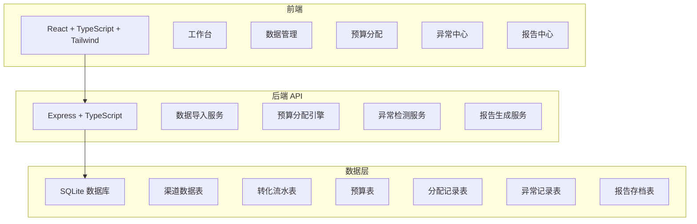
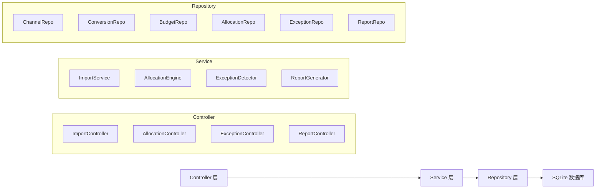
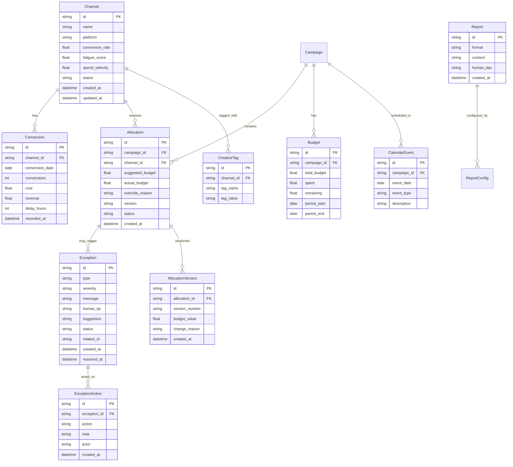

## 1. 架构设计



## 2. 技术说明

- 前端：React@18 + Tailwind CSS@3 + Vite
- 初始化工具：vite-init
- 后端：Express@4 + TypeScript（ESM 模式）
- 数据库：SQLite（better-sqlite3），适合单机演示，无需额外服务
- 状态管理：Zustand
- 路由：react-router-dom@6
- 图表：Recharts
- 图标：lucide-react

## 3. 路由定义

| 路由 | 用途 |
|------|------|
| `/` | 工作台 - 当日概览与待处理事项 |
| `/data` | 数据管理 - 导入与校验 |
| `/allocation` | 预算分配 - 建议与调整 |
| `/exceptions` | 异常中心 - 异常记录与处理 |
| `/reports` | 报告中心 - 导出与存档 |

## 4. API 定义

### 4.1 数据导入

```typescript
interface ImportRequest {
  dataType: "channel" | "conversion" | "budget" | "creative_tag" | "calendar" | "report";
  file: File;
  options?: {
    dateFormat?: "YYYY-MM-DD" | "DD/MM/YYYY" | "MM/DD/YYYY" | "auto";
    duplicatePolicy?: "skip" | "overwrite" | "rename";
    allowLateAttachment?: boolean;
  };
}

interface ImportResult {
  success: boolean;
  imported: number;
  skipped: number;
  warnings: ImportWarning[];
  errors: ImportError[];
}

interface ImportWarning {
  type: "duplicate_name" | "date_format_inconsistency" | "late_attachment" | "missing_field";
  message: string;
  suggestion: "rename" | "reformat" | "supplement" | "confirm";
  affectedRows: number[];
}

interface ImportError {
  row: number;
  field: string;
  message: string;
}
```

### 4.2 预算分配

```typescript
interface AllocationSuggestion {
  channelId: string;
  channelName: string;
  currentBudget: number;
  suggestedBudget: number;
  changePercent: number;
  metrics: {
    conversionRate: number;
    fatigueScore: number;
    remainingDays: number;
    spendVelocity: number;
  };
  explanation: string;
  confidence: "high" | "medium" | "low";
}

interface AllocationRequest {
  campaignId: string;
  totalBudget: number;
  method: "auto" | "manual" | "hybrid";
  overrides?: Array<{
    channelId: string;
    budget: number;
    reason: string;
  }>;
}

interface AllocationResult {
  id: string;
  suggestions: AllocationSuggestion[];
  totalAllocated: number;
  unallocated: number;
  warnings: string[];
  createdAt: string;
}
```

### 4.3 情景对比

```typescript
interface ScenarioComparison {
  scenarioA: {
    name: string;
    allocations: AllocationSuggestion[];
    metrics: {
      expectedConversions: number;
      fatigueRisk: number;
      budgetUtilization: number;
    };
  };
  scenarioB: {
    name: string;
    allocations: AllocationSuggestion[];
    metrics: {
      expectedConversions: number;
      fatigueRisk: number;
      budgetUtilization: number;
    };
  };
  diff: {
    conversionsDelta: number;
    fatigueDelta: number;
    utilizationDelta: number;
  };
}
```

### 4.4 异常处理

```typescript
interface Exception {
  id: string;
  type: "budget_overspend" | "fatigue_missing" | "conversion_delay" | "data_inconsistency" | "duplicate_import";
  severity: "critical" | "warning" | "info";
  message: string;
  humanReadableTip: string;
  suggestion: "rollback" | "supplement" | "confirm" | "ignore";
  status: "open" | "in_progress" | "resolved" | "dismissed";
  relatedEntityId: string;
  createdAt: string;
  resolvedAt?: string;
  resolvedBy?: string;
  resolution?: string;
}

interface ExceptionAction {
  exceptionId: string;
  action: "rollback" | "supplement" | "confirm" | "dismiss";
  note?: string;
}
```

### 4.5 报告导出

```typescript
interface ReportConfig {
  format: "markdown" | "json";
  dateRange: { start: string; end: string };
  modules: ("allocation" | "exceptions" | "comparison" | "raw_data")[];
  includeHumanTips: boolean;
}

interface Report {
  id: string;
  config: ReportConfig;
  content: string;
  humanTipsSummary: string;
  createdAt: string;
  downloadUrl: string;
}
```

## 5. 服务端架构图



## 6. 数据模型

### 6.1 数据模型定义



### 6.2 数据定义语言

```sql
CREATE TABLE channels (
  id TEXT PRIMARY KEY,
  name TEXT NOT NULL,
  platform TEXT NOT NULL,
  conversion_rate REAL DEFAULT 0,
  fatigue_score REAL DEFAULT 0,
  spend_velocity REAL DEFAULT 0,
  status TEXT DEFAULT 'active',
  created_at TEXT DEFAULT (datetime('now')),
  updated_at TEXT DEFAULT (datetime('now'))
);

CREATE TABLE conversions (
  id TEXT PRIMARY KEY,
  channel_id TEXT NOT NULL REFERENCES channels(id),
  conversion_date TEXT NOT NULL,
  conversions INTEGER DEFAULT 0,
  cost REAL DEFAULT 0,
  revenue REAL DEFAULT 0,
  delay_hours INTEGER DEFAULT 0,
  recorded_at TEXT DEFAULT (datetime('now'))
);

CREATE TABLE budgets (
  id TEXT PRIMARY KEY,
  campaign_id TEXT NOT NULL,
  total_budget REAL NOT NULL,
  spent REAL DEFAULT 0,
  remaining REAL DEFAULT 0,
  period_start TEXT NOT NULL,
  period_end TEXT NOT NULL
);

CREATE TABLE allocations (
  id TEXT PRIMARY KEY,
  campaign_id TEXT NOT NULL,
  channel_id TEXT NOT NULL REFERENCES channels(id),
  suggested_budget REAL NOT NULL,
  actual_budget REAL,
  override_reason TEXT,
  version TEXT DEFAULT '1',
  status TEXT DEFAULT 'pending',
  created_at TEXT DEFAULT (datetime('now'))
);

CREATE TABLE allocation_versions (
  id TEXT PRIMARY KEY,
  allocation_id TEXT NOT NULL REFERENCES allocations(id),
  version_number TEXT NOT NULL,
  budget_value REAL NOT NULL,
  change_reason TEXT,
  created_at TEXT DEFAULT (datetime('now'))
);

CREATE TABLE exceptions (
  id TEXT PRIMARY KEY,
  type TEXT NOT NULL,
  severity TEXT NOT NULL,
  message TEXT NOT NULL,
  human_tip TEXT NOT NULL,
  suggestion TEXT NOT NULL,
  status TEXT DEFAULT 'open',
  related_id TEXT,
  created_at TEXT DEFAULT (datetime('now')),
  resolved_at TEXT,
  resolved_by TEXT,
  resolution TEXT
);

CREATE TABLE exception_actions (
  id TEXT PRIMARY KEY,
  exception_id TEXT NOT NULL REFERENCES exceptions(id),
  action TEXT NOT NULL,
  note TEXT,
  actor TEXT,
  created_at TEXT DEFAULT (datetime('now'))
);

CREATE TABLE creative_tags (
  id TEXT PRIMARY KEY,
  channel_id TEXT NOT NULL REFERENCES channels(id),
  tag_name TEXT NOT NULL,
  tag_value TEXT NOT NULL
);

CREATE TABLE calendar_events (
  id TEXT PRIMARY KEY,
  campaign_id TEXT NOT NULL,
  event_date TEXT NOT NULL,
  event_type TEXT NOT NULL,
  description TEXT
);

CREATE TABLE reports (
  id TEXT PRIMARY KEY,
  format TEXT NOT NULL,
  content TEXT NOT NULL,
  human_tips TEXT,
  config_json TEXT,
  created_at TEXT DEFAULT (datetime('now'))
);

CREATE INDEX idx_conversions_channel ON conversions(channel_id);
CREATE INDEX idx_conversions_date ON conversions(conversion_date);
CREATE INDEX idx_allocations_campaign ON allocations(campaign_id);
CREATE INDEX idx_allocations_channel ON allocations(channel_id);
CREATE INDEX idx_exceptions_type ON exceptions(type);
CREATE INDEX idx_exceptions_status ON exceptions(status);
CREATE INDEX idx_exceptions_severity ON exceptions(severity);
CREATE INDEX idx_allocation_versions_allocation ON allocation_versions(allocation_id);
CREATE INDEX idx_creative_tags_channel ON creative_tags(channel_id);
CREATE INDEX idx_calendar_events_campaign ON calendar_events(campaign_id);
CREATE INDEX idx_calendar_events_date ON calendar_events(event_date);
```
