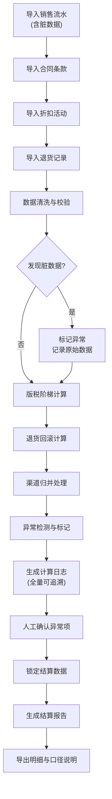
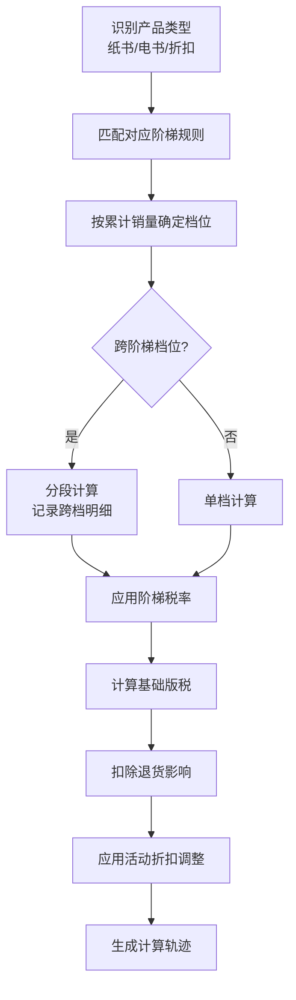

## 1. 产品概述

版权版税阶梯结算系统是为出版社设计的作者版税结算工具，支持纸书、电书、活动折扣等不同阶梯的版税计算。系统重点解决计算过程可复查、异常原因可追溯、边界情况留痕迹、数据口径一致性等核心问题。

- 主要用途：出版社向作者结算版税时的阶梯计算、退货回滚、渠道归并、差异解释、报告导出
- 解决问题：人工计算易错、边界情况无痕迹、数据口径不透明、报告与明细不一致
- 目标用户：出版社财务人员、版权编辑、作者

---

## 2. 核心功能

### 2.1 用户角色

| 角色 | 注册方式 | 核心权限 |
|------|----------|----------|
| 财务人员 | 系统账号 | 完整结算流程、数据导入、报告导出、人工确认 |
| 版权编辑 | 系统账号 | 合同维护、数据查看、异常核对 |
| 作者 | 邮件邀请 | 查看本人结算报告、下载明细 |

### 2.2 功能模块

1. **结算仪表盘**：结算周期概览、异常统计、待办事项
2. **版税计算引擎**：多阶梯计算、退货回滚、渠道归并
3. **数据管理**：销售流水、合同条款、折扣活动、退货记录、作者账号
4. **结算报告**：报告生成、差异解释、历史版本对比
5. **导出中心**：Excel/CSV导出、明细追溯、口径说明
6. **审计追踪**：计算过程日志、人工确认记录、操作历史

### 2.3 页面详情

| 页面名称 | 模块名称 | 功能描述 |
|----------|----------|----------|
| 结算仪表盘 | 概览卡片 | 本期结算金额、异常笔数、待确认项统计 |
| 结算仪表盘 | 结算周期列表 | 查看历史结算周期、状态追踪 |
| 版税结算 | 计算参数配置 | 选择结算周期、配置阶梯规则、预览参数 |
| 版税结算 | 阶梯计算器 | 实时计算、阶梯可视化、跨档提示 |
| 版税结算 | 异常列表 | 退货晚到、阶梯跨档错、渠道重复等异常展示 |
| 数据管理 | 销售流水 | 导入、查看、标记脏数据 |
| 数据管理 | 合同条款 | 阶梯配置、生效日期、特殊条款 |
| 数据管理 | 折扣活动 | 活动配置、适用范围、阶梯规则 |
| 数据管理 | 退货记录 | 退货登记、回滚计算、逾期处理 |
| 数据管理 | 作者账号 | 作者信息、税率、收款账号 |
| 结算报告 | 报告详情 | 结算金额、分项明细、差异说明 |
| 结算报告 | 版本对比 | 历史版本对比、变更痕迹 |
| 导出中心 | 导出配置 | 格式选择、字段自定义、口径说明生成 |
| 审计追踪 | 计算日志 | 每笔计算的详细过程、公式、入参 |
| 审计追踪 | 操作历史 | 人工确认、数据修改、状态变更记录 |

---

## 3. 核心流程

### 3.1 结算主流程

### 3.2 阶梯计算流程

---

## 4. 用户界面设计

### 4.1 设计风格

- **主色调**：深墨蓝 `#1a365d` - 代表专业、严谨、可信
- **辅助色**：琥珀金 `#d69e2e` - 用于强调重点数据、异常标记
- **警示色**：珊瑚红 `#c53030` - 用于错误、严重异常
- **成功色**：森林绿 `#2f855a` - 用于已确认、正常状态
- **中性色**：冷灰系列 `#1a202c` 至 `#f7fafc`
- **字体**：
  - 标题：思源宋体 - 体现出版行业的人文气质
  - 正文：Inter - 数字显示清晰、阅读舒适
  - 数字：JetBrains Mono - 财务数字等宽对齐
- **布局风格**：表格优先、数据密集但层次分明、左侧导航 + 主内容区
- **按钮风格**：扁平化、直角、细微边框、hover 状态颜色加深
- **图标风格**：线性图标、2px 线条、统一圆角

### 4.2 页面设计概述

| 页面名称 | 模块名称 | UI 元素 |
|----------|----------|----------|
| 版税结算 | 阶梯计算器 | 阶梯可视化图表、实时计算结果、异常高亮、计算轨迹展开面板 |
| 版税结算 | 异常列表 | 表格、异常类型标签、状态徽章、操作按钮列、展开行查看详情 |
| 结算报告 | 报告详情 | 卡片式汇总、可折叠明细、差异标注、版本时间戳、确认签名 |
| 导出中心 | 导出配置 | 字段勾选器、预览面板、口径说明自动生成器、下载按钮组 |
| 审计追踪 | 计算日志 | 树形结构、公式高亮、原始值/计算值对比、时间线 |

### 4.3 响应式设计

- 桌面端优先（核心使用场景）
- 平板适配：侧栏可收起、表格横向滚动
- 移动端：仅支持查看报告、确认简单异常
- 数据表格支持固定首列、横向滚动

### 4.4 数据可视化

- 阶梯示意图：分段条形图展示不同销量档位对应的税率
- 结算趋势：折线图展示作者历史结算金额
- 异常分布：饼图展示各类异常占比
- 渠道构成：堆叠条形图展示不同渠道的销售贡献
