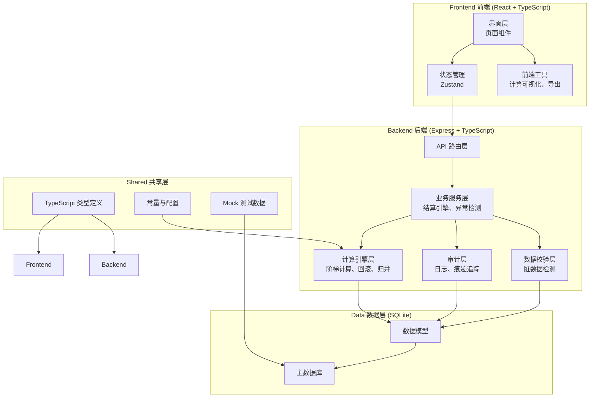
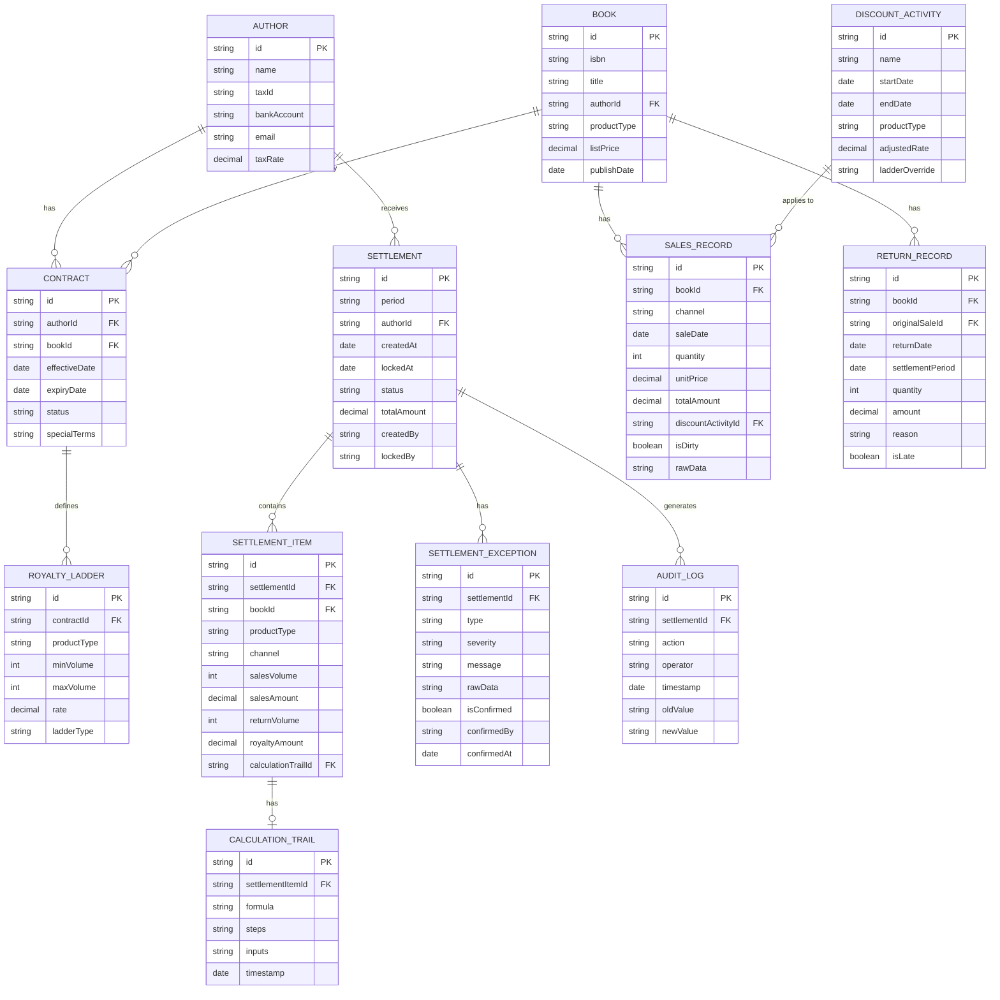

## 1. 架构设计



---

## 2. 技术描述

- **前端**：React@18 + TypeScript + tailwindcss@3 + vite
- **初始化工具**：vite-init
- **后端**：Express@4 + TypeScript + ts-node
- **数据库**：SQLite3 + better-sqlite3
- **状态管理**：zustand
- **路由**：react-router-dom
- **图标**：lucide-react
- **Excel 导出**：xlsx (SheetJS)
- **日期处理**：dayjs

---

## 3. 路由定义

| 路由 | 页面用途 |
|------|---------|
| `/` | 结算仪表盘 |
| `/settlement` | 版税结算主页面 |
| `/settlement/calculate` | 阶梯计算器 |
| `/settlement/exceptions` | 异常列表 |
| `/data/sales` | 销售流水管理 |
| `/data/contracts` | 合同条款管理 |
| `/data/discounts` | 折扣活动管理 |
| `/data/returns` | 退货记录管理 |
| `/data/authors` | 作者账号管理 |
| `/report/:id` | 结算报告详情 |
| `/export` | 导出中心 |
| `/audit` | 审计追踪 |

---

## 4. API 定义

```typescript
// 通用响应
interface ApiResponse<T> {
  success: boolean;
  data: T;
  message?: string;
  errors?: ValidationError[];
}

interface ValidationError {
  field: string;
  code: string;
  message: string;
  rawValue?: any;
}

// 计算引擎 API
interface CalculateRoyaltyRequest {
  periodId: string;
  authorId?: string;
  bookId?: string;
  forceRecalculate?: boolean;
}

interface CalculateRoyaltyResponse {
  settlementId: string;
  totalAmount: number;
  itemCount: number;
  exceptionCount: number;
  calculationLogId: string;
  items: SettlementItem[];
  exceptions: SettlementException[];
}

// 结算明细
interface SettlementItem {
  id: string;
  bookId: string;
  bookName: string;
  authorId: string;
  authorName: string;
  productType: 'PHYSICAL' | 'EBOOK' | 'DISCOUNT';
  channel: string;
  salesVolume: number;
  salesAmount: number;
  returnVolume: number;
  returnAmount: number;
  netSalesVolume: number;
  ladderTier: number;
  ladderRange: string;
  royaltyRate: number;
  royaltyAmount: number;
  calculationTrail: CalculationTrail;
}

// 计算轨迹
interface CalculationTrail {
  steps: CalculationStep[];
  formula: string;
  inputs: Record<string, number>;
  timestamp: string;
}

interface CalculationStep {
  order: number;
  description: string;
  operation: string;
  input: number;
  output: number;
  rule: string;
}

// 异常类型
interface SettlementException {
  id: string;
  type: 'LATE_RETURN' | 'LADDER_CROSSING' | 'DUPLICATE_CHANNEL' | 'DIRTY_DATA' | 'MISSING_CONTRACT';
  severity: 'WARNING' | 'ERROR' | 'INFO';
  message: string;
  settlementItemId?: string;
  rawData: Record<string, any>;
  confirmedBy?: string;
  confirmedAt?: string;
  confirmationNote?: string;
  autoOverridable: boolean;
}

// 导出 API
interface ExportRequest {
  settlementId: string;
  format: 'EXCEL' | 'CSV';
  includeTrail: boolean;
  includeRawData: boolean;
  customFields?: string[];
}

interface ExportResponse {
  downloadUrl: string;
  filename: string;
  fileSize: number;
  processingNote: string;
}
```

---

## 5. 服务端架构图

```mermaid
graph LR
    Controller["API Controller\n路由层"] --> Service["业务服务层"]
    
    subgraph "业务服务层"
        SettlementService["结算服务"]
        CalculationService["计算服务"]
        ExceptionService["异常服务"]
        ExportService["导出服务"]
        AuditService["审计服务"]
    end
    
    SettlementService --> CalculationEngine["版税计算引擎"]
    SettlementService --> ExceptionService
    CalculationService --> CalculationEngine
    ExportService --> ReportGenerator["报告生成器"]
    AuditService --> TrailLogger["轨迹记录器"]
    
    subgraph "核心引擎"
        CalculationEngine
        ReturnRollback["退货回滚模块"]
        ChannelMerge["渠道归并模块"]
        LadderResolver["阶梯解析模块"]
        ReportGenerator
        TrailLogger
    end
    
    CalculationEngine --> ReturnRollback
    CalculationEngine --> ChannelMerge
    CalculationEngine --> LadderResolver
    
    Service --> Repository["数据访问层"]
    Repository --> DB["SQLite 数据库"]
```



---

## 6. 数据模型

### 6.1 数据模型 ER 图



### 6.2 DDL 语句

```sql
-- 作者表
CREATE TABLE author (
    id TEXT PRIMARY KEY,
    name TEXT NOT NULL,
    tax_id TEXT,
    bank_account TEXT,
    email TEXT,
    tax_rate REAL DEFAULT 0.0,
    created_at TEXT DEFAULT CURRENT_TIMESTAMP,
    updated_at TEXT DEFAULT CURRENT_TIMESTAMP
);

-- 图书表
CREATE TABLE book (
    id TEXT PRIMARY KEY,
    isbn TEXT,
    title TEXT NOT NULL,
    author_id TEXT REFERENCES author(id),
    product_type TEXT NOT NULL CHECK (product_type IN ('PHYSICAL', 'EBOOK', 'DISCOUNT')),
    list_price REAL NOT NULL,
    publish_date TEXT,
    created_at TEXT DEFAULT CURRENT_TIMESTAMP
);

-- 合同表
CREATE TABLE contract (
    id TEXT PRIMARY KEY,
    author_id TEXT NOT NULL REFERENCES author(id),
    book_id TEXT NOT NULL REFERENCES book(id),
    effective_date TEXT NOT NULL,
    expiry_date TEXT,
    status TEXT NOT NULL DEFAULT 'ACTIVE',
    special_terms TEXT,
    created_at TEXT DEFAULT CURRENT_TIMESTAMP
);

-- 版税阶梯表
CREATE TABLE royalty_ladder (
    id TEXT PRIMARY KEY,
    contract_id TEXT NOT NULL REFERENCES contract(id),
    product_type TEXT NOT NULL,
    min_volume INTEGER NOT NULL DEFAULT 0,
    max_volume INTEGER,
    rate REAL NOT NULL,
    ladder_type TEXT NOT NULL DEFAULT 'STANDARD',
    created_at TEXT DEFAULT CURRENT_TIMESTAMP
);

-- 销售流水表
CREATE TABLE sales_record (
    id TEXT PRIMARY KEY,
    book_id TEXT NOT NULL REFERENCES book(id),
    channel TEXT NOT NULL,
    sale_date TEXT NOT NULL,
    quantity INTEGER NOT NULL,
    unit_price REAL NOT NULL,
    total_amount REAL NOT NULL,
    discount_activity_id TEXT REFERENCES discount_activity(id),
    is_dirty INTEGER DEFAULT 0,
    raw_data TEXT,
    created_at TEXT DEFAULT CURRENT_TIMESTAMP
);

-- 退货记录表
CREATE TABLE return_record (
    id TEXT PRIMARY KEY,
    book_id TEXT NOT NULL REFERENCES book(id),
    original_sale_id TEXT REFERENCES sales_record(id),
    return_date TEXT NOT NULL,
    settlement_period TEXT NOT NULL,
    quantity INTEGER NOT NULL,
    amount REAL NOT NULL,
    reason TEXT,
    is_late INTEGER DEFAULT 0,
    created_at TEXT DEFAULT CURRENT_TIMESTAMP
);

-- 折扣活动表
CREATE TABLE discount_activity (
    id TEXT PRIMARY KEY,
    name TEXT NOT NULL,
    start_date TEXT NOT NULL,
    end_date TEXT NOT NULL,
    product_type TEXT,
    adjusted_rate REAL,
    ladder_override TEXT,
    created_at TEXT DEFAULT CURRENT_TIMESTAMP
);

-- 结算表
CREATE TABLE settlement (
    id TEXT PRIMARY KEY,
    period TEXT NOT NULL,
    author_id TEXT NOT NULL REFERENCES author(id),
    created_at TEXT DEFAULT CURRENT_TIMESTAMP,
    locked_at TEXT,
    status TEXT NOT NULL DEFAULT 'DRAFT',
    total_amount REAL DEFAULT 0,
    created_by TEXT,
    locked_by TEXT,
    calculation_log_id TEXT
);

-- 结算明细表
CREATE TABLE settlement_item (
    id TEXT PRIMARY KEY,
    settlement_id TEXT NOT NULL REFERENCES settlement(id),
    book_id TEXT NOT NULL REFERENCES book(id),
    product_type TEXT NOT NULL,
    channel TEXT NOT NULL,
    sales_volume INTEGER NOT NULL DEFAULT 0,
    sales_amount REAL NOT NULL DEFAULT 0,
    return_volume INTEGER NOT NULL DEFAULT 0,
    return_amount REAL NOT NULL DEFAULT 0,
    net_sales_volume INTEGER NOT NULL DEFAULT 0,
    ladder_tier INTEGER,
    ladder_range TEXT,
    royalty_rate REAL NOT NULL DEFAULT 0,
    royalty_amount REAL NOT NULL DEFAULT 0,
    calculation_trail_id TEXT REFERENCES calculation_trail(id)
);

-- 结算异常表
CREATE TABLE settlement_exception (
    id TEXT PRIMARY KEY,
    settlement_id TEXT NOT NULL REFERENCES settlement(id),
    settlement_item_id TEXT REFERENCES settlement_item(id),
    type TEXT NOT NULL,
    severity TEXT NOT NULL,
    message TEXT NOT NULL,
    raw_data TEXT,
    is_confirmed INTEGER DEFAULT 0,
    confirmed_by TEXT,
    confirmed_at TEXT,
    confirmation_note TEXT,
    auto_overridable INTEGER DEFAULT 0,
    created_at TEXT DEFAULT CURRENT_TIMESTAMP
);

-- 计算轨迹表
CREATE TABLE calculation_trail (
    id TEXT PRIMARY KEY,
    settlement_item_id TEXT NOT NULL REFERENCES settlement_item(id),
    formula TEXT NOT NULL,
    steps TEXT NOT NULL,
    inputs TEXT NOT NULL,
    timestamp TEXT DEFAULT CURRENT_TIMESTAMP
);

-- 审计日志表
CREATE TABLE audit_log (
    id TEXT PRIMARY KEY,
    settlement_id TEXT REFERENCES settlement(id),
    action TEXT NOT NULL,
    operator TEXT NOT NULL,
    timestamp TEXT DEFAULT CURRENT_TIMESTAMP,
    old_value TEXT,
    newValue TEXT,
    note TEXT
);

-- 索引
CREATE INDEX idx_sales_book_date ON sales_record(book_id, sale_date);
CREATE INDEX idx_settlement_author_period ON settlement(author_id, period);
CREATE INDEX idx_exception_settlement ON settlement_exception(settlement_id);
CREATE INDEX idx_item_settlement ON settlement_item(settlement_id);
```
