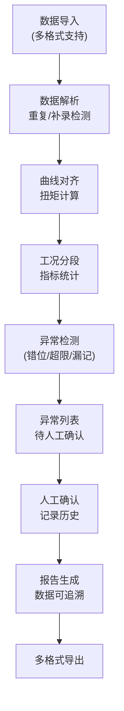
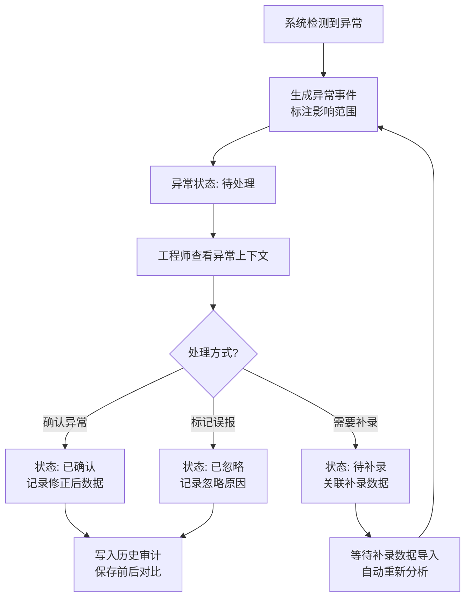

## 1. 产品概述

电机扭矩台架分析系统，面向机电实验室工程师，解决多维度测试数据（转速、扭矩、温度、负载）手工对账效率低、异常发现滞后、数据追溯困难的核心问题。通过自动化数据对齐、智能异常检测、可追溯报告生成，实现测试数据全链路质量管理。

核心价值：将分散的采样数据整合为可交互的分析视图，让异常处理成为可追踪的业务流程而非简单校验，支持重复/补录数据的自动识别与合并，最终输出可溯源的分析报告。

## 2. 核心功能

### 2.1 用户角色

| 角色 | 登录方式 | 核心权限 |
|------|----------|----------|
| 测试工程师 | 工号登录 | 数据导入、查看分析、异常标注、人工确认、导出报告 |
| 实验室主管 | 工号登录 | 全部工程师权限 + 异常复核、批量确认、查看历史审计 |

### 2.2 功能模块

1. **数据导入模块**：支持多格式采样数据导入，自动识别重复/补录记录
2. **曲线分析模块**：转速曲线、扭矩曲线、温度曲线的联动展示与对齐
3. **工况分段模块**：基于负载档位自动划分工况段，计算各段统计指标
4. **异常管理模块**：采样错位检测、温升超限分析、负载档漏记推断，支持人工确认
5. **报告导出模块**：生成可追溯分析报告，每个数据点可点击回溯原始明细
6. **历史审计模块**：记录所有人工确认动作，展示确认前后数据变化对比

### 2.3 页面详情

| 页面名称 | 模块名称 | 功能描述 |
|----------|----------|----------|
| 工作台仪表板 | 概览卡片 | 今日测试批次、待处理异常、设备运行状态统计 |
| 工作台仪表板 | 快捷操作 | 数据导入入口、最近分析报告列表、异常待办提醒 |
| 数据分析页面 | 曲线展示区 | 转速/扭矩/温度三轴联动曲线，支持缩放、hover查看详情 |
| 数据分析页面 | 工况分段表 | 按负载档位划分的工况段列表，展示各段统计指标 |
| 数据分析页面 | 原始采样表 | 对齐后的采样明细，支持按时间/设备/异常状态筛选 |
| 异常管理页面 | 异常列表 | 按类型/严重程度/状态分类的异常事件清单 |
| 异常管理页面 | 异常详情 | 异常上下文展示、影响范围标注、人工确认操作区 |
| 异常管理页面 | 历史对比 | 人工确认前后的数据变化对比视图 |
| 报告导出页面 | 报告配置 | 选择时间范围、设备、包含内容的报告配置表单 |
| 报告导出页面 | 报告预览 | 可交互的报告预览，数据点可点击追溯原始数据 |
| 报告导出页面 | 导出操作 | 支持 PDF/Excel/JSON 格式导出，包含追溯链接 |

## 3. 核心流程

### 主业务流程

测试工程师导入多批次采样数据 → 系统自动解析并检测重复/补录 → 执行曲线对齐与扭矩计算 → 自动划分工况段并统计 → 智能检测三类业务例外 → 工程师审核异常并人工确认 → 生成可追溯分析报告 → 导出交付

### 异常处理流程

## 4. 用户界面设计

### 4.1 设计风格

**工业精密仪器风格** - 体现实验室专业感与数据可信度
- 主色调：深空蓝 `#0F172A` 作为背景，科技蓝 `#3B82F6` 作为主交互色
- 强调色：警示橙 `#F59E0B`（温升预警）、警报红 `#EF4444`（超限/异常）、确认绿 `#10B981`（正常/确认）
- 中性色：多层次灰色系 `#1E293B / #334155 / #64748B / #94A3B8` 构建清晰的信息层级
- 按钮风格：直角微圆角（2px），实线边框，hover 时轻微发光效果，体现精密仪器感
- 字体：等宽字体 `JetBrains Mono` 用于数据展示，`Noto Sans SC` 用于中文说明
- 布局风格：深色主题下的模块化卡片布局，模块间有清晰的分割线与阴影层次
- 图标风格：线性 Outline 图标，统一 24px 网格，色彩与功能语义严格对应

### 4.2 页面设计概述

| 页面名称 | 模块名称 | UI 元素 |
|----------|----------|----------|
| 工作台 | 概览卡片 | 深色卡片配亮色数据，关键指标带趋势箭头，异常卡片带脉冲动画 |
| 工作台 | 异常待办 | 红色角标 + 倒计时提醒，点击直达异常详情 |
| 数据分析 | 曲线区域 | 三行联动图表，X 轴时间对齐，异常区域半透明红色遮罩 |
| 数据分析 | 工况分段 | 斑马纹表格，异常段整行高亮，点击展开该段采样明细 |
| 数据分析 | 原始采样表 | 固定表头，可排序，异常单元格红框标注，hover 显示追溯按钮 |
| 异常管理 | 异常列表 | 时间线布局，不同异常类型有专属图标与色带 |
| 异常管理 | 异常详情 | 左右分栏：左侧上下文曲线 + 影响范围高亮，右侧操作区 + 历史记录 |
| 异常管理 | 历史对比 | 左右双列对比视图，差异项用黄色高亮标注 |
| 报告导出 | 报告预览 | 仿纸质报告排版，数据带下划线可点击追溯 |
| 报告导出 | 导出操作 | 分步向导，导出前校验数据完整性 |

### 4.3 交互与动效

- **页面加载**：骨架屏渐入，模块依次淡入（stagger 50ms）
- **曲线交互**：hover 时十字准线跟随，三图联动显示同一时间点数据
- **异常标注**：检测到异常时，曲线区域红色遮罩从左往右滑动出现
- **人工确认**：确认按钮点击后有 300ms 确认态动画，历史记录从底部滑入
- **数据追溯**：点击数据点时，原始数据表格滚动定位并高亮对应行

### 4.4 响应式

- 桌面端优先设计（≥1440px），三栏布局：侧边导航 + 主内容区 + 详情面板
- 平板端（≥768px）：左右两栏，详情面板改为底部抽屉
- 移动端（<768px）：单列流式布局，重点展示异常列表与核心曲线
- 所有数据表格支持横向滚动，关键列固定

## 5. 数据可视化规范

### 5.1 曲线图表

- 转速曲线：科技蓝 `#3B82F6`，实线，2px
- 扭矩曲线：确认绿 `#10B981`，实线，2px
- 温度曲线：警示橙 `#F59E0B`，实线，2px，超过阈值后变为警报红 `#EF4444` 虚线
- 负载档位：阶梯状灰色填充区，不同档位透明度不同
- 异常区域：警报红 `#EF4444` 20% 透明度遮罩

### 5.2 状态色彩语义

| 状态 | 颜色 | 语义 |
|------|------|------|
| 正常 | `#10B981` | 数据对齐正常、无异常 |
| 预警 | `#F59E0B` | 接近阈值、轻微错位 |
| 异常 | `#EF4444` | 超限、严重错位、漏记 |
| 待确认 | `#8B5CF6` | 系统检测待人工确认 |
| 已确认 | `#06B6D4` | 人工已确认处理 |
| 已忽略 | `#64748B` | 标记为误报 |
