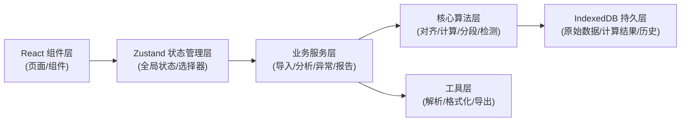
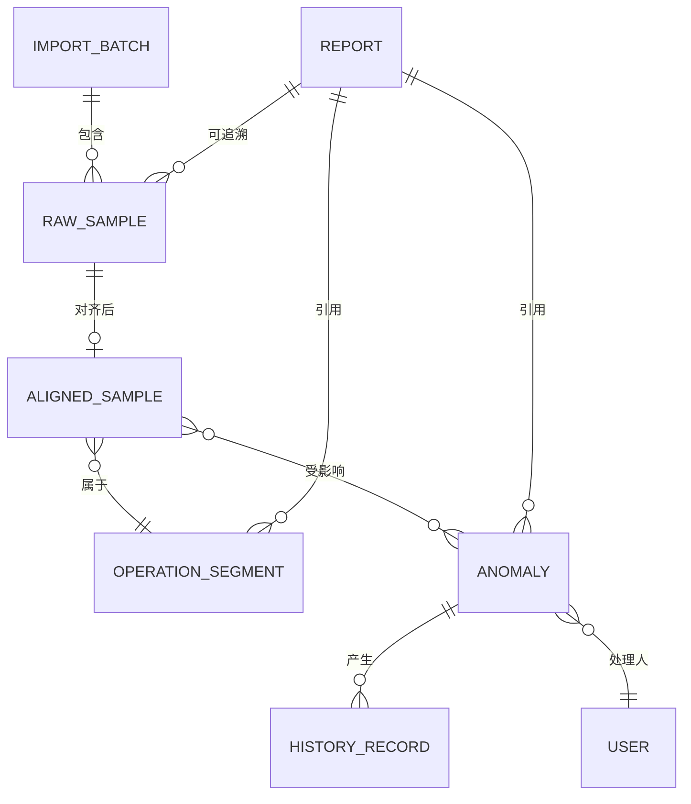

## 1. 架构设计

本系统采用前端单页应用架构，所有业务逻辑在前端完成，数据存储使用浏览器 IndexedDB 实现本地持久化。核心设计原则：

1. **数据不可变**：所有原始采样数据导入后不可修改，人工确认操作只产生新的修正记录并关联原始数据
2. **事件溯源**：所有状态变更通过事件记录，支持完整的历史回溯与审计
3. **可追溯性**：每个计算结果都保存溯源路径，可一路点击回到原始采样明细



## 2. 技术描述

- **前端框架**: React@18 + TypeScript@5
- **构建工具**: Vite@5
- **样式方案**: TailwindCSS@3 + CSS 变量（主题系统）
- **状态管理**: Zustand@4（轻量状态管理，支持中间件持久化）
- **图表库**: Apache ECharts@5（专业数据可视化，支持大数据量渲染）
- **本地数据库**: Dexie.js@3（IndexedDB 封装，支持复杂查询与事务）
- **UI 组件**: 自研组件库（基于 Headless UI 原语，避免通用 AI 审美）
- **文件解析**: PapaParse@5（CSV）、SheetJS/xlsx@0.18（Excel）
- **导出功能**: html2canvas + jspdf（PDF）、SheetJS/xlsx（Excel）

## 3. 目录结构

```
src/
├── types/              # TypeScript 类型定义
│   ├── samples.ts      # 采样数据类型
│   ├── anomalies.ts    # 异常事件类型
│   ├── segments.ts     # 工况段类型
│   ├── history.ts      # 历史记录类型
│   └── report.ts       # 报告类型
├── db/                 # IndexedDB 数据库定义
│   ├── index.ts        # Dexie 实例与 Schema
│   └── queries.ts      # 常用查询封装
├── core/               # 核心算法层（纯函数，可独立测试）
│   ├── alignment.ts    # 曲线对齐算法
│   ├── torque.ts       # 扭矩计算
│   ├── segmentation.ts # 工况分段
│   └── anomalyDetector.ts # 异常检测
├── services/           # 业务服务层
│   ├── importService.ts      # 数据导入服务
│   ├── analysisService.ts    # 分析服务
│   ├── anomalyService.ts     # 异常管理服务
│   ├── historyService.ts     # 历史审计服务
│   └── reportService.ts      # 报告导出服务
├── store/              # 状态管理
│   ├── useSampleStore.ts
│   ├── useAnomalyStore.ts
│   └── useHistoryStore.ts
├── components/         # React 组件
│   ├── charts/         # 图表组件
│   ├── tables/         # 表格组件
│   ├── layout/         # 布局组件
│   └── common/         # 通用组件
├── pages/              # 页面组件
│   ├── Dashboard.tsx
│   ├── Analysis.tsx
│   ├── Anomalies.tsx
│   └── Report.tsx
├── utils/              # 工具函数
│   ├── parsers.ts      # 文件解析
│   ├── formatters.ts   # 数据格式化
│   └── exporters.ts    # 导出工具
└── data/               # Mock 测试数据
    ├── mockSamples.ts
    ├── mockAnomalies.ts
    └── mockHistory.ts
```

## 4. 路由定义

| 路由路径 | 页面组件 | 功能说明 |
|----------|----------|----------|
| `/` | Dashboard | 工作台仪表板，概览 + 快捷操作 |
| `/analysis` | Analysis | 数据分析主页面，曲线 + 工况段 + 采样表 |
| `/analysis/:batchId` | Analysis | 指定批次的数据分析 |
| `/anomalies` | Anomalies | 异常管理列表 |
| `/anomalies/:anomalyId` | AnomalyDetail | 异常详情与处理 |
| `/report` | Report | 报告配置与导出 |
| `/report/:reportId` | ReportPreview | 报告预览与追溯 |
| `/history` | History | 历史审计记录 |

## 5. 数据模型

### 5.1 实体关系图



### 5.2 核心数据类型定义

```typescript
// 原始采样数据 - 导入后不可变
interface RawSample {
  id: string;
  batchId: string;
  importId: string;
  timestamp: number;
  deviceId: string;
  speed: number;           // 转速 (rpm)
  torqueRaw: number;       // 原始扭矩采样 (mV/V)
  temperature: number;     // 温度 (°C)
  loadLevel?: number;      // 负载档位 (可能缺失)
  source: 'direct' | 'duplicate' | 'supplement';
  rawLineNumber: number;
  createdAt: number;
}

// 对齐后的采样数据 - 计算结果，可追溯
interface AlignedSample {
  id: string;
  rawSampleId: string;     // 追溯到原始数据
  timestamp: number;       // 对齐后的时间戳
  deviceId: string;
  speed: number;
  torque: number;          // 计算后的扭矩 (N·m)
  torqueRaw: number;
  temperature: number;
  loadLevel: number;       // 推断或修正后的负载档位
  segmentId?: string;      // 所属工况段
  alignmentStatus: 'ok' | 'shifted' | 'interpolated' | 'missing';
  shiftOffset?: number;    // 采样错位偏移量 (ms)
  anomalyIds: string[];    // 关联的异常
  calculatedAt: number;
}

// 工况段
interface OperationSegment {
  id: string;
  deviceId: string;
  startTime: number;
  endTime: number;
  loadLevel: number;
  sampleCount: number;
  avgSpeed: number;
  avgTorque: number;
  maxTorque: number;
  minTorque: number;
  avgTemperature: number;
  maxTemperature: number;
  hasAnomaly: boolean;
  anomalyIds: string[];
  sampleIds: string[];     // 追溯路径
  createdAt: number;
}

// 异常事件 - 业务例外
type AnomalyType = 'sampling_shift' | 'temp_over_limit' | 'missing_load' | 'duplicate_data' | 'supplement_data';
type AnomalySeverity = 'warning' | 'error' | 'critical';
type AnomalyStatus = 'detected' | 'confirmed' | 'resolved' | 'dismissed';

interface Anomaly {
  id: string;
  type: AnomalyType;
  severity: AnomalySeverity;
  status: AnomalyStatus;
  deviceId: string;
  detectedAt: number;
  description: string;
  detail: {
    shiftOffset?: number;
    shiftConfidence?: number;
    tempValue?: number;
    tempLimit?: number;
    missingLoadRange?: [number, number];
    duplicateBatchIds?: string[];
    supplementBatchId?: string;
  };
  affectedSampleIds: string[];
  affectedSegmentIds: string[];
  confirmedBy?: string;
  confirmedAt?: number;
  confirmedNote?: string;
  correctedData?: {
    torque?: number;
    loadLevel?: number;
    shiftOffset?: number;
  };
  createdAt: number;
  updatedAt: number;
}

// 历史审计记录
interface HistoryRecord {
  id: string;
  entityType: 'anomaly' | 'sample' | 'segment' | 'report';
  entityId: string;
  action: 'created' | 'updated' | 'confirmed' | 'dismissed' | 'corrected' | 'exported';
  operator: string;
  timestamp: number;
  beforeState: any;
  afterState: any;
  comment?: string;
}

// 分析报告
interface AnalysisReport {
  id: string;
  title: string;
  deviceId: string;
  startTime: number;
  endTime: number;
  generatedBy: string;
  generatedAt: number;
  summary: {
    totalSamples: number;
    totalSegments: number;
    avgSpeed: number;
    avgTorque: number;
    maxTemperature: number;
    anomalyCount: number;
    confirmedAnomalyCount: number;
  };
  segments: OperationSegment[];
  anomalies: Anomaly[];
  sampleIdMap: Record<string, string>; // 报告数据点ID -> 原始采样ID
  exportedAt?: number;
  exportedFormat?: string;
}
```

### 5.3 IndexedDB Schema

```typescript
// db/index.ts
import Dexie from 'dexie';

export const db = new Dexie('TorqueLabDB');

db.version(1).stores({
  importBatches: '++id, deviceId, importedAt',
  rawSamples: '++id, batchId, timestamp, deviceId, [deviceId+timestamp]',
  alignedSamples: '++id, rawSampleId, timestamp, deviceId, segmentId',
  segments: '++id, deviceId, startTime, endTime',
  anomalies: '++id, type, severity, status, deviceId, detectedAt',
  history: '++id, entityType, entityId, timestamp, operator',
  reports: '++id, deviceId, generatedAt'
});
```

## 6. 核心算法说明

### 6.1 曲线对齐算法 (alignment.ts)

处理采样错位问题：
1. 以转速曲线为基准，使用互相关分析计算扭矩、温度曲线的时间偏移
2. 偏移量超过阈值（±50ms）判定为采样错位
3. 使用线性插值对偏移数据进行时间重采样
4. 记录原始偏移量与对齐置信度

```typescript
// 核心伪代码
function alignCurves(samples: RawSample[]): AlignedSample[] {
  // 1. 提取各通道时间序列
  // 2. 计算互相关函数找到最佳对齐偏移
  // 3. 对偏移数据进行重采样
  // 4. 标记对齐状态与偏移量
}
```

### 6.2 扭矩计算 (torque.ts)

基于标定系数将原始电压信号转换为物理量：
```typescript
function calculateTorque(torqueRaw: number, calibration: Calibration): number {
  // 扭矩 (N·m) = (原始采样 - 零点) × 灵敏度 × 放大倍数
  return (torqueRaw - calibration.zero) * calibration.sensitivity * calibration.gain;
}
```

### 6.3 工况分段 (segmentation.ts)

基于负载档位变化自动划分工况：
1. 检测负载档位变化点，作为段边界
2. 合并持续时间过短的段（< 5s）
3. 对每段计算统计指标（均值、最大、最小）

### 6.4 异常检测 (anomalyDetector.ts)

#### 采样错位检测
- 计算相邻采样点时间间隔，与理论采样率对比
- 检测时间戳跳变、重复、倒退
- 互相关分析置信度低于阈值

#### 温升超限检测
- 温度超过设备额定阈值（可配置，默认 125°C）
- 温度上升速率超过阈值（2°C/min）
- 温度曲线异常波动（标准差过大）

#### 负载档漏记推断
- 基于转速-扭矩关系推断当前负载档位
- 与记录的负载档位对比，发现不一致或缺失
- 使用历史数据训练的分类模型进行推断

## 7. 业务例外处理机制

三类业务例外不作为简单校验规则，而是作为完整的业务流程：

1. **采样错位**：
   - 检测偏移量与置信度
   - 自动对齐并记录偏移量
   - 生成异常事件，标注影响范围
   - 人工确认时可调整对齐参数

2. **温升超限**：
   - 区分瞬时峰值与持续超限
   - 计算超限持续时间与温升速率
   - 关联上下游工况段分析原因
   - 支持人工标注"正常波动"或"设备故障"

3. **负载档漏记**：
   - 系统自动推断缺失档位
   - 展示推断依据（转速-扭矩散点图）
   - 人工可修正推断结果
   - 记录推断与修正的对比历史

## 8. 测试数据设计

为验证系统处理真实业务场景的能力，Mock 数据包含：

1. **正常数据**：3 个设备，各 2 小时测试数据，5 个负载档位
2. **重复记录**：同一批次数据导入 2 次，系统识别为重复
3. **补录记录**：某段数据缺失，后续导入补录数据
4. **采样错位**：扭矩通道整体偏移 +120ms
5. **温升超限**：某段温度持续超过 130°C 达 5 分钟
6. **负载档漏记**：3 个采样点缺失负载档位，系统自动推断
7. **人工确认**：2 条异常已确认，1 条标记为误报，包含历史记录
