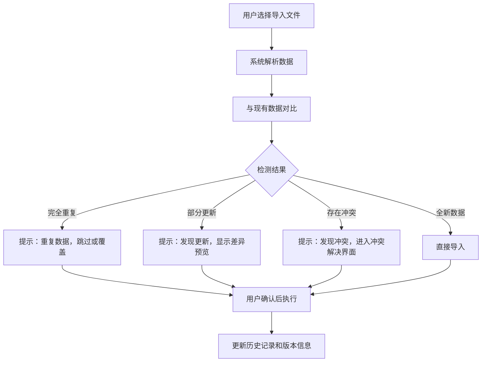
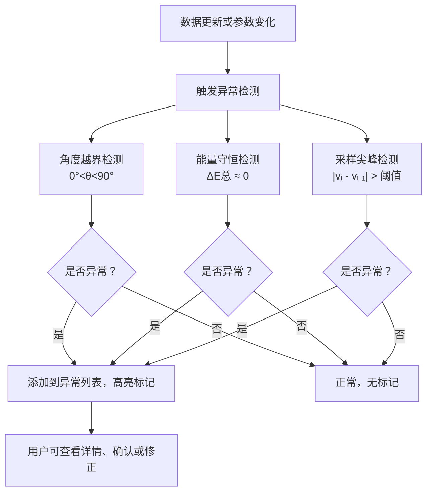

## 1. 产品概述

滑板坡道能量分析Web3D教学工具，帮助体育老师向学生解释滑板下坡过程中的能量转换，综合考虑重力势能、摩擦力和空气阻力的影响。解决传统教学中数据零散、异常难察、版本混乱等问题。

- 核心目标：将抽象的物理概念通过3D可视化和交互式分析变得直观易懂
- 目标用户：体育教师、物理教师、中学生
- 市场价值：填补体育与物理跨学科教学工具的空白，提升教学效率和学生理解度

## 2. 核心功能

### 2.1 用户角色

| 角色 | 注册方式 | 核心权限 |
|------|----------|----------|
| 教师用户 | 无需注册，本地使用 | 完整的数据分析、补录、导出、报告生成权限 |
| 学生用户 | 无需注册，本地使用 | 查看3D场景、解释面板、分析图表 |

### 2.2 功能模块

1. **3D场景页**：坡道3D可视化、滑板动画、实时参数显示、交互式对象选择
2. **参数配置页**：坡道角度、滑板质量、摩擦系数、空气阻力系数等参数设置
3. **数据分析页**：能量图表、速度曲线、损耗分析、异常检测报告
4. **数据管理页**：历史记录、版本对比、冲突解决、数据导入导出

### 2.3 页面详情

| 页面名称 | 模块名称 | 功能描述 |
|---------|---------|---------|
| 3D场景页 | 3D视口 | 可旋转、缩放、平移的3D坡道场景，支持点击选择坡道、滑板、地面等对象 |
| 3D场景页 | 时间轴控制 | 拖动时间滑块、播放/暂停、跳转至关键帧，实时更新3D场景和解释面板 |
| 3D场景页 | 侧边解释面板 | 同步显示当前时刻的能量状态、受力分析、速度数据，支持标记补录内容 |
| 3D场景页 | 异常指示器 | 高亮显示角度越界、能量异常增加、采样尖峰等问题，点击可查看详情 |
| 参数配置页 | 基础参数 | 坡道角度、滑板质量、摩擦系数、空气阻力系数、重力加速度设置 |
| 参数配置页 | 数据补录 | 支持后续补充速度采样数据、学生备注、分析报告附件、口头备注转录 |
| 参数配置页 | 补录标记 | 可视化区分原始数据与补录数据，显示补录时间和补录人 |
| 数据分析页 | 能量图表 | 势能、动能、摩擦损耗、空气阻力损耗随时间变化曲线 |
| 数据分析页 | 速度分析 | 实测速度与拟合速度对比，R²拟合优度显示 |
| 数据分析页 | 异常检测报告 | 自动列出所有检测到的异常项，支持人工确认和标注 |
| 数据分析页 | 图表导出 | 支持PNG、SVG、CSV、Excel格式导出，包含完整水印和版本信息 |
| 数据分析页 | 解释生成器 | 根据数据自动生成能量守恒、摩擦损耗、速度拟合的文字解释 |
| 数据管理页 | 历史版本 | 记录所有修改历史，支持回滚和对比 |
| 数据管理页 | 导入检测 | 导入时自动检测重复数据、更新数据或冲突数据，清晰提示用户 |
| 数据管理页 | 冲突解决 | 提供可视化冲突对比界面，支持选择保留版本或合并 |

## 3. 核心流程

### 3.1 主教学流程

教师打开应用 → 设置坡道和滑板参数 → 启动模拟 → 拖动时间轴观察能量变化 → 点击3D对象查看详细解释 → 补充学生实测数据 → 系统自动检测异常 → 生成分析报告 → 导出图表和解释

### 3.2 数据导入流程

### 3.3 异常检测流程

## 4. 用户界面设计

### 4.1 设计风格

- **设计方向**：科技感教育风，融合专业物理仿真与友好教学界面
- **主色调**：深邃蓝 `#1e3a5f` 作为主色，代表专业与信任
- **辅助色**：活力橙 `#ff8c42` 用于强调交互和异常提示，清新绿 `#2ecc71` 用于正常状态
- **中性色**：深灰 `#2d3748`、中灰 `#718096`、浅灰 `#e2e8f0`、纯白 `#ffffff`
- **字体**：标题使用 `Space Grotesk`，正文使用 `Inter`，数字使用 `JetBrains Mono`
- **按钮风格**：圆角8px，微立体阴影，hover状态轻微上浮和发光
- **布局风格**：三栏布局（左侧导航 + 中央3D视口 + 右侧解释面板），顶部工具栏
- **图标风格**：线性风格 `lucide-react` 图标，统一24px尺寸
- **数据可视化风格**：使用 `recharts`，线条流畅，渐变填充，交互提示友好

### 4.2 页面设计概述

| 页面名称 | 模块名称 | UI元素 |
|---------|---------|--------|
| 3D场景页 | 3D视口 | 深色背景带网格参考线，坡道使用木质纹理，滑板橙色高亮，能量可视化流线 |
| 3D场景页 | 时间轴 | 底部贯穿式时间轴，关键帧标记，播放控制按钮组，当前时间显示 |
| 3D场景页 | 侧边解释面板 | 卡片式布局，分能量、受力、速度三个标签页，补录数据带橙色边框标记 |
| 3D场景页 | 异常指示器 | 右上角悬浮警示条，按严重程度分级显示，点击展开异常列表 |
| 参数配置页 | 参数表单 | 分组折叠面板，滑块+数值输入框联动，实时单位显示 |
| 参数配置页 | 数据补录区 | 拖放上传区域，时间戳标记，补录来源字段，确认按钮 |
| 数据分析页 | 图表区 | 可切换图表类型，支持缩放和平移，鼠标悬停显示详细数据 |
| 数据分析页 | 解释生成区 | Markdown渲染，支持编辑和重新生成，一键复制 |
| 数据管理页 | 版本列表 | 时间线布局，版本差异对比，回滚按钮 |
| 数据管理页 | 导入对话框 | 三态指示（重复/更新/冲突），差异预览，冲突解决选项 |

### 4.3 响应式设计

- **设计策略**：桌面端优先，平板适配，移动端简化
- **断点设置**：1440px（桌面）、1024px（平板横屏）、768px（平板竖屏）、480px（手机）
- **响应式行为**：
  - 1024px以下：右侧解释面板改为底部抽屉式
  - 768px以下：左侧导航折叠为图标栏
  - 480px以下：时间轴简化，部分次要参数隐藏到二级菜单
- **触控优化**：按钮最小44x44px，滑动手势支持时间轴拖动和3D场景旋转

### 4.4 3D场景设计

- **环境与氛围**：物理实验室风格，中性灰色背景，柔和的环境光 + 方向光组合，投影柔和
- **光照设置**：
  - 环境光：强度0.4，颜色 `#e2e8f0`
  - 主方向光：强度1.0，位置(10, 10, 5)，投射软阴影
  - 补光：强度0.3，位置(-5, 5, -5)，消除暗部死黑
- **相机设置**：
  - 初始位置：(8, 6, 8)，看向坡道中点
  - 控制方式：OrbitControls，支持缩放、旋转、平移
  - 阻尼效果：开启，阻尼系数0.05，操作手感顺滑
- **构图与焦点**：
  - 坡道占据画面中心偏左区域，滑板为动态焦点
  - 能量可视化元素（发光流线、粒子效果）沿运动轨迹分布
  - 背景简洁，突出主要物体
- **交互与动画**：
  - 滑板运动：沿坡道曲面平滑移动，车轮旋转与速度联动
  - 能量显示：滑板速度越快，尾部拖尾越长，颜色从蓝（势能）渐变到橙（动能）
  - 点击反馈：选中物体发光边缘高亮，轻微放大
  - 时间动画：60fps流畅动画，支持倍速播放（0.25x ~ 4x）
- **后期处理**：
  - 轻微泛光效果（Bloom），强度0.3，阈值0.8
  - 色彩校正：饱和度+10%，对比度+5%
  - 抗锯齿：MSAA 4x
- **性能预算**：
  - 多边形总数控制在10,000以内
  - Draw call < 50
  - 目标帧率：60fps（桌面）、30fps（移动）
- **资源来源**：
  - 基础几何体：Three.js内置
  - 纹理：程序化生成木纹、金属质感
  - HDRI：使用中性室内环境贴图

