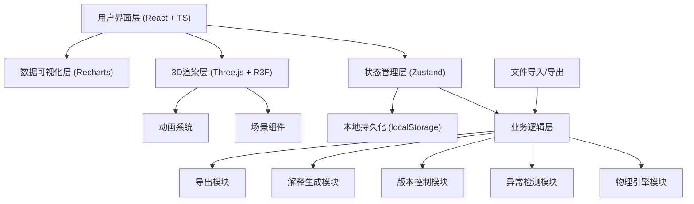
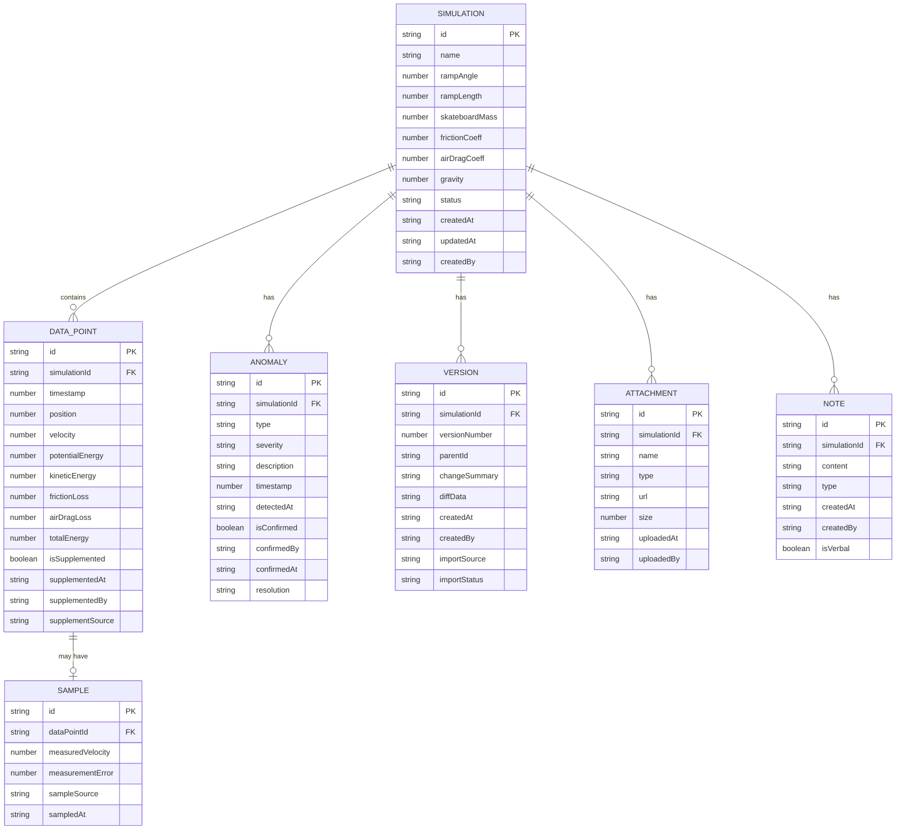

## 1. 架构设计



## 2. 技术栈描述

### 2.1 前端核心技术

- **框架**: React 18 + TypeScript 5
- **构建工具**: Vite 5
- **样式方案**: Tailwind CSS 3 + CSS Variables
- **状态管理**: Zustand 4
- **路由**: React Router DOM 6

### 2.2 3D渲染技术栈

- **3D引擎**: Three.js 0.160
- **React绑定**: @react-three/fiber 8
- **辅助组件**: @react-three/drei 9
- **后期处理**: @react-three/postprocessing 2
- **控制组件**: @react-three/drei/OrbitControls

### 2.3 数据可视化

- **图表库**: Recharts 2
- **导出支持**: html2canvas, jspdf, xlsx

### 2.4 工具库

- **图标**: lucide-react
- **时间处理**: dayjs
- **唯一ID**: nanoid
- **深拷贝**: lodash-es
- **数学计算**: mathjs

## 3. 目录结构

```
src/
├── components/          # 通用组件
│   ├── ui/             # 基础UI组件（按钮、输入框等）
│   ├── layout/         # 布局组件
│   └── common/         # 业务通用组件
├── pages/              # 页面组件
│   ├── Scene3D/        # 3D场景页
│   ├── Parameters/     # 参数配置页
│   ├── Analysis/       # 数据分析页
│   └── DataManager/    # 数据管理页
├── store/              # Zustand状态管理
│   ├── useSimulationStore.ts    # 模拟数据状态
│   ├── useUIStore.ts            # UI交互状态
│   └── useHistoryStore.ts       # 历史版本状态
├── hooks/              # 自定义Hooks
│   ├── usePhysics.ts           # 物理计算Hook
│   ├── useAnomalyDetection.ts  # 异常检测Hook
│   ├── useVersionControl.ts    # 版本控制Hook
│   └── useExport.ts            # 导出Hook
├── utils/              # 工具函数
│   ├── physics/        # 物理计算函数
│   ├── anomaly/        # 异常检测函数
│   ├── version/        # 版本控制函数
│   ├── explanation/    # 解释生成函数
│   └── export/         # 导出函数
├── types/              # TypeScript类型定义
│   ├── simulation.ts   # 模拟数据类型
│   ├── physics.ts      # 物理类型
│   └── history.ts      # 历史版本类型
├── constants/          # 常量定义
│   ├── physics.ts      # 物理常量
│   └── config.ts       # 配置常量
├── assets/             # 静态资源
│   ├── textures/       # 纹理图片
│   └── models/         # 3D模型
├── App.tsx
├── main.tsx
└── index.css
```

## 4. 数据模型定义

### 4.1 核心数据模型



### 4.2 类型定义（TypeScript）

```typescript
// 物理参数
interface PhysicsParams {
  rampAngle: number;           // 坡道角度 (度)
  rampLength: number;          // 坡道长度 (米)
  skateboardMass: number;      // 滑板质量 (千克)
  frictionCoeff: number;       // 摩擦系数
  airDragCoeff: number;        // 空气阻力系数
  gravity: number;             // 重力加速度 (m/s²)
  frontalArea?: number;        // 迎风面积 (m²)
  airDensity?: number;         // 空气密度 (kg/m³)
}

// 数据点
interface DataPoint {
  id: string;
  timestamp: number;           // 时间戳 (秒)
  position: number;            // 位置 (米)
  velocity: number;            // 速度 (m/s)
  potentialEnergy: number;     // 重力势能 (J)
  kineticEnergy: number;       // 动能 (J)
  frictionLoss: number;        // 摩擦损耗 (J)
  airDragLoss: number;         // 空气阻力损耗 (J)
  totalEnergy: number;         // 总能量 (J)
  acceleration?: number;       // 加速度 (m/s²)
  normalForce?: number;        // 法向力 (N)
  frictionForce?: number;      // 摩擦力 (N)
  airDragForce?: number;       // 空气阻力 (N)
  isSupplemented: boolean;     // 是否为补录数据
  supplementedAt?: string;     // 补录时间
  supplementedBy?: string;     // 补录人
  supplementSource?: string;   // 补录来源
  sample?: SampleData;         // 实测采样数据
}

// 采样数据
interface SampleData {
  id: string;
  measuredVelocity: number;    // 实测速度
  measurementError?: number;   // 测量误差
  sampleSource: string;        // 采样来源（学生/设备/口头）
  sampledAt: string;           // 采样时间
  recorder?: string;           // 记录人
}

// 异常项
interface Anomaly {
  id: string;
  type: 'angle_out_of_range' | 'energy_increase' | 'sample_spike' | 'other';
  severity: 'low' | 'medium' | 'high' | 'critical';
  description: string;
  timestamp: number;
  detectedAt: string;
  isConfirmed: boolean;
  confirmedBy?: string;
  confirmedAt?: string;
  resolution?: string;
  data?: Record<string, any>;
}

// 版本记录
interface Version {
  id: string;
  versionNumber: number;
  parentId?: string;
  changeSummary: string;
  diffData: string;            // JSON序列化的差异数据
  createdAt: string;
  createdBy: string;
  importSource?: string;
  importStatus: 'new' | 'duplicate' | 'update' | 'conflict';
  conflictInfo?: ConflictInfo;
}

// 冲突信息
interface ConflictInfo {
  field: string;
  oldValue: any;
  newValue: any;
  resolution: 'keep_old' | 'use_new' | 'manual';
}

// 附件
interface Attachment {
  id: string;
  name: string;
  type: 'image' | 'document' | 'audio' | 'video' | 'data';
  url: string;
  size: number;
  uploadedAt: string;
  uploadedBy: string;
  description?: string;
}

// 备注
interface Note {
  id: string;
  content: string;
  type: 'student' | 'teacher' | 'analysis' | 'verbal';
  createdAt: string;
  createdBy: string;
  isVerbal: boolean;           // 是否为口头备注转录
  relatedDataPointId?: string; // 关联的数据点
}

// 模拟会话
interface Simulation {
  id: string;
  name: string;
  physicsParams: PhysicsParams;
  dataPoints: DataPoint[];
  anomalies: Anomaly[];
  versions: Version[];
  attachments: Attachment[];
  notes: Note[];
  status: 'draft' | 'completed' | 'archived';
  createdAt: string;
  updatedAt: string;
  createdBy: string;
}
```

## 5. 状态管理设计

### 5.1 模拟数据状态 (useSimulationStore)

```typescript
interface SimulationState {
  currentSimulation: Simulation | null;
  currentTime: number;         // 当前播放时间
  isPlaying: boolean;
  playbackSpeed: number;
  selectedObjectId: string | null;
  activeTab: 'energy' | 'force' | 'velocity';
  
  // Actions
  setSimulation: (sim: Simulation) => void;
  updatePhysicsParams: (params: Partial<PhysicsParams>) => void;
  addDataPoint: (point: DataPoint) => void;
  supplementData: (pointId: string, data: Partial<DataPoint>) => void;
  setCurrentTime: (time: number) => void;
  togglePlay: () => void;
  setPlaybackSpeed: (speed: number) => void;
  selectObject: (id: string | null) => void;
  setActiveTab: (tab: 'energy' | 'force' | 'velocity') => void;
  addNote: (note: Note) => void;
  addAttachment: (attachment: Attachment) => void;
  confirmAnomaly: (anomalyId: string, confirmed: boolean) => void;
  runSimulation: () => void;
  resetSimulation: () => void;
}
```

### 5.2 UI状态 (useUIStore)

```typescript
interface UIState {
  sidebarOpen: boolean;
  showExplanation: boolean;
  showAnomalyPanel: boolean;
  showSupplementModal: boolean;
  showImportModal: boolean;
  showVersionCompare: boolean;
  compareVersionIds: [string, string] | null;
  notification: Notification | null;
  
  // Actions
  toggleSidebar: () => void;
  setShowExplanation: (show: boolean) => void;
  setShowAnomalyPanel: (show: boolean) => void;
  setShowSupplementModal: (show: boolean) => void;
  setShowImportModal: (show: boolean) => void;
  setShowVersionCompare: (show: boolean) => void;
  setCompareVersionIds: (ids: [string, string] | null) => void;
  showNotification: (notification: Omit<Notification, 'id'>) => void;
  clearNotification: () => void;
}
```

### 5.3 历史版本状态 (useHistoryStore)

```typescript
interface HistoryState {
  versions: Version[];
  currentVersionId: string | null;
  importCheckResult: ImportCheckResult | null;
  
  // Actions
  createVersion: (summary: string) => Version;
  revertToVersion: (versionId: string) => void;
  compareVersions: (versionId1: string, versionId2: string) => DiffResult;
  checkImportData: (importData: Simulation) => ImportCheckResult;
  resolveConflict: (conflictId: string, resolution: 'keep_old' | 'use_new' | 'manual') => void;
  applyImport: (mode: 'skip' | 'overwrite' | 'merge') => void;
  clearImportCheck: () => void;
}
```

## 6. 核心模块设计

### 6.1 物理引擎模块

**文件位置**: `src/utils/physics/engine.ts`

```typescript
// 计算重力势能
export function calculatePotentialEnergy(
  mass: number,
  height: number,
  gravity: number
): number;

// 计算动能
export function calculateKineticEnergy(
  mass: number,
  velocity: number
): number;

// 计算摩擦力
export function calculateFrictionForce(
  normalForce: number,
  frictionCoeff: number
): number;

// 计算空气阻力
export function calculateAirDragForce(
  dragCoeff: number,
  airDensity: number,
  velocity: number,
  frontalArea: number
): number;

// 计算摩擦损耗能量
export function calculateFrictionLoss(
  frictionForce: number,
  distance: number
): number;

// 计算空气阻力损耗能量
export function calculateAirDragLoss(
  dragForce: number,
  distance: number
): number;

// 计算沿坡道的加速度
export function calculateAcceleration(
  rampAngle: number,
  gravity: number,
  frictionCoeff: number,
  velocity: number,
  mass: number,
  airDragCoeff: number,
  airDensity: number,
  frontalArea: number
): number;

// 运行完整模拟，生成数据点序列
export function runPhysicsSimulation(
  params: PhysicsParams,
  timeStep: number = 0.01,
  maxTime: number = 10
): DataPoint[];
```

### 6.2 异常检测模块

**文件位置**: `src/utils/anomaly/detector.ts`

```typescript
// 角度越界检测
export function detectAngleOutOfRange(
  angle: number,
  minAngle: number = 1,
  maxAngle: number = 89
): Anomaly | null;

// 能量增加检测（封闭系统总能量应该减少或保持）
export function detectEnergyIncrease(
  dataPoints: DataPoint[],
  tolerance: number = 0.01
): Anomaly[];

// 采样尖峰检测
export function detectSampleSpikes(
  dataPoints: DataPoint[],
  threshold: number = 5.0  // m/s² 加速度阈值
): Anomaly[];

// 综合异常检测
export function detectAllAnomalies(
  simulation: Simulation
): Anomaly[];
```

### 6.3 版本控制模块

**文件位置**: `src/utils/version/control.ts`

```typescript
// 检查导入数据的状态
export function checkImportData(
  existingData: Simulation,
  importData: Simulation
): ImportCheckResult;

// 比较两个版本的差异
export function compareVersions(
  version1: Version,
  version2: Version
): DiffResult;

// 生成版本号
export function generateVersionNumber(
  existingVersions: Version[]
): number;

// 创建新版本
export function createVersion(
  simulation: Simulation,
  parentVersion: Version | null,
  changeSummary: string,
  createdBy: string
): Version;

// 合并冲突数据
export function mergeConflicts(
  baseData: Simulation,
  theirData: Simulation,
  resolutions: ConflictResolution[]
): Simulation;
```

### 6.4 解释生成模块

**文件位置**: `src/utils/explanation/generator.ts`

```typescript
// 生成能量守恒解释
export function generateEnergyConservationExplanation(
  dataPoints: DataPoint[],
  params: PhysicsParams
): string;

// 生成摩擦损耗解释
export function generateFrictionLossExplanation(
  dataPoints: DataPoint[],
  params: PhysicsParams
): string;

// 生成速度拟合解释
export function generateVelocityFittingExplanation(
  dataPoints: DataPoint[],
  fittedCurve: FittedCurve
): string;

// 生成综合分析报告
export function generateFullReport(
  simulation: Simulation
): string;
```

### 6.5 导出模块

**文件位置**: `src/utils/export/exporter.ts`

```typescript
// 导出为PNG图片
export function exportToPNG(
  element: HTMLElement,
  filename: string
): Promise<void>;

// 导出为SVG
export function exportToSVG(
  element: SVGSVGElement,
  filename: string
): void;

// 导出为CSV
export function exportToCSV(
  dataPoints: DataPoint[],
  filename: string
): void;

// 导出为Excel
export function exportToExcel(
  simulation: Simulation,
  filename: string
): Promise<void>;

// 导出为JSON
export function exportToJSON(
  simulation: Simulation,
  filename: string
): void;
```

## 7. 路由定义

| 路径 | 页面组件 | 说明 |
|------|---------|------|
| `/` | `Scene3D` | 3D场景主页，默认路由 |
| `/parameters` | `Parameters` | 参数配置页 |
| `/analysis` | `Analysis` | 数据分析页 |
| `/data-manager` | `DataManager` | 数据管理页 |
| `/not-found` | `NotFound` | 404页面 |

## 8. 性能优化策略

### 8.1 3D渲染优化

- 使用 `InstancedMesh` 渲染重复元素
- 启用视锥体剔除 (frustum culling)
- 动态调整LOD (Level of Detail)
- 使用 `useFrame` 的 `delta` 参数实现帧率无关动画
- 物理计算使用 Web Worker 避免阻塞主线程

### 8.2 数据处理优化

- 大数据量采样使用 `requestIdleCallback` 分批处理
- 图表数据使用虚拟滚动或降采样
- 状态变更使用 Immer 进行不可变更新
- 记忆化计算结果使用 `useMemo` 和 `reselect`

### 8.3 内存管理

- 组件卸载时清理 Three.js 资源
- 移除事件监听器和动画订阅
- 大对象使用 WeakMap 管理引用
- 图片和纹理资源使用对象池复用

## 9. 质量保障

### 9.1 类型安全

- 全量 TypeScript 覆盖，`strict: true`
- 业务数据使用 Zod 进行运行时校验
- API 边界使用类型守卫 (Type Guard)

### 9.2 测试策略

- 物理计算函数：单元测试覆盖率 100%
- 异常检测逻辑：边界条件全覆盖
- React 组件：关键交互使用 React Testing Library
- E2E 测试：核心流程使用 Playwright

### 9.3 代码规范

- ESLint + Prettier 统一代码风格
- Husky + lint-staged 提交前检查
- 遵循 React 18 最佳实践
- 组件拆分遵循单一职责原则

