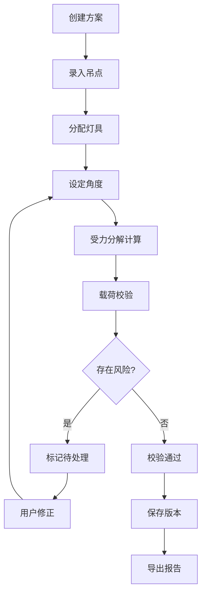

## 1. 产品概述

舞台吊点载荷预估系统是为剧场技术组设计的专业受力计算工具，解决吊挂灯具时吊点载荷估算依赖经验、数据版本混乱、风险隐患难追踪的问题。
- 目标用户：剧场技术组灯光师、舞台机械师、安全管理员
- 核心价值：将吊点载荷从"凭经验"变为"靠计算"，确保受力分解可追溯、校验结论可信、超载风险零遗漏

## 2. 核心功能

### 2.1 用户角色

| 角色 | 权限 |
|------|------|
| 灯光师 | 创建吊点方案、录入灯具、查看计算结果 |
| 舞台机械师 | 审核载荷校验、调整安全系数 |
| 安全管理员 | 查看风险报告、审批超载方案 |

> 初版不实现登录认证，通过角色切换模拟

### 2.2 功能模块

1. **工作台**：吊点布置、灯具分配、受力分解图、载荷校验、风险高亮、安装备注
2. **方案对比**：多方案并排对比载荷分布、安全裕度、风险项
3. **报告与历史**：方案版本时间线、变更记录、报告导出（PDF）

### 2.3 页面详情

| 页面 | 模块 | 功能描述 |
|------|------|----------|
| 工作台 | 吊点面板 | 新增/编辑/删除吊点，显示坐标、额定载荷、当前载荷、安全系数 |
| 工作台 | 灯具清单 | 灯具名称、重量(kg/lb)、数量、分配至吊点；单位自动换算与校验 |
| 工作台 | 受力分解图 | 吊杆角度→水平/垂直分力矢量图，实时更新 |
| 工作台 | 载荷校验 | 每个吊点实际载荷 vs 额定载荷，安全系数校验，超载/临界/安全三色标识 |
| 工作台 | 风险高亮 | 单位错误、超载、角度方向反、安全系数不足→待处理标记，不允许"假绿" |
| 工作台 | 安装备注 | 每个吊点/灯具可附加文字备注 |
| 方案对比 | 方案选择器 | 从历史版本中选择2-3个方案并排展示 |
| 方案对比 | 指标对比 | 总载荷、最大单点载荷、安全裕度、风险项数对比表 |
| 方案对比 | 差异高亮 | 关键指标差异用颜色/箭头标记 |
| 报告与历史 | 版本时间线 | 方案创建、修改、审核的时间轴，可回溯任意版本原始数据 |
| 报告与历史 | 变更记录 | 字段级变更：谁改了什么，从什么值改到什么值 |
| 报告与历史 | 报告导出 | 当前方案导出为结构化PDF，含受力图、校验表、风险摘要 |

## 3. 核心流程

### 3.1 方案创建与计算流程

用户在工作台创建吊点方案 → 录入吊点坐标与额定载荷 → 从灯具清单分配灯具至吊点 → 设定吊杆角度 → 系统实时计算受力分解 → 载荷校验自动执行 → 风险项自动标记为"待处理" → 用户修正后重新校验 → 保存为新版本

### 3.2 数据一致性保障流程

所有计算在后端执行 → 前端仅做展示与输入 → 报告导出读取同一数据源 → 版本保存时快照完整状态 → 历史回溯读取快照而非重新计算

## 4. 用户界面设计

### 4.1 设计风格

- **主色调**：深灰底(#1a1a2e) + 琥珀色强调(#f59e0b) + 危险红(#ef4444) + 安全绿(#22c55e)
- **风格**：工业仪表盘，参照CAD/SCADA系统，信息密度高但不杂乱
- **字体**：JetBrains Mono（数据/数字）+ Noto Sans SC（中文正文）
- **布局**：左侧导航 + 顶部工具栏 + 主内容区网格布局
- **按钮**：圆角4px，扁平化，危险操作红色，主要操作琥珀色
- **数据单元格**：等宽数字对齐，超载闪烁边框

### 4.2 页面设计概览

| 页面 | 模块 | UI要素 |
|------|------|--------|
| 工作台 | 吊点面板 | 卡片网格，每卡含坐标、载荷条、状态色标 |
| 工作台 | 灯具清单 | 可编辑表格，拖拽分配，单位切换下拉 |
| 工作台 | 受力分解图 | SVG矢量图，分力箭头+数值标注 |
| 工作台 | 载荷校验 | 表格+进度条，三色（绿/琥珀/红） |
| 工作台 | 风险高亮 | 侧边抽屉，风险项列表，点击定位 |
| 方案对比 | 对比视图 | 2-3列并排，同指标水平对齐，差异箭头 |
| 报告与历史 | 时间线 | 竖直时间线，节点可展开查看完整快照 |
| 报告与历史 | 报告导出 | 预览面板+下载按钮 |

### 4.3 响应式

桌面优先设计，最小支持1280px宽度。移动端仅提供只读查看，不做编辑操作。

## 5. 关键约束

1. **数据一致性**：屏幕显示与导出报告必须源自同一计算结果，禁止前端独立计算后与后端不一致
2. **不可伪造安全**：任何校验不通过的吊点必须标记为"待处理"，不允许覆盖为"通过"
3. **版本不可变**：已保存的历史版本数据只读，不可修改，回溯时展示原始数据
4. **单位强制校验**：重量输入时自动识别单位，kg/lb换算精度保留到0.1kg，单位冲突时标记风险
5. **角度方向**：吊杆角度以垂直向下为0°，偏转方向正负约定必须明确标注
