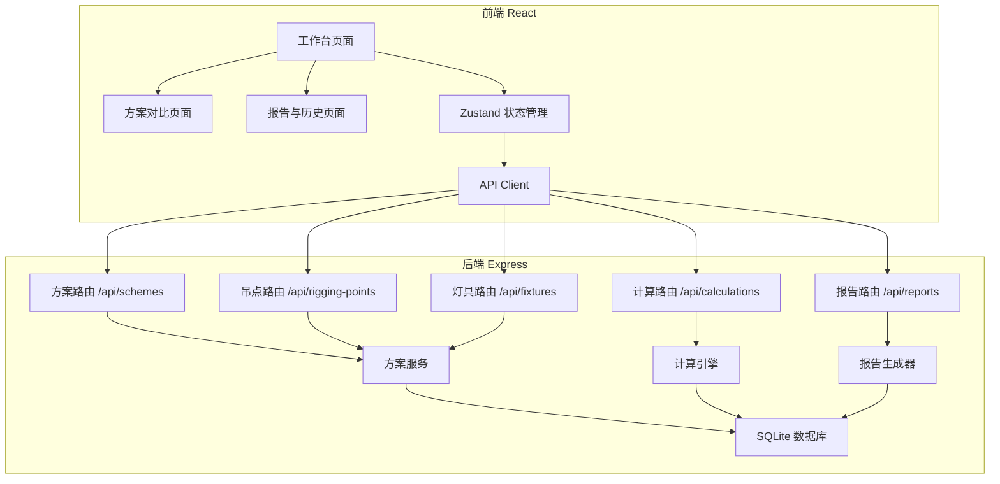
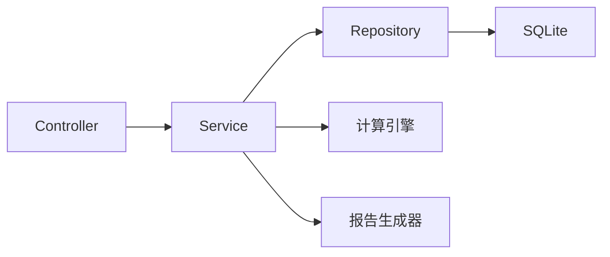
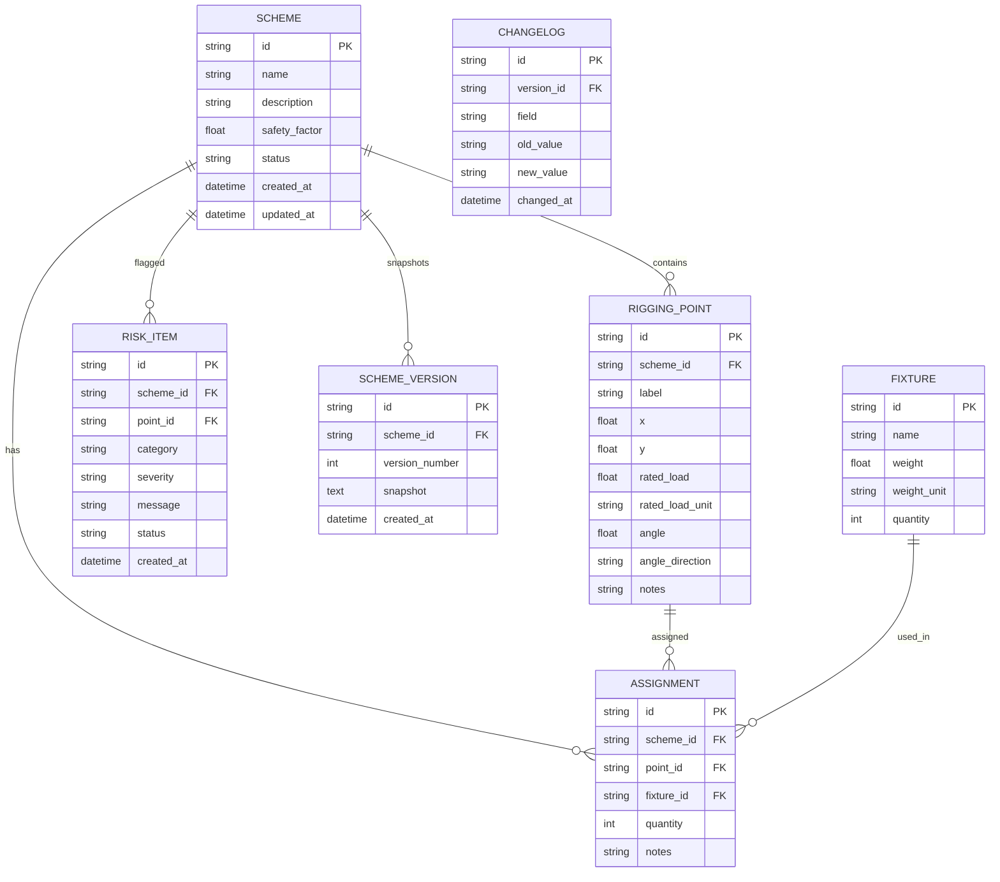

## 1. 架构设计



## 2. 技术说明

- **前端**：React@18 + TypeScript + Tailwind CSS@3 + Vite
- **状态管理**：Zustand（前端缓存，数据源为后端API）
- **初始化工具**：vite-init（react-express-ts 模板）
- **后端**：Express@4 + TypeScript（ESM）
- **数据库**：SQLite（better-sqlite3），文件级持久化，重启不丢数据
- **报告导出**：PDFKit 生成PDF，数据从数据库直读，不经过前端

## 3. 路由定义

| 路由 | 用途 |
|------|------|
| `/` | 工作台主页面 |
| `/compare` | 方案对比页面 |
| `/history` | 报告与历史页面 |

## 4. API 定义

### 4.1 方案管理

```
GET    /api/schemes              获取所有方案列表
POST   /api/schemes              创建新方案
GET    /api/schemes/:id          获取方案详情（含吊点、灯具分配）
PUT    /api/schemes/:id          更新方案基本信息
DELETE /api/schemes/:id          删除方案
POST   /api/schemes/:id/snapshot 保存方案快照（版本）
GET    /api/schemes/:id/versions 获取方案版本列表
GET    /api/schemes/:id/versions/:vid 获取指定版本完整快照
```

### 4.2 吊点管理

```
GET    /api/schemes/:id/points           获取方案下所有吊点
POST   /api/schemes/:id/points           添加吊点
PUT    /api/schemes/:id/points/:pid      更新吊点
DELETE /api/schemes/:id/points/:pid      删除吊点
```

### 4.3 灯具管理

```
GET    /api/fixtures                     获取灯具库
POST   /api/fixtures                     添加灯具到库
PUT    /api/fixtures/:fid                更新灯具信息
DELETE /api/fixtures/:fid                删除灯具
POST   /api/schemes/:id/assignments      分配灯具到吊点
PUT    /api/schemes/:id/assignments/:aid  更新分配
DELETE /api/schemes/:id/assignments/:aid  移除分配
```

### 4.4 计算与校验

```
POST   /api/calculations/decompose       受力分解计算
POST   /api/calculations/verify          载荷校验
GET    /api/schemes/:id/risks            获取风险项列表
```

### 4.5 报告

```
POST   /api/reports/generate/:id         生成PDF报告（返回下载链接）
GET    /api/reports/download/:filename   下载PDF文件
GET    /api/schemes/:id/changelog        获取变更记录
```

### 4.6 TypeScript 类型定义

```typescript
interface Scheme {
  id: string
  name: string
  description: string
  safetyFactor: number
  status: 'draft' | 'verified' | 'flagged'
  createdAt: string
  updatedAt: string
}

interface RiggingPoint {
  id: string
  schemeId: string
  label: string
  x: number
  y: number
  ratedLoad: number
  ratedLoadUnit: 'kg' | 'lb'
  angle: number
  angleDirection: 'left' | 'right'
  notes: string
}

interface Fixture {
  id: string
  name: string
  weight: number
  weightUnit: 'kg' | 'lb'
  quantity: number
}

interface Assignment {
  id: string
  schemeId: string
  pointId: string
  fixtureId: string
  quantity: number
  notes: string
}

interface ForceDecomposition {
  pointId: string
  totalWeightKg: number
  verticalForce: number
  horizontalForce: number
  angleDeg: number
}

interface LoadVerification {
  pointId: string
  actualLoad: number
  ratedLoad: number
  loadRatio: number
  safetyFactor: number
  status: 'safe' | 'warning' | 'overload'
}

interface RiskItem {
  id: string
  schemeId: string
  pointId: string
  category: 'unit_error' | 'overload' | 'angle_reversed' | 'safety_insufficient'
  severity: 'critical' | 'warning' | 'info'
  message: string
  status: 'pending' | 'resolved' | 'dismissed'
  createdAt: string
}

interface SchemeVersion {
  id: string
  schemeId: string
  versionNumber: number
  snapshot: string
  changelog: ChangelogEntry[]
  createdAt: string
}

interface ChangelogEntry {
  field: string
  oldValue: string
  newValue: string
  changedAt: string
}
```

## 5. 服务端架构图



## 6. 数据模型

### 6.1 ER 图



### 6.2 DDL

```sql
CREATE TABLE scheme (
    id TEXT PRIMARY KEY,
    name TEXT NOT NULL,
    description TEXT DEFAULT '',
    safety_factor REAL NOT NULL DEFAULT 2.0,
    status TEXT NOT NULL CHECK(status IN ('draft','verified','flagged')),
    created_at TEXT NOT NULL DEFAULT (datetime('now')),
    updated_at TEXT NOT NULL DEFAULT (datetime('now'))
);

CREATE TABLE rigging_point (
    id TEXT PRIMARY KEY,
    scheme_id TEXT NOT NULL REFERENCES scheme(id) ON DELETE CASCADE,
    label TEXT NOT NULL,
    x REAL NOT NULL DEFAULT 0,
    y REAL NOT NULL DEFAULT 0,
    rated_load REAL NOT NULL,
    rated_load_unit TEXT NOT NULL CHECK(rated_load_unit IN ('kg','lb')),
    angle REAL NOT NULL DEFAULT 0,
    angle_direction TEXT NOT NULL DEFAULT 'left' CHECK(angle_direction IN ('left','right')),
    notes TEXT DEFAULT '',
    created_at TEXT NOT NULL DEFAULT (datetime('now'))
);

CREATE TABLE fixture (
    id TEXT PRIMARY KEY,
    name TEXT NOT NULL,
    weight REAL NOT NULL,
    weight_unit TEXT NOT NULL CHECK(weight_unit IN ('kg','lb')),
    quantity INTEGER NOT NULL DEFAULT 1
);

CREATE TABLE assignment (
    id TEXT PRIMARY KEY,
    scheme_id TEXT NOT NULL REFERENCES scheme(id) ON DELETE CASCADE,
    point_id TEXT NOT NULL REFERENCES rigging_point(id) ON DELETE CASCADE,
    fixture_id TEXT NOT NULL REFERENCES fixture(id) ON DELETE CASCADE,
    quantity INTEGER NOT NULL DEFAULT 1,
    notes TEXT DEFAULT ''
);

CREATE TABLE risk_item (
    id TEXT PRIMARY KEY,
    scheme_id TEXT NOT NULL REFERENCES scheme(id) ON DELETE CASCADE,
    point_id TEXT REFERENCES rigging_point(id) ON DELETE SET NULL,
    category TEXT NOT NULL CHECK(category IN ('unit_error','overload','angle_reversed','safety_insufficient')),
    severity TEXT NOT NULL CHECK(severity IN ('critical','warning','info')),
    message TEXT NOT NULL,
    status TEXT NOT NULL DEFAULT 'pending' CHECK(status IN ('pending','resolved','dismissed')),
    created_at TEXT NOT NULL DEFAULT (datetime('now'))
);

CREATE TABLE scheme_version (
    id TEXT PRIMARY KEY,
    scheme_id TEXT NOT NULL REFERENCES scheme(id) ON DELETE CASCADE,
    version_number INTEGER NOT NULL,
    snapshot TEXT NOT NULL,
    created_at TEXT NOT NULL DEFAULT (datetime('now'))
);

CREATE TABLE changelog (
    id TEXT PRIMARY KEY,
    version_id TEXT NOT NULL REFERENCES scheme_version(id) ON DELETE CASCADE,
    field TEXT NOT NULL,
    old_value TEXT NOT NULL DEFAULT '',
    new_value TEXT NOT NULL DEFAULT '',
    changed_at TEXT NOT NULL DEFAULT (datetime('now'))
);

CREATE INDEX idx_rigging_point_scheme ON rigging_point(scheme_id);
CREATE INDEX idx_assignment_scheme ON assignment(scheme_id);
CREATE INDEX idx_assignment_point ON assignment(point_id);
CREATE INDEX idx_assignment_fixture ON assignment(fixture_id);
CREATE INDEX idx_risk_scheme ON risk_item(scheme_id);
CREATE INDEX idx_risk_status ON risk_item(status);
CREATE INDEX idx_version_scheme ON scheme_version(scheme_id);
CREATE INDEX idx_changelog_version ON changelog(version_id);
```

## 7. 计算引擎核心逻辑

### 7.1 受力分解

```
对于吊点P，角度θ（偏离垂直方向的偏角），挂载总重量W（统一换算为kg后转N）：
- 垂直分力 Fv = W × g × cos(θ)
- 水平分力 Fh = W × g × sin(θ)
- g = 9.80665 m/s²
- 角度方向：angle_direction标记水平分力方向（左/右）
```

### 7.2 载荷校验

```
载荷比 = 实际载荷(kg) / 额定载荷(kg)
- loadRatio ≤ 1/safetyFactor → safe（绿色）
- 1/safetyFactor < loadRatio ≤ 1.0 → warning（琥珀色）
- loadRatio > 1.0 → overload（红色，强制标记风险）
```

### 7.3 风险检测规则

| 规则 | 触发条件 | 严重度 |
|------|----------|--------|
| 单位错误 | 同一吊点下灯具单位不一致且未换算 | critical |
| 吊点超载 | loadRatio > 1.0 | critical |
| 角度方向反 | 相邻吊点角度方向逻辑矛盾 | warning |
| 安全系数不足 | loadRatio > 1/safetyFactor 且 ≤ 1.0 | warning |
