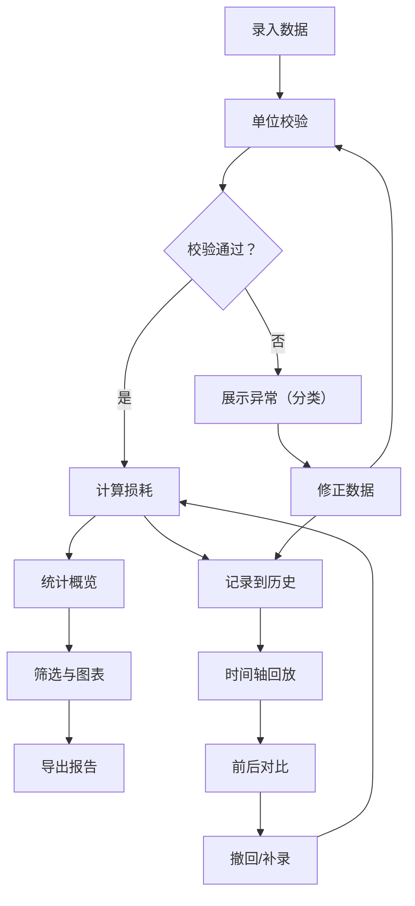

## 1. 产品概述

光纤损耗测量助手是一款面向通信实验课的测量数据处理工具，帮助学生和教师录入、校验、计算和导出光纤损耗数据。核心解决三个痛点：数据来源混杂（系统导出 vs 手动备注）导致校验困难、对数单位错误/零长度/接头重复三类异常互相掩盖、操作不可复查（重算/撤回/补录后无法追溯前后变化）。

- 目标用户：通信工程专业学生、实验课教师
- 核心价值：把筛选、统计、异常解释和导出对齐，让每一步操作可复查、可回放

## 2. 核心功能

### 2.1 用户角色

| 角色 | 进入方式 | 核心权限 |
|------|----------|----------|
| 学生 | 直接使用 | 录入数据、计算损耗、查看异常、导出报告 |
| 教师 | 直接使用 | 以上全部 + 查看历史操作时间轴、批量导出 |

### 2.2 功能模块

1. **数据录入页**：批量数据表、来源标记（系统/手动）、单位校验、接头查重
2. **损耗计算与异常页**：损耗系数计算、三类异常分段展示、异常解释文案
3. **历史与时间轴页**：操作记录时间轴、前后对比差异、撤回/补录
4. **筛选与导出页**：按波长/长度/异常类型筛选、图表生成、导出与当前视图一致

### 2.3 页面详情

| 页面名称 | 模块名称 | 功能描述 |
|----------|----------|----------|
| 数据录入 | 数据表格 | 支持逐行录入光纤长度、输入功率、输出功率、波长、接头数量；每行可标记来源（系统导出/手动填写） |
| 数据录入 | 单位校验 | 自动识别功率单位（dBm/dB/mW），标记不匹配项；长度为零时高亮警告 |
| 数据录入 | 接头查重 | 同一光纤段内接头编号重复时独立标红，不计入总数 |
| 损耗计算 | 损耗系数 | 按公式 L = (P_in - P_out) / 长度 计算每公里损耗(dB/km)，自动换算功率单位 |
| 损耗计算 | 异常分段 | 三类异常（对数单位错、长度为零、接头重复）分别列出，各带解释文案，互不掩盖 |
| 损耗计算 | 统计概览 | 平均损耗、最大/最小损耗、异常占比 |
| 历史时间轴 | 操作记录 | 每次计算/修改/补录/撤回生成一条记录，含时间戳和变更摘要 |
| 历史时间轴 | 前后对比 | 选中任意两条记录可查看数值差异，绿色新增、红色删除、黄色修改 |
| 历史时间轴 | 撤回与补录 | 支持撤回到任意历史节点；补录数据后自动追加记录 |
| 筛选与导出 | 筛选面板 | 按波长范围、长度范围、异常类型、数据来源筛选 |
| 筛选与导出 | 图表 | 损耗-波长曲线图、损耗-长度散点图，图表范围跟随筛选条件 |
| 筛选与导出 | 导出 | 导出CSV/图片，内容与当前筛选范围完全一致 |

## 3. 核心流程

用户打开应用 → 在数据录入页填写或粘贴光纤测量数据 → 系统自动校验单位、标记异常 → 点击"计算"按钮 → 跳转损耗计算页查看结果和三类异常解释 → 切换到筛选面板按条件过滤 → 生成图表 → 导出与当前视图一致的报告 → 在历史时间轴回看操作记录和前后差异

## 4. 用户界面设计

### 4.1 设计风格

- 主色调：深靛蓝(#1B2A4A) + 琥珀色(#E8A838)强调色，传达精密仪器的专业感
- 辅助色：浅灰蓝背景(#F0F4F8)、红色警告(#E53E3E)、绿色正常(#38A169)
- 按钮风格：圆角矩形(8px)、琥珀色主按钮、灰色次按钮、红色危险操作按钮
- 字体：标题用 JetBrains Mono（等宽，适合数据展示）、正文用 Noto Sans SC
- 布局：左侧导航栏 + 右侧内容区，顶部状态栏
- 图标风格：线性图标（lucide-react），2px 描边

### 4.2 页面设计概览

| 页面名称 | 模块名称 | UI元素 |
|----------|----------|--------|
| 数据录入 | 数据表格 | 可编辑表格，行内校验提示，来源标签(蓝/灰)，底部汇总栏 |
| 数据录入 | 单位校验 | 单元格内红色下划线+悬浮tooltip解释，顶部校验统计徽章 |
| 损耗计算 | 异常分段 | 三列卡片布局，每列一类异常，各列独立计数和列表，底部解释文案 |
| 损耗计算 | 统计概览 | 顶部数据卡片（平均值/最大/最小/异常率），带迷你趋势线 |
| 历史时间轴 | 时间轴 | 左侧竖向时间轴，节点圆点+连线，右侧操作描述和变更摘要 |
| 历史时间轴 | 前后对比 | 双列对比表格，差异单元格高亮（绿/红/黄） |
| 筛选与导出 | 筛选面板 | 顶部折叠式筛选栏，多选/范围滑块 |
| 筛选与导出 | 图表 | SVG折线图/散点图，悬浮数据点提示，图表标题含当前筛选条件 |

### 4.3 响应式

- 桌面优先设计，最小宽度1024px
- 表格横向可滚动
- 图表响应式缩放

### 4.4 3D场景

不适用
