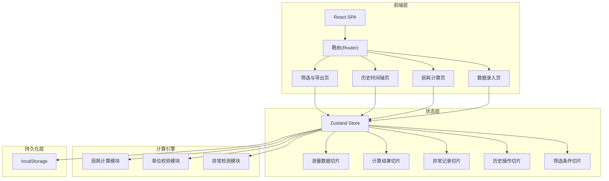
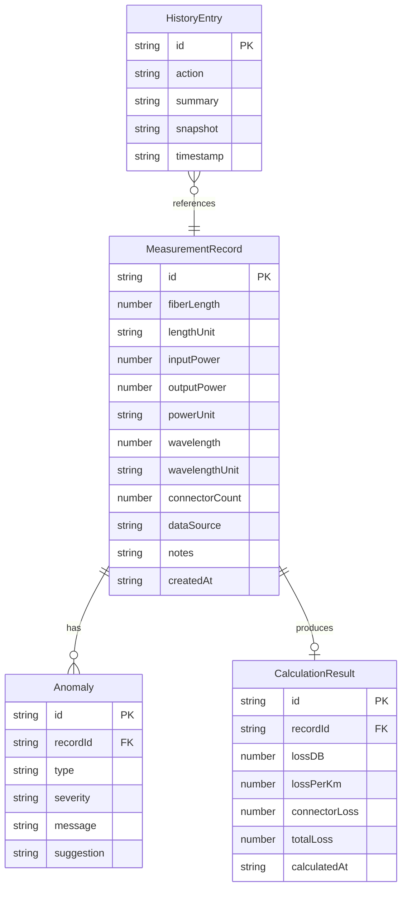

## 1. 架构设计



## 2. 技术说明

- 前端：React@18 + TypeScript + Tailwind CSS@3 + Vite
- 初始化工具：vite-init (react-ts 模板)
- 后端：无（纯前端应用，数据存储于 localStorage）
- 数据库：无（localStorage 做持久化，最大约5MB，足够存储实验数据）
- 图表：Recharts（轻量级 React 图表库）
- 导出：html-to-image（截图导出）+ PapaParse（CSV导出）

## 3. 路由定义

| 路由 | 用途 |
|------|------|
| / | 数据录入页 - 主页面，批量录入光纤测量数据 |
| /calculation | 损耗计算页 - 损耗系数计算与异常分段展示 |
| /history | 历史时间轴页 - 操作记录回放与前后对比 |
| /export | 筛选与导出页 - 条件筛选、图表生成、报告导出 |

## 4. API定义

无后端API，所有数据在前端处理。

## 5. 服务端架构图

不适用（纯前端应用）

## 6. 数据模型

### 6.1 数据模型定义



### 6.2 数据定义

TypeScript 类型定义：

```typescript
interface MeasurementRecord {
  id: string;
  fiberLength: number;
  lengthUnit: 'km' | 'm';
  inputPower: number;
  outputPower: number;
  powerUnit: 'dBm' | 'mW';
  wavelength: number;
  wavelengthUnit: 'nm' | 'μm';
  connectorCount: number;
  connectorIds: string[];
  dataSource: 'system' | 'manual';
  notes: string;
  createdAt: string;
}

type AnomalyType = 'unit_error' | 'zero_length' | 'duplicate_connector';

interface Anomaly {
  id: string;
  recordId: string;
  type: AnomalyType;
  severity: 'error' | 'warning';
  message: string;
  suggestion: string;
}

interface CalculationResult {
  id: string;
  recordId: string;
  lossDB: number;
  lossPerKm: number;
  connectorLoss: number;
  totalLoss: number;
  calculatedAt: string;
}

interface HistoryEntry {
  id: string;
  action: 'calculate' | 'modify' | 'supplement' | 'undo' | 'delete';
  summary: string;
  beforeSnapshot: string;
  afterSnapshot: string;
  timestamp: string;
}

interface FilterState {
  wavelengthRange: [number, number];
  lengthRange: [number, number];
  anomalyTypes: AnomalyType[];
  dataSource: ('system' | 'manual')[];
}
```
