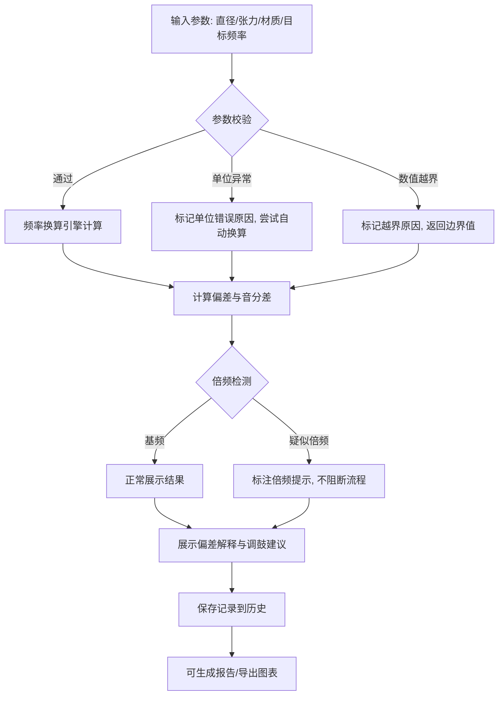

## 1. 产品概述

鼓皮张力频率换算工具——面向鼓手和维修技师的专业调鼓辅助应用。通过输入鼓皮直径、张力读数、材质等参数，快速估算目标频率、计算所需张力，并生成偏差分析和换算报告，替代纯靠耳朵调音的传统方式。

- 核心价值：将鼓皮物理参数（直径、张力、材质面密度）与目标音高频率建立精确数学关系，实现可量化、可复现的调鼓流程
- 目标用户：专业鼓手、鼓房维修师、打击乐教师

## 2. 核心功能

### 2.1 用户角色

| 角色 | 使用方式 | 核心权限 |
|------|----------|----------|
| 鼓手/维修师 | 直接使用 | 全部功能：换算、保存、报告导出 |

### 2.2 功能模块

1. **换算工作台**：参数输入、实时频率估算、偏差计算、倍频提示
2. **历史与报告**：调鼓记录保存、换算报告生成、图表导出

### 2.3 页面详情

| 页面名称 | 模块名称 | 功能描述 |
|----------|----------|----------|
| 换算工作台 | 参数输入面板 | 输入鼓皮直径（英寸/厘米）、张力读数（N/m、lbf/in、kgf/cm）、材质选择（Mylar、Kevlar、小牛皮等）、目标频率/音名 |
| 换算工作台 | 频率估算面板 | 根据输入参数实时计算基础频率，显示所需张力或目标频率，标注当前偏差百分比与音分差 |
| 换算工作台 | 偏差解释面板 | 用自然语言解释偏差来源：材质老化、温度影响、安装偏差等，给出调试备注建议 |
| 换算工作台 | 频率-张力曲线 | Canvas 绘制当前直径和材质下的频率-张力关系曲线，标注当前工作点 |
| 历史与报告 | 记录列表 | 展示所有调鼓记录，支持搜索、筛选、删除，覆盖时给出明确警告但允许继续 |
| 历史与报告 | 报告生成 | 将单条或多条记录生成可打印/导出的换算报告（含参数表、偏差分析、曲线图） |
| 历史与报告 | 图表导出 | 将频率-张力曲线导出为 PNG 图片 |

## 3. 核心流程

**换算主流程**：用户输入鼓皮参数 → 系统根据物理公式计算频率/张力 → 展示结果与偏差 → 保存记录 → 生成报告

**错误容错流程**：批量换算或参数异常时，不中断整体流程，正常条目继续处理，异常条目标记原因（单位错误、倍频误判、数值越界等）

## 4. 用户界面设计

### 4.1 设计风格

- **主色调**：暖棕+铜金（对应鼓皮、铜钹的质感），深色背景配高对比度文字
- **辅助色**：琥珀色用于警告提示，翠绿色用于正常偏差范围，红色用于异常
- **按钮风格**：圆角矩形，微阴影，hover 时有金属光泽过渡
- **字体**：显示字体使用 Playfair Display（优雅乐器感），正文使用 Source Sans 3（清晰可读）
- **布局**：左右分栏——左侧参数输入，右侧结果展示与曲线图
- **图标**：Lucide 图标，线描风格

### 4.2 页面设计概览

| 页面名称 | 模块名称 | UI 元素 |
|----------|----------|---------|
| 换算工作台 | 参数输入面板 | 深色卡片，输入框分组（直径/张力/材质/目标），单位切换下拉，实时数值校验提示 |
| 换算工作台 | 频率估算面板 | 大号频率数值显示，音名标注，偏差条形图（绿色0-5%，黄色5-10%，红色>10%） |
| 换算工作台 | 偏差解释面板 | 折叠式卡片，逐条列出偏差来源与建议，调试备注可编辑文本区 |
| 换算工作台 | 频率-张力曲线 | Canvas 绘图，横轴张力、纵轴频率，当前点高亮，可拖拽查看 |
| 历史与报告 | 记录列表 | 表格布局，支持排序筛选，每行有操作按钮（查看/报告/删除） |
| 历史与报告 | 报告生成 | 模态框预览，含参数表、偏差摘要、曲线图、导出按钮（PNG/打印） |

### 4.3 响应式

- 桌面优先设计（1920×1080 基准）
- 平板端左右分栏改为上下堆叠
- 移动端保持单列布局，曲线图可横屏查看

### 4.4 三维场景指引

不适用
