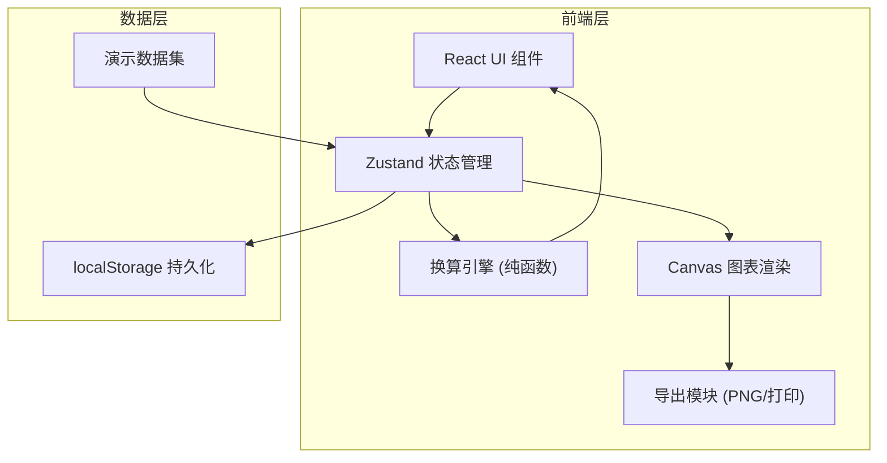
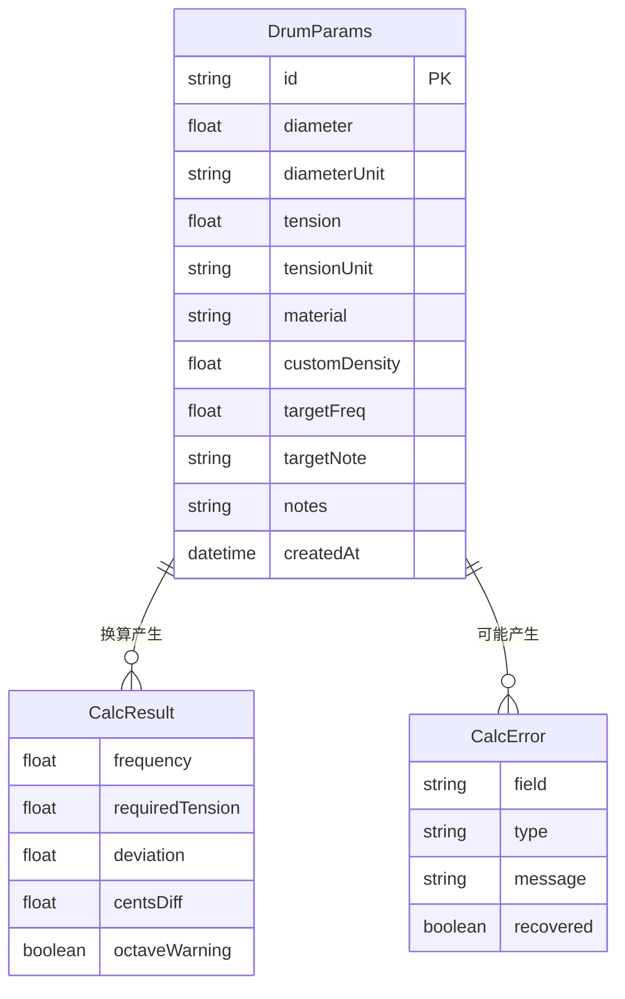

## 1. 架构设计



## 2. 技术说明

- **前端框架**：React@18 + TypeScript + Vite
- **样式方案**：Tailwind CSS 3
- **状态管理**：Zustand
- **图表渲染**：原生 Canvas API（无第三方图表库依赖，保持轻量）
- **路由**：react-router-dom（两个主页面）
- **数据持久化**：localStorage（无需后端）
- **初始化工具**：vite-init

## 3. 路由定义

| 路由 | 用途 |
|------|------|
| / | 换算工作台：参数输入、频率估算、偏差解释、曲线图 |
| /history | 历史与报告：调鼓记录列表、报告生成、图表导出 |

## 4. API 定义

无后端 API。所有数据通过 localStorage 持久化，换算逻辑为纯前端计算。

### 4.1 核心数据类型

```typescript
interface DrumParams {
  id: string;
  diameter: number;
  diameterUnit: 'inch' | 'cm';
  tension: number;
  tensionUnit: 'N/m' | 'lbf/in' | 'kgf/cm';
  material: 'mylar' | 'kevlar' | 'calf' | 'custom';
  customDensity?: number;
  targetFreq?: number;
  targetNote?: string;
  notes: string;
  createdAt: number;
}

interface CalcResult {
  frequency: number;
  requiredTension: number;
  deviation: number;
  centsDiff: number;
  octaveWarning: boolean;
  errors: CalcError[];
}

interface CalcError {
  field: string;
  type: 'unit_mismatch' | 'octave_misjudge' | 'value_out_of_range' | 'history_overwrite';
  message: string;
  recovered: boolean;
}
```

## 5. 服务器架构图

不适用（纯前端项目）

## 6. 数据模型

### 6.1 数据模型定义



### 6.2 物理换算公式

圆形膜基频公式：

**f = (k₀₁ / 2π) × √(T / (σ × a²))**

- f：基频 (Hz)
- k₀₁ = 2.4048：(0,1) 模态常数
- T：膜面张力 (N/m)
- σ：面密度 (kg/m²)
- a：膜半径 (m)

材质面密度预设：
- Mylar（聚酯薄膜）：0.19 kg/m²
- Kevlar（芳纶纤维）：0.23 kg/m²
- Calf（小牛皮）：0.28 kg/m²

单位换算：
- 1 lbf/in = 175.13 N/m
- 1 kgf/cm = 980.67 N/m
- 1 inch = 0.0254 m
- 1 cm = 0.01 m

音分差计算：
**cents = 1200 × log₂(f_actual / f_target)**

### 6.3 演示数据

1. **顺利流程**：14英寸小军鼓，Mylar材质，张力2000 N/m → 计算基频约 247 Hz (B3)
2. **边界情况**：6英寸 piccolo 军鼓，Kevlar材质，张力 8000 N/m → 高频区倍频误判风险
3. **现实例外**：旧小牛皮鼓皮，面密度异常偏低（老化），实测频率与计算频率偏差超过15%，需标注材质老化偏差

### 6.4 初始数据语言

所有演示数据、UI文案、错误提示均使用中文。
