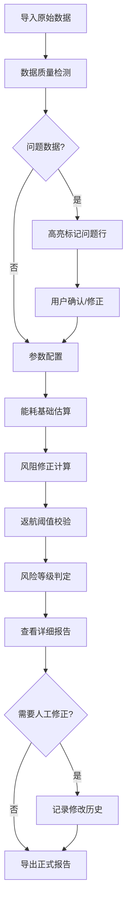

## 1. 产品概述
无人机续航风阻估算工具，为航拍团队提供出任务前的续航保守估算，综合考虑风速、载重、返航余量等关键因素。
- 解决问题：快速定位续航风险、数据质量校验、风阻修正计算、历史版本追溯
- 目标用户：航拍团队飞手、任务规划人员、设备管理员

## 2. 核心功能

### 2.1 用户角色
| 角色 | 注册方式 | 核心权限 |
|------|----------|----------|
| 飞手 | 本地用户 | 导入数据、计算续航、导出报告 |
| 管理员 | 本地用户 | 查看历史、对比版本、系统设置 |

### 2.2 功能模块
1. **数据导入与清洗**：多格式数据导入、空列/错别字/重复行检测、数据质量评分
2. **能耗估算引擎**：基础能耗计算、风速方向校验、载重折算、电池状态评估
3. **风阻修正模型**：迎风面积估算、风阻系数计算、逆风补偿、保守系数调整
4. **返航阈值判断**：返航点距离计算、电量余量预警、负余量红色标记、多级告警
5. **历史版本管理**：人工修改记录、版本对比、修改人追踪、覆盖标记
6. **报告导出**：PDF生成、风险高亮、来源标注、解释说明

### 2.3 页面详情
| 页面名称 | 模块名称 | 功能描述 |
|---------|----------|----------|
| 主工作台 | 数据导入区 | 拖拽上传、格式自动识别、预览前10行 |
| 主工作台 | 数据清洗面板 | 问题行高亮、一键修复、手动编辑、质量评分 |
| 主工作台 | 参数配置区 | 无人机型号、保守系数、风速单位、返航高度 |
| 计算中心 | 能耗估算 | 基础能耗、载重影响、电池衰减系数 |
| 计算中心 | 风阻修正 | 风向校验、逆风系数、实时风阻曲线 |
| 计算中心 | 返航阈值 | 电量警戒线、返航点标记、负余量红色警报 |
| 风险报告 | 风险清单 | 严重/警告/注意三级分类、问题描述、建议措施 |
| 风险报告 | 来源追踪 | 每条计算标注数据来源、计算公式、假设条件 |
| 历史记录 | 版本列表 | 时间轴展示、修改人、修改内容对比 |
| 历史记录 | 导出中心 | 多格式导出、带水印、签名栏 |

## 3. 核心流程
用户导入原始数据 → 系统自动清洗并标记问题 → 用户确认或手动修正 → 配置无人机参数与保守系数 → 执行能耗估算+风阻修正 → 计算返航阈值并标记风险 → 查看详细报告与来源解释 → 选择是否记录人工修改 → 导出带历史版本的正式报告

## 4. 用户界面设计

### 4.1 设计风格
- **主色调**：深航空蓝 (#1a365d) 搭配警示橙 (#ed8936)、危险红 (#e53e3e)、安全绿 (#38a169)
- **按钮风格**：直角轻微圆角、边框分明、悬停有阴影反馈
- **字体**：JetBrains Mono (数字显示) + PingFang SC (中文说明)，等宽字体用于数据表格
- **布局风格**：三栏式工作台、左侧数据区、中间计算区、右侧报告区
- **图标风格**：线性图标、航空元素、仪表盘风格

### 4.2 页面设计概述
| 页面名称 | 模块名称 | UI 元素 |
|---------|----------|---------|
| 主工作台 | 数据面板 | 表格行背景色交替、问题行红色边框、鼠标悬停显示问题详情 |
| 主工作台 | 仪表盘 | 续航里程环形图、电池电量进度条、风阻系数仪表盘 |
| 计算中心 | 曲线图 | 能耗曲线带置信区间、逆风影响区域阴影标记 |
| 风险报告 | 警示卡片 | 红色卡片(严重)、橙色卡片(警告)、黄色卡片(注意)，带闪烁动画 |
| 历史记录 | 时间轴 | 左侧版本节点、右侧修改内容、差异高亮显示 |

### 4.3 响应式
- Desktop-first 设计，1440px 最佳体验
- 平板端改为上下两栏布局
- 移动端折叠面板，支持手势切换

### 4.4 动效设计
- 数据导入时进度条动画
- 风险标记出现时轻微抖动提示
- 仪表盘数字滚动效果
- 页面切换淡入淡出过渡
