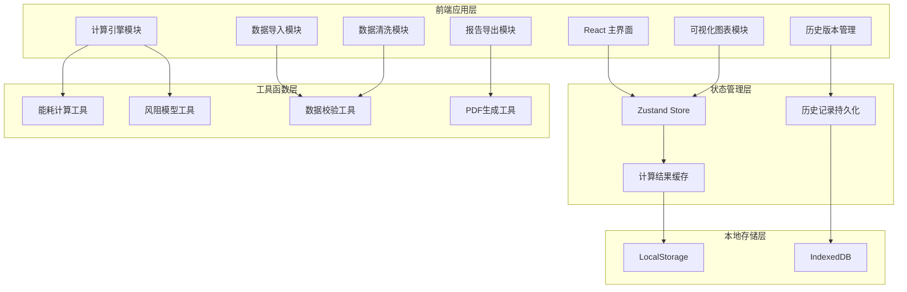

## 1. 架构设计



## 2. 技术选型说明
- **前端框架**: React@18 + TypeScript@5 + Vite@5
- **样式方案**: TailwindCSS@3 + 自定义 CSS 变量
- **状态管理**: Zustand@4 (轻量、API 友好)
- **图表库**: Recharts@2 (React 生态、可定制性强)
- **数据处理**: Papaparse@5 (CSV解析) + SheetJS (Excel支持)
- **PDF导出**: jsPDF@2 + html2canvas
- **本地存储**: LocalStorage (配置) + IndexedDB (历史记录)
- **后端**: 纯前端应用，无后端依赖，所有计算本地完成

## 3. 路由定义
| 路由路径 | 页面名称 | 页面说明 |
|----------|----------|----------|
| / | 主工作台 | 数据导入、参数配置、实时计算 |
| /calculator | 计算中心 | 详细能耗和风阻计算界面 |
| /report | 风险报告 | 风险清单、来源追踪、建议措施 |
| /history | 历史记录 | 版本对比、修改历史、导出中心 |

## 4. 数据模型

### 4.1 核心数据结构

```typescript
// 无人机参数
interface DroneParams {
  id: string;
  model: string;
  maxTakeoffWeight: number;      // 最大起飞重量 (g)
  emptyWeight: number;           // 空机重量 (g)
  batteryCapacity: number;       // 电池容量 (mAh)
  batteryVoltage: number;        // 电池电压 (V)
  maxFlightTime: number;         // 标称续航时间 (min)
  cruiseSpeed: number;           // 巡航速度 (m/s)
  frontalArea: number;           // 迎风面积 (m²)
  dragCoefficient: number;       // 风阻系数
}

// 风速数据
interface WindData {
  speed: number;                 // 风速 (m/s)
  direction: number;             // 风向 (度, 0-360)
  flightDirection: number;       // 飞行方向 (度)
  altitude: number;              // 海拔高度 (m)
}

// 载重数据
interface PayloadData {
  cameraWeight: number;          // 相机重量 (g)
  batteryWeight: number;         // 电池重量 (g)
  accessoriesWeight: number;     // 附件重量 (g)
  totalWeight: number;           // 总载重 (g)
}

// 电池状态
interface BatteryStatus {
  currentCapacity: number;       // 当前容量 (%)
  cycleCount: number;            // 循环次数
  temperature: number;           // 温度 (°C)
  health: number;                // 健康度 (%)
}

// 航线点
interface Waypoint {
  id: string;
  lat: number;
  lng: number;
  altitude: number;
  speed: number;
  stayTime: number;              // 停留时间 (s)
}

// 数据质量问题
interface DataIssue {
  id: string;
  type: 'empty' | 'typo' | 'duplicate' | 'invalid' | 'negative_margin';
  severity: 'error' | 'warning' | 'info';
  field: string;
  rowIndex?: number;
  message: string;
  suggestion: string;
  fixed: boolean;
}

// 计算结果
interface CalculationResult {
  id: string;
  timestamp: number;
  droneParams: DroneParams;
  windData: WindData;
  payloadData: PayloadData;
  batteryStatus: BatteryStatus;
  waypoints: Waypoint[];
  
  // 能耗估算
  baseEnergyConsumption: number;  // 基础能耗 (Wh)
  payloadEnergyImpact: number;    // 载重影响系数
  windResistanceImpact: number;   // 风阻影响系数
  
  // 风阻修正
  dragForce: number;              // 风阻力 (N)
  dragPower: number;              // 风阻功率 (W)
  headwindComponent: number;      // 逆风分量 (m/s)
  
  // 续航估算
  estimatedFlightTime: number;    // 估算飞行时间 (min)
  estimatedRange: number;         // 估算航程 (km)
  returnBatteryThreshold: number; // 返航电量阈值 (%)
  remainingBatteryMargin: number; // 剩余电量余量 (%)
  
  // 风险评估
  risks: RiskItem[];
  confidenceScore: number;        // 置信度评分 (0-100)
}

// 风险项
interface RiskItem {
  id: string;
  level: 'critical' | 'warning' | 'notice';
  category: 'battery' | 'wind' | 'payload' | 'navigation' | 'data';
  title: string;
  description: string;
  source: string;                 // 数据来源说明
  formula?: string;               // 计算公式
  suggestion: string;
}

// 历史版本记录
interface HistoryRecord {
  id: string;
  version: number;
  timestamp: number;
  author: string;
  description: string;
  changes: ChangeItem[];
  calculationResult: CalculationResult;
}

// 修改项
interface ChangeItem {
  field: string;
  oldValue: any;
  newValue: any;
  reason: string;
}
```

### 4.2 核心计算公式

#### 基础能耗估算
```
基础功率(W) = (电池电压 × 电池容量 × 0.001) / (标称续航时间 / 60)
基础能耗(Wh) = 基础功率 × 飞行时间(h)
载重影响系数 = 1 + (实际载重 - 空机重量) / 最大起飞重量 × 0.5
```

#### 风阻修正计算
```
空气密度 ρ = 1.225 × (1 - 0.0065 × 海拔/288.15)^4.256
逆风分量 = 风速 × cos(|飞行方向 - 风向| × π/180)
风阻力 = 0.5 × ρ × 逆风分量² × 迎风面积 × 风阻系数
风阻功率 = 风阻力 × (巡航速度 + 逆风分量)
风阻影响系数 = 1 + 风阻功率 / 基础功率
```

#### 返航阈值计算
```
总航程 = Σ 两点间距离
返航距离 = 当前位置到起飞点距离
返航所需电量 = (返航距离 / 估算航程) × 100%
安全余量 = 15%  (保守估算)
返航阈值 = 返航所需电量 + 安全余量
电量余量 = 当前电量 - 返航阈值
```

## 5. 模块划分

| 模块名称 | 文件路径 | 职责说明 |
|----------|----------|----------|
| 数据导入 | src/components/DataImport/ | 支持 CSV/Excel/JSON，格式自动识别 |
| 数据清洗 | src/components/DataCleaner/ | 问题检测、自动修复、手动编辑 |
| 参数配置 | src/components/ParamsConfig/ | 无人机参数、保守系数设置 |
| 计算引擎 | src/engine/ | 能耗估算、风阻修正、返航阈值 |
| 可视化 | src/components/Charts/ | 续航曲线、风阻仪表、风险雷达 |
| 风险报告 | src/components/Report/ | 风险清单、来源追踪、建议展示 |
| 历史记录 | src/components/History/ | 版本对比、修改追踪 |
| 导出工具 | src/utils/export/ | PDF/Excel/JSON 导出 |
| 状态管理 | src/store/ | 全局状态、缓存管理 |
| 工具函数 | src/utils/ | 计算工具、校验工具、格式化工具 |
