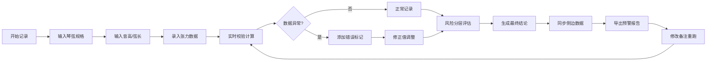

## 1. 产品概述

弦乐张力断弦预警系统是一款面向琴行维修师的专业工具，用于记录和分析琴弦张力数据，提前发现调音时可能出现的断弦风险组合。通过分层记录（原始值、修正值、结论）和详细的判断明细，大幅提升后续复核效率。

- 目标用户：琴行维修师、乐器调音师
- 核心价值：降低断弦风险、标准化记录流程、简化复核工作

## 2. 核心功能

### 2.1 用户角色

| 角色 | 注册方式 | 核心权限 |
|------|----------|----------|
| 维修师 | 本地应用 | 完整的张力记录、计算、预警和报告导出功能 |

### 2.2 功能模块

1. **张力记录面板**：琴弦规格输入、音高选择、弦长设置、张力数据录入
2. **实时计算与预警**：张力超限检测、规格匹配验证、音高映射校验
3. **客户乐器管理**：乐器信息记录、历史维修记录追溯
4. **数据分层展示**：原始值、修正值、最终结论三级视图
5. **预警报告导出**：带标记筛选的PDF/Excel报告生成
6. **参数实时同步**：修改参数后侧边数据和报告预览即时更新

### 2.3 页面详情

| 页面名称 | 模块名称 | 功能描述 |
|----------|----------|----------|
| 主工作台 | 左侧参数面板 | 琴弦规格、音高、弦长、客户信息输入，支持实时修改 |
| 主工作台 | 中间计算视图 | 张力计算公式展示、规格匹配过程、风险分层逻辑可视化 |
| 主工作台 | 右侧数据面板 | 原始值/修正值/结论分层展示，错误标记高亮显示 |
| 主工作台 | 底部明细区 | 张力计算、规格匹配、风险分层、维修历史、判断理由明细 |
| 报告预览 | 报告导出页 | 支持筛选带标记记录，导出包含完整判断链的报告 |

## 3. 核心流程

维修师从输入琴弦参数开始，系统实时校验并计算张力，自动标记异常数据（音高映射错误、弦长单位错误、张力超限）。修改参数时所有数据同步更新，最终可导出包含完整判断理由的预警报告。

## 4. 用户界面设计

### 4.1 设计风格

- **主色调**：深海军蓝 (#0F2B4A) - 专业、可靠
- **辅助色**：琥珀橙 (#F59E0B) - 预警提示、翡翠绿 (#10B981) - 正常状态、玫瑰红 (#EF4444) - 危险标记
- **按钮风格**：微圆角 (4px)、轻微阴影、悬停浮起效果
- **字体**：标题用 Noto Serif SC（专业感），正文用 Noto Sans SC（可读性）
- **布局风格**：三栏式工作台布局，卡片化模块，清晰的视觉层级
- **图标风格**：线性细线图标，配合音乐/工具相关的emoji增强识别度

### 4.2 页面设计概述

| 页面名称 | 模块名称 | UI元素 |
|----------|----------|--------|
| 主工作台 | 参数面板 | 分组表单、下拉选择、数字输入、单位切换 |
| 主工作台 | 计算视图 | 公式展示区、匹配过程条、风险进度条、动画过渡 |
| 主工作台 | 数据面板 | 三色分层卡片、错误标记徽章、时间戳显示 |
| 主工作台 | 明细区 | 可折叠时间线、判断理由标签、版本对比 |
| 报告预览 | 导出页 | 筛选器、预览表格、导出按钮组 |

### 4.3 响应式

- 桌面端优先设计（1280px+），三栏完整布局
- 平板端（768-1279px）：左右两栏，底部明细区展开
- 移动端（<768px）：单栏垂直堆叠，标签页切换各模块

### 4.4 交互细节

- 参数修改时，相关数据区域高亮闪烁提示更新
- 错误标记采用脉冲动画吸引注意
- 明细区时间线支持展开/折叠的平滑过渡
- 悬停在结论上时显示原始值与修正值的对比tooltip
