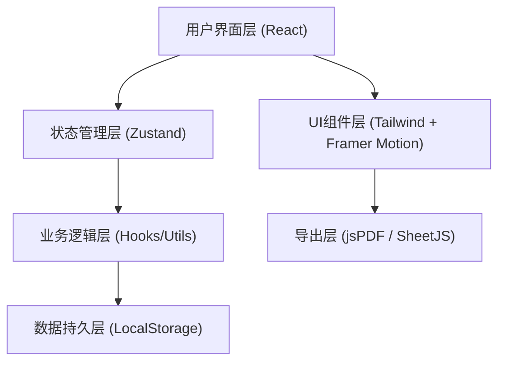
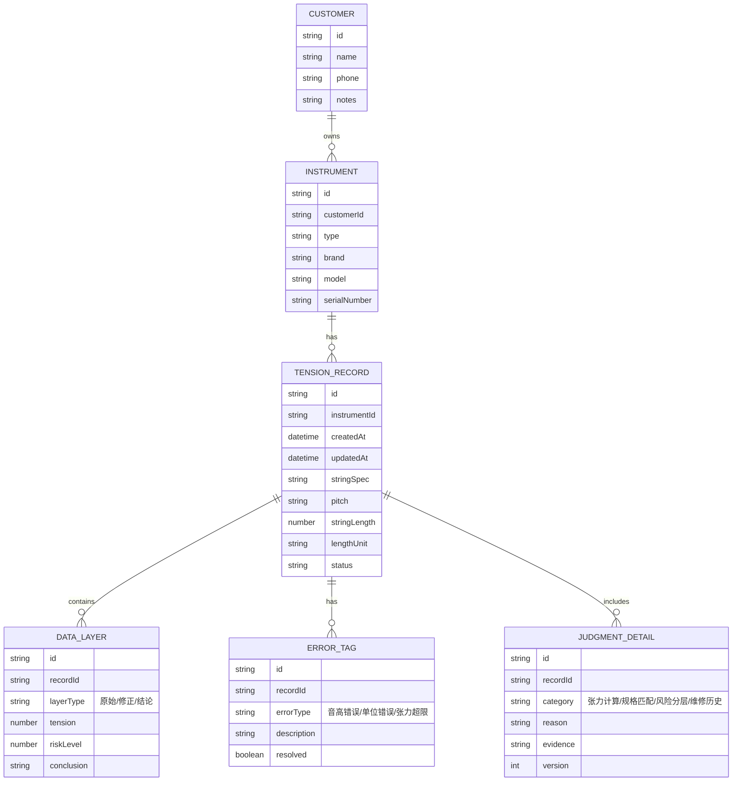

## 1. 架构设计

这是一个纯前端的单页应用，使用本地存储持久化数据，无需后端服务。



## 2. 技术描述

- **前端框架**: React@18 + TypeScript
- **构建工具**: Vite@5
- **样式方案**: TailwindCSS@3
- **状态管理**: Zustand（轻量级，适合本地应用）
- **动画库**: Framer Motion
- **图标**: Lucide React
- **数据持久化**: LocalStorage（加密存储）
- **导出功能**: jsPDF (PDF导出) + xlsx (Excel导出)
- **字体**: Google Fonts (Noto Serif SC + Noto Sans SC)

## 3. 路由定义

| 路由 | 用途 |
|------|------|
| / | 主工作台（参数输入、计算、数据展示、明细） |
| /report | 报告预览与导出 |
| /history | 历史记录浏览 |

## 4. 数据模型

### 4.1 数据模型定义



### 4.2 TypeScript 类型定义

```typescript
// 客户信息
interface Customer {
  id: string;
  name: string;
  phone: string;
  notes: string;
  createdAt: string;
}

// 乐器信息
interface Instrument {
  id: string;
  customerId: string;
  type: 'guitar' | 'violin' | 'piano' | 'other';
  brand: string;
  model: string;
  serialNumber: string;
  stringCount: number;
}

// 错误标记类型
type ErrorType = 'pitch_mapping' | 'unit_error' | 'tension_exceeded' | 'spec_mismatch';

// 错误标记
interface ErrorTag {
  id: string;
  type: ErrorType;
  description: string;
  resolved: boolean;
  createdAt: string;
}

// 数据层类型
type LayerType = 'original' | 'corrected' | 'final';

// 数据层
interface DataLayer {
  tension: number;
  riskLevel: 1 | 2 | 3 | 4 | 5;
  conclusion: string;
  updatedAt: string;
}

// 判断明细
interface JudgmentDetail {
  id: string;
  category: 'tension_calc' | 'spec_match' | 'risk_assess' | 'repair_history';
  reason: string;
  evidence: string;
  version: number;
  createdAt: string;
}

// 张力记录
interface TensionRecord {
  id: string;
  instrumentId: string;
  stringSpec: string;
  pitch: string;
  stringLength: number;
  lengthUnit: 'mm' | 'cm' | 'inch';
  original: DataLayer;
  corrected?: DataLayer;
  final: DataLayer;
  errorTags: ErrorTag[];
  details: JudgmentDetail[];
  notes: string;
  createdAt: string;
  updatedAt: string;
}

// 应用状态
interface AppState {
  records: TensionRecord[];
  customers: Customer[];
  instruments: Instrument[];
  currentRecordId: string | null;
  filters: {
    showTagged: boolean;
    errorType?: ErrorType;
    dateRange?: [string, string];
  };
}
```

## 5. 核心工具函数

### 5.1 张力计算

```typescript
// 张力计算公式: T = (f² * 4 * L² * μ) / 9.8
// f: 频率 (Hz), L: 弦长 (m), μ: 线密度 (kg/m)
function calculateTension(
  frequency: number,
  stringLength: number,
  unit: 'mm' | 'cm' | 'inch',
  stringSpec: string
): { tension: number; details: string };
```

### 5.2 音高映射校验

```typescript
function validatePitchMapping(
  pitch: string,
  stringNumber: number,
  instrumentType: string
): { valid: boolean; suggestedPitch?: string; reason: string };
```

### 5.3 单位转换与校验

```typescript
function convertLengthUnit(
  value: number,
  fromUnit: 'mm' | 'cm' | 'inch',
  toUnit: 'mm' | 'cm' | 'inch'
): number;

function validateStringLength(
  length: number,
  unit: string,
  instrumentType: string
): { valid: boolean; suggestion?: string };
```

### 5.4 风险分层评估

```typescript
function assessRiskLevel(
  tension: number,
  stringSpec: string,
  historicalData?: TensionRecord[]
): { level: 1 | 2 | 3 | 4 | 5; reason: string; evidence: string };
```

## 6. 状态管理设计

使用 Zustand 创建全局 store，包含：
- records: 所有张力记录
- customers: 客户列表
- instruments: 乐器列表
- currentRecord: 当前编辑的记录
- filters: 筛选条件
- actions: CRUD 操作、计算触发、导出等

## 7. 导出功能实现

- **PDF导出**: 使用 jsPDF 生成包含表格、图表和判断明细的完整报告
- **Excel导出**: 使用 xlsx 库导出多工作表Excel，保留错误标记
