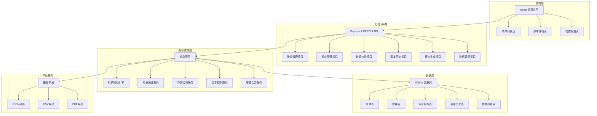
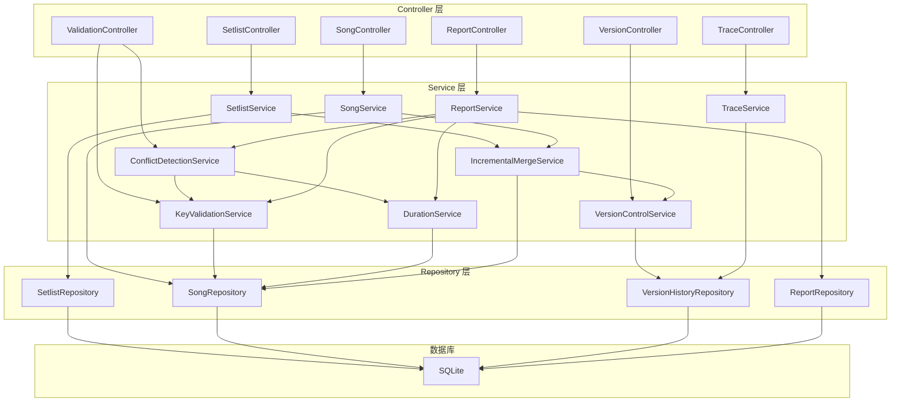
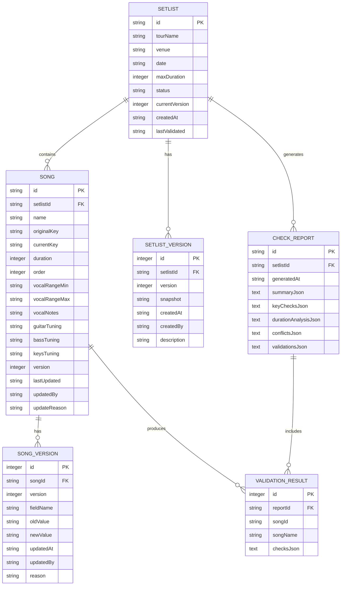

## 1. 架构设计



## 2. 技术描述

- **前端**：React 18 + TypeScript + Vite + TailwindCSS 3 + Recharts（图表）+ Lucide React（图标）
- **后端**：Node.js + Express 4 + TypeScript
- **数据库**：SQLite 3 + better-sqlite3（高性能同步API）
- **认证**：JWT Token
- **数据版本控制**：基于时间戳的多版本存储，每次变更生成新版本记录
- **增量合并策略**：字段级版本追踪，后到数据只补充缺失字段，不覆盖已有有效值

## 3. 路由定义

| 路由 | 页面 | 用途 |
|------|------|------|
| / | 歌单列表页 | 显示所有巡演歌单概览、状态、冲突标记 |
| /setlist/:id | 歌单详情页 | 歌曲清单、调号编辑、主唱备注、乐器调弦、实时校验 |
| /setlist/:id/report | 检查报告页 | 完整校验结果、图表分析、冲突详情、版本追溯、导出 |
| /api-docs | API文档页 | 所有接口说明 + curl可复制样例 |

## 4. API 定义

### 4.1 核心接口列表

| 方法 | 路径 | 功能 |
|------|------|------|
| POST | /api/setlists | 创建新歌单 |
| GET | /api/setlists | 获取歌单列表 |
| GET | /api/setlists/:id | 获取歌单详情 |
| PATCH | /api/setlists/:id | 增量更新歌单（不覆盖已有字段） |
| POST | /api/setlists/:id/songs | 添加歌曲到歌单 |
| PATCH | /api/setlists/:id/songs/:songId | 增量更新歌曲信息 |
| GET | /api/setlists/:id/versions | 获取歌单版本历史 |
| POST | /api/setlists/:id/validate | 执行转调检查 |
| GET | /api/setlists/:id/report | 获取检查报告 |
| GET | /api/setlists/:id/report/export?format=json | 导出报告 |
| GET | /api/setlists/:id/trace?field=totalDuration | 数据字段追溯 |

### 4.2 关键数据结构

```typescript
// 调号类型
type Key = 'C' | 'C#' | 'Db' | 'D' | 'D#' | 'Eb' | 'E' | 'F' | 'F#' | 'Gb' | 'G' | 'G#' | 'Ab' | 'A' | 'A#' | 'Bb' | 'B';

// 歌曲
interface Song {
  id: string;
  name: string;
  originalKey: Key;       // 原调
  currentKey: Key;        // 当前转调
  duration: number;       // 时长（秒）
  order: number;          // 演出顺序
  vocalRange?: {          // 主唱音域
    min: Key;
    max: Key;
  };
  vocalNotes?: string;    // 主唱备注
  instrumentTunings?: {   // 乐器调弦
    guitar?: string;
    bass?: string;
    keys?: string;
  };
  version: number;        // 数据版本号
  lastUpdated: string;    // ISO时间戳
  updatedBy: string;      // 更新人
  updateReason?: string;  // 更新原因
}

// 歌单
interface Setlist {
  id: string;
  tourName: string;       // 巡演名称
  venue: string;          // 场地
  date: string;           // 演出日期
  maxDuration: number;    // 最大允许时长（秒）
  songs: Song[];
  status: 'draft' | 'validated' | 'has_warnings' | 'has_errors';
  currentVersion: number;
  createdAt: string;
  lastValidated?: string;
}

// 校验结果
interface ValidationResult {
  songId: string;
  songName: string;
  checks: {
    keyFormat: {
      passed: boolean;
      message: string;    // 可读解释，如"调号'H#'不存在，是否想说'A#'？"
      suggestion?: string;
    };
    vocalRange: {
      passed: boolean;
      message: string;    // 如"转调后最高音超出主唱音域2个半音"
      details?: {
        originalNote: string;
        transposedNote: string;
        vocalistMax: string;
        semitoneDiff: number;
      };
    };
    instrumentTuning: {
      passed: boolean;
      message: string;    // 如"吉他调弦DADGAD与转调G不兼容，建议 capo 2品"
      suggestion?: string;
    };
    duration: {
      passed: boolean;
      message: string;
    };
  };
}

// 检查报告
interface CheckReport {
  setlistId: string;
  generatedAt: string;
  summary: {
    totalSongs: number;
    passed: number;
    warnings: number;
    errors: number;
    totalDuration: number;
    maxDuration: number;
    overDuration: number;
  };
  keyChecks: {
    validKeys: number;
    invalidKeys: Array<{songId: string, songName: string, invalidKey: string, suggestion: string}>;
    oldVersionMixins: Array<{songId: string, songName: string, currentVersion: number, latestVersion: number}>;
  };
  durationAnalysis: {
    perSong: Array<{songId: string, songName: string, duration: number, cumulative: number}>;
    breakdown: Array<{source: string, value: number, explanation: string}>;
  };
  conflicts: Array<{
    type: 'key_conflict' | 'duration_over' | 'old_version' | 'vocal_range' | 'instrument';
    severity: 'error' | 'warning';
    songId: string;
    songName: string;
    message: string;
    suggestion: string;
    trace: Array<{field: string, value: string, updatedAt: string, updatedBy: string}>;
  }>;
  validations: ValidationResult[];
}

// 数据追溯响应
interface FieldTrace {
  field: string;
  currentValue: any;
  calculationRule?: string;  // 如"累计时长 = SUM(songs[*].duration)"
  sourceFields?: string[];   // 参与计算的字段
  history: Array<{
    version: number;
    value: any;
    updatedAt: string;
    updatedBy: string;
    reason: string;
    diff: any;
  }>;
}
```

## 5. 服务器架构图



## 6. 数据模型

### 6.1 ER 图



### 6.2 DDL 语句

```sql
-- 歌单表
CREATE TABLE setlists (
    id TEXT PRIMARY KEY,
    tour_name TEXT NOT NULL,
    venue TEXT NOT NULL,
    date TEXT NOT NULL,
    max_duration INTEGER NOT NULL,
    status TEXT NOT NULL DEFAULT 'draft',
    current_version INTEGER NOT NULL DEFAULT 1,
    created_at TEXT NOT NULL,
    last_validated TEXT
);

CREATE INDEX idx_setlists_date ON setlists(date);
CREATE INDEX idx_setlists_status ON setlists(status);

-- 歌曲表
CREATE TABLE songs (
    id TEXT PRIMARY KEY,
    setlist_id TEXT NOT NULL REFERENCES setlists(id),
    name TEXT NOT NULL,
    original_key TEXT NOT NULL,
    current_key TEXT NOT NULL,
    duration INTEGER NOT NULL,
    song_order INTEGER NOT NULL,
    vocal_range_min TEXT,
    vocal_range_max TEXT,
    vocal_notes TEXT,
    guitar_tuning TEXT,
    bass_tuning TEXT,
    keys_tuning TEXT,
    version INTEGER NOT NULL DEFAULT 1,
    last_updated TEXT NOT NULL,
    updated_by TEXT NOT NULL,
    update_reason TEXT
);

CREATE INDEX idx_songs_setlist_id ON songs(setlist_id);
CREATE INDEX idx_songs_order ON songs(setlist_id, song_order);

-- 歌曲版本历史表（字段级变更）
CREATE TABLE song_versions (
    id INTEGER PRIMARY KEY AUTOINCREMENT,
    song_id TEXT NOT NULL REFERENCES songs(id),
    version INTEGER NOT NULL,
    field_name TEXT NOT NULL,
    old_value TEXT,
    new_value TEXT NOT NULL,
    updated_at TEXT NOT NULL,
    updated_by TEXT NOT NULL,
    reason TEXT
);

CREATE INDEX idx_song_versions_song_id ON song_versions(song_id);
CREATE INDEX idx_song_versions_version ON song_versions(song_id, version);

-- 歌单版本历史表（快照）
CREATE TABLE setlist_versions (
    id INTEGER PRIMARY KEY AUTOINCREMENT,
    setlist_id TEXT NOT NULL REFERENCES setlists(id),
    version INTEGER NOT NULL,
    snapshot TEXT NOT NULL,
    created_at TEXT NOT NULL,
    created_by TEXT NOT NULL,
    description TEXT
);

CREATE INDEX idx_setlist_versions_setlist_id ON setlist_versions(setlist_id);

-- 检查报告表
CREATE TABLE check_reports (
    id TEXT PRIMARY KEY,
    setlist_id TEXT NOT NULL REFERENCES setlists(id),
    generated_at TEXT NOT NULL,
    summary_json TEXT NOT NULL,
    key_checks_json TEXT NOT NULL,
    duration_analysis_json TEXT NOT NULL,
    conflicts_json TEXT NOT NULL,
    validations_json TEXT NOT NULL
);

CREATE INDEX idx_check_reports_setlist_id ON check_reports(setlist_id);
CREATE INDEX idx_check_reports_generated_at ON check_reports(generated_at);

-- 校验结果表
CREATE TABLE validation_results (
    id INTEGER PRIMARY KEY AUTOINCREMENT,
    report_id TEXT NOT NULL REFERENCES check_reports(id),
    song_id TEXT NOT NULL,
    song_name TEXT NOT NULL,
    checks_json TEXT NOT NULL
);

CREATE INDEX idx_validation_results_report_id ON validation_results(report_id);
```

### 6.3 初始化测试数据

```sql
-- 插入示例歌单
INSERT INTO setlists (id, tour_name, venue, date, max_duration, status, current_version, created_at)
VALUES ('sl-001', '夏日狂热巡演', '北京工人体育馆', '2026-06-15', 7200, 'draft', 1, datetime('now'));

-- 插入示例歌曲
INSERT INTO songs (id, setlist_id, name, original_key, current_key, duration, song_order, 
                   vocal_range_min, vocal_range_max, vocal_notes, guitar_tuning, 
                   last_updated, updated_by, update_reason)
VALUES 
('s-001', 'sl-001', '夜空中最亮的星', 'D', 'C', 280, 1, 'G3', 'D5', '副歌部分注意换气', 'Standard', datetime('now'), '音乐总监', '初始版本'),
('s-002', 'sl-001', '海阔天空', 'C', 'Bb', 320, 2, 'F3', 'C5', '主唱近期感冒，降1key', 'Standard', datetime('now'), '音乐总监', '降调适配主唱'),
('s-003', 'sl-001', '光辉岁月', 'E', 'H#', 295, 3, 'G3', 'E5', NULL, 'Drop D', datetime('now'), '巡演经理', '临时录入');
```
