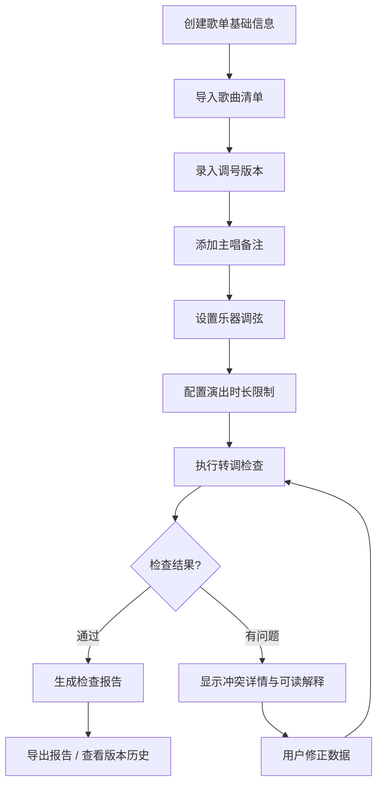
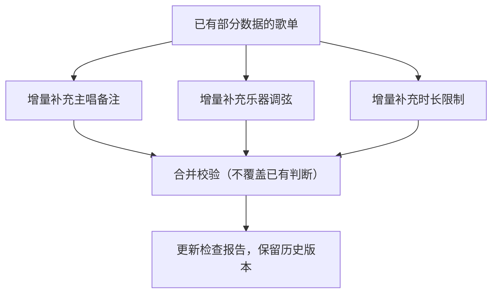

## 1. 产品概述

巡演歌单转调检查系统，为乐队巡演前的歌单整理工作提供智能化的转调校验、时长管理和冲突检测服务。解决主唱嗓况变化、乐器调弦差异、现场时长限制导致的转调版本频繁变动问题。

- 核心价值：确保歌单调号一致性、时长合规性，避免旧版歌单混入，让所有错误在报告中可读
- 目标用户：乐队音乐总监、巡演经理、现场调音师

## 2. 核心功能

### 2.1 用户角色

| 角色 | 注册方式 | 核心权限 |
|------|----------|----------|
| 巡演经理 | 账号登录 | 歌单管理、报告导出、完整数据权限 |
| 音乐总监 | 账号登录 | 调号版本管理、主唱备注编辑、转调规则配置 |
| 调音师 | 账号登录 | 乐器调弦录入、查看检查报告 |

### 2.2 功能模块

1. **歌单列表页**：歌单概览、版本状态、时长统计、冲突标记、快速操作
2. **歌单详情页**：歌曲清单、调号版本、主唱备注、乐器调弦、变更历史、实时校验
3. **检查报告页**：转调校验结果、时长分析、冲突详情、版本追溯、图表明细、导出功能
4. **API接口层**：RESTful API + curl样例，支持脚本自动化集成

### 2.3 页面详情

| 页面名称 | 模块名称 | 功能描述 |
|----------|----------|----------|
| 歌单列表页 | 歌单概览卡片 | 显示巡演名称、日期、场地、歌曲数量、总时长、状态标签 |
| 歌单列表页 | 冲突标记 | 调号冲突红色标记、时长超限橙色标记、版本不一致黄色标记 |
| 歌单列表页 | 快速操作 | 一键检查、导出报告、查看历史 |
| 歌单详情页 | 歌曲清单 | 歌曲顺序、歌名、原调、当前调、主唱备注、乐器调弦、时长 |
| 歌单详情页 | 调号版本管理 | 版本号、变更时间、变更人、变更原因、回滚功能 |
| 歌单详情页 | 实时校验面板 | 转调冲突、主唱音域匹配、乐器调弦兼容、时长累加 |
| 歌单详情页 | 版本历史时间线 | 所有数据变更的完整审计轨迹 |
| 检查报告页 | 校验摘要 | 通过/警告/错误数量统计，可点击下钻到明细 |
| 检查报告页 | 转调校验详情 | 每首歌的调号检查、调号错误的可读解释、修正建议 |
| 检查报告页 | 时长统计图表 | 单歌时长柱状图、累计时长折线图、超限部分高亮标注 |
| 检查报告页 | 冲突提示面板 | 调号冲突、旧版混入、主唱音域不匹配等问题的完整说明 |
| 检查报告页 | 版本追溯 | 每个数据字段的来源、更新时间、变更历史 |
| 检查报告页 | 报告导出 | PDF/JSON/CSV三种格式导出 |

## 3. 核心流程

数据补录流程：

## 4. 用户界面设计

### 4.1 设计风格

- 主色调：深靛蓝 #1e3a5f（专业、稳重），辅助色：珊瑚橙 #ff6b6b（警告）、森林绿 #2d6a4f（通过）、琥珀黄 #f4a261（提示）
- 按钮风格：微圆角4px，轻微阴影，hover时有微妙的上浮效果
- 字体：标题使用"Noto Sans SC"粗体，正文使用"Noto Sans SC"常规，等宽数据展示使用"JetBrains Mono"
- 布局风格：卡片式布局，左侧导航 + 主内容区，重要信息采用对角线分割强调
- 图标风格：线性图标搭配填充状态，警告/错误图标带轻微脉冲动画

### 4.2 页面设计概述

| 页面名称 | 模块名称 | UI元素 |
|----------|----------|--------|
| 歌单列表页 | 歌单卡片网格 | 悬停放大、状态标签脉冲动画、冲突计数角标 |
| 歌单详情页 | 歌曲列表 | 斑马行、调号颜色编码、可展开的版本历史面板 |
| 歌单详情页 | 校验侧栏 | 固定右侧、实时更新、进度条动画、错误项可跳转定位 |
| 检查报告页 | 统计图表 | 渐变填充、数据点悬停显示来源信息、点击下钻明细 |
| 检查报告页 | 冲突详情卡片 | 标题带图标、问题描述、影响范围、修正建议、追溯链接 |

### 4.3 响应式

- 桌面端优先设计，1280px起步
- 平板端：侧栏收起为图标，卡片变为两列
- 移动端：底部导航，卡片单列，图表简化为关键数据
- 所有交互元素支持触摸操作，最小点击区域44px

### 4.4 数据追溯设计

- 所有统计数字可点击，弹出"数据来源"面板
- 面板显示：原始数据、计算规则、参与计算的字段、最后更新时间、更新人
- 版本历史中每个变更点可对比前后差异
- 报告中每个结论都标注"依据来源"链接
