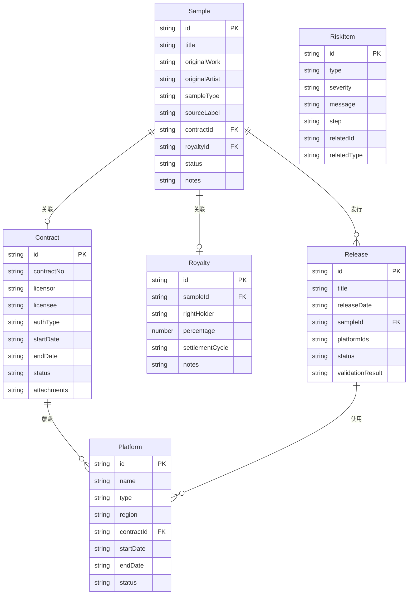

## 1. 架构设计

```mermaid
flowchart TB
    subgraph "前端层"
        "React 18 + TypeScript"
        "Tailwind CSS"
        "Zustand 状态管理"
        "React Router"
    end
    subgraph "数据层"
        "Mock 数据 (JSON)"
        "Zustand Store 持久化"
    end
    subgraph "导出层"
        "CSV 导出工具"
    end
    "React 18 + TypeScript" --> "Zustand 状态管理"
    "Zustand 状态管理" --> "Mock 数据 (JSON)"
    "React 18 + TypeScript" --> "CSV 导出工具"
```

纯前端架构，数据通过 Zustand store 管理，使用 localStorage 持久化，无需后端服务。

## 2. 技术说明

- 前端：React@18 + Tailwind CSS@3 + Vite
- 初始化工具：vite-init（react-ts 模板）
- 后端：无（纯前端，Mock 数据）
- 数据库：无（Zustand + localStorage 持久化）

## 3. 路由定义

| 路由 | 用途 |
|------|------|
| / | 首页重定向至采样清单 |
| /samples | 采样清单页，管理采样条目 |
| /contracts | 授权合同页，管理合同与到期预警 |
| /platforms | 平台范围页，授权平台与越界检测 |
| /royalties | 分成规则页，分成比例与试算 |
| /releases | 发行计划页，发行排期与联动校验 |
| /report | 台账报告页，风险提示与导出 |

## 4. API定义

无后端API，数据层通过 Zustand store 直接操作。

## 5. 服务端架构

不适用

## 6. 数据模型

### 6.1 数据模型定义



### 6.2 数据定义

所有数据以 TypeScript 接口定义，初始 Mock 数据内置在 store 中。

### 核心校验逻辑

1. **授权状态校验**：合同 endDate 与当前日期比较 → 生效/即将到期(30天内)/已过期/待签署
2. **平台越界检测**：发行计划中 platformIds 与合同关联的授权平台取差集 → 越界平台列表
3. **分成完整性校验**：采样条目关联的分成规则，比例之和是否为100% → 缺失/不足/超额
4. **发行联动校验**：发行日期是否在授权期限内 → 日期越界提示

### 风险卡点标注规则

| 异常类型 | 卡点步骤 | 提示语模板 |
|----------|----------|------------|
| 授权过期 | 合同续签 | "卡在合同续签：合同 H-2024-003 已于 2024-06-01 到期，需续签后才能继续发行" |
| 平台越界 | 平台授权 | "卡在平台授权：网易云音乐未在合同 H-2024-001 授权范围内，需补充平台授权" |
| 分成缺失 | 分成配置 | "卡在分成配置：采样「夜曲片段」未配置分成规则，无法计算结算金额" |
| 分成不足 | 分成配置 | "卡在分成配置：采样「夜曲片段」分成比例合计 85%，剩余 15% 未分配" |
| 发行越界 | 发行计划 | "卡在发行计划：发行日期 2025-03-01 超出合同 H-2024-001 授权期限（至 2025-01-01）" |
