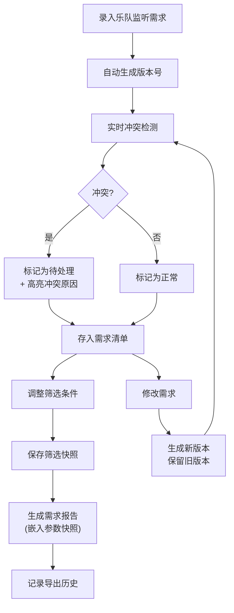

## 1. 产品概述

面向音乐节舞台经理的专业监听需求管理系统，解决乐队监听需求频繁变更、通道冲突、换场超时等核心痛点，实现需求版本可追溯、计算参数可复现、冲突风险透明化。

- **核心问题**：通道、返听、换场时间频繁临时改动，版本混乱，冲突难以发现
- **目标用户**：音乐节舞台经理、音响工程师、演出统筹
- **核心价值**：宁可标记"待处理"也不输出假结论，所有改动留痕，历史数据永不丢失

## 2. 核心特性

### 2.1 用户角色

| 角色 | 注册方式 | 核心权限 |
|------|----------|----------|
| 舞台经理 | 本地使用无需注册 | 全部功能：需求录入、版本管理、冲突校验、排程、导出 |

### 2.2 功能模块

1. **需求清单主页**：乐队监听需求列表、筛选器、版本选择器、状态概览
2. **需求详情页**：单乐队需求完整信息、版本对比、变更历史
3. **通道校验页**：通道表管理、重名检测、分配状态可视化
4. **返听配置页**：返听设备配置、漏配检测、需求匹配度
5. **换场排程页**：时间线视图、超时检测、排程冲突
6. **报告导出页**：参数快照、可复现筛选条件、多格式导出

### 2.3 页面详情

| 页面名称 | 模块名称 | 功能描述 |
|----------|----------|----------|
| 需求清单主页 | 筛选器面板 | 支持按乐队、状态、日期、版本筛选，筛选条件可保存为快照 |
| 需求清单主页 | 需求列表 | 展示乐队名称、通道数、返听数、换场时间、状态标记（正常/待处理/冲突） |
| 需求清单主页 | 版本选择器 | 可切换查看历史版本，支持版本对比 |
| 需求清单主页 | 状态仪表盘 | 待处理数、冲突数、总需求数、导出历史计数 |
| 需求详情页 | 需求表单 | 乐队信息、通道需求、返听配置、换场时间、舞台备注 |
| 需求详情页 | 版本历史 | 每次修改生成新版本，显示修改人、时间、变更内容diff |
| 需求详情页 | 冲突提示 | 实时检测并高亮通道重名、返听漏配、换场超时 |
| 通道校验页 | 通道表管理 | 全局通道列表、分配状态、重名检测 |
| 返听配置页 | 设备配置 | 返听设备清单、频段、可用状态 |
| 换场排程页 | 时间线视图 | 可视化展示各乐队演出时间、换场时间、超时警告 |
| 报告导出页 | 导出配置 | 嵌入当前筛选条件和计算参数快照，确保可复现 |
| 报告导出页 | 导出历史 | 记录每次导出的参数、时间、文件标识 |

## 3. 核心流程

**用户操作流程说明**：
1. 舞台经理录入乐队需求（通道、返听、换场时间、备注）
2. 系统自动生成版本号，进行实时冲突检测
3. 存在冲突则标记"待处理"并明确说明原因，绝不自动修正
4. 所有修改生成新版本，旧版本永久保留
5. 设置筛选条件后可保存为"参数快照"
6. 导出报告时自动嵌入当前筛选条件和计算参数，确保他人可复现
7. 所有导出操作记录在案，刷新重启后数据完整保留

## 4. 用户界面设计

### 4.1 设计风格

**工业实用主义 × 音乐节霓虹美学**
- **主色调**：深夜黑 (#0F0F12) 为基底，搭配舞台霓虹色
- **强调色**：警示红 (#FF3366)、正常绿 (#00FF88)、待处理橙 (#FFAA00)、霓虹紫 (#AA55FF)
- **字体**：标题用 Space Mono（等宽、工业感），正文用 JetBrains Mono（代码感、易读）
- **按钮风格**：直角、粗边框、按下时的凹陷效果、霓虹发光hover
- **布局风格**：高密度信息面板、模块化卡片、网格对齐、故障艺术(glitch)点缀
- **视觉细节**：CRT扫描线纹理、数字抖动效果、版本号用等宽字体对齐显示

### 4.2 页面设计概览

| 页面名称 | 模块名称 | UI元素 |
|----------|----------|--------|
| 需求清单主页 | 顶部状态栏 | 版本号显示、系统时间、导出计数、待处理/冲突数字徽章 |
| 需求清单主页 | 筛选器面板 | 下拉选择器、日期范围、复选框组、"保存快照"按钮 |
| 需求清单主页 | 需求列表 | 表格布局、行高紧凑、状态色标签、版本号列、hover显示变更摘要 |
| 需求清单主页 | 侧边栏 | 快速导航、版本历史折叠面板、导出历史列表 |
| 需求详情页 | 表单区域 | 分组字段、实时校验边框色、冲突提示徽章 |
| 需求详情页 | 版本时间线 | 垂直时间线、节点用不同颜色区分状态、点击查看diff |
| 换场排程页 | 时间线 | 甘特图样式、色块区分乐队、超时区域红色渐变闪烁 |
| 通道校验页 | 通道矩阵 | 网格布局、已分配/空闲/冲突用不同背景色 |

### 4.3 响应式

- **桌面优先**：1440px 基准设计，高密度信息布局
- **平板适配**：1024px 时侧边栏收起为图标，表格可水平滚动
- **触控优化**：按钮最小 44px，重要操作增加二次确认
- **不支持移动端**：专业工具，信息密度过高，移动端体验不佳

### 4.4 关键交互细节

1. **版本切换动效**：切换版本时，数据区域轻微"故障"闪烁(glitch)，暗示时间线跳跃
2. **冲突提示**：冲突项边框脉冲动画，鼠标悬停时展开详细原因
3. **导出按钮**：按下时有"打印"机械感动画，完成后显示导出编号
4. **时间线滚动**：换场排程横向滚动时，时间标尺跟随吸附
5. **数据保存**：所有输入自动保存，顶部显示"已同步"状态指示器
