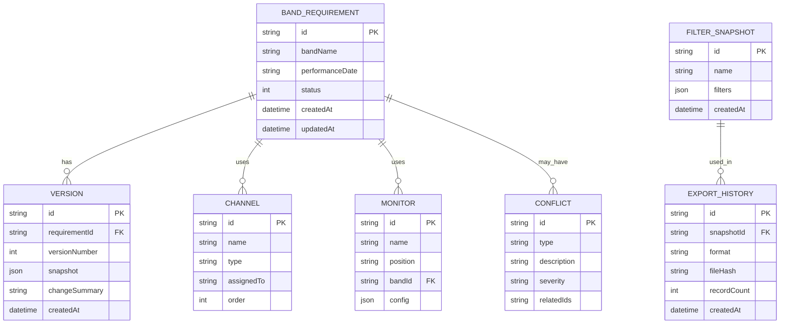

## 1. 架构设计

```mermaid
graph TD
    subgraph "前端应用 (React + TypeScript)"
        A["UI 组件层"] --> B["状态管理层 (Zustand)"]
        B --> C["业务逻辑层"]
        C --> D["数据持久层 (localStorage)"]
    end
    
    subgraph "核心模块"
        E["需求版本系统"]
        F["冲突检测引擎"]
        G["排程计算模块"]
        H["报告导出模块"]
    end
    
    B --> E
    B --> F
    B --> G
    B --> H
    
    style A fill:#1a1a2e,stroke:#AA55FF,stroke-width:2
    style B fill:#16213e,stroke:#00FF88,stroke-width:2
    style C fill:#0f3460,stroke:#FFAA00,stroke-width:2
    style D fill:#1a1a2e,stroke:#FF3366,stroke-width:2
```



**架构说明**：
- 纯前端单页应用，无后端依赖
- 所有数据通过 localStorage 持久化，刷新/重启不丢失
- 状态管理集中化，确保数据一致性
- 业务逻辑与UI分离，便于测试和维护
- 版本系统采用不可变数据设计，历史记录永不丢失

## 2. 技术栈描述

- **前端框架**：React@18 + TypeScript@5
- **构建工具**：Vite@5
- **状态管理**：Zustand@4（轻量级、支持immer、devtools）
- **路由**：React Router@6
- **样式方案**：TailwindCSS@3 + CSS Variables
- **UI组件**：Headless UI（无样式，便于自定义设计）
- **日期处理**：date-fns@3（轻量、Tree-shakable）
- **导出功能**：html2canvas + jspdf（PDF）、SheetJS（Excel）
- **图标**：Lucide React（简洁、统一风格）
- **后端**：None（纯前端，localStorage存储）
- **数据库**：localStorage（键值对存储，JSON序列化）

## 3. 路由定义

| 路由 | 页面名称 | 主要用途 |
|------|----------|----------|
| / | 需求清单主页 | 查看所有乐队需求、筛选、版本切换 |
| /requirement/:id | 需求详情页 | 查看/编辑单乐队需求、版本历史、冲突详情 |
| /requirement/new | 新建需求 | 录入新的乐队监听需求 |
| /channels | 通道校验页 | 通道表管理、重名检测、分配状态 |
| /monitors | 返听配置页 | 返听设备管理、漏配检测 |
| /schedule | 换场排程页 | 时间线视图、超时检测 |
| /export | 报告导出页 | 配置导出参数、查看导出历史 |

## 4. 数据模型

### 4.1 ER图



### 4.2 TypeScript 类型定义

```typescript
// 需求状态枚举
export enum RequirementStatus {
  NORMAL = 'normal',
  PENDING = 'pending',
  CONFLICT = 'conflict'
}

// 冲突类型枚举
export enum ConflictType {
  CHANNEL_DUPLICATE = 'channel_duplicate',
  MONITOR_MISSING = 'monitor_missing',
  CHANGE_OVER_TIMEOUT = 'change_over_timeout'
}

// 乐队监听需求
export interface BandRequirement {
  id: string;
  bandName: string;
  performanceDate: string;
  startTime: string;
  endTime: string;
  changeOverTime: number; // 分钟
  channels: Channel[];
  monitors: Monitor[];
  stageNotes: string;
  status: RequirementStatus;
  conflicts: Conflict[];
  currentVersion: number;
  createdAt: string;
  updatedAt: string;
}

// 通道
export interface Channel {
  id: string;
  name: string;
  type: 'vocals' | 'guitar' | 'bass' | 'drums' | 'keys' | 'other';
  assignedTo: string;
  order: number;
  notes?: string;
}

// 返听配置
export interface Monitor {
  id: string;
  name: string;
  position: 'stage_left' | 'stage_center' | 'stage_right' | 'drummer';
  mix: Record<string, number>; // channelId -> level (0-100)
  notes?: string;
}

// 冲突
export interface Conflict {
  id: string;
  type: ConflictType;
  description: string;
  severity: 'warning' | 'error';
  relatedItemIds: string[];
  resolved: boolean;
}

// 版本记录
export interface VersionRecord {
  id: string;
  requirementId: string;
  versionNumber: number;
  snapshot: BandRequirement;
  changeSummary: string;
  createdAt: string;
  createdBy: string;
}

// 筛选快照
export interface FilterSnapshot {
  id: string;
  name: string;
  filters: FilterCriteria;
  createdAt: string;
}

// 筛选条件
export interface FilterCriteria {
  bandName?: string;
  status?: RequirementStatus[];
  dateFrom?: string;
  dateTo?: string;
  hasConflict?: boolean;
}

// 导出历史
export interface ExportRecord {
  id: string;
  snapshotId?: string;
  filterCriteria: FilterCriteria;
  format: 'pdf' | 'excel' | 'json';
  fileHash: string;
  recordCount: number;
  createdAt: string;
}

// 全局状态
export interface AppState {
  requirements: BandRequirement[];
  versions: VersionRecord[];
  filterSnapshots: FilterSnapshot[];
  exportHistory: ExportRecord[];
  globalChannels: Channel[];
  globalMonitors: Monitor[];
  currentFilters: FilterCriteria;
  selectedVersion: number | null;
}
```

## 5. 核心模块设计

### 5.1 版本追踪系统

```typescript
// 每次修改创建新版本，旧版本永不删除
function createVersion(
  requirement: BandRequirement,
  changeSummary: string
): VersionRecord {
  return {
    id: generateId(),
    requirementId: requirement.id,
    versionNumber: requirement.currentVersion + 1,
    snapshot: JSON.parse(JSON.stringify(requirement)), // 深拷贝
    changeSummary,
    createdAt: new Date().toISOString(),
    createdBy: 'current_user'
  };
}

// 版本对比，返回变更diff
function compareVersions(v1: BandRequirement, v2: BandRequirement): ChangeDiff {
  return {
    channels: diffArray(v1.channels, v2.channels, 'id'),
    monitors: diffArray(v1.monitors, v2.monitors, 'id'),
    changeOverTime: v1.changeOverTime !== v2.changeOverTime 
      ? { from: v1.changeOverTime, to: v2.changeOverTime } 
      : null,
    stageNotes: v1.stageNotes !== v2.stageNotes 
      ? { from: v1.stageNotes, to: v2.stageNotes } 
      : null
  };
}
```

### 5.2 冲突检测引擎

```typescript
// 通道重名检测
function detectChannelDuplicates(channels: Channel[]): Conflict[] {
  const conflicts: Conflict[] = [];
  const nameMap = new Map<string, Channel[]>();
  
  channels.forEach(ch => {
    const existing = nameMap.get(ch.name) || [];
    nameMap.set(ch.name, [...existing, ch]);
  });
  
  nameMap.forEach((items, name) => {
    if (items.length > 1) {
      conflicts.push({
        id: generateId(),
        type: ConflictType.CHANNEL_DUPLICATE,
        description: `通道名称"${name}"重复使用 ${items.length} 次`,
        severity: 'error',
        relatedItemIds: items.map(i => i.id),
        resolved: false
      });
    }
  });
  
  return conflicts;
}

// 换场超时检测
function detectChangeOverTimeout(
  req: BandRequirement,
  allRequirements: BandRequirement[],
  maxChangeOver: number = 30
): Conflict[] {
  const conflicts: Conflict[] = [];
  const sameDayReqs = allRequirements
    .filter(r => r.performanceDate === req.performanceDate && r.id !== req.id)
    .sort((a, b) => a.startTime.localeCompare(b.startTime));
  
  const currentIndex = sameDayReqs.findIndex(r => r.id === req.id);
  if (currentIndex > 0) {
    const prevReq = sameDayReqs[currentIndex - 1];
    const actualChangeOver = calculateMinutes(prevReq.endTime, req.startTime);
    
    if (actualChangeOver < req.changeOverTime) {
      conflicts.push({
        id: generateId(),
        type: ConflictType.CHANGE_OVER_TIMEOUT,
        description: `换场时间不足：需要 ${req.changeOverTime} 分钟，实际只有 ${actualChangeOver} 分钟`,
        severity: 'error',
        relatedItemIds: [prevReq.id, req.id],
        resolved: false
      });
    }
  }
  
  return conflicts;
}
```

### 5.3 数据持久化

```typescript
// localStorage 键名常量
const STORAGE_KEYS = {
  REQUIREMENTS: 'stage_monitor_requirements',
  VERSIONS: 'stage_monitor_versions',
  FILTER_SNAPSHOTS: 'stage_monitor_snapshots',
  EXPORT_HISTORY: 'stage_monitor_exports',
  GLOBAL_CHANNELS: 'stage_monitor_global_channels',
  GLOBAL_MONITORS: 'stage_monitor_global_monitors',
  APP_STATE: 'stage_monitor_app_state'
};

// 自动保存中间件
const persistMiddleware = (config) => (set, get, api) => {
  return config(
    (args) => {
      set(args);
      // 每次状态变化后持久化到 localStorage
      const state = get();
      Object.entries(STORAGE_KEYS).forEach(([key, storageKey]) => {
        const stateKey = key.toLowerCase();
        if (state[stateKey]) {
          localStorage.setItem(storageKey, JSON.stringify(state[stateKey]));
        }
      });
    },
    get,
    api
  );
};
```

### 5.4 报告导出模块

```typescript
// 导出版本参数嵌入报告
function generateExportMetadata(
  filters: FilterCriteria,
  recordCount: number
): ExportMetadata {
  return {
    exportVersion: '1.0.0',
    exportedAt: new Date().toISOString(),
    filterCriteria: filters,
    recordCount,
    dataHash: generateDataHash(filters, recordCount),
    reproducibilityNote: '使用相同筛选条件可复现此报告'
  };
}

// PDF导出 - 包含参数快照二维码或文本
async function exportToPDF(
  requirements: BandRequirement[],
  filters: FilterCriteria
): Promise<Blob> {
  const metadata = generateExportMetadata(filters, requirements.length);
  
  // PDF内容包含：
  // 1. 报告标题和导出信息
  // 2. 筛选条件参数快照
  // 3. 数据表格
  // 4. 冲突列表
  // 5. 版本信息
  // 6. 可复现说明
  
  return generatePDF(content);
}
```
