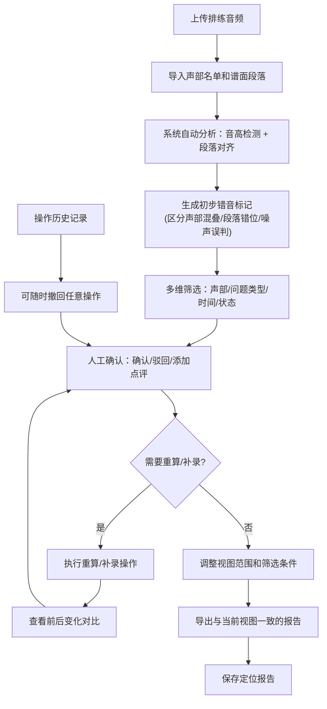

## 1. 产品概述

儿童合奏错音定位系统，帮助少儿乐团老师从排练录音中精准定位小提琴、长笛等声部的错音段落，解决传统人工听音效率低、错音容易遗漏的问题。系统支持多源数据整合（音频、声部名单、谱面、标记、备注、报告），区分系统自动生成与人工录入内容，提供可追溯的分析操作流程。

### 核心价值
- **精准定位**：自动检测音高偏差，区分声部混叠、段落错位、噪声误判三类常见问题
- **可复查性**：重算、撤回、补录操作全程留痕，可对比查看前后变化
- **灵活导出**：导出内容与当前屏幕筛选范围、时间轴选区完全一致
- **人机协同**：自动检测 + 人工确认，确保分析结果准确可靠

---

## 2. 核心功能

### 2.1 用户角色

| 角色 | 注册方式 | 核心权限 |
|------|----------|----------|
| 乐团老师 | 无需注册，本地使用 | 上传音频、分析错音、人工确认、导出报告、管理历史记录 |

### 2.2 功能模块

1. **主工作台**：音频波形显示、音高曲线、时间轴导航、错音标记层叠
2. **数据管理**：排练音频、声部名单、谱面段落、老师标记、学生备注、定位报告的统一管理
3. **分析引擎**：音高检测、段落对齐、错音统计、声部分离算法
4. **筛选面板**：按声部、问题类型、时间段、确认状态、数据来源多维筛选
5. **人工确认**：错音确认/驳回、添加点评、撤回操作、历史对比
6. **报告导出**：导出当前视图范围的PDF/Excel报告，包含统计图表和详细列表

### 2.3 页面详情

| 页面名称 | 模块名称 | 功能描述 |
|----------|----------|----------|
| 主工作台 | 音频播放控制 | 播放/暂停、进度跳转、循环播放、音量调节、变速播放 |
| 主工作台 | 波形音高视图 | 双声道波形显示、检测到的音高曲线 overlay、谱面段落标记 |
| 主工作台 | 错音标记层 | 按问题类型（声部混叠/段落错位/噪声误判）用不同颜色标记错音点 |
| 主工作台 | 时间轴导航 | 全局缩略图、缩放控制、选区拖拽、精细调节 |
| 筛选面板 | 多维筛选 | 声部筛选（小提琴/长笛/全部）、问题类型筛选、确认状态筛选、数据来源筛选（系统/人工）、时间范围筛选 |
| 筛选面板 | 统计概览 | 各类问题分类统计数字，不只是总数 |
| 错音列表 | 可排序表格 | 时间点、声部、问题类型、预期音高、实际音高、偏差值、确认状态、来源 |
| 错音列表 | 人工确认 | 确认正确、标记为误判、添加点评备注、一键定位到音频位置 |
| 操作历史 | 动作记录 | 重算、撤回、补录的操作日志，可点击回滚到任意历史状态 |
| 操作历史 | 对比视图 | 并排显示操作前后的错音数量和类型变化 |
| 数据管理 | 文件列表 | 显示所有关联数据文件，标注来源（系统导出/人工录入） |
| 报告导出 | 导出配置 | 选择导出格式（PDF/Excel）、选择包含的内容、预览导出范围 |

---

## 3. 核心流程

### 3.1 主工作流程

1. 老师上传排练音频文件
2. 导入声部名单和谱面段落信息（可系统导入或人工填写）
3. 系统自动进行音高检测和段落对齐分析
4. 系统生成初步错音标记，区分三类问题类型
5. 老师通过筛选器缩小范围，逐个确认或驳回错音标记
6. 老师添加点评备注，可随时撤回之前的操作
7. 查看重算/补录前后的对比，确认分析质量
8. 调整当前视图范围和筛选条件，导出一致的分析报告

### 3.2 流程图

---

## 4. 用户界面设计

### 4.1 设计风格

**设计方向：专业工具型，简洁高效**

- **主色调**：深邃靛蓝 `#1e3a5f` 作为主色，代表专业和精准
- **辅助色**：
  - 声部混叠：暖橙 `#f59e0b`
  - 段落错位：玫红 `#ef4444`
  - 噪声误判：冷紫 `#8b5cf6`
  - 已确认：翠绿 `#10b981`
  - 已驳回：灰蓝 `#64748b`
- **中性色**：
  - 背景：近炭黑 `#0f172a`，减少视觉疲劳，适合长时间分析
  - 卡片：深灰 `#1e293b`，轻微边框
  - 文字：灰白 `#e2e8f0` 为主，次级文字 `#94a3b8`
- **字体**：
  - 标题/数字：`JetBrains Mono` 等宽字体，时间码和数字对齐整齐
  - 正文：`Noto Sans SC` 中文无衬线，清晰易读
- **布局**：三栏布局，左筛选、中波形、右列表
- **图标**：线性简约图标，统一 16px 尺寸

### 4.2 页面设计概览

| 页面名称 | 模块名称 | UI 元素 |
|----------|----------|----------|
| 主工作台 | 顶部工具栏 | 面包屑导航、音频选择器、分析按钮、重算按钮、导出按钮、操作历史按钮 |
| 主工作台 | 左侧筛选面板 | 分组折叠式筛选器，每个筛选维度带统计数字、筛选条件标签化显示 |
| 主工作台 | 中央波形区 | 顶部时间刻度、波形画布、音高曲线层、错音标记点、谱面段落分隔线、播放头 |
| 主工作台 | 底部时间轴 | 全局波形缩略图、选区拖拽手柄、缩放滑块 |
| 主工作台 | 右侧详情区 | 错音列表（带颜色标记）、选中错音的详情卡片、点评输入框、确认/驳回按钮 |
| 操作历史弹窗 | 时间线 | 垂直时间线，每条记录带操作类型、时间、操作者、变化摘要 |
| 操作历史弹窗 | 对比视图 | 左右双栏，操作前 vs 操作后的数据对比，差异高亮 |
| 导出预览 | 范围可视化 | 在时间轴上高亮显示即将导出的范围、内容勾选列表、格式选择 |

### 4.3 交互细节

- **错音标记**：悬停显示浮动卡片，包含时间、声部、问题类型、音高偏差
- **点击定位**：点击错音列表项或标记点，自动跳转并播放该位置前后2秒
- **筛选联动**：调整筛选条件时，错音列表和波形标记同步更新，带过渡动画
- **状态变化**：确认/驳回操作后，标记点颜色渐变过渡，数字计数器平滑变动
- **历史回滚**：点击历史记录可预览回滚后的状态，二次确认后执行

### 4.4 响应式

- **桌面端优先**：1440px+ 为最佳体验，三栏布局
- **平板适配**：1024-1439px，左右面板可折叠收起
- **移动端**：单列布局，波形全屏显示，列表和筛选通过抽屉唤起

---

## 5. 数据来源区分规范

所有数据必须明确标注来源类型，在界面上用不同样式区分：

| 数据类型 | 来源类型 | 视觉标识 |
|----------|----------|----------|
| 排练音频 | 系统导入 | 文件图标，无特殊标记 |
| 声部名单 | 系统导出 | `[系统]` 标签，蓝色边框 |
| 声部名单 | 人工填写 | `[人工]` 标签，橙色边框 |
| 谱面段落 | 系统导出 | `[系统]` 标签 |
| 谱面段落 | 人工填写 | `[人工]` 标签 |
| 错音标记 | 系统检测 | 空心圆点标记 |
| 错音标记 | 人工补录 | 实心圆点标记，带 `+` 图标 |
| 备注点评 | 老师标记 | 头像图标 + 姓名 |
| 备注点评 | 学生备注 | 学生图标 + 姓名 |
| 定位报告 | 系统生成 | 报告图标，自动时间戳 |
| 定位报告 | 人工编辑 | 编辑图标，最后修改人 |
