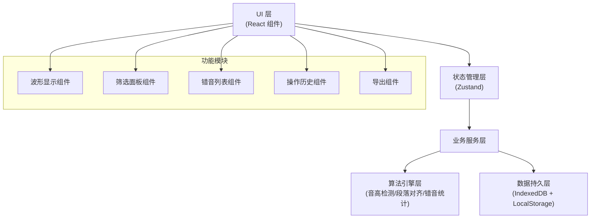
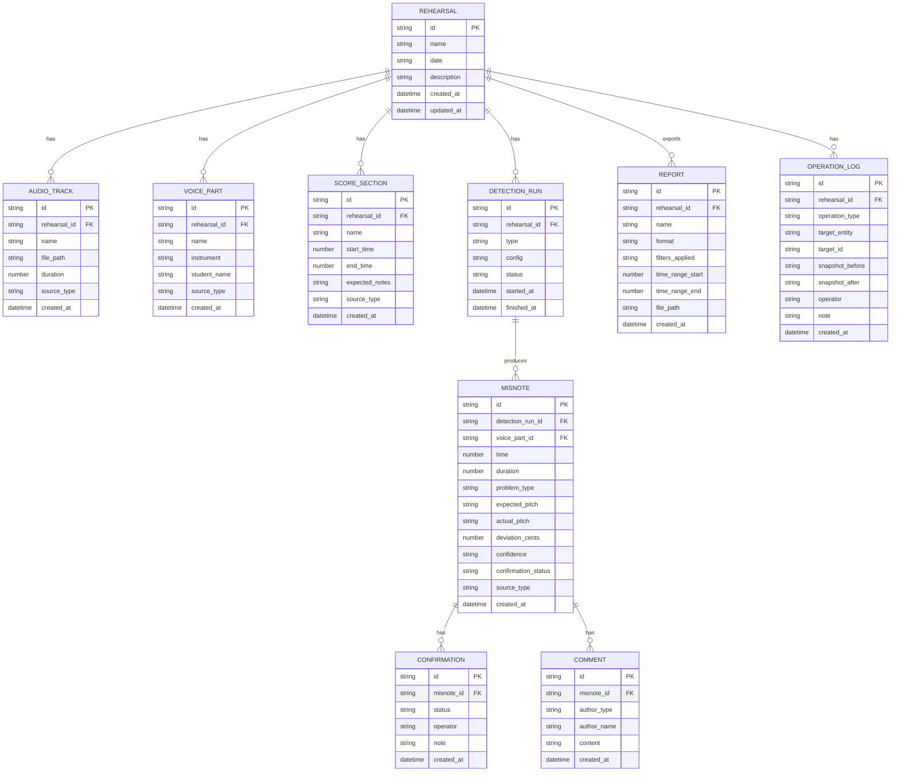

## 1. 架构设计

本系统为纯前端单页应用，所有数据存储在浏览器本地（IndexedDB + LocalStorage），无需后端服务。采用分层架构，确保可维护性和可扩展性。



---

## 2. 技术描述

### 2.1 核心技术栈

| 层级 | 技术选型 | 版本 | 用途 |
|------|----------|------|------|
| 前端框架 | React | 18.x | UI 组件化开发 |
| 构建工具 | Vite | 5.x | 快速开发构建 |
| 语言 | TypeScript | 5.x | 类型安全 |
| 样式 | TailwindCSS | 3.x | 原子化 CSS |
| 状态管理 | Zustand | 4.x | 轻量状态管理 |
| 本地数据库 | Dexie.js | 4.x | IndexedDB 封装 |
| 音频处理 | Web Audio API | - | 原生音频播放和分析 |
| 音高检测 | ml5.js (PitchDetection) + 自定义算法 | - | YIN 算法 + 后处理 |
| 波形绘制 | Canvas API | - | 高性能波形和音高曲线渲染 |
| 图标 | Lucide React | - | 线性图标库 |
| 导出 | jsPDF + SheetJS | - | PDF/Excel 导出 |

### 2.2 初始化方式

使用 Vite 官方 React + TypeScript 模板初始化：
```bash
npm create vite@latest . -- --template react-ts
```

---

## 3. 路由定义

| 路由 | 页面/组件 | 用途 |
|------|-----------|------|
| `/` | 主工作台页面 | 核心分析界面，包含波形、筛选、列表 |
| `/data` | 数据管理页面 | 管理音频、声部、谱面等数据文件 |
| `/history` | 历史记录页面 | 查看所有操作历史和对比 |
| `/reports` | 报告列表页面 | 查看和管理已导出的定位报告 |

---

## 4. 数据模型

### 4.1 ER 图



### 4.2 核心 TypeScript 类型定义

```typescript
// 来源类型枚举
export type SourceType = 'system' | 'manual';

// 问题类型枚举
export type ProblemType = 'voice_overlap' | 'section_misalignment' | 'noise_misjudgment';

// 确认状态枚举
export type ConfirmationStatus = 'pending' | 'confirmed' | 'rejected';

// 操作类型枚举
export type OperationType = 'detection_run' | 'rerun' | 'undo' | 'manual_add' | 'confirm' | 'reject' | 'comment_add' | 'export';

// 声部
export interface VoicePart {
  id: string;
  rehearsalId: string;
  name: string;
  instrument: 'violin' | 'flute' | 'other';
  studentName: string;
  sourceType: SourceType;
  createdAt: Date;
}

// 谱面段落
export interface ScoreSection {
  id: string;
  rehearsalId: string;
  name: string;
  startTime: number;
  endTime: number;
  expectedNotes: string;
  sourceType: SourceType;
  createdAt: Date;
}

// 错音标记
export interface Misnote {
  id: string;
  detectionRunId: string;
  voicePartId: string;
  time: number;
  duration: number;
  problemType: ProblemType;
  expectedPitch: string;
  actualPitch: string;
  deviationCents: number;
  confidence: number;
  confirmationStatus: ConfirmationStatus;
  sourceType: SourceType;
  createdAt: Date;
}

// 操作日志
export interface OperationLog {
  id: string;
  rehearsalId: string;
  operationType: OperationType;
  targetEntity: string;
  targetId: string;
  snapshotBefore: string;
  snapshotAfter: string;
  operator: string;
  note: string;
  createdAt: Date;
}

// 筛选条件
export interface FilterCriteria {
  voicePartIds: string[];
  problemTypes: ProblemType[];
  confirmationStatuses: ConfirmationStatus[];
  sourceTypes: SourceType[];
  timeRange: [number, number] | null;
  minConfidence: number;
  maxDeviation: number;
}

// 导出配置
export interface ExportConfig {
  format: 'pdf' | 'xlsx';
  includeCharts: boolean;
  includeMisnoteList: boolean;
  includeComments: boolean;
  timeRange: [number, number];
  filters: FilterCriteria;
}
```

### 4.3 数据库 DDL（Dexie.js Schema）

```typescript
import Dexie from 'dexie';

export class AppDatabase extends Dexie {
  rehearsals!: Dexie.Table<Rehearsal, string>;
  audioTracks!: Dexie.Table<AudioTrack, string>;
  voiceParts!: Dexie.Table<VoicePart, string>;
  scoreSections!: Dexie.Table<ScoreSection, string>;
  detectionRuns!: Dexie.Table<DetectionRun, string>;
  misnotes!: Dexie.Table<Misnote, string>;
  confirmations!: Dexie.Table<Confirmation, string>;
  comments!: Dexie.Table<Comment, string>;
  reports!: Dexie.Table<Report, string>;
  operationLogs!: Dexie.Table<OperationLog, string>;

  constructor() {
    super('MisnoteDetectorDB');
    this.version(1).stores({
      rehearsals: 'id, createdAt',
      audioTracks: 'id, rehearsalId, createdAt',
      voiceParts: 'id, rehearsalId, instrument, createdAt',
      scoreSections: 'id, rehearsalId, startTime, endTime',
      detectionRuns: 'id, rehearsalId, type, startedAt',
      misnotes: 'id, detectionRunId, voicePartId, time, problemType, confirmationStatus, sourceType',
      confirmations: 'id, misnoteId, createdAt',
      comments: 'id, misnoteId, createdAt',
      reports: 'id, rehearsalId, createdAt',
      operationLogs: 'id, rehearsalId, operationType, createdAt',
    });
  }
}
```

---

## 5. 核心算法模块

### 5.1 音高检测模块

```typescript
// 使用 YIN 算法进行音高检测，后处理过滤噪声和多声部干扰
export interface PitchDetectionResult {
  time: number;
  frequency: number;
  probability: number;
}

export class PitchDetector {
  async detect(audioBuffer: AudioBuffer): Promise<PitchDetectionResult[]> {
    // 1. 分帧处理（每帧 2048 samples，重叠 50%）
    // 2. YIN 算法计算基频
    // 3. 概率阈值过滤
    // 4. 中值滤波平滑
    // 5. 八度错误修正
  }
}
```

### 5.2 声部分离模块

```typescript
// 基于谱面特征的声部分离，区分小提琴和长笛
export interface SeparationResult {
  time: number;
  dominantInstrument: 'violin' | 'flute' | 'both' | 'none';
  violinEnergy: number;
  fluteEnergy: number;
}

export class VoiceSeparator {
  async separate(audioBuffer: AudioBuffer): Promise<SeparationResult[]> {
    // 1. 计算频谱特征（MFCC、频谱质心、频谱衰减）
    // 2. 小提琴：高频泛音丰富，频谱质心较高
    // 3. 长笛：频谱纯净，泛音较弱
    // 4. 基于能量阈值判断主导声部
    // 5. 标记声部混叠区域
  }
}
```

### 5.3 段落对齐模块

```typescript
// 将音频与谱面段落进行时间对齐
export interface AlignmentResult {
  scoreSectionId: string;
  alignedStartTime: number;
  alignedEndTime: number;
  confidence: number;
}

export class SectionAligner {
  async align(
    audioBuffer: AudioBuffer,
    sections: ScoreSection[],
    referencePitches: string[]
  ): Promise<AlignmentResult[]> {
    // 1. 动态时间规整（DTW）对齐
    // 2. 检测段落起始和结束的特征点
    // 3. 计算对齐置信度
    // 4. 标记段落错位问题
  }
}
```

### 5.4 错音统计模块

```typescript
export interface MisnoteStatistics {
  total: number;
  byProblemType: Record<ProblemType, number>;
  byVoicePart: Record<string, number>;
  byConfirmationStatus: Record<ConfirmationStatus, number>;
  byDeviationRange: { range: string; count: number }[];
  timeDistribution: { time: number; count: number }[];
}

export class MisnoteAnalyzer {
  analyze(
    misnotes: Misnote[],
    filters: FilterCriteria
  ): MisnoteStatistics {
    // 1. 应用筛选条件
    // 2. 多维度分类统计
    // 3. 时间分布统计（按 10 秒分段）
    // 4. 偏差分布统计
  }
}
```

---

## 6. 状态管理设计

### 6.1 Zustand Store 结构

```typescript
interface AppState {
  // 数据
  rehearsals: Rehearsal[];
  currentRehearsal: Rehearsal | null;
  audioTrack: AudioTrack | null;
  voiceParts: VoicePart[];
  scoreSections: ScoreSection[];
  misnotes: Misnote[];
  operationLogs: OperationLog[];
  
  // 视图状态
  playbackTime: number;
  isPlaying: boolean;
  viewRange: [number, number];
  selectionRange: [number, number] | null;
  filters: FilterCriteria;
  selectedMisnoteId: string | null;
  
  // 操作
  setCurrentRehearsal: (id: string) => Promise<void>;
  runDetection: (config: any) => Promise<void>;
  rerunDetection: (runId: string) => Promise<void>;
  confirmMisnote: (id: string, note?: string) => Promise<void>;
  rejectMisnote: (id: string, note?: string) => Promise<void>;
  addManualMisnote: (data: Partial<Misnote>) => Promise<void>;
  undoOperation: (logId: string) => Promise<void>;
  setFilters: (filters: Partial<FilterCriteria>) => void;
  exportReport: (config: ExportConfig) => Promise<void>;
}
```

---

## 7. 性能优化策略

1. **Canvas 虚拟化渲染**：只渲染可视时间范围内的波形和标记
2. **Web Worker**：音高检测和分析算法在 Web Worker 中运行，不阻塞 UI
3. **数据分页**：错音列表使用虚拟滚动，支持万级数据量
4. **缓存策略**：检测结果缓存到 IndexedDB，避免重复计算
5. **增量更新**：重算时只更新受影响的时间段数据

---

## 8. 可复查性实现

1. **操作快照**：每次修改操作（确认、驳回、添加、删除）都保存前后数据快照
2. **时间线回溯**：通过操作日志可以回滚到任意历史状态
3. **对比视图**：选择两个操作点，并排展示数据差异
4. **审计追踪**：所有操作记录操作人、时间、变更内容，不可篡改
