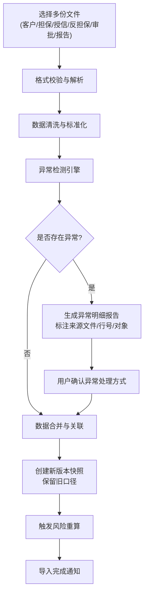
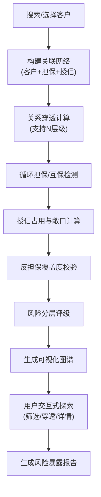
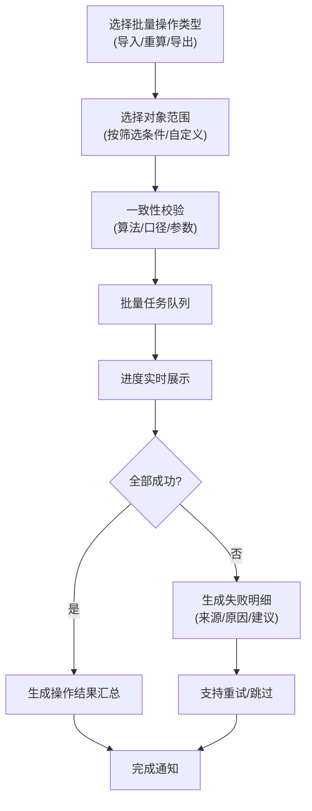

## 1. 产品概述

担保圈授信暴露图系统是面向公司金融风控业务同事的集团客户风险分析工具，解决互保关系、反担保信息、授信余额分散在多系统的数据孤岛问题。系统通过可视化图谱直观展示担保圈网络，自动检测风险异常，支持批量操作与历史版本追溯，确保风控审查的准确性与可追溯性。

产品目标：通过关系穿透、授信占用计算、担保校验和风险分层，帮助业务人员快速识别集团客户担保圈的风险暴露，避免因互保重复、余额日期错误、反担保缺失等问题导致的风险漏判。

## 2. 核心功能

### 2.1 用户角色

| 角色 | 注册方式 | 核心权限 |
|------|----------|----------|
| 风控审查员 | 企业账号登录 | 数据导入、图谱查看、风险分析、报告导出 |
| 风控主管 | 企业账号登录 | 全部审查员权限 + 审批意见查看、批量审核 |

### 2.2 功能模块

1. **工作台首页**：待处理任务、异常告警概览、最近操作历史
2. **数据导入中心**：多来源文件导入、版本管理、导入校验、异常明细
3. **担保圈图谱**：关系可视化、穿透查询、节点筛选、路径分析
4. **风险分析**：授信占用计算、担保有效性校验、风险分层评级
5. **报告中心**：暴露报告生成、批量导出、历史报告查询
6. **系统管理**：版本历史、操作撤回、口径管理

### 2.3 页面详情

| 页面名称 | 模块名称 | 功能描述 |
|---------|----------|----------|
| 工作台首页 | 异常告警面板 | 展示互保重复、余额日期异常、反担保缺失等告警，支持点击跳转 |
| 工作台首页 | 快捷操作区 | 一键导入、最近查看的担保圈、快速搜索客户 |
| 数据导入中心 | 文件上传区 | 拖拽上传客户关系、担保合同、授信余额、反担保材料、审批意见、暴露报告 |
| 数据导入中心 | 导入预览与校验 | 数据预览、异常检测、冲突标记、版本对比 |
| 数据导入中心 | 历史版本列表 | 展示所有导入批次，支持版本对比、撤回、口径追溯 |
| 担保圈图谱 | 可视化图谱区 | 力导向图展示客户-担保-授信关系网络，支持缩放、拖拽、点击查看详情 |
| 担保圈图谱 | 关系穿透面板 | 多级关联穿透、担保链追踪、风险传导路径展示 |
| 担保圈图谱 | 筛选工具栏 | 按客户类型、担保金额、风险等级筛选节点和连线 |
| 风险分析 | 授信占用计算 | 自动计算各主体授信占用、担保敞口、风险缓释效果 |
| 风险分析 | 担保有效性校验 | 检查担保合同有效性、反担保覆盖度、互保循环识别 |
| 风险分析 | 风险分层评级 | 根据担保复杂度、集中度、缓释能力进行风险分层 |
| 报告中心 | 报告生成 | 单客户/批量生成风险暴露报告，包含异常明细与改进建议 |
| 报告中心 | 报告导出 | 支持 Excel、PDF 格式导出，可自定义报告模板 |
| 系统管理 | 操作历史 | 完整的操作日志，支持操作撤回（限30天内） |
| 系统管理 | 口径管理 | 维护计算口径版本，支持旧口径追溯查询 |

## 3. 核心流程

### 3.1 数据导入与校验流程

业务人员从不同系统导出数据文件后，在导入中心批量上传。系统对每份文件进行格式校验、数据去重、异常检测，标记出互保重复、余额日期异常、反担保缺失等问题。导入时保留所有历史版本，不直接覆盖旧数据，可查看不同版本的口径差异。

### 3.2 担保圈分析流程

用户搜索或选择客户后，系统自动构建以该客户为中心的担保圈网络，计算各主体间的关联关系、授信占用情况和风险等级。支持多层级穿透、循环担保识别、风险传导路径分析。

### 3.3 批量处理流程

支持批量导入、批量风险重算、批量报告导出。所有批量操作保持与单条记录相同的算法逻辑，确保结果一致性。

## 4. 用户界面设计

### 4.1 设计风格

- **主色调**：深靛蓝 `#1e3a5f`（专业、稳健），搭配琥珀橙 `#f59e0b`（告警强调）、翠绿 `#10b981`（正常）、赤红 `#ef4444`（危险）
- **按钮风格**：扁平化设计，直角微圆角（4px），悬停时有微妙的背景色加深和阴影
- **字体**：标题使用 "Noto Serif SC"（专业稳重），正文使用 "Noto Sans SC"（清晰易读）
- **布局风格**：三栏式布局，左侧导航，中间主内容区，右侧详情面板；卡片式信息容器，层次分明
- **图标风格**：Lucide 线性图标，保持统一线宽（2px），与金融专业气质匹配

### 4.2 页面设计概述

| 页面名称 | 模块名称 | UI 元素 |
|---------|----------|----------|
| 工作台首页 | 异常告警面板 | 卡片式告警列表，按严重程度色标区分，含异常计数、快捷处理按钮 |
| 数据导入中心 | 导入预览与校验 | 表格展示数据，异常行高亮显示，鼠标悬浮显示异常详情 |
| 担保圈图谱 | 可视化图谱区 | 深色背景画布，节点按类型用不同形状/颜色区分，连线粗细代表担保金额，动画展示风险传导 |
| 风险分析 | 风险分层评级 | 仪表盘式风险评分卡片，分层标签（低/中/高/极高），风险因素展开列表 |
| 报告中心 | 报告生成 | 报告预览侧边栏，章节导航，生成进度条，导出格式选择 |

### 4.3 响应性

- **桌面优先**：1920px 为基准设计，核心图谱区域自适应窗口大小
- **平板适配**：1024px-1440px，右侧详情面板可收起，导航栏压缩
- **触控优化**：图谱节点触控区域扩大至 48x48px，支持双指缩放

### 4.4 可视化设计重点

1. **担保圈图谱**：
   - 节点：客户（圆形）、担保合同（菱形）、授信（方形）
   - 颜色：正常（翠绿）、关注（琥珀橙）、不良（赤红）
   - 连线：实线（直接担保）、虚线（反担保）、点线（授信关系）
   - 动画：风险高亮脉冲、选中节点发光、路径追踪动画

2. **异常展示**：
   - 表格行：浅红背景高亮异常行
   - 异常徽章：圆角矩形，内含异常类型和严重程度
   - 悬浮提示：展示异常详情、来源文件、原始行号、处理建议

3. **历史版本对比**：
   - 并排双栏布局，不同版本数据对比
   - 新增（绿色下划线）、删除（红色删除线）、修改（黄色高亮）
   - 口径变更说明独立标签展示
