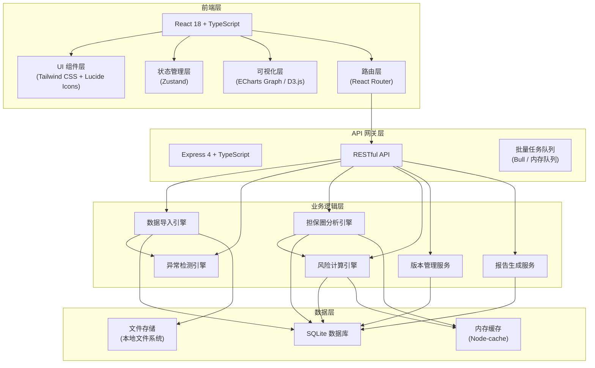
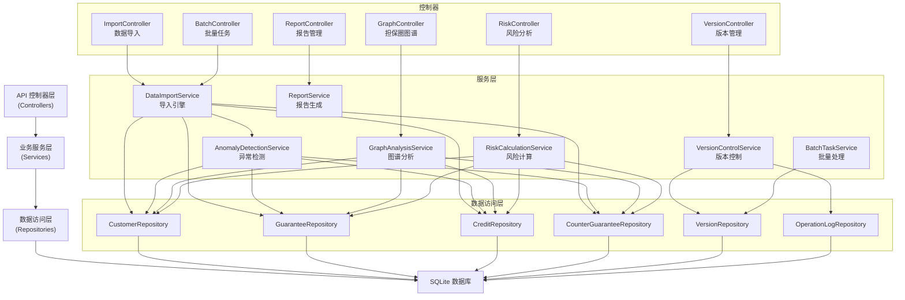
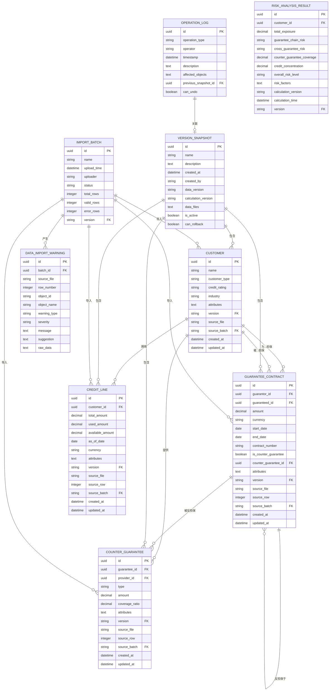

## 1. 架构设计



## 2. 技术描述

- **前端**：React 18 + TypeScript + Tailwind CSS 3 + Vite
- **状态管理**：Zustand（轻量级，支持时间旅行调试便于实现撤回功能）
- **可视化**：ECharts（力导向图）+ D3.js（高级自定义交互）
- **后端**：Express 4 + TypeScript + ESM
- **数据库**：SQLite（零配置，便于部署，适合中小型企业应用）
- **文件处理**：xlsx（Excel 解析）、pdf-lib（PDF 生成）
- **缓存**：node-cache（内存缓存图谱计算结果）
- **初始化工具**：vite-init

## 3. 路由定义

| 路由 | 页面/用途 |
|------|----------|
| `/` | 工作台首页（Dashboard） |
| `/import` | 数据导入中心 |
| `/import/:batchId` | 导入批次详情与校验 |
| `/graph` | 担保圈图谱 |
| `/graph/:customerId` | 指定客户的担保圈分析 |
| `/risk` | 风险分析 |
| `/reports` | 报告中心 |
| `/reports/:reportId` | 报告详情 |
| `/history` | 版本历史与操作管理 |
| `/settings` | 系统设置与口径管理 |

## 4. API 定义

### 4.1 核心类型定义

```typescript
// shared/types.ts

export type FileSourceType = 
  | 'customer'      // 客户关系
  | 'guarantee'     // 担保合同
  | 'credit'        // 授信余额
  | 'counterGuarantee'  // 反担保材料
  | 'approval'      // 审批意见
  | 'exposureReport';  // 暴露报告

export type RiskLevel = 'low' | 'medium' | 'high' | 'critical';
export type NodeType = 'customer' | 'guarantee' | 'credit';
export type RelationType = 'directGuarantee' | 'counterGuarantee' | 'creditLine';

export interface DataSourceFile {
  id: string;
  name: string;
  sourceType: FileSourceType;
  uploadTime: string;
  uploader: string;
  rowCount: number;
  status: 'pending' | 'processing' | 'completed' | 'error';
  errorCount: number;
  warnings: DataImportWarning[];
}

export interface DataImportWarning {
  id: string;
  sourceFile: string;
  rowNumber: number;
  objectId?: string;
  objectName?: string;
  warningType: string;
  severity: 'info' | 'warning' | 'error';
  message: string;
  suggestion: string;
  rawData: Record<string, any>;
}

export interface Customer {
  id: string;
  name: string;
  customerType: 'enterprise' | 'group' | 'individual';
  creditRating: string;
  industry: string;
  attributes: Record<string, any>;
  version: string;
  sourceFile: string;
}

export interface GuaranteeContract {
  id: string;
  guarantorId: string;
  guaranteedId: string;
  amount: number;
  currency: string;
  startDate: string;
  endDate: string;
  contractNumber: string;
  isCounterGuarantee: boolean;
  counterGuaranteeId?: string;
  attributes: Record<string, any>;
  version: string;
  sourceFile: string;
  rowNumber: number;
}

export interface CreditLine {
  id: string;
  customerId: string;
  totalAmount: number;
  usedAmount: number;
  availableAmount: number;
  asOfDate: string;
  currency: string;
  attributes: Record<string, any>;
  version: string;
  sourceFile: string;
  rowNumber: number;
}

export interface CounterGuarantee {
  id: string;
  guaranteeId: string;
  providerId: string;
  type: string;
  amount: number;
  coverageRatio: number;
  attributes: Record<string, any>;
  version: string;
  sourceFile: string;
  rowNumber: number;
}

export interface GraphNode {
  id: string;
  type: NodeType;
  name: string;
  riskLevel: RiskLevel;
  data: Customer | GuaranteeContract | CreditLine;
  x?: number;
  y?: number;
}

export interface GraphEdge {
  id: string;
  source: string;
  target: string;
  relationType: RelationType;
  amount?: number;
  riskLevel: RiskLevel;
}

export interface RiskAnalysisResult {
  customerId: string;
  totalExposure: number;
  guaranteeChainRisk: RiskLevel;
  crossGuaranteeRisk: RiskLevel;
  counterGuaranteeCoverage: number;
  creditConcentration: number;
  overallRiskLevel: RiskLevel;
  riskFactors: RiskFactor[];
  calculationVersion: string;
  calculationTime: string;
}

export interface RiskFactor {
  code: string;
  name: string;
  severity: RiskLevel;
  description: string;
  relatedObjects: string[];
}

export interface VersionSnapshot {
  id: string;
  name: string;
  description: string;
  createdAt: string;
  createdBy: string;
  dataVersion: string;
  calculationVersion: string;
  dataFiles: string[];
  isActive: boolean;
  canRollback: boolean;
}

export interface OperationLog {
  id: string;
  operationType: string;
  operator: string;
  timestamp: string;
  description: string;
  affectedObjects: string[];
  previousSnapshotId?: string;
  canUndo: boolean;
}

export interface BatchTask {
  id: string;
  type: 'import' | 'recalculate' | 'export';
  status: 'pending' | 'running' | 'completed' | 'partial' | 'failed';
  totalCount: number;
  successCount: number;
  failedCount: number;
  progress: number;
  startedAt: string;
  completedAt?: string;
  failedItems: FailedItem[];
}

export interface FailedItem {
  index: number;
  objectId: string;
  objectName: string;
  sourceFile?: string;
  rowNumber?: number;
  errorMessage: string;
  errorCode: string;
  rawData: Record<string, any>;
}
```

### 4.2 API 接口定义

```typescript
// shared/api.ts

// 数据导入相关
export interface ImportRequest {
  files: { name: string; sourceType: FileSourceType; content: string }[];
  createNewVersion: boolean;
  versionName: string;
}

export interface ImportResponse {
  batchId: string;
  taskId: string;
}

export interface ImportPreviewResponse {
  batchId: string;
  totalRows: number;
  validRows: number;
  errorRows: number;
  warnings: DataImportWarning[];
  sampleData: Record<string, any>[];
}

// 担保圈图谱相关
export interface GraphRequest {
  centerCustomerId?: string;
  maxDepth: number;
  minAmount?: number;
  riskLevels?: RiskLevel[];
  version?: string;
}

export interface GraphResponse {
  nodes: GraphNode[];
  edges: GraphEdge[];
  riskSummary: {
    totalCustomers: number;
    totalGuarantees: number;
    highRiskCount: number;
    criticalRiskCount: number;
  };
}

// 风险分析相关
export interface RiskAnalysisRequest {
  customerIds?: string[];
  version?: string;
  batch?: boolean;
}

export interface RiskAnalysisResponse {
  results: RiskAnalysisResult[];
  taskId?: string;
}

// 异常检测相关
export interface AnomalyDetectionRequest {
  batchId: string;
}

export interface AnomalyDetectionResponse {
  anomalies: DataImportWarning[];
  duplicateGuarantees: GuaranteeContract[][];
  dateAnomalies: { type: string; objects: any[]; message: string }[];
  missingCounterGuarantees: { guaranteeId: string; message: string }[];
}

// 版本管理相关
export interface RollbackRequest {
  snapshotId: string;
  reason: string;
}

export interface RollbackResponse {
  success: boolean;
  newSnapshotId: string;
  affectedCount: number;
}

// 报告导出相关
export interface ReportRequest {
  type: 'single' | 'batch';
  customerIds: string[];
  format: 'excel' | 'pdf';
  includeSections: string[];
}

export interface ReportResponse {
  reportId: string;
  downloadUrl: string;
  expiresAt: string;
}

// 批量任务相关
export interface BatchTaskResponse {
  taskId: string;
  status: BatchTask['status'];
  progress: number;
}
```

## 5. 服务端架构图



## 6. 数据模型

### 6.1 数据模型 ER 图



### 6.2 数据定义语言 (DDL)

```sql
-- 版本快照表
CREATE TABLE version_snapshot (
    id TEXT PRIMARY KEY,
    name TEXT NOT NULL,
    description TEXT,
    created_at DATETIME DEFAULT CURRENT_TIMESTAMP,
    created_by TEXT NOT NULL,
    data_version TEXT NOT NULL,
    calculation_version TEXT NOT NULL,
    data_files TEXT,
    is_active INTEGER DEFAULT 1,
    can_rollback INTEGER DEFAULT 1
);

-- 操作日志表
CREATE TABLE operation_log (
    id TEXT PRIMARY KEY,
    operation_type TEXT NOT NULL,
    operator TEXT NOT NULL,
    timestamp DATETIME DEFAULT CURRENT_TIMESTAMP,
    description TEXT NOT NULL,
    affected_objects TEXT,
    previous_snapshot_id TEXT,
    can_undo INTEGER DEFAULT 1,
    FOREIGN KEY (previous_snapshot_id) REFERENCES version_snapshot(id)
);

-- 导入批次表
CREATE TABLE import_batch (
    id TEXT PRIMARY KEY,
    name TEXT NOT NULL,
    upload_time DATETIME DEFAULT CURRENT_TIMESTAMP,
    uploader TEXT NOT NULL,
    status TEXT NOT NULL,
    total_rows INTEGER DEFAULT 0,
    valid_rows INTEGER DEFAULT 0,
    error_rows INTEGER DEFAULT 0,
    version TEXT NOT NULL,
    FOREIGN KEY (version) REFERENCES version_snapshot(id)
);

-- 导入警告表
CREATE TABLE data_import_warning (
    id TEXT PRIMARY KEY,
    batch_id TEXT NOT NULL,
    source_file TEXT NOT NULL,
    row_number INTEGER,
    object_id TEXT,
    object_name TEXT,
    warning_type TEXT NOT NULL,
    severity TEXT NOT NULL,
    message TEXT NOT NULL,
    suggestion TEXT,
    raw_data TEXT,
    FOREIGN KEY (batch_id) REFERENCES import_batch(id)
);

-- 客户表
CREATE TABLE customer (
    id TEXT PRIMARY KEY,
    name TEXT NOT NULL,
    customer_type TEXT NOT NULL,
    credit_rating TEXT,
    industry TEXT,
    attributes TEXT,
    version TEXT NOT NULL,
    source_file TEXT NOT NULL,
    source_batch TEXT NOT NULL,
    created_at DATETIME DEFAULT CURRENT_TIMESTAMP,
    updated_at DATETIME DEFAULT CURRENT_TIMESTAMP,
    FOREIGN KEY (version) REFERENCES version_snapshot(id),
    FOREIGN KEY (source_batch) REFERENCES import_batch(id)
);

-- 担保合同表
CREATE TABLE guarantee_contract (
    id TEXT PRIMARY KEY,
    guarantor_id TEXT NOT NULL,
    guaranteed_id TEXT NOT NULL,
    amount DECIMAL(18,2) NOT NULL,
    currency TEXT NOT NULL DEFAULT 'CNY',
    start_date DATE,
    end_date DATE,
    contract_number TEXT,
    is_counter_guarantee INTEGER DEFAULT 0,
    counter_guarantee_id TEXT,
    attributes TEXT,
    version TEXT NOT NULL,
    source_file TEXT NOT NULL,
    source_row INTEGER,
    source_batch TEXT NOT NULL,
    created_at DATETIME DEFAULT CURRENT_TIMESTAMP,
    updated_at DATETIME DEFAULT CURRENT_TIMESTAMP,
    FOREIGN KEY (guarantor_id) REFERENCES customer(id),
    FOREIGN KEY (guaranteed_id) REFERENCES customer(id),
    FOREIGN KEY (counter_guarantee_id) REFERENCES guarantee_contract(id),
    FOREIGN KEY (version) REFERENCES version_snapshot(id),
    FOREIGN KEY (source_batch) REFERENCES import_batch(id)
);

-- 授信余额表
CREATE TABLE credit_line (
    id TEXT PRIMARY KEY,
    customer_id TEXT NOT NULL,
    total_amount DECIMAL(18,2) NOT NULL,
    used_amount DECIMAL(18,2) DEFAULT 0,
    available_amount DECIMAL(18,2) DEFAULT 0,
    as_of_date DATE NOT NULL,
    currency TEXT NOT NULL DEFAULT 'CNY',
    attributes TEXT,
    version TEXT NOT NULL,
    source_file TEXT NOT NULL,
    source_row INTEGER,
    source_batch TEXT NOT NULL,
    created_at DATETIME DEFAULT CURRENT_TIMESTAMP,
    updated_at DATETIME DEFAULT CURRENT_TIMESTAMP,
    FOREIGN KEY (customer_id) REFERENCES customer(id),
    FOREIGN KEY (version) REFERENCES version_snapshot(id),
    FOREIGN KEY (source_batch) REFERENCES import_batch(id)
);

-- 反担保表
CREATE TABLE counter_guarantee (
    id TEXT PRIMARY KEY,
    guarantee_id TEXT NOT NULL,
    provider_id TEXT NOT NULL,
    type TEXT NOT NULL,
    amount DECIMAL(18,2) NOT NULL,
    coverage_ratio DECIMAL(5,4) DEFAULT 0,
    attributes TEXT,
    version TEXT NOT NULL,
    source_file TEXT NOT NULL,
    source_row INTEGER,
    source_batch TEXT NOT NULL,
    created_at DATETIME DEFAULT CURRENT_TIMESTAMP,
    updated_at DATETIME DEFAULT CURRENT_TIMESTAMP,
    FOREIGN KEY (guarantee_id) REFERENCES guarantee_contract(id),
    FOREIGN KEY (provider_id) REFERENCES customer(id),
    FOREIGN KEY (version) REFERENCES version_snapshot(id),
    FOREIGN KEY (source_batch) REFERENCES import_batch(id)
);

-- 风险分析结果表
CREATE TABLE risk_analysis_result (
    id TEXT PRIMARY KEY,
    customer_id TEXT NOT NULL,
    total_exposure DECIMAL(18,2) DEFAULT 0,
    guarantee_chain_risk TEXT,
    cross_guarantee_risk TEXT,
    counter_guarantee_coverage DECIMAL(5,4) DEFAULT 0,
    credit_concentration DECIMAL(5,4) DEFAULT 0,
    overall_risk_level TEXT NOT NULL,
    risk_factors TEXT,
    calculation_version TEXT NOT NULL,
    calculation_time DATETIME DEFAULT CURRENT_TIMESTAMP,
    version TEXT NOT NULL,
    FOREIGN KEY (customer_id) REFERENCES customer(id),
    FOREIGN KEY (version) REFERENCES version_snapshot(id)
);

-- 索引优化
CREATE INDEX idx_customer_version ON customer(version);
CREATE INDEX idx_guarantee_version ON guarantee_contract(version);
CREATE INDEX idx_guarantee_guarantor ON guarantee_contract(guarantor_id);
CREATE INDEX idx_guarantee_guaranteed ON guarantee_contract(guaranteed_id);
CREATE INDEX idx_credit_version ON credit_line(version);
CREATE INDEX idx_credit_customer ON credit_line(customer_id);
CREATE INDEX idx_counter_guarantee_version ON counter_guarantee(version);
CREATE INDEX idx_risk_version ON risk_analysis_result(version);
CREATE INDEX idx_risk_customer ON risk_analysis_result(customer_id);
CREATE INDEX idx_warning_batch ON data_import_warning(batch_id);
CREATE INDEX idx_version_active ON version_snapshot(is_active);
```

## 7. 核心算法模块

### 7.1 异常检测引擎

| 检测类型 | 算法描述 | 异常输出字段 |
|---------|----------|-------------|
| 互保重复检测 | 对担保合同按 (guarantor_id, guaranteed_id, contract_number) 分组，发现数量 > 1 标记为重复 | sourceFile, rowNumber, objectId, objectName, message, suggestion |
| 余额日期异常 | 检查授信余额日期是否在合理范围内（距当前日期 ± 90天），多份授信日期跨度 > 30天标记 | sourceFile, rowNumber, objectId, objectName, message, suggestion |
| 反担保缺失检测 | 对每笔担保合同检查是否存在对应的反担保记录，金额覆盖度 < 50% 标记 | sourceFile, rowNumber, objectId, objectName, coverageRatio, message, suggestion |
| 循环担保检测 | 使用 DFS 遍历担保关系图，检测长度 >= 3 的环 | cyclePath, totalAmount, message, suggestion |

### 7.2 关系穿透算法

- **深度优先搜索 (DFS)**：从指定客户出发，递归遍历所有关联的担保关系，支持最大深度配置
- **路径记忆化**：缓存已计算的路径避免重复遍历
- **风险传播计算**：根据担保链长度、金额集中度计算路径风险值

### 7.3 风险分层模型

```
风险评分 = 0.3*担保圈复杂度 + 0.25*授信集中度 + 0.25*反担保覆盖度 + 0.2*互保风险系数

风险等级:
- low: 0 <= 评分 < 25
- medium: 25 <= 评分 < 50
- high: 50 <= 评分 < 75
- critical: 75 <= 评分 <= 100
```

### 7.4 授信占用计算

```
某客户总占用 = 直接授信已用金额 + Σ(为他人担保金额 * 风险系数)
风险系数: 直接担保=0.5, 反担保=0.3, 间接担保(N层)=0.5^N
```

## 8. 项目目录结构

```
.
├── src/                          # 前端代码
│   ├── components/               # 公共组件
│   │   ├── common/              # 通用组件（按钮、卡片、表格等）
│   │   ├── graph/               # 图谱相关组件
│   │   ├── import/              # 导入相关组件
│   │   └── risk/                # 风险分析相关组件
│   ├── pages/                   # 页面组件
│   │   ├── Dashboard.tsx
│   │   ├── DataImport.tsx
│   │   ├── ImportBatchDetail.tsx
│   │   ├── GuaranteeGraph.tsx
│   │   ├── RiskAnalysis.tsx
│   │   ├── ReportCenter.tsx
│   │   ├── VersionHistory.tsx
│   │   └── Settings.tsx
│   ├── hooks/                   # 自定义 Hooks
│   │   ├── useGraphData.ts
│   │   ├── useRiskAnalysis.ts
│   │   ├── useImport.ts
│   │   └── useVersionControl.ts
│   ├── store/                   # Zustand 状态管理
│   │   ├── useGraphStore.ts
│   │   ├── useImportStore.ts
│   │   ├── useRiskStore.ts
│   │   └── useVersionStore.ts
│   ├── utils/                   # 工具函数
│   │   ├── graph.ts
│   │   ├── risk.ts
│   │   ├── anomaly.ts
│   │   └── file.ts
│   ├── types/                   # 类型定义
│   ├── api/                     # API 调用封装
│   ├── App.tsx
│   ├── main.tsx
│   └── index.css
├── api/                          # 后端代码
│   ├── src/
│   │   ├── controllers/         # 控制器层
│   │   ├── services/            # 业务服务层
│   │   ├── repositories/        # 数据访问层
│   │   ├── models/              # 数据模型
│   │   ├── middleware/          # 中间件
│   │   ├── utils/               # 工具函数
│   │   │   ├── anomalyDetection.ts
│   │   │   ├── graphAnalysis.ts
│   │   │   ├── riskCalculation.ts
│   │   │   └── versionControl.ts
│   │   ├── config/              # 配置
│   │   ├── db/                  # 数据库初始化
│   │   └── server.ts
│   └── migrations/              # 数据库迁移
├── shared/                       # 前后端共享类型
│   └── types.ts
├── .trae/documents/             # 项目文档
├── vite.config.ts
├── tailwind.config.js
├── tsconfig.json
└── package.json
```

## 9. 关键技术决策

| 决策项 | 选择方案 | 理由 |
|-------|----------|------|
| 前端框架 | React 18 + TypeScript | 生态成熟，类型安全，适合复杂交互应用 |
| 状态管理 | Zustand | 轻量级，API 简洁，支持时间旅行便于实现撤回 |
| 可视化 | ECharts + D3.js | ECharts 力导向图成熟稳定，D3.js 支持高级自定义交互 |
| 后端框架 | Express 4 + TypeScript | 轻量灵活，适合快速开发企业级应用 |
| 数据库 | SQLite | 零配置部署，事务支持完善，适合中小型应用 |
| 版本管理 | 全量快照 + 增量记录 | 确保数据可追溯，支持完整撤回 |
| 异常处理 | 不中断流程 + 详细日志 | 坏数据不打崩系统，精确定位来源文件、行号、对象 |
| 批量处理 | 任务队列 + 进度追踪 | 支持大批量导入和计算，实时反馈进度 |
