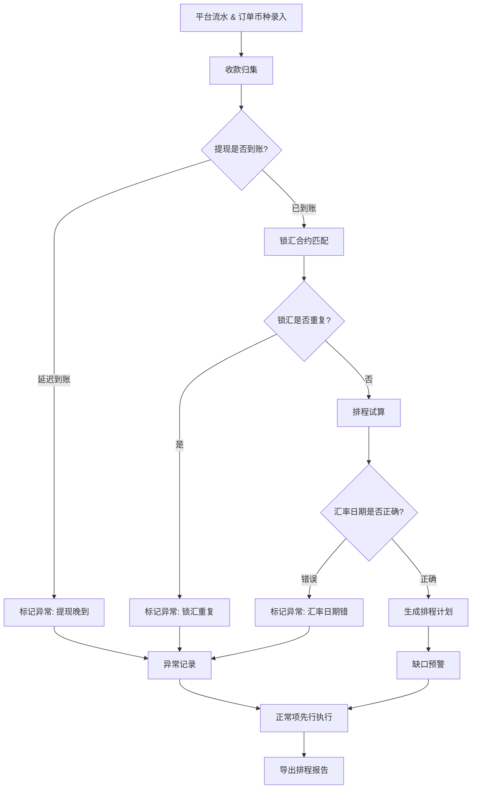

## 1. 产品概述

跨境电商结汇排程分析工具——为跨境电商财务团队提供从收款归集、锁汇匹配、排程试算到缺口预警、报告导出的闭环分析能力。解决订单收款、汇率锁定和平台提现时间冲突导致结汇效率低下的问题，让每笔资金在正确时间以正确汇率完成结汇。

- 目标用户：跨境电商财务运营人员
- 核心价值：将分散的平台流水、订单币种、锁汇合约、提现记录统一到一条业务线上可视化分析，异常不阻断正常流程

## 2. 核心功能

### 2.1 用户角色

| 角色 | 权限 |
|------|------|
| 财务分析师 | 查看所有图表、下钻明细、执行排程试算、导出报告 |
| 财务主管 | 同上 + 审批锁汇匹配结果、确认结汇计划 |

### 2.2 功能模块

1. **收款归集总览页**：平台收款分布、币种结构、提现到账状态、归集进度图表
2. **排程试算工作台页**：锁汇合约匹配、结汇排程时间线、试算结果对比、缺口预警面板
3. **预警与报告页**：异常记录列表、批量处理状态、排程报告生成与导出

### 2.3 页面详情

| 页面 | 模块名称 | 功能描述 |
|------|----------|----------|
| 收款归集总览 | 平台收款分布图 | 按平台(Amazon/Shopee/独立站)展示收款金额柱状图，点击柱体下钻到该平台订单明细 |
| 收款归集总览 | 币种结构环形图 | 展示USD/EUR/GBP/JPY等币种占比，点击扇区下钻到该币种订单列表 |
| 收款归集总览 | 提现到账时间线 | 按日期展示各平台提现申请与实际到账，延迟到账标红，点击查看延迟原因 |
| 收款归集总览 | 归集进度看板 | 待归集/归集中/已归集三栏看板，显示金额与笔数，点击展开明细 |
| 排程试算工作台 | 锁汇合约匹配面板 | 左侧锁汇合约列表(金额/汇率/到期日)，右侧待结汇订单，自动匹配+手动调整，重复锁汇高亮警告 |
| 排程试算工作台 | 结汇排程时间线 | 甘特图样式展示锁汇到期日、提现到账日、结汇执行日，日期冲突自动标红 |
| 排程试算工作台 | 试算结果对比 | 并排展示"按锁汇汇率"vs"按即期汇率"的结汇金额差异，差额用色带标注 |
| 排程试算工作台 | 缺口预警面板 | 未覆盖锁汇的待结汇金额、即将到期未执行的锁汇合约、资金缺口预警 |
| 预警与报告 | 异常记录列表 | 提现晚到/锁汇重复/汇率日期错误三类异常，每条标注原因与影响范围 |
| 预警与报告 | 批量处理状态 | 整批排程执行进度：已完成/跳过(含原因)/待处理，正常项先行完成 |
| 预警与报告 | 排程报告生成 | 按日期范围生成结汇排程报告，含归集汇总、锁汇匹配明细、缺口分析、异常说明 |
| 预警与报告 | 报告导出 | 导出为CSV/PDF格式，报告内容与图表一致 |

## 3. 核心流程

用户进入系统后，首先在"收款归集总览"查看各平台资金到账状态，识别延迟到账的提现；然后进入"排程试算工作台"，系统自动将已到账资金与锁汇合约匹配，用户确认匹配结果后执行排程试算，查看锁汇vs即期汇率差异和资金缺口；最后在"预警与报告"查看异常记录，确认正常项先执行完成，导出排程报告。

**容错原则**：提现晚到、锁汇重复、汇率日期错误三种异常不中断整批排程，正常项先走完，异常项留在记录中并标注原因。

## 4. 用户界面设计

### 4.1 设计风格

- 主色调：深蓝灰(#1a1f2e)背景 + 翠绿(#00d4aa)强调色，金融终端质感
- 辅助色：琥珀色(#f59e0b)用于预警，珊瑚红(#ef4444)用于异常，冰蓝(#38bdf8)用于信息
- 按钮：圆角8px，主按钮翠绿填充，次按钮半透明边框
- 字体：数字使用 JetBrains Mono 等宽字体，正文使用 Noto Sans SC
- 布局：左侧固定导航栏(64px) + 主内容区，数据密集但层次分明
- 图标：线性图标(Phosphor/Lucide风格)，2px描边

### 4.2 页面设计概览

| 页面 | 模块名称 | UI要素 |
|------|----------|--------|
| 收款归集总览 | 顶部KPI卡片 | 4张卡片横排：总待结汇金额/已锁汇金额/未锁汇缺口/异常笔数，数字大字+趋势箭头 |
| 收款归集总览 | 平台收款柱状图 | 分组柱状图，悬停显示金额，点击柱体弹出右侧抽屉显示订单明细表 |
| 收款归集总览 | 币种环形图 | 中心显示总金额，外圈各币种占比，点击扇区弹出该币种订单列表 |
| 收款归集总览 | 提现时间线 | 横轴日期，纵轴平台，圆点表示提现事件，红色圆点=延迟，点击弹出详情 |
| 收款归集总览 | 归集看板 | 三栏卡片：待归集(灰)/归集中(蓝)/已归集(绿)，每栏显示金额+笔数，点击展开明细表 |
| 排程试算工作台 | 锁汇匹配面板 | 上下分栏：上方锁汇合约卡片流(金额/汇率/到期)，下方待结汇订单表格，拖拽连线匹配 |
| 排程试算工作台 | 排程甘特图 | 横轴日期，三行(锁汇到期/提现到账/结汇执行)，色块长度=持续时间，冲突处红色重叠 |
| 排程试算工作台 | 试算对比 | 左右双栏：锁汇结汇额 vs 即期结汇额，底部色带标注差额(绿=锁汇有利/红=锁汇不利) |
| 排程试算工作台 | 缺口预警 | 右侧固定面板，三条预警线：未覆盖金额(红)/即将到期(黄)/可用锁汇(绿)，点击展开详情 |
| 预警与报告 | 异常列表 | 表格：类型图标+描述+影响金额+原因+状态标签，行可展开查看关联订单 |
| 预警与报告 | 批量进度 | 水平进度条 + 三段色(已完成绿/跳过黄/待处理灰)，下方明细表格 |
| 预警与报告 | 报告生成 | 日期选择器 + 预览区 + 导出按钮(CSV/PDF)，预览区显示报告摘要 |

### 4.3 响应式

- 桌面优先设计，最小宽度1280px
- 图表区域支持拖拽调整宽度
- 抽屉式详情面板从右侧滑入，不遮挡主图表

## 5. 演示数据设计

### 5.1 顺利流程（正常闭环）

- Amazon平台3笔USD订单收款，合计$45,000
- 提现申请5月25日，实际到账5月26日（正常）
- 锁汇合约：$45,000 @ 7.12，到期6月15日
- 排程结果：6月10日执行结汇，锁汇汇率7.12 vs 即期7.08，节省¥1,800

### 5.2 边界情况（提现晚到 + 缺口）

- Shopee平台2笔EUR订单，合计€12,000
- 提现申请5月20日，实际到账5月27日（延迟7天）
- 锁汇合约：€8,000 @ 7.85，到期6月5日
- 排程结果：已到账€8,000匹配锁汇正常结汇，€4,000缺口无锁汇覆盖，预警提示

### 5.3 现实例外（锁汇重复 + 汇率日期错）

- 独立站3笔GBP订单，合计£20,000
- 两笔锁汇合约覆盖同一笔£8,000订单（重复锁汇）
- 一笔锁汇合约汇率7.12但签约日期为5月1日，而实际到账5月28日，期间汇率已大幅波动，汇率日期标记错误
- 排程结果：重复锁汇的£8,000标记异常跳过，汇率日期错的£5,000标记异常跳过，剩余£7,000正常排程

## 6. 交互关键规则

1. **图表可下钻**：所有图表的每个数据点/区域点击后必须弹出对应的明细数据表
2. **异常不中断**：批量排程遇到异常时，正常项继续执行，异常项标注原因后跳过
3. **业务线串联**：从平台流水→订单币种→锁汇合约→提现记录→结汇计划→排程报告，同一条数据可追溯
4. **实时预警**：缺口预警面板始终可见，变化时闪烁提示
