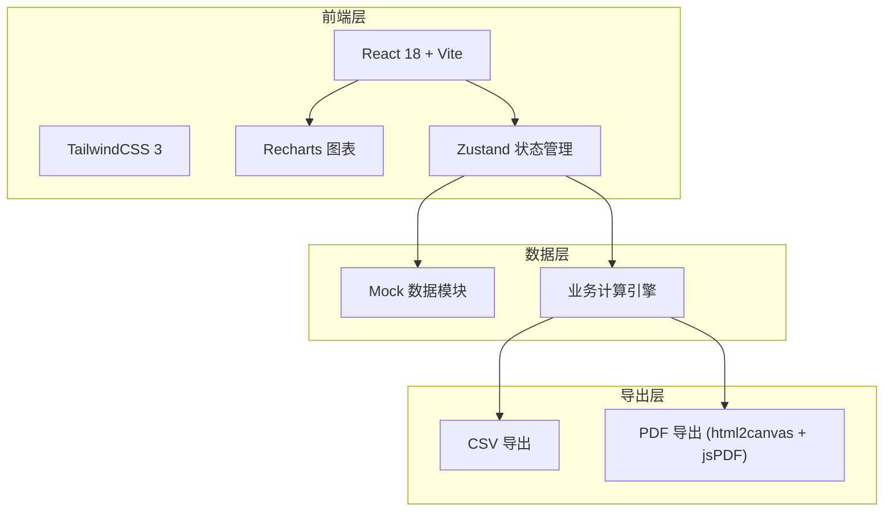
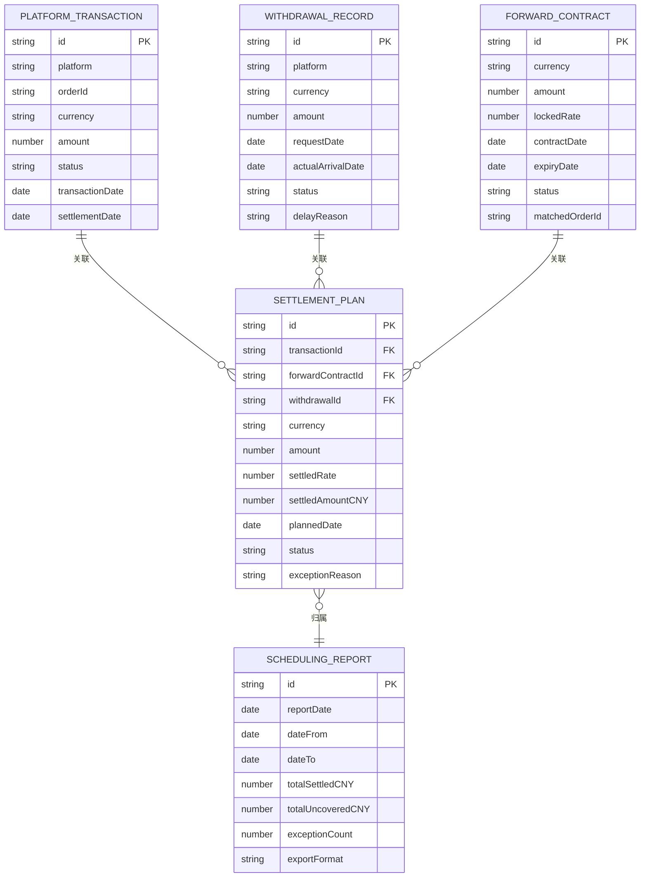

## 1. 架构设计



纯前端架构，无后端依赖。所有业务数据通过 Mock 数据模块提供，业务计算（锁汇匹配、排程试算、缺口计算）在前端完成，报告导出通过浏览器端生成。

## 2. 技术说明

- **前端框架**: React@18 + TypeScript + Vite
- **初始化工具**: Vite (react-ts 模板)
- **样式方案**: TailwindCSS@3
- **图表库**: Recharts (声明式React图表，支持点击事件下钻)
- **状态管理**: Zustand (轻量级，适合中等复杂度应用)
- **图标库**: Lucide React
- **导出**: csv-stringify + jsPDF + html2canvas
- **后端**: 无 (纯前端，Mock数据)
- **数据库**: 无 (内存数据 + localStorage持久化)

## 3. 路由定义

| 路由 | 用途 |
|------|------|
| `/` | 重定向到 `/collection` |
| `/collection` | 收款归集总览页 - 平台收款分布、币种结构、提现状态、归集进度 |
| `/scheduling` | 排程试算工作台页 - 锁汇匹配、排程时间线、试算对比、缺口预警 |
| `/alerts` | 预警与报告页 - 异常记录、批量处理状态、报告生成导出 |

## 4. 数据模型

### 4.1 数据模型定义



### 4.2 数据定义

**平台流水 (PlatformTransaction)**
| 字段 | 类型 | 说明 |
|------|------|------|
| id | string | 唯一标识 |
| platform | string | 平台: Amazon / Shopee / 独立站 |
| orderId | string | 平台订单号 |
| currency | string | 币种: USD / EUR / GBP / JPY |
| amount | number | 金额 |
| status | string | 状态: pending / collected / settled |
| transactionDate | date | 交易日期 |
| settlementDate | date | 结汇日期(可空) |

**提现记录 (WithdrawalRecord)**
| 字段 | 类型 | 说明 |
|------|------|------|
| id | string | 唯一标识 |
| platform | string | 平台 |
| currency | string | 币种 |
| amount | number | 提现金额 |
| requestDate | date | 申请日期 |
| actualArrivalDate | date | 实际到账日期 |
| status | string | 状态: pending / arrived / delayed |
| delayReason | string | 延迟原因(可空) |

**锁汇合约 (ForwardContract)**
| 字段 | 类型 | 说明 |
|------|------|------|
| id | string | 唯一标识 |
| currency | string | 币种 |
| amount | number | 锁定金额 |
| lockedRate | number | 锁定汇率 |
| contractDate | string | 签约日期 |
| expiryDate | string | 到期日期 |
| status | string | 状态: active / matched / expired / duplicate_error / rate_date_error |
| matchedOrderId | string | 匹配的订单ID(可空) |

**结汇计划 (SettlementPlan)**
| 字段 | 类型 | 说明 |
|------|------|------|
| id | string | 唯一标识 |
| transactionId | string | 关联交易ID |
| forwardContractId | string | 关联合约ID(可空) |
| withdrawalId | string | 关联提现ID |
| currency | string | 币种 |
| amount | number | 结汇金额 |
| settledRate | number | 实际/计划结汇汇率 |
| settledAmountCNY | number | 结汇人民币金额 |
| plannedDate | date | 计划结汇日 |
| status | string | 状态: planned / executed / skipped_exception |
| exceptionReason | string | 异常原因(可空) |

**排程报告 (SchedulingReport)**
| 字段 | 类型 | 说明 |
|------|------|------|
| id | string | 唯一标识 |
| reportDate | date | 报告生成日期 |
| dateFrom | date | 数据起始日 |
| dateTo | date | 数据截止日 |
| totalSettledCNY | number | 已结汇总额(CNY) |
| totalUncoveredCNY | number | 未覆盖缺口(CNY) |
| exceptionCount | number | 异常笔数 |
| exportFormat | string | 导出格式 |

## 5. 核心业务计算逻辑

### 5.1 锁汇匹配算法

1. 按币种分组待匹配订单和锁汇合约
2. 优先匹配到期日最近的锁汇合约（避免合约过期浪费）
3. 匹配金额：合约金额 >= 订单金额时全额匹配，否则部分匹配并标记缺口
4. 重复检测：同一笔订单被多个合约匹配时，保留最早签约的合约，其余标记 `duplicate_error`
5. 汇率日期校验：合约签约日与实际到账日差距超过30天且期间汇率波动>2%时，标记 `rate_date_error`

### 5.2 排程试算

1. 已匹配锁汇的订单：结汇汇率 = 锁定汇率
2. 未匹配锁汇的订单：结汇汇率 = 即期汇率（Mock数据）
3. 计算每种方案的CNY金额差异
4. 缺口 = 未覆盖锁汇金额 × 即期汇率 - 已锁汇部分节省金额

### 5.3 容错处理

1. 遇到 `duplicate_error` 或 `rate_date_error` 的计划项，status 设为 `skipped_exception`
2. 正常项 status 设为 `planned` 或 `executed`
3. 异常项的 `exceptionReason` 字段填写具体原因
4. 批量执行时跳过异常项，不中断流程

## 6. 项目目录结构

```
src/
├── components/
│   ├── layout/          # 布局组件(侧边栏、顶栏)
│   ├── charts/          # 图表组件(柱状图、环形图、甘特图)
│   ├── panels/          # 面板组件(KPI卡片、预警面板、匹配面板)
│   ├── tables/          # 表格组件(明细表、异常表)
│   └── shared/          # 通用组件(抽屉、标签、进度条)
├── pages/
│   ├── CollectionPage/  # 收款归集总览
│   ├── SchedulingPage/  # 排程试算工作台
│   └── AlertsPage/      # 预警与报告
├── store/
│   ├── useStore.ts      # Zustand全局状态
│   └── slices/          # 状态分片
├── data/
│   ├── mockData.ts      # Mock演示数据
│   └── types.ts         # TypeScript类型定义
├── engine/
│   ├── matching.ts      # 锁汇匹配引擎
│   ├── scheduling.ts    # 排程试算引擎
│   └── export.ts        # 报告导出引擎
├── App.tsx
└── main.tsx
```
