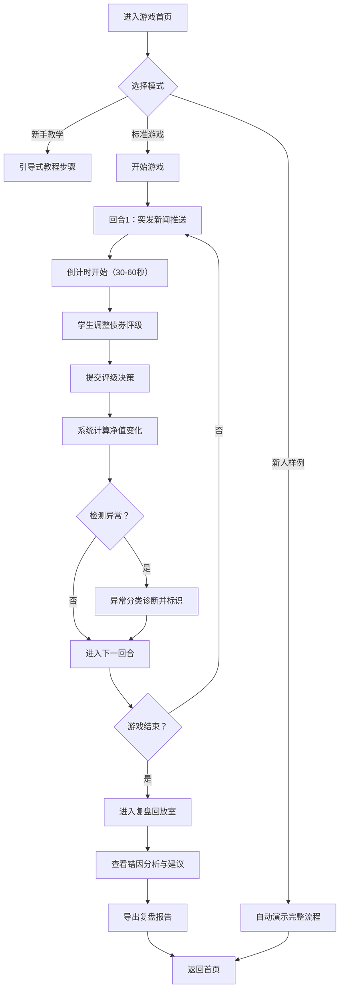

## 1. 产品概述

"债券评级急救室"是一款面向金融专业学生的债券评级决策模拟游戏，通过突发新闻事件驱动学生在时间压力下调整债券评级，实时影响组合净值。产品解决了传统教学中依赖纸质材料难以追踪操作痕迹、异常问题难以分类定位的痛点，同时保留完整的金融规则逻辑。

- **目标用户**：金融课程教师、金融专业学生、新入职债券分析人员
- **核心价值**：在游戏化场景中掌握债券评级逻辑，理解评级决策对组合净值的影响，学会快速定位异常问题根源

---

## 2. 核心 Features

### 2.1 用户角色

| 角色 | 使用方式 | 核心权限 |
|------|----------|----------|
| 学生用户 | 直接进入游戏 | 进行评级操作、查看复盘报告、导出学习记录 |
| 教师用户 | 管理模式登录 | 配置游戏参数、查看全班成绩、导出教学报告 |

### 2.2 功能模块

1. **游戏首页**：模式选择、新人引导、样例流程入口
2. **游戏主界面**：新闻播报区、债券持仓面板、评级操作台、组合净值监控、计时器
3. **异常诊断面板**：异常分类标识（数据问题/规则问题/材料问题）、问题追溯链路
4. **复盘回放室**：操作时间线、关键选择高亮、扣分原因详解、优化建议
5. **报告导出中心**：单局成绩报告、操作痕迹审计、错因分析汇总

### 2.3 页面详情

| 页面名称 | 模块名称 | 功能描述 |
|-----------|-------------|---------------------|
| 游戏首页 | 模式选择区 | 新手教学/标准游戏/自定义难度三种模式 |
| 游戏首页 | 新人引导区 | 一键运行完整样例流程：导入→游戏→报告导出 |
| 游戏首页 | 历史记录 | 最近游戏成绩、最佳成绩展示 |
| 游戏主界面 | 新闻播报区 | 突发新闻轮播、新闻等级标识、倒计时显示 |
| 游戏主界面 | 债券持仓面板 | 5-8只债券的当前评级、仓位、市值、成本展示 |
| 游戏主界面 | 评级操作台 | 评级调整滑块/按钮、调整理由输入、确认提交 |
| 游戏主界面 | 组合监控区 | 实时净值、现金余额、客户信任度、已用时间 |
| 游戏主界面 | 异常警示区 | 三色异常标识（红=数据问题/橙=规则问题/黄=材料问题）、异常详情 |
| 复盘回放室 | 操作时间线 | 每步操作的时间戳、调整前后评级、净值变化 |
| 复盘回放室 | 错因分析 | 错误类型、扣分原因、正确评级逻辑、参考案例 |
| 复盘回放室 | 优化建议 | 针对个人薄弱点的改进建议、相关知识点链接 |
| 报告导出中心 | 报告预览 | 可交互HTML报告预览、关键指标图表 |
| 报告导出中心 | 导出功能 | PDF/Excel/JSON三种格式导出 |

---

## 3. 核心流程

**核心业务规则：**
1. 每个新闻事件限定30-60秒响应时间，超时自动扣分
2. 评级分为7档：AAA/AA/A/BBB/BB/B/CCC，每档对应不同的风险权重
3. 组合净值 = Σ(债券市值 × 风险权重调整系数) + 现金
4. 客户信任度随正确评级提升，随错误/超时评级下降
5. 异常分类规则：
   - 🔴 数据问题：评级倒退（如AAA直接调到BBB）、净值计算不一致
   - 🟠 规则问题：同一新闻重复触发评级调整、评级调整与新闻方向矛盾
   - 🟡 材料问题：必要评级依据未填写、调整理由为空

---

## 4. 用户界面设计

### 4.1 设计风格

采用**急救室/医院主题**的专业游戏化设计：
- **主色调**：深青蓝(#0F2E3D) 代表专业稳重，急救红(#E63946) 代表紧急事件，健康绿(#2A9D8F) 代表正常状态
- **辅助色**：数据问题红(#D62828)、规则问题橙(#F77F00)、材料问题黄(#FCBF49)
- **字体**：标题使用Space Grotesk（现代专业），正文使用Inter（清晰可读）
- **按钮风格**：圆角8px，阴影分层，急救按钮采用脉冲动画
- **布局风格**：仪表盘式卡片布局，关键数据大字号展示，操作区与信息区分明
- **视觉元素**：使用EKG心电图动画、倒计时进度条、状态指示灯增强急救室氛围

### 4.2 页面设计概览

| 页面名称 | 模块名称 | UI Elements |
|-----------|-------------|-------------|
| 游戏首页 | 模式选择区 | 大卡片式选项，hover上浮效果，选中态边框发光 |
| 游戏主界面 | 新闻播报区 | 顶部通栏设计，红色背景闪烁动画，大字号新闻标题 |
| 游戏主界面 | 债券持仓面板 | 表格卡片，评级变化用颜色渐变过渡动画 |
| 游戏主界面 | 评级操作台 | 7档评级按钮矩阵，选中态放大，提交按钮带脉冲效果 |
| 游戏主界面 | 组合监控区 | 仪表盘风格，净值用大号数字，变化箭头带颜色指示 |
| 游戏主界面 | 异常警示区 | 横向滚动警示条，三色图标，点击展开详情 |
| 复盘回放室 | 操作时间线 | 垂直时间轴，关键节点高亮，可点击回放 |
| 复盘回放室 | 错因分析 | 标签页切换，代码块式扣分原因展示 |
| 报告导出中心 | 报告预览 | 类PDF布局，可打印样式，图表可交互 |

### 4.3 响应性

- **桌面优先**：1280px以上为主要设计目标，采用4列网格布局
- **平板适配**：1024px折叠为3列，侧栏变为底部抽屉
- **手机适配**：768px折叠为单列，新闻区固定顶部，操作区底部弹出
- **触控优化**：按钮最小44px，评级按钮支持滑动选择

### 4.4 微交互与动画

1. **新闻到达**：顶部滑入+红色闪烁+警报音效（可关闭）
2. **倒计时**：圆形进度条，最后10秒变红加速闪烁
3. **评级调整**：按钮缩放+颜色渐变过渡
4. **净值变化**：数字滚动动画，上升/下降箭头颜色指示
5. **异常发生**：对应颜色的警示图标弹跳出现，详情面板滑入
6. **页面切换**：淡入淡出+轻微缩放，时间线滑动动画
