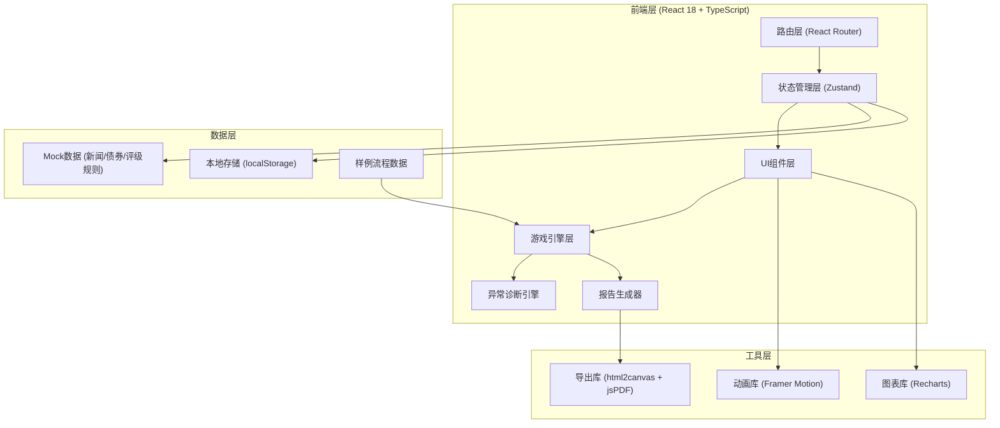
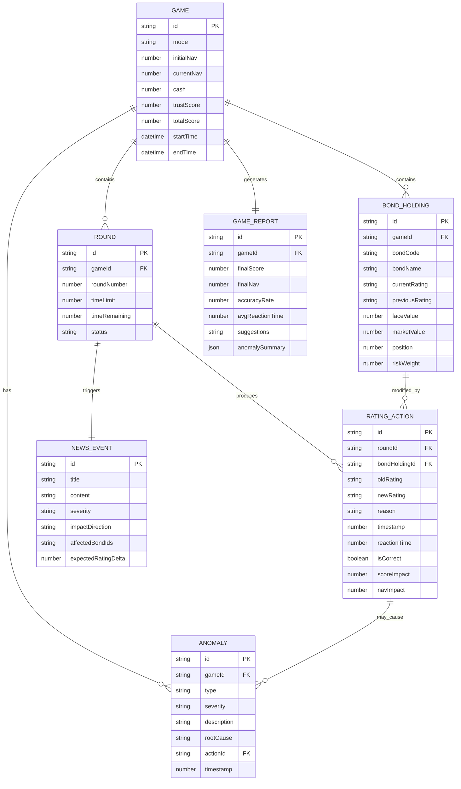

## 1. 架构设计



---

## 2. 技术描述

### 2.1 核心技术栈
- **前端框架**: React 18 + TypeScript
- **构建工具**: Vite 5
- **样式方案**: TailwindCSS 3
- **状态管理**: Zustand 4
- **路由**: React Router 6
- **动画**: Framer Motion 11
- **图表**: Recharts 2
- **导出**: jsPDF + html2canvas + xlsx

### 2.2 技术选型理由
- **Zustand**: 轻量级状态管理，适合游戏状态的快速更新和订阅
- **Framer Motion**: 支持复杂的页面过渡和微交互，满足急救室主题的动画需求
- **Recharts**: 可交互的图表库，用于展示净值曲线和评级分布
- **本地优先**: 无需后端，所有数据存储在localStorage，降低部署复杂度

---

## 3. 目录结构

```
src/
├── assets/                 # 静态资源
│   ├── fonts/             # 字体文件
│   └── icons/             # 图标资源
├── components/            # 通用组件
│   ├── ui/                # 基础UI组件 (Button, Card, etc.)
│   ├── layout/            # 布局组件
│   └── common/            # 业务通用组件
├── pages/                 # 页面组件
│   ├── Home/              # 游戏首页
│   ├── Game/              # 游戏主界面
│   ├── Review/            # 复盘回放室
│   └── Report/            # 报告导出中心
├── store/                 # 状态管理
│   ├── gameStore.ts       # 游戏核心状态
│   └── uiStore.ts         # UI状态
├── engine/                # 业务引擎
│   ├── gameEngine.ts      # 游戏逻辑引擎
│   ├── anomalyEngine.ts   # 异常诊断引擎
│   └── ratingEngine.ts    # 评级计算引擎
├── data/                  # Mock数据
│   ├── bonds.ts           # 债券数据
│   ├── news.ts            # 新闻事件库
│   ├── ratingRules.ts     # 评级规则
│   └── sampleFlow.ts      # 新人样例流程数据
├── types/                 # TypeScript类型定义
│   ├── game.ts            # 游戏相关类型
│   ├── bond.ts            # 债券相关类型
│   └── anomaly.ts         # 异常相关类型
├── utils/                 # 工具函数
│   ├── export.ts          # 导出相关工具
│   ├── calculation.ts     # 计算工具
│   └── format.ts          # 格式化工具
├── hooks/                 # 自定义Hooks
│   ├── useTimer.ts        # 计时器Hook
│   └── useGameFlow.ts     # 游戏流程Hook
└── styles/                # 全局样式
    ├── index.css          # 主样式文件
    └── animations.css     # 动画关键帧
```

---

## 4. 路由定义

| 路由 | 页面 | 用途 |
|-------|------|------|
| `/` | 首页 | 模式选择、新人引导、历史记录 |
| `/game/tutorial` | 新手教学页 | 引导式教程步骤 |
| `/game/play` | 游戏主界面 | 核心游戏玩法 |
| `/game/sample` | 样例演示页 | 自动演示完整流程 |
| `/review` | 复盘回放室 | 操作回放、错因分析 |
| `/report` | 报告导出中心 | 报告预览与导出 |
| `/report/:gameId` | 单局报告页 | 指定游戏的详细报告 |

---

## 5. 核心数据模型

### 5.1 实体关系图



### 5.2 核心常量定义

```typescript
// 评级档位定义
const RATING_LEVELS = [
  { level: 'AAA', score: 7, riskWeight: 0.1, color: '#2A9D8F' },
  { level: 'AA',  score: 6, riskWeight: 0.2, color: '#4CAF50' },
  { level: 'A',   score: 5, riskWeight: 0.35, color: '#8BC34A' },
  { level: 'BBB', score: 4, riskWeight: 0.5, color: '#CDDC39' },
  { level: 'BB',  score: 3, riskWeight: 0.7, color: '#FFC107' },
  { level: 'B',   score: 2, riskWeight: 0.85, color: '#FF9800' },
  { level: 'CCC', score: 1, riskWeight: 1.0, color: '#E63946' },
] as const;

// 异常类型定义
const ANOMALY_TYPES = {
  DATA_ISSUE: {
    code: 'DATA_ISSUE',
    label: '数据问题',
    color: '#D62828',
    icon: '🔴',
    examples: [
      '评级倒退超过3档',
      '净值计算不一致',
      '债券市值异常波动',
    ],
  },
  RULE_ISSUE: {
    code: 'RULE_ISSUE',
    label: '规则问题',
    color: '#F77F00',
    icon: '🟠',
    examples: [
      '同一新闻重复触发评级',
      '评级调整与新闻方向矛盾',
      '违反评级调整间隔规则',
    ],
  },
  MATERIAL_ISSUE: {
    code: 'MATERIAL_ISSUE',
    label: '材料问题',
    color: '#FCBF49',
    icon: '🟡',
    examples: [
      '调整理由为空',
      '必要评级依据未填写',
      '缺少关键参考材料',
    ],
  },
} as const;

// 评分规则
const SCORING_RULES = {
  CORRECT_RATING: 100,
  NEAR_MISS: 50,
  WRONG_DIRECTION: -50,
  TIMEOUT_PENALTY: -30,
  ANOMALY_PENALTY: -20,
  TRUST_BOOST: 5,
  TRUST_PENALTY: -10,
} as const;
```

---

## 6. 核心模块设计

### 6.1 游戏引擎 (gameEngine.ts)

```typescript
class GameEngine {
  // 初始化游戏
  initGame(mode: GameMode): GameState;
  
  // 开始新回合
  startRound(gameId: string): RoundState;
  
  // 提交评级调整
  submitRating(
    gameId: string,
    bondId: string,
    newRating: RatingLevel,
    reason: string
  ): RatingResult;
  
  // 计算回合结果
  calculateRoundResult(gameId: string): RoundResult;
  
  // 结束游戏
  endGame(gameId: string): GameResult;
  
  // 验证评级调整合法性
  validateRatingChange(
    oldRating: RatingLevel,
    newRating: RatingLevel,
    news: NewsEvent
  ): ValidationResult;
}
```

### 6.2 异常诊断引擎 (anomalyEngine.ts)

```typescript
class AnomalyEngine {
  // 检测评级调整中的异常
  detectAnomalies(
    action: RatingAction,
    gameState: GameState,
    news: NewsEvent
  ): Anomaly[];
  
  // 诊断异常根因
  diagnoseRootCause(anomaly: Anomaly): RootCauseAnalysis;
  
  // 分类异常类型
  classifyAnomaly(anomaly: Anomaly): AnomalyType;
  
  // 生成异常修复建议
  generateFixSuggestion(anomaly: Anomaly): string;
  
  // 检查评级倒退
  checkRatingRegression(
    oldRating: RatingLevel,
    newRating: RatingLevel
  ): boolean;
  
  // 检查规则冲突
  checkRuleConflict(
    action: RatingAction,
    previousActions: RatingAction[]
  ): boolean;
  
  // 检查材料完整性
  checkMaterialCompleteness(action: RatingAction): boolean;
}
```

### 6.3 评级计算引擎 (ratingEngine.ts)

```typescript
class RatingEngine {
  // 计算债券风险权重
  calculateRiskWeight(rating: RatingLevel): number;
  
  // 计算债券调整后市值
  calculateAdjustedValue(
    marketValue: number,
    riskWeight: number
  ): number;
  
  // 计算组合净值
  calculatePortfolioNAV(
    holdings: BondHolding[],
    cash: number
  ): number;
  
  // 评估评级调整正确性
  evaluateRatingAccuracy(
    oldRating: RatingLevel,
    newRating: RatingLevel,
    expectedDelta: number,
    newsImpact: string
  ): AccuracyResult;
  
  // 计算评分
  calculateScore(
    accuracy: AccuracyResult,
    reactionTime: number,
    hasAnomaly: boolean
  ): number;
}
```

---

## 7. 状态管理设计

### 7.1 Game Store (gameStore.ts)

```typescript
interface GameStore {
  // 游戏状态
  currentGame: Game | null;
  currentRound: Round | null;
  currentNews: NewsEvent | null;
  bondHoldings: BondHolding[];
  ratingActions: RatingAction[];
  anomalies: Anomaly[];
  
  // 计时器状态
  timeRemaining: number;
  isTimerRunning: boolean;
  
  // 游戏操作
  startGame: (mode: GameMode) => void;
  submitRating: (bondId: string, rating: string, reason: string) => void;
  nextRound: () => void;
  endGame: () => void;
  
  // 计时器操作
  startTimer: () => void;
  pauseTimer: () => void;
  resetTimer: () => void;
}
```

---

## 8. 新人样例流程设计

### 8.1 样例数据 (sampleFlow.ts)

```typescript
// 预定义完整的样例游戏流程
const SAMPLE_GAME_FLOW = {
  initialPortfolio: [
    /* 5只初始债券持仓 */
  ],
  rounds: [
    {
      news: {/* 第一条新闻 */},
      expectedActions: [/* 期望的评级调整 */],
      anomalies: [/* 预设的异常情况 */],
      navChange: 2.5,
    },
    // 3-5个回合的完整流程
  ],
  finalReport: {
    score: 780,
    accuracy: 75,
    suggestions: [...],
  },
};

// 自动播放控制
class SampleFlowPlayer {
  async playFullDemo(): Promise<void>;
  async playStep(stepIndex: number): Promise<void>;
  pause(): void;
  resume(): void;
  reset(): void;
}
```

---

## 9. 导出功能设计

### 9.1 报告生成器 (reportGenerator.ts)

```typescript
class ReportGenerator {
  // 生成HTML报告
  generateHTMLReport(gameId: string): string;
  
  // 导出PDF
  exportPDF(gameId: string): Promise<void>;
  
  // 导出Excel
  exportExcel(gameId: string): Promise<void>;
  
  // 导出JSON（包含完整操作痕迹）
  exportJSON(gameId: string): string;
  
  // 生成审计日志
  generateAuditLog(gameId: string): AuditLogEntry[];
}
```

---

## 10. 性能优化策略

1. **状态更新防抖**：净值计算、异常检测等耗时操作使用requestIdleCallback
2. **动画优化**：使用transform和opacity属性，避免layout thrashing
3. **虚拟滚动**：历史记录和长列表使用虚拟滚动
4. **懒加载**：非关键页面组件使用React.lazy
5. **内存管理**：游戏结束后及时清理大型数据对象
