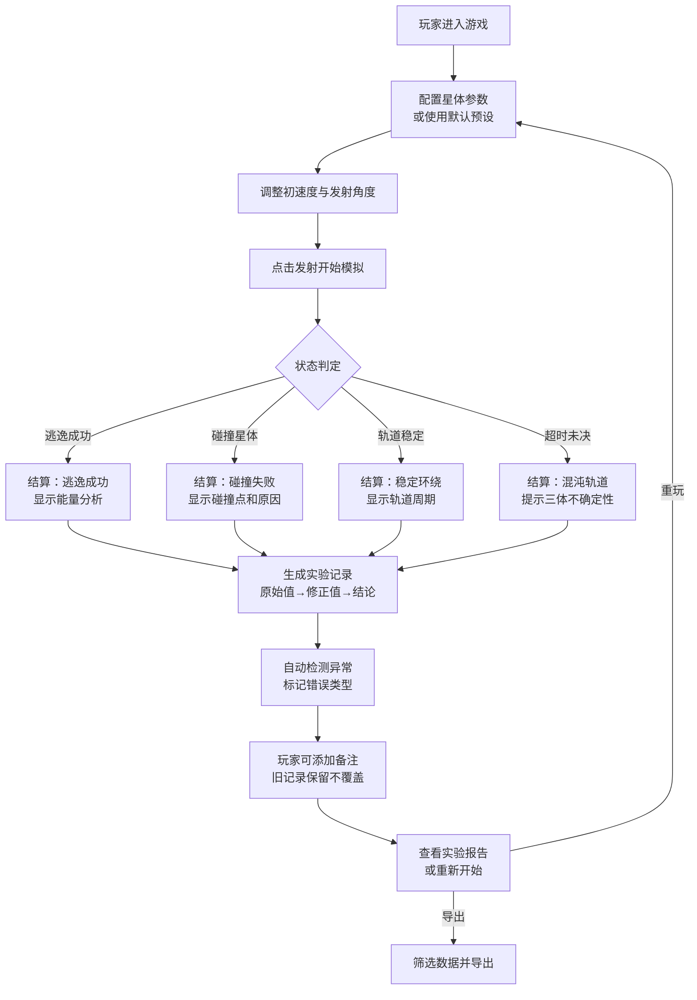

## 1. 产品概述

"三体引力弹珠台"是一款面向物理爱好者和学生的教育类物理模拟游戏。玩家通过调整弹珠的初始速度和角度，在三颗星体的引力场中发射弹珠，观察弹珠轨道是否能稳定环绕或成功逃逸。游戏融合了真实的牛顿引力物理模拟、严谨的实验记录系统和可视化的能量分析，让玩家在游戏中直观理解三体问题的混沌特性。

- 核心目标：通过互动游戏化方式讲解天体力学和引力知识
- 目标用户：物理社成员、学生、科学爱好者
- 产品价值：将抽象的物理概念转化为可交互的游戏体验，培养科学思维和实验记录习惯

## 2. 核心功能

### 2.1 功能模块

1. **主游戏界面**：三体引力模拟画布、轨迹实时绘制、能量条显示
2. **控制面板**：初速度调节、角度调节、引力参数设置、星体配置
3. **实验报告系统**：实验记录台账、原始值/修正值/结论分离、错误标记
4. **游戏流程控制**：开始、暂停、重开、失败判定、结算展示
5. **数据分析**：轨迹回放、能量变化曲线、逃逸判定分析
6. **数据导出**：CSV/JSON格式导出、筛选查询、备注管理

### 2.2 页面详情

| 页面名称 | 模块名称 | 功能描述 |
|-----------|-------------|---------------------|
| 主游戏页 | 引力模拟画布 | Canvas实时渲染三体运动、弹珠轨迹、碰撞检测 |
| 主游戏页 | 发射控制面板 | 初速度滑块、角度调节器、发射按钮、参数预设 |
| 主游戏页 | 能量监测条 | 动能、势能、总能量实时显示，逃逸能量阈值标记 |
| 主游戏页 | 游戏状态栏 | 时间计数、状态指示（就绪/运行/暂停/失败/成功） |
| 实验报告页 | 实验记录列表 | 按时间顺序展示所有实验，支持筛选和搜索 |
| 实验报告页 | 实验详情面板 | 原始参数、修正参数、最终结论三段式展示 |
| 实验报告页 | 错误标记系统 | 引力方向错误、速度溢出、碰撞漏判标记与说明 |
| 实验报告页 | 备注编辑 | 支持添加/修改备注，历史版本不覆盖 |
| 数据导出页 | 数据筛选 | 按结果类型、错误类型、时间范围筛选记录 |
| 数据导出页 | 导出功能 | CSV/JSON格式导出，保留所有标记和元数据 |

## 3. 核心流程

玩家在每次发射前可调节引力常数、星体质量等参数。发射后系统实时计算引力并绘制轨迹，同时监测能量变化。结算时系统会自动标记计算过程中的异常（如数值溢出、引力方向错误等），生成完整的实验记录。玩家可随时添加备注，系统采用版本化存储，确保历史结论不会被覆盖。

## 4. 用户界面设计

### 4.1 设计风格

**复古物理实验室风格**，模拟80年代科研仪器的CRT显示器美学：
- 主色调：深灰底色 `#1a1a2e`，荧光绿 `#00ff88`，警示橙 `#ff6b35`，数据蓝 `#4fc3f7`
- 字体：等宽字体 `JetBrains Mono` 搭配科技感显示字体 `Orbitron`
- 视觉效果：扫描线纹理、CRT畸变、荧光辉光、像素化渲染
- 按钮风格：方形倒角按钮，按压凹陷效果，状态指示灯
- 图标：线性科技风格图标，状态用不同颜色LED指示灯表示

**核心交互原则**：
- 所有参数调节实时反馈到画布预览
- 错误状态用醒目颜色+文字说明双重提示
- 数据输入区与模拟显示区清晰分区
- 关键操作（发射、重置）有二次确认机制

### 4.2 页面设计概览

| 页面名称 | 模块名称 | UI元素 |
|-----------|-------------|-------------|
| 主游戏页 | 引力模拟画布 | 700x500 Canvas，星空背景，三体彩色光球，弹珠拖尾轨迹，逃逸边界虚线 |
| 主游戏页 | 控制面板 | 滑块组件带数字输入框，角度圆盘调节器，发射按钮带倒计时 |
| 主游戏页 | 能量条 | 三色分段进度条，阈值虚线标记，实时数值显示 |
| 主游戏页 | 状态栏 | LED状态指示灯，时间计数器，FPS显示 |
| 实验报告页 | 记录列表 | 斑马纹表格，状态标签，错误标记徽章，展开/折叠动画 |
| 实验报告页 | 详情面板 | 三段式布局（原始值/修正值/结论），不同边框颜色区分，时间戳水印 |
| 数据导出页 | 筛选面板 | 多选标签组，日期范围选择器，搜索框 |
| 数据导出页 | 导出预览 | 可滚动数据表格，导出格式选择按钮 |

### 4.3 响应式设计

采用桌面端优先设计，针对不同屏幕尺寸自适应：
- 桌面端（≥1280px）：三栏布局，左侧参数面板、中间画布、右侧能量与报告
- 平板端（768-1279px）：上下布局，上半部分画布，下半部分可切换的参数/报告面板
- 移动端（<768px）：单列布局，画布自适应宽度，控制面板折叠为可展开抽屉

所有触控操作区域不小于48x48px，滑块支持触摸拖动。

### 4.4 动效设计

- 页面加载：控制元素从底部滑入，画布渐显带扫描线动画
- 发射瞬间：按钮闪烁，能量条脉动，弹珠拖尾从透明渐显
- 碰撞/逃逸：画布边缘闪光，结算面板弹性滑入
- 错误标记：徽章抖动动画，展开时背景色渐变高亮
- 数据导出：进度条模拟扫描效果，完成后图标旋转确认
