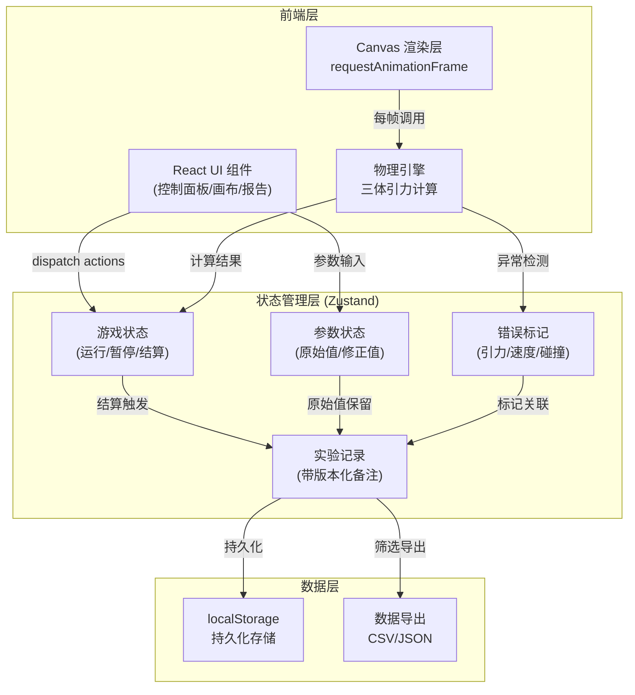
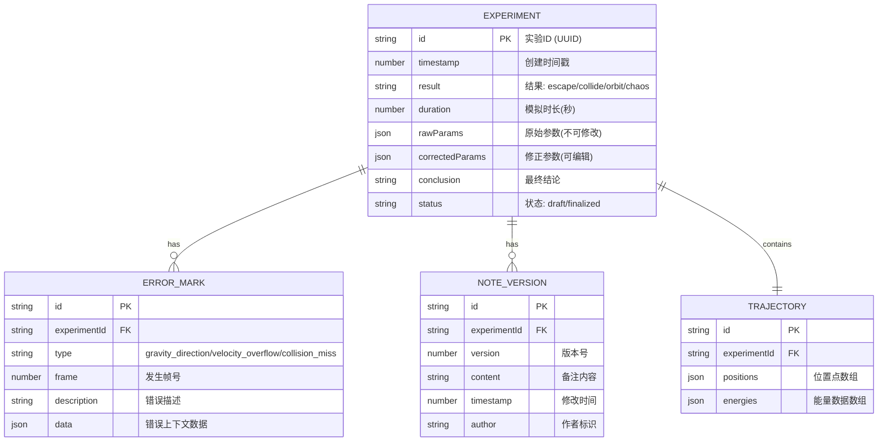

## 1. 架构设计



架构采用分层设计：物理引擎独立封装确保计算准确性，状态管理层分离游戏状态、参数、记录和错误标记，UI层仅负责展示和用户交互。所有实验记录通过版本化机制存储，确保修改备注时旧数据不被覆盖。

## 2. 技术描述

- **前端框架**：React@18 + TypeScript + Vite@5
- **样式方案**：TailwindCSS@3 + CSS变量（主题系统）
- **状态管理**：Zustand@4（轻量化，支持时间旅行调试）
- **路由**：React Router DOM@6（单页应用，Hash模式）
- **图标**：Lucide React
- **物理计算**：原生Canvas 2D API，自主实现RK4积分器
- **数据持久化**：localStorage + IndexedDB（大容量记录存储）
- **构建工具**：Vite，按需导入，生产构建启用gzip压缩

**核心技术选型理由**：
1. 自主实现物理引擎而非使用第三方库，确保引力计算过程可追溯、可标记错误
2. Zustand相比Redux更轻量，适合物理模拟这类高频状态更新场景
3. Canvas 2D相比WebGL足够实现2000+轨迹点的渲染，开发效率更高

## 3. 路由定义

| 路由 | 页面组件 | 用途 |
|-------|---------|-------|
| `/` | `GamePage` | 主游戏页面：引力模拟、参数控制、能量显示 |
| `/reports` | `ReportsPage` | 实验报告列表与详情查看 |
| `/export` | `ExportPage` | 数据筛选与导出 |
| `*` | `NotFoundPage` | 404页面，返回首页按钮 |

## 4. 数据模型

### 4.1 实体关系图



### 4.2 核心类型定义

```typescript
// 星体配置
interface Body {
  id: string;
  x: number;
  y: number;
  vx: number;
  vy: number;
  mass: number;
  radius: number;
  color: string;
}

// 弹珠状态
interface Marble {
  x: number;
  y: number;
  vx: number;
  vy: number;
  radius: number;
  trail: { x: number; y: number }[];
}

// 物理参数
interface PhysicsParams {
  gravitationalConstant: number;  // 引力常数 G
  timeStep: number;               // 时间步长
  damping: number;                // 阻尼系数
  escapeThreshold: number;        // 逃逸能量阈值
}

// 能量数据
interface EnergyState {
  kinetic: number;     // 动能
  potential: number;   // 势能
  total: number;       // 总能量
}

// 错误标记类型
type ErrorType = 'gravity_direction' | 'velocity_overflow' | 'collision_miss';

interface ErrorMark {
  id: string;
  type: ErrorType;
  frame: number;
  timestamp: number;
  description: string;
  data: Record<string, unknown>;
}

// 实验记录 - 三段式数据结构
interface ExperimentRecord {
  id: string;
  createdAt: number;
  updatedAt: number;
  
  // 原始值 - 发射时的参数，永不修改
  raw: {
    initialVelocity: { vx: number; vy: number };
    initialPosition: { x: number; y: number };
    bodies: Body[];
    physicsParams: PhysicsParams;
    launchAngle: number;
    launchSpeed: number;
  };
  
  // 修正值 - 玩家/系统可修改的参数
  corrected: {
    physicsParams: PhysicsParams;
    notes: string;
  };
  
  // 最终结论
  conclusion: {
    result: 'escape' | 'collide' | 'orbit' | 'chaos' | 'timeout';
    duration: number;
    finalEnergy: EnergyState;
    collisionBodyId?: string;
    orbitPeriod?: number;
    escapeDistance?: number;
    errorMarks: ErrorMark[];
    summary: string;
  };
  
  // 版本化备注 - 历史记录永不覆盖
  noteVersions: {
    version: number;
    content: string;
    timestamp: number;
  }[];
  
  // 轨迹数据
  trajectory: {
    positions: { x: number; y: number }[];
    energies: EnergyState[];
    timestamps: number[];
  };
}

// 游戏状态
type GameStatus = 'idle' | 'ready' | 'running' | 'paused' | 'settled';

interface GameState {
  status: GameStatus;
  bodies: Body[];
  marble: Marble;
  physicsParams: PhysicsParams;
  launchAngle: number;
  launchSpeed: number;
  energyHistory: EnergyState[];
  currentFrame: number;
  simulationTime: number;
  errorMarks: ErrorMark[];
}
```

## 5. 目录结构

```
src/
├── components/
│   ├── game/
│   │   ├── SimulationCanvas.tsx    # 引力模拟画布
│   │   ├── ControlPanel.tsx        # 发射控制面板
│   │   ├── EnergyBar.tsx           # 能量条组件
│   │   ├── StatusBar.tsx           # 状态栏
│   │   └── SettlementModal.tsx     # 结算弹窗
│   ├── reports/
│   │   ├── RecordList.tsx          # 记录列表
│   │   ├── RecordDetail.tsx        # 记录详情（三段式）
│   │   ├── ErrorBadge.tsx          # 错误标记徽章
│   │   └── NoteEditor.tsx          # 备注编辑器（版本化）
│   ├── export/
│   │   ├── FilterPanel.tsx         # 筛选面板
│   │   └── ExportPreview.tsx       # 导出预览
│   └── common/
│       ├── SliderInput.tsx         # 滑块+数字输入
│       ├── AngleDial.tsx           # 角度调节器
│       └── LedIndicator.tsx        # LED状态灯
├── hooks/
│   ├── usePhysicsEngine.ts         # 物理引擎Hook
│   ├── useGameLoop.ts              # 游戏循环Hook
│   ├── useExperimentRecord.ts      # 实验记录Hook
│   └── useErrorDetection.ts        # 错误检测Hook
├── store/
│   ├── useGameStore.ts             # 游戏状态
│   ├── useParamStore.ts            # 参数状态
│   └── useRecordStore.ts           # 记录状态
├── utils/
│   ├── physics/
│   │   ├── gravity.ts              # 引力计算
│   │   ├── integrator.ts           # RK4积分器
│   │   └── energy.ts               # 能量计算
│   ├── export/
│   │   ├── csv.ts                  # CSV导出
│   │   └── json.ts                 # JSON导出
│   └── storage/
│       ├── indexedDB.ts            # IndexedDB操作
│       └── versioned.ts            # 版本化存储
├── types/
│   └── index.ts                    # 类型定义
├── pages/
│   ├── GamePage.tsx
│   ├── ReportsPage.tsx
│   ├── ExportPage.tsx
│   └── NotFoundPage.tsx
├── App.tsx
├── main.tsx
└── index.css
```

## 6. 核心算法说明

### 6.1 三体引力计算（RK4积分器）

使用四阶龙格-库塔方法进行数值积分，确保引力计算的精度和稳定性：

```
k1 = dt * f(t, y)
k2 = dt * f(t + dt/2, y + k1/2)
k3 = dt * f(t + dt/2, y + k2/2)
k4 = dt * f(t + dt, y + k3)
y_new = y + (k1 + 2*k2 + 2*k3 + k4) / 6
```

### 6.2 错误检测机制

1. **引力方向错误**：检测计算出的引力向量是否指向星体（点积<0表示方向错误）
2. **速度溢出**：检测速度是否超过光速的1/100（模拟参数的合理上限），或出现NaN/Infinity
3. **碰撞漏判**：检测弹珠与星体距离小于半径和，但未触发碰撞事件

### 6.3 版本化备注存储

每次修改备注时新增版本记录，而非覆盖原有内容：
```
noteVersions.push({
  version: currentVersion + 1,
  content: newContent,
  timestamp: Date.now()
})
```

### 6.4 逃逸判定

基于能量守恒：总能量 > 0 表示弹珠具有足够动能逃逸引力场。同时检测弹珠与系统质心的距离是否超过逃逸边界。
