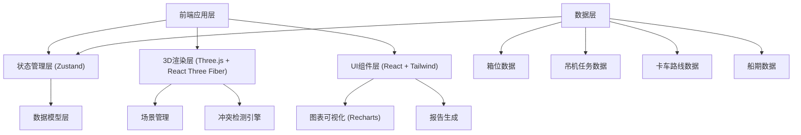
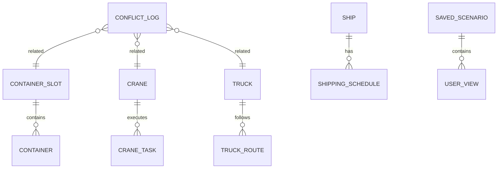

# 港口集装箱堆场沙盘 - 技术架构文档

## 1. 架构设计



## 2. 技术说明

- **前端框架**: React@18 + TypeScript + Vite
- **3D渲染**: Three.js + @react-three/fiber + @react-three/drei
- **状态管理**: Zustand
- **样式方案**: TailwindCSS@3
- **图表库**: Recharts
- **图标库**: Lucide React
- **报告导出**: jsPDF + html2canvas
- **数据持久化**: LocalStorage (方案保存)

## 3. 路由定义

| 路由 | 用途 |
|-------|---------|
| / | 3D堆场沙盘主页面 |
| /replay | 任务回放页面 |
| /reports | 报告管理页面 |

## 4. 数据模型

### 4.1 数据模型定义



### 4.2 核心类型定义

```typescript
// 箱位
interface ContainerSlot {
  id: string;
  position: { x: number; y: number; z: number };
  size: '20ft' | '40ft';
  status: 'empty' | 'occupied' | 'reserved';
  container?: Container;
  conflicts: Conflict[];
}

// 集装箱
interface Container {
  id: string;
  number: string;
  type: 'dry' | 'reefer' | 'hazardous';
  weight: number;
  arrivalTime: Date;
  departureTime: Date;
}

// 吊机
interface Crane {
  id: string;
  name: string;
  position: { x: number; y: number; z: number };
  status: 'idle' | 'working' | 'maintenance';
  currentTask?: CraneTask;
}

// 吊机任务
interface CraneTask {
  id: string;
  craneId: string;
  type: 'load' | 'unload' | 'move';
  sourceSlot?: string;
  targetSlot?: string;
  startTime: Date;
  endTime: Date;
  priority: number;
}

// 卡车
interface Truck {
  id: string;
  plateNumber: string;
  position: { x: number; y: number; z: number };
  status: 'waiting' | 'moving' | 'loading' | 'unloading';
  currentRoute?: TruckRoute;
}

// 卡车路线
interface TruckRoute {
  id: string;
  truckId: string;
  waypoints: { x: number; y: number; z: number; timestamp: Date }[];
  startTime: Date;
  endTime: Date;
}

// 冲突
interface Conflict {
  id: string;
  type: 'slot_overlap' | 'crane_collision' | 'route_blockage' | 'port_congestion';
  severity: 'warning' | 'critical';
  description: string;
  affectedObjects: string[];
  timestamp: Date;
  dataSource: string[];
}

// 保存方案
interface SavedScenario {
  id: string;
  name: string;
  description: string;
  createdAt: Date;
  cameraPosition: { x: number; y: number; z: number };
  filters: FilterState;
  selectedObjects: string[];
  screenshot?: string;
}
```

## 5. 目录结构

```
src/
├── components/
│   ├── 3d/
│   │   ├── YardScene.tsx
│   │   ├── ContainerSlot3D.tsx
│   │   ├── Crane3D.tsx
│   │   ├── Truck3D.tsx
│   │   └── RouteLine.tsx
│   ├── ui/
│   │   ├── SidePanel.tsx
│   │   ├── Timeline.tsx
│   │   ├── FilterPanel.tsx
│   │   ├── ConflictList.tsx
│   │   └── ObjectDetails.tsx
│   └── charts/
│       ├── UtilizationChart.tsx
│       └── ConflictChart.tsx
├── hooks/
│   ├── useConflictDetection.ts
│   ├── useTimeline.ts
│   └── useScenario.ts
├── store/
│   ├── useYardStore.ts
│   └── useUILayoutStore.ts
├── types/
│   └── index.ts
├── utils/
│   ├── conflictDetector.ts
│   ├── dataMerger.ts
│   └── reportGenerator.ts
├── pages/
│   ├── YardPage.tsx
│   ├── ReplayPage.tsx
│   └── ReportsPage.tsx
└── data/
    └── mockData.ts
```

## 6. 核心算法模块

### 6.1 冲突检测引擎
- **箱位重叠检测**: 空间碰撞检测算法，检查集装箱位置是否重叠
- **吊机冲突检测**: 作业时间窗口重叠检测 + 工作范围空间检测
- **路线堵塞检测**: 卡车路线交叉点时间窗口分析
- **数据来源追踪**: 每个冲突记录关联原始数据文件来源

### 6.2 数据合并策略
- 多源数据增量更新机制
- 按时间戳优先级保留最新数据
- 数据来源记录与可追溯性
- 防止旧数据覆盖新数据的保护机制

### 6.3 回放引擎
- 基于时间轴的状态插值计算
- 关键帧动画系统
- 事件标记与跳转
