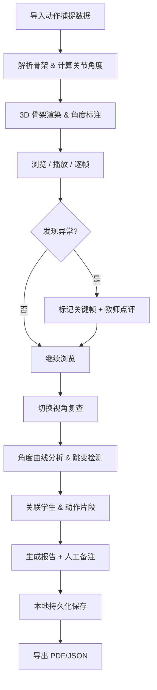

## 1. 产品概述

人体动作关节角课堂——面向体育教师的 3D 骨架动作分析工具。将学生动作捕捉数据渲染为可交互的 3D 骨架，实时测量并标注膝盖、髋部等关节角度，帮助教师精准定位不稳定动作环节。所有骨架点、关节角、动作片段、学生名单、教师点评、课堂报告及人工备注均可本地持久化，第二天打开继续处理。

- 目标用户：中小学体育教师、运动康复师
- 核心价值：用可视化关节角度替代肉眼经验判断，数据可追溯、可导出、可跨日续读

## 2. 核心功能

### 2.1 用户角色

| 角色 | 使用方式 | 核心权限 |
|------|----------|----------|
| 体育教师 | 本地打开即用 | 导入数据、标注关节角、点评、导出报告 |

### 2.2 功能模块

1. **课堂主界面**：3D 骨架渲染、关节角度标注、视角切换、时间轴控制
2. **角度分析面板**：关节角度时序曲线、角度跳变检测、关键帧标注
3. **学生管理**：学生名单、动作片段关联、教师点评
4. **课堂报告**：汇总报告、人工备注、导出

### 2.3 页面详情

| 页面名称 | 模块名称 | 功能描述 |
|----------|----------|----------|
| 课堂主界面 | 3D 骨架视窗 | 加载动作捕捉 JSON/CSV，渲染 3D 骨架，支持旋转/缩放/平移，标注关节角度数值 |
| 课堂主界面 | 视角控制 | 预设视角（正面/侧面/俯视/自由），视角切换后骨架与角度标注同步 |
| 课堂主界面 | 时间轴 | 播放/暂停/逐帧，拖拽定位帧，标记关键帧 |
| 课堂主界面 | 关节角度标注 | 实时显示选中关节的角度值，用弧线可视化角度范围 |
| 角度分析面板 | 角度曲线图 | 展示选中关节的角度-时间曲线，多关节可叠加对比 |
| 角度分析面板 | 跳变检测 | 自动标记角度突变帧（阈值可调），高亮异常区间 |
| 角度分析面板 | 关键帧列表 | 列出所有手动/自动关键帧，点击跳转，可附加文字标注 |
| 学生管理 | 学生名单 | 增删改学生，关联动作片段 |
| 学生管理 | 动作片段 | 按学生分组展示动作片段，支持帧范围裁剪，防覆盖确认 |
| 学生管理 | 教师点评 | 针对片段或帧添加文字/语音点评，与帧位置绑定 |
| 课堂报告 | 报告汇总 | 自动生成角度统计、异常次数、关键帧截图 |
| 课堂报告 | 人工备注 | 教师追加备注，备注与报告段落关联 |
| 课堂报告 | 导出 | 导出 PDF/JSON 报告，包含骨架图、角度曲线截图、备注全文 |

## 3. 核心流程

1. 教师导入动作捕捉数据（JSON 格式，含帧序列与关节点坐标）
2. 系统解析并渲染 3D 骨架，自动计算关节角度
3. 教师播放/逐帧浏览，观察角度标注与弧线
4. 发现异常帧时添加关键帧标注或教师点评
5. 切换视角复查，确认骨架与角度数据一致
6. 在角度分析面板查看时序曲线，定位跳变
7. 为学生关联动作片段，撰写点评
8. 生成课堂报告，添加人工备注
9. 保存所有数据至本地存储，下次打开可继续

## 4. 用户界面设计

### 4.1 设计风格

- 主色调：深青色（#0D9488）+ 暖橙色（#F97316）作为警示/强调色
- 辅助色：深灰底（#111827）+ 中灰面板（#1F2937）
- 骨架渲染色：关节点用青色，骨骼线用白色，角度弧线用橙色，异常高亮用红色
- 按钮风格：圆角（8px），填充式主按钮，幽灵式次按钮
- 字体：JetBrains Mono 用于数值，Noto Sans SC 用于中文正文
- 布局：左侧 3D 视窗占主体（60%），右侧分析面板（40%），底部时间轴

### 4.2 页面设计概览

| 页面名称 | 模块名称 | UI 元素 |
|----------|----------|----------|
| 课堂主界面 | 3D 骨架视窗 | 深色背景 3D 画布，关节点为发光球体，骨骼为圆柱，角度弧线标注，右侧视角切换按钮组 |
| 课堂主界面 | 时间轴 | 底部轨道条，播放/暂停按钮，帧号显示，关键帧标记点，拖拽滑块 |
| 课堂主界面 | 关节角度标注 | 悬浮标签显示角度值，点击关节弹出详细角度面板 |
| 角度分析面板 | 角度曲线图 | SVG 折线图，横轴帧号，纵轴角度，多曲线叠加，异常区间红色底色 |
| 角度分析面板 | 跳变检测 | 曲线上的红色竖线标记，悬停显示跳变幅度 |
| 角度分析面板 | 关键帧列表 | 可滚动列表，每行显示帧号+标注文字+跳转按钮 |
| 学生管理 | 学生名单 | 左侧列表，选中学生在右侧展示关联片段 |
| 学生管理 | 教师点评 | 片段下方评论框，时间戳 + 文字内容 |
| 课堂报告 | 报告汇总 | 卡片式布局，统计数字 + 小图 + 备注区域 |
| 课堂报告 | 导出 | 导出按钮，格式选择（PDF/JSON），进度提示 |

### 4.3 响应式设计

- 桌面优先设计，最小宽度 1280px
- 大屏（≥1920px）：3D 视窗可扩展至 70%，分析面板 30%
- 中屏（1280-1920px）：3D 视窗 60%，分析面板 40%
- 不适配移动端（3D 交互需要精确鼠标操作）

### 4.4 3D 场景指引

- 环境：深色中性背景，网格地面辅助空间感
- 灯光：环境光 + 方向光，确保关节点清晰可见
- 相机：透视相机，FOV 50°，支持 OrbitControls 旋转/缩放
- 构图：骨架居中，关节角度弧线始终面向相机
- 交互：点击关节选中并高亮，拖拽旋转视角，滚轮缩放
- 后处理：关节点发光效果（Bloom），提升视觉辨识度

## 5. 数据持久化与一致性

### 5.1 保存内容

- 骨架点坐标序列（原始数据）
- 关节角度计算结果（派生数据，可重算）
- 动作片段（帧范围 + 关联学生 ID）
- 学生名单
- 教师点评（帧位置 + 文字）
- 课堂报告人工备注（段落关联 + 文字）
- 关键帧标注（帧号 + 标注文字 + 来源）
- 应用状态（当前视角、选中关节、播放位置）

### 5.2 错误处理口径

| 异常类型 | 检测方式 | 处理方式 |
|----------|----------|----------|
| 关节点错连 | 骨骼长度突变超 2σ | 标记为可疑帧，用上一帧插值，日志记录 |
| 角度跳变 | 帧间角度差 > 阈值（默认 15°） | 曲线标红，自动插入关键帧，不修改原始数据 |
| 片段覆盖 | 保存时帧范围与已有片段重叠 | 弹出确认对话框，选择覆盖/保留两者/取消 |

### 5.3 视角切换一致性保证

视角切换时同步更新：3D 骨架朝向、角度弧线朝向、角度数值标签朝向；角度曲线图不随视角变化（始终为时间序列）；关键帧标注在 3D 视窗和曲线图同步高亮；点评与帧位置绑定，不受视角影响；报告导出时以当前视角截图 + 全视角汇总。
