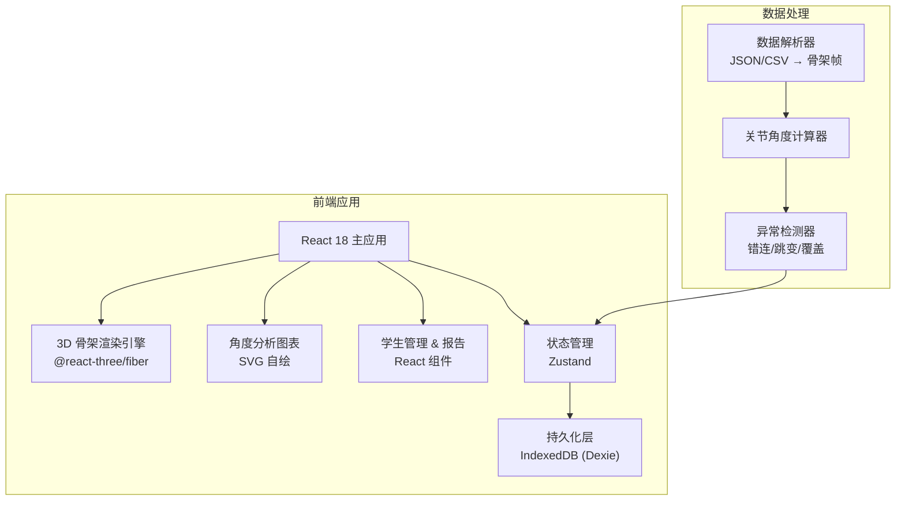
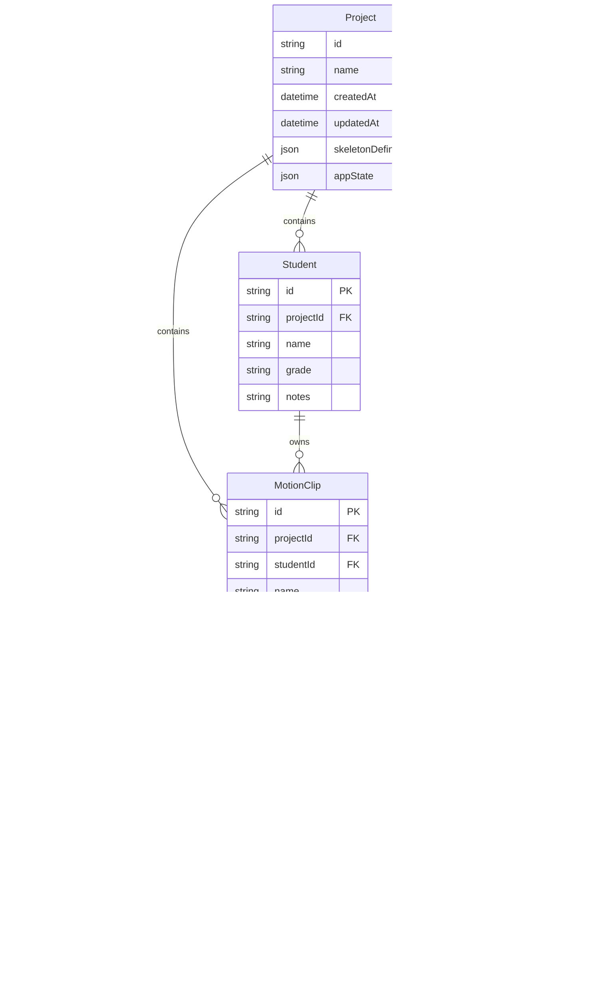

## 1. 架构设计



## 2. 技术说明

- 前端：React@18 + Tailwind CSS@3 + Vite
- 初始化工具：Vite (react-ts 模板)
- 3D 渲染：three@0.170 + @react-three/fiber@8 + @react-three/drei@9 + @react-three/postprocessing@2
- 状态管理：Zustand@5 (含 persist middleware)
- 本地持久化：Dexie@4 (IndexedDB 封装)
- 图表：SVG 自绘折线图 (无需第三方图表库，减少体积)
- 后端：无（纯前端，所有数据本地存储）
- 数据库：IndexedDB（通过 Dexie 操作）

## 3. 路由定义

| 路由 | 用途 |
|------|------|
| / | 课堂主界面：3D 骨架视窗 + 时间轴 + 关节角度标注 |
| /analysis | 角度分析面板：角度曲线 + 跳变检测 + 关键帧列表 |
| /students | 学生管理：名单 + 动作片段 + 教师点评 |
| /report | 课堂报告：汇总 + 人工备注 + 导出 |

## 4. API 定义

无后端 API。所有数据通过本地 IndexedDB 读写。

### 4.1 数据导入格式

```typescript
interface MotionData {
  frames: Frame[]
  fps: number
  skeletonDefinition: SkeletonDefinition
}

interface Frame {
  frameIndex: number
  timestamp: number
  joints: Record<string, [number, number, number]>
}

interface SkeletonDefinition {
  joints: string[]
  bones: [string, string][]
  angleJoints: AngleJointDef[]
}

interface AngleJointDef {
  name: string
  center: string
  from: string
  to: string
  label: string
}
```

## 5. 数据模型

### 5.1 数据模型定义



### 5.2 数据定义语言（IndexedDB Schema via Dexie）

```typescript
import Dexie, { Table } from 'dexie'

class MotionClassroomDB extends Dexie {
  projects!: Table<Project>
  students!: Table<Student>
  motionClips!: Table<MotionClip>
  keyframes!: Table<Keyframe>
  comments!: Table<Comment>
  angleSnapshots!: Table<AngleSnapshot>
  reports!: Table<Report>
  manualNotes!: Table<ManualNote>

  constructor() {
    super('MotionClassroomDB')
    this.version(1).stores({
      projects: 'id, name, updatedAt',
      students: 'id, projectId, name',
      motionClips: 'id, projectId, studentId, name',
      keyframes: 'id, clipId, frameIndex',
      comments: 'id, clipId, frameIndex',
      angleSnapshots: 'id, clipId, frameIndex, jointName',
      reports: 'id, projectId',
      manualNotes: 'id, reportId, section',
    })
  }
}
```

## 6. 异常处理机制

### 6.1 关节点错连

- **检测**：每帧检查每根骨骼长度，与该骨骼历史均值比较，偏差超 2σ 标记为可疑
- **处理**：可疑帧的关节点用上一帧对应点插值替代显示，原始数据不修改，anomalyLog 记录帧号与关节名
- **口径稳定性**：阈值固定为 2σ，插值算法为线性，不因运行次数变化

### 6.2 角度跳变

- **检测**：相邻帧同一关节角度差超过阈值（默认 15°，可调）
- **处理**：曲线图标红竖线，自动插入 source='auto' 的关键帧，原始角度数据保留
- **口径稳定性**：阈值持久化到 project.appState，修改需显式操作

### 6.3 片段覆盖

- **检测**：保存 MotionClip 时检查帧范围 [startFrame, endFrame] 与同 student 下其他 clip 是否重叠
- **处理**：弹出确认对话框，三个选项：覆盖旧片段 / 保留两者 / 取消
- **口径稳定性**：始终弹出确认，不自动覆盖

## 7. 视角切换一致性方案

| 数据/视图 | 视角切换时行为 |
|-----------|---------------|
| 3D 骨架 | 相机位置/朝向变化，骨架坐标不变 |
| 角度弧线 | 始终 Billboard 面向相机 |
| 角度数值标签 | 始终 Billboard 面向相机 |
| 角度曲线图 | 不受视角影响，始终为时间序列 |
| 关键帧标注 | 3D 视窗中位置跟随关节，曲线图中位置不变 |
| 教师点评 | 与帧位置绑定，不受视角影响 |
| 报告导出 | 导出当前视角截图 + 正/侧/俯三视角汇总截图 |

## 8. 本地持久化方案

- **主要存储**：IndexedDB（Dexie），存储所有结构化数据
- **应用状态**：Zustand persist middleware，存储当前视角、选中关节、播放位置等运行时状态到 localStorage
- **导入数据**：首次导入后写入 IndexedDB，后续直接从 IndexedDB 读取
- **导出格式**：PDF（html2canvas + jsPDF）和 JSON（完整数据导出，可用于备份/迁移）

## 9. 关键技术决策

| 决策项 | 选择 | 理由 |
|--------|------|------|
| 3D 框架 | @react-three/fiber | React 生态集成好，支持声明式 3D |
| 角度曲线 | SVG 自绘 | 轻量可控，无额外依赖 |
| 持久化 | IndexedDB (Dexie) | 支持大量帧数据存储，查询灵活 |
| 状态管理 | Zustand | 轻量，persist middleware 适配本地持久化 |
| 路由 | React Router v6 | SPA 路由，无需服务端 |
| PDF 导出 | html2canvas + jsPDF | 纯前端方案，无需服务端 |
