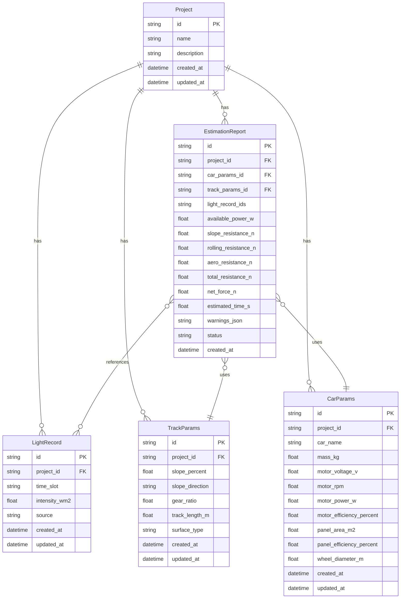

## 1. 架构设计

```mermaid
flowchart TD
    subgraph "前端层"
        "React 18 + Vite" --- "Tailwind CSS"
        "React 18 + Vite" --- "Zustand 状态管理"
        "React 18 + Vite" --- "React Router"
    end
    subgraph "后端层"
        "Express 4 + TypeScript" --- "REST API"
    end
    subgraph "数据层"
        "SQLite (better-sqlite3)" --- "光照记录表"
        "SQLite (better-sqlite3)" --- "赛道参数表"
        "SQLite (better-sqlite3)" --- "小车参数表"
        "SQLite (better-sqlite3)" --- "估算报告表"
        "SQLite (better-sqlite3)" --- "追溯链表"
    end
    "前端层" -->|HTTP/JSON| "后端层"
    "后端层" -->|SQL| "数据层"
```

## 2. 技术说明
- 前端：React@18 + Tailwind CSS@3 + Vite + Zustand
- 初始化工具：vite-init (react-express-ts 模板)
- 后端：Express@4 + TypeScript (ESM)
- 数据库：SQLite (better-sqlite3)，数据持久化到文件，重启不丢失
- 状态管理：Zustand 管理前端UI状态，业务数据全部走后端API持久化

## 3. 路由定义
| 路由 | 用途 |
|------|------|
| `/` | 仪表盘 - 项目概览与预警 |
| `/light-records` | 光照记录管理 |
| `/track-params` | 赛道参数（坡度+齿轮比） |
| `/car-params` | 小车参数（质量+电机） |
| `/estimation` | 估算报告 - 功率/阻力/时间/对比/导出 |

## 4. API 定义

### 4.1 光照记录
```typescript
interface LightRecord {
  id: string;
  project_id: string;
  time_slot: string;
  intensity_wm2: number;
  source: string;
  created_at: string;
  updated_at: string;
}

// GET /api/light-records?project_id=xxx
// POST /api/light-records
// PUT /api/light-records/:id
// DELETE /api/light-records/:id
```

### 4.2 赛道参数
```typescript
interface TrackParams {
  id: string;
  project_id: string;
  slope_percent: number;
  slope_direction: "uphill" | "downhill" | "flat";
  gear_ratio: number;
  track_length_m: number;
  surface_type: string;
  created_at: string;
  updated_at: string;
}

// GET /api/track-params?project_id=xxx
// POST /api/track-params
// PUT /api/track-params/:id
// DELETE /api/track-params/:id
```

### 4.3 小车参数
```typescript
interface CarParams {
  id: string;
  project_id: string;
  car_name: string;
  mass_kg: number;
  motor_voltage_v: number;
  motor_rpm: number;
  motor_power_w: number;
  motor_efficiency_percent: number;
  panel_area_m2: number;
  panel_efficiency_percent: number;
  wheel_diameter_m: number;
  created_at: string;
  updated_at: string;
}

// GET /api/car-params?project_id=xxx
// POST /api/car-params
// PUT /api/car-params/:id
// DELETE /api/car-params/:id
```

### 4.4 估算报告
```typescript
interface EstimationReport {
  id: string;
  project_id: string;
  car_params_id: string;
  track_params_id: string;
  light_record_ids: string[];
  available_power_w: number;
  slope_resistance_n: number;
  rolling_resistance_n: number;
  aero_resistance_n: number;
  total_resistance_n: number;
  net_force_n: number;
  estimated_time_s: number;
  warnings: EstimationWarning[];
  status: "confirmed" | "pending";
  created_at: string;
}

interface EstimationWarning {
  type: "light_gap" | "slope_direction_reversed" | "gear_ratio_out_of_range" | "power_insufficient";
  message: string;
  business_impact: string;
  source_ids: string[];
}

// POST /api/estimations  (运行估算)
// GET /api/estimations?project_id=xxx
// GET /api/estimations/:id/trace  (获取追溯链)
// PUT /api/estimations/:id/confirm  (确认记录)
// GET /api/estimations/:id/export  (导出CSV)
// POST /api/estimations/compare  (参数对比)
```

### 4.5 项目
```typescript
interface Project {
  id: string;
  name: string;
  description: string;
  created_at: string;
  updated_at: string;
}

// GET /api/projects
// POST /api/projects
// GET /api/projects/:id
```

## 5. 数据模型

### 5.1 数据模型定义



### 5.2 数据定义语言

```sql
CREATE TABLE projects (
    id TEXT PRIMARY KEY,
    name TEXT NOT NULL,
    description TEXT DEFAULT '',
    created_at TEXT DEFAULT (datetime('now')),
    updated_at TEXT DEFAULT (datetime('now'))
);

CREATE TABLE light_records (
    id TEXT PRIMARY KEY,
    project_id TEXT NOT NULL REFERENCES projects(id),
    time_slot TEXT NOT NULL,
    intensity_wm2 REAL NOT NULL,
    source TEXT DEFAULT 'manual',
    created_at TEXT DEFAULT (datetime('now')),
    updated_at TEXT DEFAULT (datetime('now'))
);

CREATE TABLE track_params (
    id TEXT PRIMARY KEY,
    project_id TEXT NOT NULL REFERENCES projects(id),
    slope_percent REAL NOT NULL DEFAULT 0,
    slope_direction TEXT NOT NULL CHECK(slope_direction IN ('uphill','downhill','flat')),
    gear_ratio REAL NOT NULL DEFAULT 1,
    track_length_m REAL NOT NULL DEFAULT 10,
    surface_type TEXT DEFAULT 'smooth',
    created_at TEXT DEFAULT (datetime('now')),
    updated_at TEXT DEFAULT (datetime('now'))
);

CREATE TABLE car_params (
    id TEXT PRIMARY KEY,
    project_id TEXT NOT NULL REFERENCES projects(id),
    car_name TEXT NOT NULL DEFAULT '默认小车',
    mass_kg REAL NOT NULL DEFAULT 0.5,
    motor_voltage_v REAL NOT NULL DEFAULT 6,
    motor_rpm REAL NOT NULL DEFAULT 3000,
    motor_power_w REAL NOT NULL DEFAULT 2,
    motor_efficiency_percent REAL NOT NULL DEFAULT 60,
    panel_area_m2 REAL NOT NULL DEFAULT 0.03,
    panel_efficiency_percent REAL NOT NULL DEFAULT 20,
    wheel_diameter_m REAL NOT NULL DEFAULT 0.06,
    created_at TEXT DEFAULT (datetime('now')),
    updated_at TEXT DEFAULT (datetime('now'))
);

CREATE TABLE estimation_reports (
    id TEXT PRIMARY KEY,
    project_id TEXT NOT NULL REFERENCES projects(id),
    car_params_id TEXT NOT NULL REFERENCES car_params(id),
    track_params_id TEXT NOT NULL REFERENCES track_params(id),
    light_record_ids TEXT NOT NULL DEFAULT '[]',
    available_power_w REAL NOT NULL DEFAULT 0,
    slope_resistance_n REAL NOT NULL DEFAULT 0,
    rolling_resistance_n REAL NOT NULL DEFAULT 0,
    aero_resistance_n REAL NOT NULL DEFAULT 0,
    total_resistance_n REAL NOT NULL DEFAULT 0,
    net_force_n REAL NOT NULL DEFAULT 0,
    estimated_time_s REAL NOT NULL DEFAULT 0,
    warnings_json TEXT NOT NULL DEFAULT '[]',
    status TEXT NOT NULL DEFAULT 'pending' CHECK(status IN ('confirmed','pending')),
    created_at TEXT DEFAULT (datetime('now'))
);

CREATE INDEX idx_light_records_project ON light_records(project_id);
CREATE INDEX idx_track_params_project ON track_params(project_id);
CREATE INDEX idx_car_params_project ON car_params(project_id);
CREATE INDEX idx_estimation_project ON estimation_reports(project_id);
CREATE INDEX idx_estimation_status ON estimation_reports(status);
```

### 5.3 初始样例数据

植入一条"容易出错"的边界样例项目，用于验证工具在非顺畅场景下的表现：
- 光照强度仅 50 W/m²（远低于典型值 800-1000）
- 坡度方向设为"上坡"但坡度值 15%（过大）
- 齿轮比 12（越界，正常范围 0.5-10）
- 小车质量 2kg（偏重）
- 电机效率仅 30%

此样例应触发所有预警：光照缺口、坡度方向反、齿轮比越界、功率不足，并产生明确的业务影响描述。
