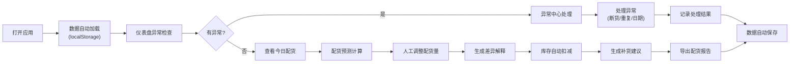

## 1. 产品概述

巡演周边库存配货工具是专为乐队巡演团队设计的实战型库存管理系统，解决非标准化数据处理、异常情况智能识别、配货决策辅助等核心问题。系统能够处理包含临时列、合并单元格、人工改名的杂乱表格，自动识别尺码断货、库存重复、城市日期错误等关键异常，并提供完整的差异解释和补货建议。

- 核心价值：让巡演工作人员无需技术背景就能高效处理复杂的周边库存配货
- 目标用户：乐队巡演经理、周边负责人、物料管理员

## 2. 核心功能

### 2.1 用户角色

| 角色 | 注册方式 | 核心权限 |
|------|----------|----------|
| 巡演管理员 | 本地使用 | 数据导入、配货管理、报告导出、系统设置 |

### 2.2 功能模块

1. **数据仪表盘**：今日概览、异常预警、库存状态、销量趋势
2. **城市日程管理**：巡演城市列表、日期校验、场次状态追踪
3. **库存中心**：商品列表、尺码明细、重复项检测、库存调整
4. **配货预测**：智能计算、销量参考、异常标注、补货建议
5. **历史销量**：数据查询、趋势分析、对比报表
6. **补货记录**：补货申请、状态追踪、入库确认
7. **报告中心**：配货报告、差异解释、异常汇总、导出功能
8. **异常处理中心**：问题分类、处理建议、批量修复

### 2.3 页面详情

| 页面名称 | 模块名称 | 功能描述 |
|-----------|-------------|---------------------|
| 数据仪表盘 | 今日概览 | 展示当前场次、待处理异常、库存预警、今日销量目标 |
| 数据仪表盘 | 异常预警卡片 | 尺码断货、库存重复、日期错误三类异常高亮展示，点击跳转详情 |
| 数据仪表盘 | 库存状态面板 | 分类展示T恤、唱片等品类库存概况，支持快捷查看断码情况 |
| 城市日程 | 巡演时间表 | 日历视图展示巡演城市，支持日期校验、冲突检测、状态标记 |
| 城市日程 | 城市详情面板 | 单场销量历史、配货记录、异常记录、备注信息 |
| 库存中心 | 商品列表 | 支持多格式导入、模糊匹配、合并单元格解析、临时列自动识别 |
| 库存中心 | 尺码矩阵 | T恤尺码分布热力图、断码预警、库存重复项高亮 |
| 配货预测 | 智能计算 | 基于历史销量、城市规模、场次顺序计算建议配货量 |
| 配货预测 | 差异解释 | 系统建议vs人工调整的差异对比，支持备注原因 |
| 配货预测 | 补货建议 | 自动生成补货清单，包含规格、数量、紧急程度 |
| 历史销量 | 数据查询 | 按城市、商品、时间维度筛选，支持空值/重复项统计 |
| 补货记录 | 状态追踪 | 补货申请→已下单→已入库流程管理，支持异常标记 |
| 报告中心 | 报告导出 | 生成配货报告、差异说明、异常汇总，支持Excel/PDF导出 |
| 异常中心 | 问题分类 | 尺码断货、库存重复、日期错误、空值数据分类展示 |
| 异常中心 | 批量处理 | 支持批量确认、批量修复、导出异常清单 |

## 3. 核心流程

## 4. 用户界面设计

### 4.1 设计风格

- **主色调**：深黑色 (#121212) 背景 + 荧光红 (#FF2D55) 强调色，体现摇滚/独立乐队的反叛精神
- **辅助色**：荧光绿 (#30D158) 表示正常、琥珀橙 (#FF9F0A) 表示警告、荧光红 (#FF2D55) 表示严重异常
- **按钮风格**：方角、粗边框、悬停时荧光色发光效果
- **字体**：标题使用 "Space Grotesk"，正文使用 "Inter"，数字使用等宽字体 "JetBrains Mono"
- **布局风格**：模块化卡片布局，信息密度适中，重要数据使用大字号突出
- **视觉效果**：暗黑工业风，带有细微噪点纹理、霓虹边框、故障艺术风格的异常提示

### 4.2 页面设计概述

| 页面名称 | 模块名称 | UI元素 |
|-----------|-------------|-------------|
| 数据仪表盘 | 异常预警卡片 | 霓虹边框、脉冲动画、大字号数字、图标闪烁效果 |
| 数据仪表盘 | 库存状态面板 | 网格布局、进度条、尺码热力图、悬停详情弹出 |
| 城市日程 | 巡演时间表 | 时间线布局、日期校验标记、城市标签、状态徽章 |
| 库存中心 | 尺码矩阵 | 表格布局、重复项斜纹背景、空值灰显、断货红色高亮 |
| 配货预测 | 差异解释 | 左右对比布局、差值箭头、颜色编码、备注输入框 |
| 异常中心 | 问题列表 | 分类标签、严重程度指示、处理按钮、批量操作栏 |

### 4.3 响应式

- 桌面端优先设计 (1440px+)
- 平板适配 (768px-1439px)：侧边栏收起、卡片自动换行
- 移动端适配 (375px-767px)：垂直堆叠布局、简化表格、触摸优化按钮

### 4.4 交互动效

- 页面加载：元素从上到下渐入，带轻微位移动画
- 异常提示：呼吸灯效果 + 细微抖动
- 数据更新：数字滚动动画
- 卡片悬停：轻微上浮 + 边框发光
- 按钮点击：按压反馈 + 颜色瞬间加深
