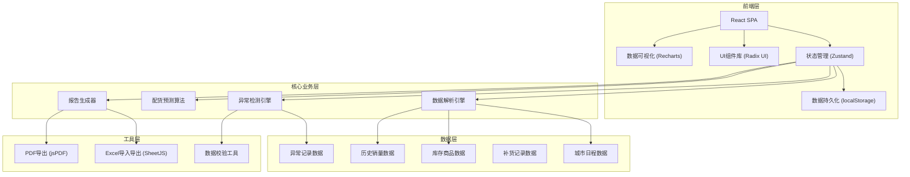

## 1. 架构设计



## 2. 技术描述

- **前端框架**: React@18 + TypeScript
- **构建工具**: Vite@5
- **样式方案**: TailwindCSS@3 + CSS Variables
- **状态管理**: Zustand@4 (轻量级，支持中间件持久化)
- **UI组件**: Radix UI (无样式组件) + Lucide React (图标)
- **数据可视化**: Recharts@2
- **Excel处理**: SheetJS (xlsx@0.18)
- **PDF导出**: jsPDF + autoTable
- **数据持久化**: localStorage + Zustand persist 中间件
- **后端**: 无后端，纯前端应用，数据本地存储

## 3. 路由定义

| 路由 | 页面名称 | 主要功能 |
|-------|---------|----------|
| / | 数据仪表盘 | 异常概览、库存状态、今日配货 |
| /schedule | 城市日程 | 巡演时间表、日期校验、城市详情 |
| /inventory | 库存中心 | 商品列表、尺码矩阵、重复项检测 |
| /forecast | 配货预测 | 智能计算、差异解释、补货建议 |
| /history | 历史销量 | 数据查询、趋势分析、统计报表 |
| /restock | 补货记录 | 补货申请、状态追踪、入库确认 |
| /reports | 报告中心 | 报告生成、差异说明、文件导出 |
| /anomalies | 异常中心 | 问题分类、处理建议、批量修复 |

## 4. 数据模型

### 4.1 核心数据结构

```typescript
// 城市日程
interface CitySchedule {
  id: string;
  cityName: string;
  date: string;
  venue: string;
  status: 'upcoming' | 'completed' | 'cancelled';
  expectedAttendance: number;
  notes: string;
  anomalies: DateAnomaly[];
}

// 商品SKU
interface Product {
  id: string;
  name: string;
  category: 'tshirt' | 'vinyl' | 'cd' | 'other';
  sku: string;
  price: number;
  sizes?: string[]; // T恤特有
  createdAt: string;
  updatedAt: string;
}

// 库存记录
interface InventoryItem {
  id: string;
  productId: string;
  size?: string;
  quantity: number;
  location: 'warehouse' | 'tour' | 'transit';
  lastCounted: string;
  isDuplicate: boolean;
  duplicateOf?: string;
  notes: string;
}

// 历史销量
interface SalesRecord {
  id: string;
  cityScheduleId: string;
  productId: string;
  size?: string;
  quantity: number;
  revenue: number;
  date: string;
  hasEmptyValues: boolean;
}

// 配货预测
interface ForecastItem {
  id: string;
  cityScheduleId: string;
  productId: string;
  size?: string;
  suggestedQuantity: number;
  adjustedQuantity: number;
  differenceReason: string;
  confidence: 'high' | 'medium' | 'low';
  anomalies: ForecastAnomaly[];
  status: 'pending' | 'approved' | 'shipped' | 'received';
}

// 补货记录
interface RestockRecord {
  id: string;
  productId: string;
  size?: string;
  quantity: number;
  status: 'requested' | 'ordered' | 'shipped' | 'received';
  requestedDate: string;
  expectedDate: string;
  receivedDate?: string;
  urgency: 'low' | 'medium' | 'high' | 'critical';
  notes: string;
}

// 异常记录
interface AnomalyRecord {
  id: string;
  type: 'size_out_of_stock' | 'duplicate_inventory' | 'date_error' | 'empty_value' | 'other';
  severity: 'critical' | 'warning' | 'info';
  status: 'open' | 'in_progress' | 'resolved' | 'ignored';
  description: string;
  affectedItems: string[];
  suggestedAction: string;
  resolution?: string;
  createdAt: string;
  resolvedAt?: string;
}
```

### 4.2 异常检测规则

| 异常类型 | 检测规则 | 严重程度 |
|---------|---------|---------|
| 尺码断货 | 库存数量 <= 0 且 历史销量 > 0 | critical |
| 库存重复 | 相同productId + size + location 出现多次 | warning |
| 日期错误 | 日期格式无效 / 日期冲突 / 日期顺序错误 | critical |
| 空值数据 | 必填字段为空 | warning |
| 低库存预警 | 库存数量 < 历史平均销量的50% | warning |

## 5. 核心算法

### 5.1 配货预测算法

```
基础配货量 = (该商品历史3场平均销量) × (本场预估人数 / 历史平均人数) × 系数

系数调整规则：
- 周末场次: × 1.3
- 首站/末站: × 1.2
- 大城市(人口>500万): × 1.15
- 有新专辑发布: × 1.4
- 临近节假日: × 1.25
```

### 5.2 数据模糊匹配

- 支持商品名称模糊匹配（Levenshtein距离）
- 支持城市名称别名映射（如"京城"→"北京"）
- 支持尺码标准化（如"加大"→"XL"，"小号"→"S"）

## 6. 持久化方案

使用 Zustand persist 中间件，所有状态自动保存到 localStorage：

- 存储键名：`tour-merch-inventory-v1`
- 序列化：JSON.stringify
- 反序列化：JSON.parse
- 版本管理：支持数据迁移
- 黑名单：排除临时UI状态

## 7. 性能优化

- 虚拟滚动：长列表使用 react-window
- 防抖：搜索输入 300ms 防抖
- 按需计算：配货预测使用 useMemo 缓存
- 懒加载：路由级代码分割
