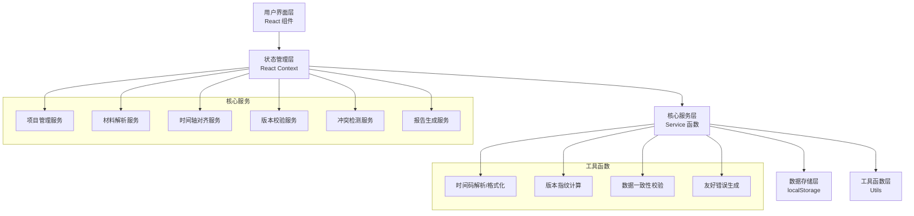
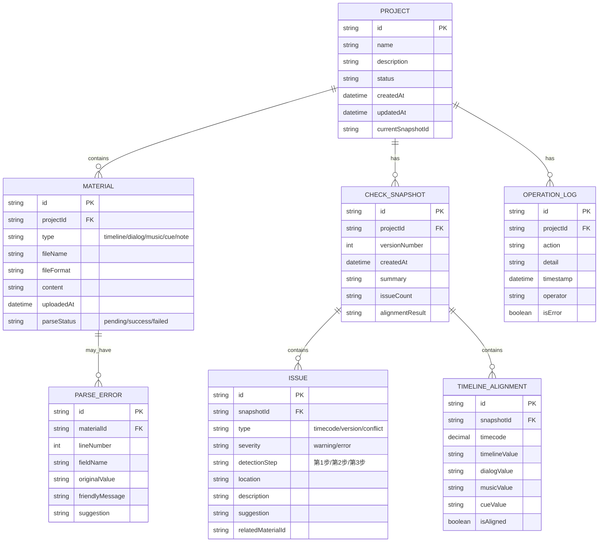

## 1. 架构设计

轻量级纯前端应用，所有数据存储在浏览器 localStorage，无需后端服务。核心设计原则是「单一数据源」，确保屏幕显示和报告导出使用同一套计算结果。



## 2. 技术描述

- **前端框架**：React@18 + TypeScript
- **构建工具**：Vite@5
- **样式方案**：TailwindCSS@3 + CSS 变量
- **状态管理**：React Context + useReducer
- **路由**：React Router@6
- **数据存储**：localStorage（项目数据） + IndexedDB（大文件缓存）
- **图标**：Lucide React
- **导出功能**：jsPDF（PDF导出） + xlsx（Excel导出）
- **初始化方式**：npm create vite@latest

## 3. 路由定义

| 路由路径 | 页面名称 | 功能说明 |
|----------|----------|----------|
| `/` | 项目入口页 | 项目列表、新建项目入口 |
| `/project/:id/upload` | 材料上传页 | 五类材料上传与解析 |
| `/project/:id/process` | 核对处理页 | 时间轴对齐、版本校验、冲突检测 |
| `/project/:id/history` | 历史回看页 | 版本历史、操作日志、对比差异 |
| `/project/:id/report` | 报告导出页 | 报告预览、多格式导出 |
| `*` | 404页 | 友好的页面不存在提示 |

## 4. 数据模型

### 4.1 数据模型定义



### 4.2 核心常量定义

```typescript
// 材料类型
type MaterialType = 'timeline' | 'dialog' | 'music' | 'cue' | 'note';

// 时间码格式 HH:MM:SS:FF 或 HH:MM:SS.ms
interface Timecode {
  hours: number;
  minutes: number;
  seconds: number;
  frames?: number;
  milliseconds?: number;
  totalSeconds: number;
}

// Cue点信息
interface CuePoint {
  id: string;
  number: string;
  name: string;
  startTime: Timecode;
  endTime: Timecode;
  duration: Timecode;
  description?: string;
}

// 对齐结果
interface AlignmentResult {
  timecode: number;
  timelineCue?: CuePoint;
  dialogCue?: CuePoint;
  musicCue?: CuePoint;
  cueListCue?: CuePoint;
  issues: string[];
}
```

## 5. 核心技术决策

### 5.1 单一数据源设计
- 所有计算结果存储在 `CHECK_SNAPSHOT` 中
- 界面显示和报告导出均从同一份快照数据读取
- 禁止导出时重新计算，确保数据一致性

### 5.2 错误处理机制
- 每个解析/校验函数返回 `Result<T, ParseError>` 类型
- `ParseError` 包含：位置、原值、友好提示、建议操作
- 捕获所有异常并转换为人类可读的错误信息

### 5.3 时间码处理
- 内部统一使用「总秒数」作为计算单位
- 支持多种输入格式：`HH:MM:SS:FF`、`HH:MM:SS.ms`、纯秒数
- 输出时根据原始格式还原显示

### 5.4 版本指纹
- 音乐文件：计算文件哈希 + 时长 + 关键帧采样
- 时间轴/Cue清单：计算内容哈希 + 条目数量 + 起止时间
- 版本比对时优先比对指纹，再比对具体字段
